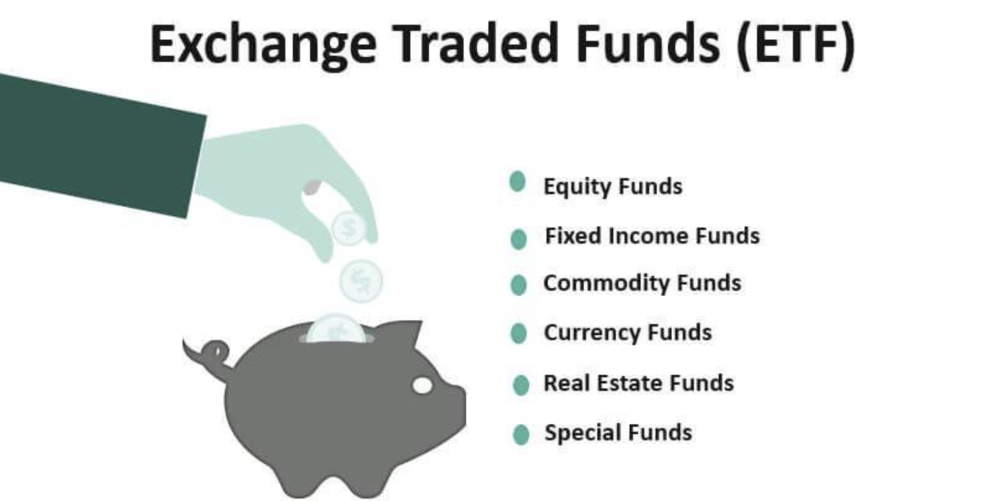

## Table of Contents

## What is an ETF and how does it differ from other investment vehicles?

An ETF, or Exchange-Traded Fund, is a type of investment that combines the features of mutual funds and stocks. It's like a basket that holds a collection of assets, such as stocks, bonds, or commodities. You can buy and sell ETFs on a stock exchange, just like you would with individual stocks. This makes ETFs easy to trade throughout the day at market prices.

ETFs differ from other investment vehicles in a few key ways. Unlike mutual funds, which are only priced at the end of the trading day, ETFs can be bought and sold at any time during trading hours. This flexibility can be a big advantage for investors who want to react quickly to market changes. Also, ETFs often have lower fees than mutual funds because they are passively managed, meaning they track an index rather than trying to beat the market. Compared to individual stocks, ETFs offer more diversification because they hold a variety of assets, which can help reduce risk.

## What are the basic characteristics of ETFs that make them suitable for short-term trading?

ETFs are good for short-term trading because they can be bought and sold easily during the day. This means you can quickly react to changes in the market. If you see a good opportunity, you can jump in and out of an ETF without waiting until the end of the day like you would with a mutual fund. This flexibility is a big plus for people who like to trade often and make quick decisions.

Another reason ETFs work well for short-term trading is that they are very liquid. This means there are usually a lot of buyers and sellers, so you can easily find someone to trade with. High [liquidity](/wiki/liquidity-risk-premium) helps keep the costs of trading low, which is important if you're buying and selling often. Plus, the prices of ETFs are clear and easy to see throughout the day, making it easier to decide when to trade.

## How does the liquidity of ETFs affect short-term trading strategies?

The liquidity of ETFs is really important for short-term trading. Liquidity means there are a lot of buyers and sellers, so you can easily buy or sell your ETFs without moving the price much. This is good for short-term traders because they can get in and out of trades quickly. If an [ETF](/wiki/etf-trading-strategies) is very liquid, you can trade it without worrying about big price changes that might happen with less liquid investments.

When you're trading in the short term, you want to keep your costs low. With high liquidity, the difference between the price you buy at and the price you sell at (called the bid-ask spread) is usually small. This means you can make more money from your trades because you're not losing a lot to these costs. So, the high liquidity of ETFs helps short-term traders by making it easier and cheaper to trade often.

## What role do trading volumes play in short-term ETF trading?

Trading volumes are very important for people who trade ETFs in the short term. When an ETF has high trading volumes, it means a lot of people are buying and selling it. This makes the ETF more liquid, which is good for short-term traders. They can quickly buy and sell the ETF without causing big changes in the price. High trading volumes also mean that the difference between the price to buy and the price to sell, called the bid-ask spread, is usually smaller. This helps traders keep their costs down and make more money from their trades.

On the other hand, if an ETF has low trading volumes, it can be harder to trade in the short term. With fewer people trading, it can be tougher to find someone to buy or sell with. This can lead to bigger price swings when you do trade, which can hurt your profits. Also, the bid-ask spread might be wider, making each trade more expensive. So, for short-term ETF trading, it's usually better to stick with ETFs that have high trading volumes.

## How can the expense ratio of an ETF impact short-term trading profits?

The expense ratio of an ETF is the yearly fee you pay for owning the fund. It's a percentage of the total money you have invested in the ETF. When you're trading ETFs in the short term, even a small expense ratio can eat into your profits. If you're buying and selling often, these fees add up quickly. So, a higher expense ratio can make it harder for you to make money, especially if you're only holding the ETF for a short time.

Choosing ETFs with lower expense ratios can help you keep more of your profits. For example, if you trade an ETF with a 0.1% expense ratio versus one with a 0.5% expense ratio, the difference in fees can be big over many trades. This is why short-term traders often look for ETFs with the lowest possible expense ratios. It's a way to keep costs down and increase the chance of making a profit from their short-term trades.

## What are the tax implications of trading ETFs in the short term?

When you trade ETFs in the short term, you need to think about taxes. If you hold an ETF for less than a year and then sell it for a profit, that profit is called a short-term capital gain. The tax on these gains is usually higher than the tax on long-term gains, which are profits from investments you hold for more than a year. Short-term gains are taxed at your regular income tax rate, which can be as high as 37% depending on your income.

Another thing to consider is the tax on dividends. Some ETFs pay dividends, which are payments from the companies the ETF holds. If you receive dividends from an ETF, you'll have to pay taxes on them. The tax rate on dividends can be different depending on whether they are qualified or non-qualified dividends. Short-term trading can lead to more frequent dividend payments, which means more taxes to pay. So, it's important to think about how often you're trading and how it might affect your tax bill at the end of the year.

## How does market volatility influence short-term ETF trading?

Market [volatility](/wiki/volatility-trading-strategies) means the prices of ETFs can go up and down a lot in a short time. This can be good or bad for short-term trading. If you're good at guessing when prices will go up or down, you might make more money during times when the market is very volatile. But it's also riskier because the prices can change quickly, and you might lose money if you guess wrong.

When the market is volatile, short-term traders need to be ready to act fast. They have to watch the market closely and be ready to buy or sell at the right time. This can be stressful, but it's part of the game for people who trade often. If you can handle the stress and make good decisions, you might do well in a volatile market. But if you're not careful, you could end up losing more than you make.

## What advanced trading strategies can be applied to ETFs for short-term gains?

One advanced strategy for short-term ETF trading is called [scalping](/wiki/gamma-scalping). This means you buy and sell ETFs very quickly, sometimes in just a few minutes or seconds, to make small profits from small price changes. Scalpers need to watch the market closely and use charts and other tools to find the best times to trade. They might use things like moving averages or other technical indicators to help them decide when to buy and sell. The key to scalping is to make a lot of small trades and add up the profits over time.

Another strategy is called [momentum](/wiki/momentum) trading. This is where you look for ETFs that are moving strongly in one direction, either up or down, and you try to ride that wave. You might buy an ETF that's going up fast, hoping it will keep going up so you can sell it for a profit. Or you might sell short an ETF that's going down fast, betting that it will keep falling so you can buy it back cheaper later. Momentum traders use tools like the Relative Strength Index (RSI) to find ETFs with strong momentum. This strategy can be exciting but also risky because the market can change direction quickly.

A third strategy is called pairs trading. This involves finding two ETFs that usually move together, like two ETFs that track similar indexes. If one ETF starts to do better than the other, you might buy the one that's doing worse and sell the one that's doing better, betting that they will come back together. This strategy tries to take advantage of short-term differences in how the ETFs move. It's a bit more complex but can be a good way to make money if you're good at spotting these patterns.

## How can one use technical analysis to enhance short-term ETF trading?

Technical analysis can help you make better short-term trades with ETFs by looking at charts and patterns to guess where the price might go next. You can use things like moving averages to see if an ETF is trending up or down. For example, if the price of an ETF is above its 50-day moving average, it might be a good time to buy because it could keep going up. You can also use indicators like the Relative Strength Index (RSI) to see if an ETF is overbought or oversold. If the RSI is high, the ETF might be due for a drop, and if it's low, it might be ready to go up. By using these tools, you can make smarter decisions about when to buy and sell.

Another way technical analysis can help is by spotting patterns on the charts. For instance, if you see a "head and shoulders" pattern, it might mean the ETF's price is going to go down soon. On the other hand, a "cup and handle" pattern could mean the price is about to go up. By recognizing these patterns, you can time your trades better. Also, [volume](/wiki/volume-trading-strategy) can tell you a lot. If an ETF's price is going up and the volume is high, it's a strong sign that the trend might continue. By combining all these pieces of information, you can get a better idea of what might happen next and trade more confidently.

## What are the risks associated with short-term ETF trading and how can they be mitigated?

Short-term ETF trading can be risky because the market can change quickly. If you guess wrong about which way the price will go, you could lose money fast. Also, trading a lot means you pay more in fees and taxes, which can eat into your profits. Another risk is that you might get too emotional about your trades. If you're not careful, you could make bad decisions based on fear or greed instead of sticking to a plan. High market volatility can also make short-term trading more stressful and risky because prices can swing a lot in a short time.

To lower these risks, it's important to have a clear trading plan and stick to it. This means setting rules for when to buy and sell, and not letting your emotions take over. Using stop-loss orders can help too. These are orders that automatically sell your ETF if the price drops to a certain level, which can limit how much you lose. It's also a good idea to keep an eye on your fees and taxes, and try to trade ETFs with low expense ratios. Lastly, learning more about the market and practicing with a demo account can help you get better at short-term trading without risking real money right away.

## How do sector-specific ETFs perform in short-term trading scenarios?

Sector-specific ETFs can be really interesting for short-term trading because they focus on certain parts of the economy, like technology, healthcare, or energy. When you trade these ETFs in the short term, you're betting on what's happening in that specific sector right now. If there's good news or a big event in that sector, the ETF's price might go up fast. But if something bad happens, the price can drop just as quickly. So, sector-specific ETFs can be more exciting to trade because they can move a lot, but they can also be riskier because they depend a lot on what's going on in that one part of the market.

To do well with sector-specific ETFs in the short term, you need to keep a close eye on the news and events that affect that sector. For example, if there's a new law that helps the tech industry, a tech ETF might go up. Or if there's a problem with oil prices, an energy ETF might go down. By staying informed, you can try to guess which way the ETF's price will go and make trades based on that. But remember, because these ETFs can be more volatile, it's important to have a good plan and be ready for big price swings.

## What are the best practices for managing a short-term ETF trading portfolio?

Managing a short-term ETF trading portfolio means you need to have a clear plan and stick to it. You should decide ahead of time when you will buy and sell ETFs, and not let your feelings change your mind. It's a good idea to use stop-loss orders to limit how much money you can lose on a trade. These orders will sell your ETF if the price drops to a certain level, so you don't lose more than you want to. Also, keep an eye on the fees and taxes you pay because they can take away from your profits. Trading a lot means you'll pay more in fees and taxes, so try to choose ETFs with low expense ratios to keep your costs down.

Another important thing is to stay informed about what's happening in the market and the sectors your ETFs focus on. News and events can make ETF prices go up or down fast, so you need to know what's going on. If you're trading sector-specific ETFs, pay special attention to news that affects that sector. It's also smart to practice your trading skills with a demo account before you start trading with real money. This way, you can learn how to handle the ups and downs of the market without risking your cash. By following these best practices, you can manage your short-term ETF trading portfolio better and increase your chances of making money.

## References & Further Reading

[1]: Bergstra, J., Bardenet, R., Bengio, Y., & Kégl, B. (2011). ["Algorithms for Hyper-Parameter Optimization."](https://papers.nips.cc/paper/4443-algorithms-for-hyper-parameter-optimization) Advances in Neural Information Processing Systems 24.

[2]: ["Advances in Financial Machine Learning"](https://www.amazon.com/Advances-Financial-Machine-Learning-Marcos/dp/1119482089) by Marcos Lopez de Prado

[3]: ["Evidence-Based Technical Analysis: Applying the Scientific Method and Statistical Inference to Trading Signals"](https://www.amazon.com/Evidence-Based-Technical-Analysis-Scientific-Statistical/dp/0470008741) by David Aronson

[4]: ["Machine Learning for Algorithmic Trading"](https://github.com/stefan-jansen/machine-learning-for-trading) by Stefan Jansen

[5]: ["Quantitative Trading: How to Build Your Own Algorithmic Trading Business"](https://books.google.com/books/about/Quantitative_Trading.html?id=j70yEAAAQBAJ) by Ernest P. Chan