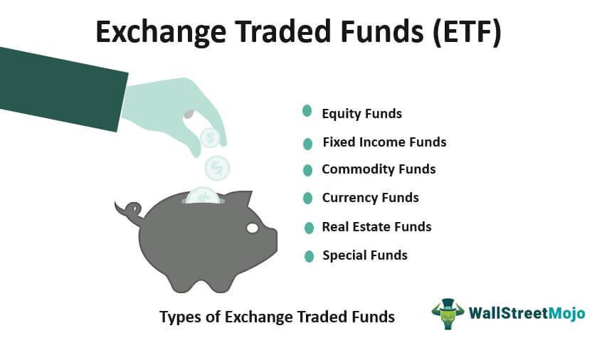

The world of investment provides numerous strategies, each designed to cater to distinct financial objectives. As financial markets have evolved, short-term trading has emerged as a compelling option for traders aiming to capitalize on quick market movements. Exchange-Traded Funds (ETFs) and algorithmic trading have gained considerable traction in this context due to their flexibility and efficiency.

Short-term trading with ETFs is increasingly favored due to the unique advantages they offer, including diversification and liquidity. ETFs allow traders to exploit market fluctuations by providing access to a diversified portfolio that can be traded like a stock throughout the trading day. This real-time trading capacity is essential for short-term strategies, enabling traders to respond swiftly to market changes.



Algorithmic trading, on the other hand, leverages sophisticated algorithms to automate trading decisions based on pre-defined criteria. This automation allows for high-speed execution and precision, reducing the impact of human emotions on trading outcomes and enabling traders to benefit from market inefficiencies.

This article focuses on creating effective strategies for short-term ETF trading using algorithmic methods. The suitability of ETFs for this purpose is highlighted by their cost efficiency and price transparency, features that align well with algorithmic trading's precision. Combining these elements empowers traders to optimize their returns and manage risks more effectively in short time frames.

Understanding the dynamics of short-term ETF trading is essential for traders aiming to maximize their profits. By integrating algorithmic strategies, traders can enhance their ability to execute trades rapidly and precisely, aligning with the fast-paced nature of short-term market movements. Ultimately, the intersection of ETFs and algorithmic trading provides an innovative avenue for investors seeking to harness the full potential of modern financial markets.

## Table of Contents

## Understanding ETFs for Short-Term Trading

Exchange-Traded Funds (ETFs) present a compelling option for short-term trading due to their inherent characteristics of diversification and real-time trading capabilities. These features suit the dynamic nature of active trading, where rapid decision-making is crucial. ETFs function like individual stocks on an exchange, enabling investors to buy and sell throughout the trading day at market prices. This distinguishes them from mutual funds, which only trade once at the end of the day. 

The advantages of ETFs for short-term traders are manifold, with [liquidity](/wiki/liquidity-risk-premium) being a primary concern. Liquidity refers to the ease with which an [ETF](/wiki/etf-trading-strategies) can be bought or sold without causing significant price changes. High liquidity in ETFs comes from the high [volume](/wiki/volume-trading-strategy) of shares traded, which translates to tighter bid-ask spreads. A tighter spread implies lower transaction costs, which enhances profitability for traders operating on short margins. The bid-ask spread is the difference between the highest price a buyer is willing to pay and the lowest price a seller is willing to accept. A smaller spread typically indicates higher liquidity.

Cost efficiency is another crucial [factor](/wiki/factor-investing) for short-term ETF trading. ETFs generally have lower expense ratios compared to mutual funds, as they involve less management—but it is important to consider the transaction fees associated with frequent trading. The cost savings gained through lower expense ratios can be considerable over time, making ETFs a cost-effective vehicle for active trading.

Price transparency of ETFs also plays a critical role. ETFs provide visibility into their holdings on a daily basis, allowing traders to react promptly to market changes. This feature supports informed decision-making, facilitating the implementation of precise trading strategies. Price transparency is bolstered by the publication of the indicative Net Asset Value (iNAV) throughout the trading day, providing investors with an updated reference point for an ETF's market value relative to its underlying assets.

The U.S. ETF market is the most extensive globally, offering diverse opportunities for active traders. It includes a wide variety of sectors, industries, commodities, and international exposure. With over 2,000 ETFs available, traders can find specific instruments to fit their tactical trading strategies, making the U.S. market highly attractive to both domestic and international investors.

For effective short-term ETF trading, understanding these key components—liquidity, cost efficiency, and price transparency—is essential. These features enable traders to execute swift and informed trading decisions, crucial in the fast-paced environment of short-term investments. The U.S. ETF market's diversity further amplifies its appeal, providing ample avenues for traders pursuing active strategies to optimize their outcomes.

## Benefits and Limitations of Algorithmic Trading

Algorithmic trading has revolutionized the way financial markets operate, particularly by leveraging speed and precision in executing trades. This method employs complex algorithms to automate trading decisions, which are typically based on parameters such as price, timing, and volume. The primary advantage of [algorithmic trading](/wiki/algorithmic-trading) in short-term ETF strategies is its ability to eliminate the emotional component from trading decisions. By automating trades, algorithms adhere strictly to predefined criteria, ensuring consistent and rational decision-making. This reduces the potential for human error, a significant factor in trading losses attributable to emotional biases and impulses.

Additionally, algorithmic trading facilitates the execution of trades at lightning speed, often in milliseconds, which is a significant advantage in the fast-paced world of short-term trading. The precision offered by algorithmic trading allows for the specification of exact parameters under which trades are executed, ensuring that trades conform precisely to the intended strategy without deviation. This level of precision can be particularly beneficial when trading ETFs, where timely and accurate execution can impact the profitability of trades due to the liquidity and price movements of the underlying securities.

Despite these advantages, algorithmic trading is not without limitations. One significant challenge lies in the potential for over-optimization, where algorithms are overly fine-tuned to fit historical data. This can result in a model that performs exceptionally well on past data but poorly on new, unseen data due to its lack of adaptability to market changes. Another potential pitfall is the occurrence of unforeseen market anomalies. Financial markets are influenced by numerous factors, some of which are unpredictable. Algorithms may not be equipped to handle sudden, unexpected events, leading to undesirable trading outcomes.

In the context of short-term ETF strategies, the integration of algorithmic trading can lead to improved outcomes by optimizing execution, minimizing human error, and maximizing speed. For example, algorithms can be programmed to take advantage of minute-by-minute market fluctuations or respond to real-time economic indicators, which is difficult for human traders to achieve consistently. However, it is crucial for traders to continually review and update their algorithms to account for changing market conditions and new data, thus avoiding the trap of relying on static, over-optimized models.

In summary, while algorithmic trading offers significant benefits in terms of speed, precision, and emotional detachment, traders must remain vigilant about its limitations. Continuous monitoring, adaptation, and risk management are essential to successfully integrating algorithmic trading into short-term ETF strategies.

## Critical Factors in ETF Algo Trading Strategies

In the context of short-term ETF algorithmic trading strategies, understanding the critical factors that influence both the selection of ETFs and the execution of trades is essential for optimizing performance and profitability.

**Liquidity in ETFs**

Liquidity is a crucial consideration for any short-term trading strategy, as it directly impacts the ease and cost of entering and exiting positions. An ETF's liquidity refers to how easily shares can be bought or sold without causing a significant impact on the ETF's price. It is greatly affected by both the trading volume of the ETF itself and the liquidity of its underlying assets. High liquidity generally translates to tighter bid-ask spreads, enabling trades to be executed at more favorable prices, which is critical for short-term traders aiming to capitalize on small price movements.

**Indicative NAV and Pricing Transparency**

The Indicative Net Asset Value (iNAV) plays a vital role in ensuring pricing transparency for ETFs. It provides an intraday "real-time" estimate of an ETF's per-share value, which helps traders make informed decisions based on current market conditions rather than relying solely on end-of-day values. iNAV calculations are typically based on the current value of the ETF's underlying assets and can be influenced by changes in the market value of these components. Accurate iNAV values help maintain fairness in trading by reducing the chances of price discrepancies between the ETF's market price and the net asset value of the securities it holds.

**Role of Authorized Participants**

Authorized participants (APs) are key players in the ETF market, contributing significantly to liquidity and pricing accuracy. These institutions have the exclusive ability to create and redeem ETF shares directly with the fund. They monitor [arbitrage](/wiki/arbitrage) opportunities between the ETF's market price and its NAV, thereby aligning the two through the creation or redemption process. By doing so, APs help maintain efficient markets by ensuring that ETF prices remain close to their underlying value, minimizing price deviations that could affect short-term trading strategies.

**Transaction Costs and Profitability**

Transaction costs are a critical factor in determining the profitability of short-term ETF trading strategies. These costs can include brokerage fees, spreads, and commissions that traders incur each time they buy or sell shares. For short-term trading, where profit margins may be slim, minimizing transaction costs is essential to maximize returns. Strategies that focus on high turnover rates must account for these costs, as they can significantly erode potential gains. Algorithmic trading offers a solution by optimizing execution, potentially reducing slippage and therefore the impact of transaction costs on overall profitability.

**Mechanics of Unit Creation and Redemption**

The mechanics of unit creation and redemption underpin the liquidity of ETFs. Creation involves an AP assembling a portfolio that mirrors the ETF and delivering it to the issuer in exchange for new ETF shares. Conversely, redemption allows the AP to return ETF shares to the issuer for an equivalent basket of underlying securities. This process helps ensure that supply and demand imbalances can be corrected efficiently, contributing to the liquidity of the ETF. For short-term traders, understanding these mechanics is crucial, as they can affect the availability and pricing of ETF shares, particularly during volatile market conditions or when large trades are placed.

Overall, comprehensively understanding these factors is vital for developing sound ETF algorithmic trading strategies that are efficient and effective in capitalizing on short-term market opportunities.

## Popular Short-Term Trading Strategies for ETFs

Short-term trading strategies for Exchange-Traded Funds (ETFs) encompass various approaches, catering to traders aiming to capitalize on market fluctuations over brief periods. Among the prominent strategies are swing trading, sector rotation, and [momentum](/wiki/momentum) trading, each leveraging different market phenomena to generate profit opportunities.

### Swing Trading
Swing trading attempts to capture gains in an ETF over days or weeks, based on expected price swings. This strategy relies on technical analysis, identifying support and resistance levels, and monitoring chart patterns. It benefits from ETFs' liquidity and transparency, allowing for quick entries and exits. Algorithmic strategies assist in swing trading by continuously analyzing price movements and automating trades when certain criteria are met.

Example of an ETF suitable for swing trading:
- **SPDR S&P 500 ETF Trust (SPY)**: Its high liquidity and responsiveness to market movements make SPY a prime candidate for swing trading.

### Sector Rotation
Sector rotation involves shifting investments among various economic sectors to take advantage of the cyclical nature of industries. By predicting which sectors will outperform others based on macroeconomic indicators or phases of the economic cycle, traders can adjust their ETF holdings accordingly.

Algorithmic models improve this strategy by analyzing economic indicators and timing market entry points accurately. An algorithm may, for example, use [interest rate](/wiki/interest-rate-trading-strategies) movements or GDP growth data to predict sector performance.

Example of ETFs for sector rotation:
- **Technology Select Sector SPDR Fund (XLK)**: Invests in technology companies, often benefiting during economic upturns.
- **Utilities Select Sector SPDR Fund (XLU)**: Offers stability during market downturns due to its focus on utilities, seen as defensive investments.

### Momentum Trading
Momentum trading capitalizes on existing market trends, assuming that higher prices will continue to rise and lower prices will continue to fall. This strategy often requires real-time data analysis, identifying ETFs that show strong upward or downward trends.

Algorithmically, momentum trading can be enhanced by employing [machine learning](/wiki/machine-learning) algorithms to predict future price movements based on historical trends and trading volumes.

Example of ETFs used in momentum trading:
- **iShares MSCI USA Momentum Factor ETF (MTUM)**: Specifically designed to capture momentum in the U.S. market, tracking stocks with positive price momentum.

### Market Timing and Economic Indicators
Effective short-term ETF trading requires precise market timing, often informed by economic indicators like unemployment rates, inflation data, and consumer confidence indices. Algorithms play a pivotal role here, processing vast amounts of data to predict market movements and optimize trade timings.

For instance, an algorithm might trigger a buy signal when job reports exceed expectations, suggesting economic growth and potential stock market gains.

### Algorithmic Optimization
Algorithmic trading enhances these strategies by offering:
- Speed and accuracy in trade execution.
- Objective decision-making devoid of emotional biases.
- The ability to back-test strategies on historical data to gauge effectiveness.

In Python, an example of a simple moving average crossover strategy, common in momentum trading, could look like this:

```python
import pandas as pd
import numpy as np

def moving_average_crossover_strategy(data, short_window=40, long_window=100):
    signals = pd.DataFrame(index=data.index)
    signals['price'] = data['Close']
    signals['short_mavg'] = data['Close'].rolling(window=short_window).mean()
    signals['long_mavg'] = data['Close'].rolling(window=long_window).mean()
    signals['signal'] = 0.0
    signals['signal'][short_window:] = np.where(
        signals['short_mavg'][short_window:] > signals['long_mavg'][short_window:], 1.0, 0.0
    )
    signals['positions'] = signals['signal'].diff()
    return signals

# Assuming `price_data` is a DataFrame with 'Close' prices of the ETF
trading_signals = moving_average_crossover_strategy(price_data)
```

By employing these strategies and incorporating algorithmic precision, traders can enhance their ability to identify and act on short-term opportunities in the ETF market.

## Risk Management in Near-Term ETF Trading

Short-term trading in Exchange-Traded Funds (ETFs) carries inherent risks due to the high [volatility](/wiki/volatility-trading-strategies) and unpredictable nature of financial markets. Traders must navigate these challenges with effective risk management strategies to safeguard their investments and pursue their financial objectives.

High volatility is a significant concern in short-term ETF trading as price fluctuations can lead to substantial gains or losses in a very short period. Market movements can be sudden and unforeseen, often triggered by economic data releases, geopolitical developments, or shifts in market sentiment. Thus, traders should implement a set of tools and strategies to mitigate these risks effectively.

Stop-loss orders are a fundamental risk management technique in short-term trading. These orders automatically sell a security when it reaches a predetermined price, limiting the potential downside. For example, if a trader buys an ETF at $50 and sets a stop-loss order at $48, the position will automatically be sold if the price drops to $48, thereby capping the loss at $2 per share. While stop-loss orders protect against severe losses, they must be carefully placed to avoid premature execution in the face of temporary price swings.

Mitigating risk in short-term ETF trading also involves employing diversification and position sizing. By holding a mix of different asset classes and properly sizing each position relative to the overall portfolio, traders can reduce the impact of a single adverse price movement on their portfolio's performance.

Algorithmic tools significantly enhance risk management by enabling real-time monitoring and swift execution of trades in response to changes in market conditions. These tools can be programmed to adhere to specific risk parameters, such as volatility thresholds or maximum allowable drawdowns, thereby facilitating disciplined trading practices. For example, an algorithm can be set to automatically adjust stop-loss levels based on volatility bands or historical price movements, minimizing the emotional biases that often lead to suboptimal decisions.

Using a Python script, traders can implement a basic risk management algorithm that adjusts stop-loss levels based on volatility:

```python
import numpy as np

def adjust_stop_loss(current_price, volatility, factor=1.0):
    stop_loss = current_price - (volatility * factor)
    return stop_loss

# Example usage
current_price = 100  # Current price of the ETF
volatility = 2.5     # Historical volatility measure
factor = 1.5         # Adjustment factor

stop_loss = adjust_stop_loss(current_price, volatility, factor)
print(f"Adjusted Stop Loss Level: {stop_loss}")
```

Balancing risks with potential rewards is a crucial consideration for traders engaging in short-term strategies. While higher risks may present opportunities for greater returns, they also increase the likelihood of substantial losses. Traders must carefully evaluate their risk tolerance and financial goals, developing a trading plan that aligns with these considerations. Continuous learning and adaptation to changing market conditions are imperative for maintaining a competitive edge and optimizing returns in short-term ETF trading.

In conclusion, effective risk management in near-term ETF trading involves employing a combination of techniques such as stop-loss orders, diversification, and position sizing, coupled with the strategic utilization of algorithmic tools. This multifaceted approach helps traders navigate the intricacies of volatile markets, striving for a balance between risk and reward to achieve their investment objectives.

## The Future of Short-Term ETF Algo Trading

The landscape of short-term ETF algorithmic trading is on the cusp of significant transformation, driven by both market demands and technological advancements. A key trend is the increasing sophistication of [artificial intelligence](/wiki/ai-artificial-intelligence) and machine learning, which are enhancing the decision-making processes in trading algorithms. These technologies enable the analysis of vast datasets at unprecedented speeds and with greater accuracy, facilitating the identification of complex trading patterns that were previously difficult to discern. Machine learning models, such as neural networks, can continuously learn from market data, improving their predictive performance over time. 

Moreover, the advancement in quantum computing holds promise for exponentially increasing the speed and efficiency of complex calculations in algorithmic trading. While still in its nascent stages, quantum computing could revolutionize the way algorithms solve optimization and data analysis tasks, potentially providing a substantial edge in the highly competitive ETF trading landscape.

Blockchain technology also presents intriguing applications for the future of ETF trading. With its inherent transparency and security, blockchain can streamline settlement processes, reduce transaction costs, and mitigate counterparty risks by ensuring the provenance and authenticity of financial assets. As blockchain technology matures, its integration with ETF platforms could lead to more efficient ecosystems, benefiting short-term traders.

As these technological advancements converge, the integration of big data analytics will further refine trading strategies. The ability to process and interpret a myriad of economic indicators, news sentiment, and social media trends can offer traders deeper insights, enhancing their ability to time the market effectively. 

Predictive analytics, powered by machine learning, is set to become even more pivotal in short-term trading strategies as it enables algorithms to forecast potential anomalies and shifts in the market dynamics, allowing for proactive adjustments rather than reactive responses.

The evolving role of exchange-traded funds, influenced by these technological advancements, mandates that traders remain vigilant and adaptive. As the trading environment becomes increasingly automated, the importance of staying informed through continuous education and engagement with emerging technologies cannot be overstated. A commitment to understanding these innovations and their implications is crucial for traders aiming to maintain a competitive advantage. 

Embracing these changes with agility will be key to harnessing the full potential of algorithmic trading in the ETF market. As technology continues to accelerate the pace of trading, the successful integration and adaptation of these elements will shape the future landscape of short-term ETF trading, offering new frontiers for profitability and efficiency.

## Conclusion

In summary, short-term ETF algorithmic trading strategies offer a sophisticated approach to navigating financial markets efficiently. These strategies leverage the unique characteristics of ETFs, such as liquidity and diversity, while utilizing the precision and speed of algorithmic trading. For traders, informed decision-making and a commitment to continuous learning are paramount. Understanding the nuances of both ETFs and algorithmic systems is essential for optimizing trading outcomes.

Harnessing the power of algorithms enables traders to make data-driven decisions and execute trades with minimal emotional interference, thus potentially maximizing returns. As technology and algorithmic trading techniques continue to evolve, it is crucial for traders to stay updated with the latest research and advancements.

Preparation and adaptability are key, as the trading environment is dynamic and influenced by various factors, including market innovations and regulatory changes. By maintaining a proactive stance and cultivating a robust understanding of both ETFs and algorithmic strategies, traders can position themselves for success in this competitive landscape.

## References & Further Reading

[1]: Bergstra, J., Bardenet, R., Bengio, Y., & Kégl, B. (2011). ["Algorithms for Hyper-Parameter Optimization."](https://papers.nips.cc/paper/4443-algorithms-for-hyper-parameter-optimization) Advances in Neural Information Processing Systems 24.

[2]: ["Advances in Financial Machine Learning"](https://www.amazon.com/Advances-Financial-Machine-Learning-Marcos/dp/1119482089) by Marcos Lopez de Prado

[3]: ["Evidence-Based Technical Analysis: Applying the Scientific Method and Statistical Inference to Trading Signals"](https://www.amazon.com/Evidence-Based-Technical-Analysis-Scientific-Statistical/dp/0470008741) by David Aronson

[4]: ["Machine Learning for Algorithmic Trading"](https://github.com/stefan-jansen/machine-learning-for-trading) by Stefan Jansen

[5]: ["Quantitative Trading: How to Build Your Own Algorithmic Trading Business"](https://books.google.com/books/about/Quantitative_Trading.html?id=j70yEAAAQBAJ) by Ernest P. Chan