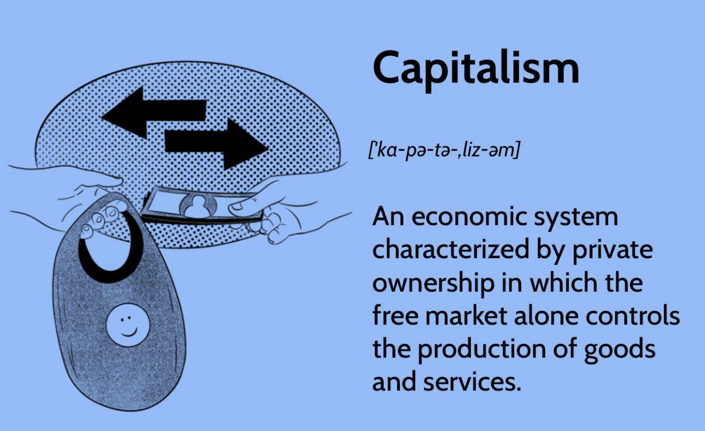

## Table of Contents

## What is a capitalist economy?

A capitalist economy is a type of economic system where businesses and industries are owned and operated by private individuals or companies, rather than by the government. In this system, the main goal is to make a profit. People can start their own businesses, and they get to keep the money they earn after paying for costs like materials and labor. The government has less control over the economy, and it mainly works to protect property rights and ensure fair competition.

In a capitalist economy, the prices of goods and services are determined by the forces of supply and demand. If many people want a product and there's not enough of it, the price goes up. If there's too much of a product and not enough people want it, the price goes down. This system encourages competition among businesses, which can lead to better products and services for consumers. However, it can also lead to inequality, as some people may earn much more than others.

## What are the main characteristics of a capitalist economy?

A capitalist economy is all about private ownership. This means that people or companies own businesses, not the government. The main goal in this system is to make money. Owners can decide what to produce and how to sell it. They keep the profits after paying for things like materials and workers. The government's job is to make sure everyone plays fair and to protect what people own.

In a capitalist economy, prices are set by how much people want something and how much of it is available. If lots of people want a product and there isn't enough, the price goes up. If there's too much of a product and not many people want it, the price goes down. This system makes businesses compete with each other. Competition can lead to better products and services for customers. But it can also mean that some people earn a lot more money than others, which can create inequality.

## How does private property ownership work in capitalist economies?

In a capitalist economy, private property ownership means that individuals or businesses own things like land, buildings, and factories. They can use these things to make money. For example, someone might own a farm and sell the crops they grow. Or a company might own a factory and make products to sell. The owners get to decide how to use their property and can keep the profits they make.

The government in a capitalist economy helps protect private property. It makes laws to make sure no one can take someone else's property without permission. This protection encourages people to invest in businesses and property because they know they can keep what they earn. But this system can also lead to big differences between rich and poor people, because some owners make a lot more money than others.

## What role does competition play in capitalist economies?

Competition is a big part of capitalist economies. It happens when different businesses try to sell their products or services to the same customers. This makes companies work hard to make better products or offer lower prices. When businesses compete, it can be good for customers because they get more choices and better deals. For example, if two phone companies are competing, they might try to make the best phone or offer the cheapest plan to get more customers.

But competition can also be tough for businesses. If a company can't keep up with others, it might lose customers and even go out of business. This can lead to some companies getting very big and powerful, which might make it hard for new businesses to start. The government sometimes steps in to make sure competition stays fair. They might make rules to stop big companies from doing things that hurt smaller ones. This helps keep the market balanced and gives everyone a chance to succeed.

## How is profit motive central to capitalism?

In a capitalist economy, the profit motive is what drives everything. It means that people and businesses want to make money. When someone starts a business, their main goal is to earn more money than they spend. They do this by selling things or services for more than it costs to make them. The more profit they make, the more successful their business is. This pushes people to work hard and come up with new ideas to make more money.

The profit motive helps the economy grow. When businesses make profits, they can use that money to grow bigger, hire more people, or start new projects. This can lead to more jobs and more things for people to buy. But it can also cause problems. Some people might focus too much on making money and forget about other important things, like taking care of the environment or treating workers fairly. So, while the profit motive is key to capitalism, it can also create challenges that need to be managed carefully.

## What is the function of markets in a capitalist system?

In a capitalist system, markets are where people buy and sell things. They help figure out what people want and how much they're willing to pay for it. When there are lots of buyers and sellers, it creates competition. This competition can make prices go up or down. If lots of people want something and there's not enough of it, the price goes up. If there's too much of something and not many people want it, the price goes down. This way, markets help decide what gets made and how much it costs.

Markets also help businesses figure out what to make. If a company sees that people are buying a lot of a certain product, they might decide to make more of it. This can lead to new ideas and better products. But sometimes, markets can have problems. For example, if one big company controls most of the market, they might set high prices and make it hard for new businesses to start. That's why governments sometimes make rules to keep markets fair and make sure everyone has a chance to compete.

## How do capitalist economies handle economic freedom?

In a capitalist economy, economic freedom means that people can make their own choices about what to buy, sell, and invest in. They can start their own businesses and decide how to run them. This freedom encourages people to work hard and come up with new ideas because they know they can keep the money they earn. The government's role is to make sure everyone follows the rules and to protect people's right to own things. This system can lead to a lot of growth and new opportunities for people.

But economic freedom can also cause problems. Not everyone starts with the same amount of money or resources, so some people can take more advantage of this freedom than others. This can lead to big differences between rich and poor people. Also, if businesses focus too much on making money, they might not take care of the environment or treat workers fairly. So, while economic freedom is a big part of capitalism, it needs to be balanced with rules to make sure it's fair for everyone.

## What are the differences between laissez-faire and regulated capitalism?

Laissez-faire capitalism is when the government stays out of the economy as much as possible. It means "let it be" in French. In this system, businesses can do what they want without many rules. They decide what to make, how much to charge, and how to treat workers. The idea is that the market will fix any problems on its own. But this can lead to big companies getting too powerful and not taking care of workers or the environment.

Regulated capitalism is different because the government makes rules to keep the economy fair. These rules can set limits on what businesses can do. For example, the government might make laws about how much workers should be paid or how businesses should treat the environment. The goal is to make sure everyone has a fair chance and that businesses don't harm people or the planet. While this can slow down the economy a bit, it tries to make sure that economic growth helps everyone, not just a few.

## How do capitalist economies address income inequality?

In a capitalist economy, income inequality can be a big problem. This means some people earn a lot more money than others. Capitalism focuses on making profits, and people who own businesses or have a lot of money can make even more money. But people who don't have much to start with might find it hard to get ahead. This can make the gap between rich and poor people even bigger.

To address income inequality, some capitalist countries use different methods. They might have the government take some money from richer people through taxes and give it to poorer people through programs like welfare or healthcare. This is called redistribution. Some countries also make rules to make sure workers get paid fairly and have good working conditions. While these steps can help reduce inequality, they can also be controversial because some people think they go against the idea of economic freedom in capitalism.

## What impact do capitalist economies have on innovation and technological advancement?

In a capitalist economy, the desire to make money pushes people to come up with new ideas and inventions. Businesses want to make better products or find new ways to do things so they can sell more and make more profit. This competition makes them spend a lot of time and money on research and development. When they find something new, they can get a patent, which means they own the idea and can make money from it. This system has led to a lot of new technology and inventions that make life easier and better for everyone.

But there can be some problems too. Not everyone has the same chance to innovate because starting a business or doing research can be expensive. Big companies might have more money to spend on new ideas, which can make it hard for smaller businesses or individuals to compete. Also, the focus on making money might mean that some important inventions that don't make a lot of profit get ignored. Even with these challenges, the drive to make money in a capitalist economy has been a big reason why we see so much innovation and technological advancement.

## How do capitalist systems respond to economic crises?

When an economic crisis happens in a capitalist system, the government often steps in to help. They might lower interest rates to make it easier for people to borrow money. This can help businesses keep going and people keep spending. The government might also spend more money on things like building roads or helping people who are out of work. This is called a stimulus, and it can help the economy start growing again.

But sometimes, the government doesn't do much, and they let the market fix itself. This is called a laissez-faire approach. The idea is that if businesses fail, new ones will take their place. This can be tough for people who lose their jobs, but supporters believe it leads to a stronger economy in the long run. Different countries handle crises differently, depending on how much they think the government should be involved.

## What are the critiques and defenses of capitalist economies from an economic theory perspective?

Critics of capitalist economies argue that they can lead to big gaps between rich and poor people. They say that people who already have money can make even more money, while others struggle to get by. This can make life unfair for many people. Critics also point out that businesses might focus too much on making money and ignore important things like taking care of the environment or treating workers well. They worry that without government rules, big companies can get too powerful and hurt smaller businesses and workers.

Defenders of capitalism say it's good because it encourages people to work hard and come up with new ideas. They believe that when people can keep the money they earn, they are more likely to start businesses and invent new things. This can lead to more jobs and better products for everyone. Defenders also argue that competition in a capitalist system keeps prices low and gives people more choices. They think that while there can be problems, the government can make rules to fix them without taking away too much economic freedom.

## References & Further Reading

### Articles and Books on Economic Theory

1. **"The Wealth of Nations" by Adam Smith** - A foundational text in classical economics, this book explores the concept of the invisible hand and the benefits of a free market system. Smith's analysis of labor division and free-market dynamics remains influential in understanding capitalist economies.

2. **"The General Theory of Employment, Interest and Money" by John Maynard Keynes** - This work challenged classical economic thought and introduced Keynesian economics, emphasizing the role of government intervention in stabilizing the economy and addressing unemployment.

### Research Papers on Algorithmic Trading and Its Impact on Financial Markets

1. **"High-Frequency Trading: A Primer" by Albert J. Menkveld (2013)** - This paper provides an overview of high-frequency trading (HFT), discussing its historical development, strategies, and impacts on financial markets, such as liquidity provision and transaction costs.

2. **"The Flash Crash: The Impact of High-Frequency Trading on an Electronic Market" by Andrei A. Kirilenko, Albert S. Kyle, Mehrdad Samadi, Tugkan Tuzun (2017)** - An in-depth analysis of the 2010 Flash Crash, this paper investigates the role of HFT in contributing to market volatility, offering insights into both the benefits and risks posed by algorithmic trading.

3. **"Adaptive Markets: Financial Evolution at the Speed of Thought" by Andrew W. Lo (2017)** - This paper introduces the Adaptive Markets Hypothesis, which reconciles the efficient market hypothesis with behavioral economics, illustrating how evolutionary principles can explain the dynamics of financial markets influenced by algorithmic trading.

### Further Reading on the Evolution of Market Economies and Socialist Principles

1. **"Capitalism, Socialism and Democracy" by Joseph A. Schumpeter** - Schumpeter's analysis of capitalist and socialist systems includes his famous theory of creative destruction, highlighting how innovation drives economic progress while rendering old technologies and business models obsolete.

2. **"Market Socialism: The Current Debate" edited by Pranab Bardhan and John Roemer** - This collection examines various models of market socialism, a system attempting to blend the efficiency of market mechanisms with the equitable aims of socialism.

3. **"Towards a New Socialism" by Paul Cockshott and Allin Cottrell** - This book proposes a model for utilizing modern computing technologies to enhance the efficiency of socialist economies, focusing on the integration of planning with market elements to achieve societal goals.

