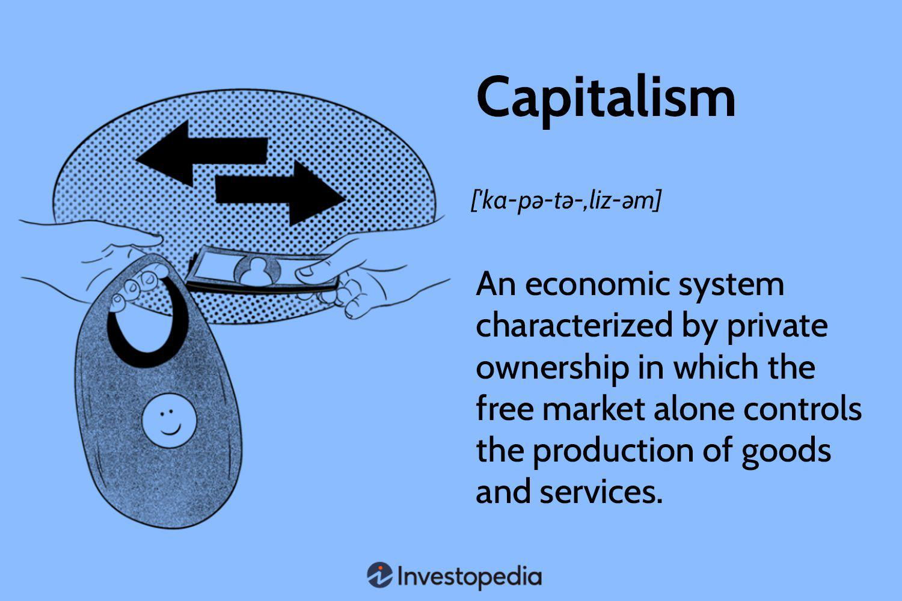

The global economy encompasses a variety of systems, with capitalism and socialism as two of the most predominant paradigms. Capitalism is frequently synonymous with market economies, where private ownership and the forces of a free market prevail. It operates on the principles of competition, individualism, and profit maximization, allowing for economic agents to freely engage in market activities. In contrast, socialism underscores public ownership and the equitable distribution of resources. This system seeks to manage resources to ensure fairness and meet societal needs, often characterized by substantial government intervention in economic activities.

In recent times, the incorporation of technological advancements such as algorithmic trading has significantly influenced and reshaped the dynamics within these economic frameworks. Algorithmic trading involves the use of sophisticated algorithms to automate trading decisions and execute orders in financial markets with high speed and precision. This technological integration has not only enhanced the efficiency and competitiveness of markets but also posed challenges regarding regulation and stability.



This article examines how economic characteristics and principles inherent in market economies under capitalism intersect with the emerging role of algorithmic trading. By understanding these dynamics, we can better appreciate how both capitalism and socialism are adapting to technological progress and what this means for future economic development.

## Table of Contents

## Key Features of a Market Economy under Capitalism

A market economy under capitalism is fundamentally characterized by private ownership, profit motives, and minimal government intervention. These core attributes create an environment where economic decisions and the pricing of goods and services are guided by the forces of supply and demand with limited state influence.

### Private Ownership and Profit Motive

In capitalist economies, the means of production are predominantly owned by individuals or corporations. This private ownership facilitates the accumulation of capital and investment into businesses and enterprises seeking to generate profit. The profit motive is central to driving economic activities, incentivizing innovation, and encouraging efficiency in production processes. Companies are incentivized to reduce costs and increase output to maximize profits.

### Competition and Innovation

Competition is a defining feature of market economies under capitalism. It propels businesses to continuously innovate and optimize to survive and thrive in the market. Competitive pressures compel companies to improve product quality, enhance service offerings, and adopt new technologies to gain an edge over rivals. This environment fosters a culture of continuous improvement and creative destruction, as theorized by Joseph Schumpeter, where outdated industries and technologies are replaced by more efficient ones.

### Consumer Choice and the Invisible Hand

Consumer choice is at the heart of market economies as it dictates the supply and demand dynamics. The "invisible hand," a concept popularized by Adam Smith, describes the self-regulating nature of the market where individual self-interest inadvertently benefits society as a whole. As consumers make choices based on personal preferences and price, producers must adapt to meet these demands, which in turn influences resource allocation and production decisions across the economy.

### Influential Economic Theorists

Adam Smith and John Maynard Keynes have significantly shaped capitalist economic theory. Adam Smith, through his seminal work "The Wealth of Nations," laid the foundation for classical economics, advocating for free markets and limited government intervention. He emphasized the importance of self-interest and voluntary exchange in fostering economic prosperity. John Maynard Keynes, on the other hand, introduced Keynesian economics, advocating for government intervention to mitigate the adverse effects of economic recessions. Although he diverged from classical theory, Keynesian principles have been adopted to stabilize capitalist economies during periods of economic instability.

In summary, a market economy under capitalism thrives on the foundations of private ownership, profit-driven enterprise, competition, and consumer choice, all of which interact dynamically to shape economic growth and innovation. Notable figures like Adam Smith and John Maynard Keynes have provided essential insights and frameworks that continue to influence the structure and function of market economies today.

## Algorithmic Trading in Capitalist Economies

Algorithmic trading has fundamentally transformed the way transactions are executed in capitalist economies, utilizing computer algorithms to facilitate trades with unprecedented speed and accuracy. This technology, a significant leap in financial innovation, enables the analysis of vast data sets, identification of trading opportunities, and execution of trades within milliseconds.

In capitalist markets, which are characterized by private ownership and profit-driven motives, [algorithmic trading](/wiki/algorithmic-trading) serves as a tool to enhance market efficiency and competitiveness. It reduces transaction costs, provides [liquidity](/wiki/liquidity-risk-premium), and minimizes human errors associated with manual trading processes. By automating decision-making, participants can react to market changes instantly, optimizing their trade strategies in alignment with market conditions.

The strategic approaches employed in algorithmic trading vary across several methodologies. Trend-following strategies, for instance, analyze historical price patterns to predict future movements. Arbitrage seeks to exploit price discrepancies between different markets or instruments. More advanced strategies incorporate complex [machine learning](/wiki/machine-learning) models, wherein algorithms are trained to recognize patterns and make decisions based on historical data. This can involve the use of supervised learning techniques, where the algorithm learns from labeled training data to make predictions or decisions without human intervention.

```python
import numpy as np
from sklearn.linear_model import LinearRegression

# Sample data: time series of prices
prices = np.array([[1, 10], [2, 12], [3, 13], [4, 15], [5, 16]])

# Train a simple linear trend-following model
X = prices[:, 0].reshape(-1, 1)  # Time
y = prices[:, 1]  # Prices
model = LinearRegression().fit(X, y)

# Predict future prices
future_time = np.array([[6], [7]])
predicted_prices = model.predict(future_time)

print(predicted_prices)
```

However, algorithmic trading presents inherent challenges. The reliance on technology introduces vulnerabilities to technological failures and cybersecurity threats. Market [volatility](/wiki/volatility-trading-strategies) can amplify risks, as rapid market swings may lead to substantial financial losses for poorly executed algorithms. Moreover, the vast number of trades executed by high-frequency trading algorithms can lead to market instability and flash crashes, necessitating effective regulatory oversight to maintain orderly market operations.

Regulators face the task of striking a balance between fostering innovation and ensuring market stability, necessitating frameworks that monitor algorithmic trading activities without stifling technological advancements. This includes implementing real-time surveillance systems, enforcing transparency, and setting rigorous standards for algorithm testing and deployment.

## Economic Features of Socialist Systems

Socialist economies emphasize extensive government control and a focus on equitable distribution of resources. This approach aims to address social welfare through the redirection of economic activities towards the needs of society, rather than prioritizing profits. The fundamental distinction of socialist systems is the collective or state ownership of the means of production, wherein resources, industries, and enterprises are managed by the government to ensure that distribution aligns with social objectives.

The central role of the state in socialist economies includes not only ownership but also significant planning and intervention in economic processes. This governance is structured to eliminate the disparities seen in capitalist systems, promoting an egalitarian distribution of income and access to essential services such as healthcare, education, and housing.

Modern applications of socialism have evolved to incorporate market-driven elements alongside traditional socialist principles. China's economic model, often referred to as "socialism with Chinese characteristics," exemplifies this hybrid approach. It combines a predominantly state-owned economy with aspects of a market economy, allowing for private enterprise within a framework directed and regulated by the state. This model has enabled significant economic growth while maintaining state control over key sectors.

In socialist economies, the allocation of resources is predominantly determined by central planning rather than market forces. Planners forecast societal needs and allocate resources accordingly, attempting to ensure that production meets these needs efficiently. This contrasts with capitalist market systems where supply and demand are guided by consumer preferences and profit motives.

While socialist principles focus on reducing inequality through policies of redistribution and state welfare, the integration of certain capitalist mechanisms, such as market competition and private entrepreneurship, can enhance innovation and economic dynamism. The challenge within these mixed economies is achieving a balance where market incentives can coexist with social priorities ensuring equitable resource distribution.

## Algorithmic Trading and Socialist Economies

Algorithmic trading in socialist economies is shaped by a distinct framework of state regulation, adhering to the broader principles of equity and collective welfare inherent in socialist ideologies. Unlike capitalist markets, where the primary objective is often profit maximization, socialist systems prioritize equitable resource distribution and societal well-being. This unique emphasis significantly influences how algorithmic trading is implemented and managed within these economies.

In socialist countries, algorithmic trading is typically monitored and controlled by state or collective bodies to ensure that the technology serves the public interest. This regulatory oversight is crucial to prevent the concentration of economic power and to maintain financial market stability. The state, acting as a central figure in economic management, establishes guidelines and policies to ensure that algorithmic trading aligns with the collective goals of the society. These may include maintaining employment levels, ensuring fair access to financial markets, and stabilizing economic cycles.

While the primary focus of socialist economies is equitable growth, the incorporation of algorithmic trading can substantially enhance market efficiency. By automating trade executions and reducing transaction times, algorithmic trading can optimize resource allocation, thus contributing to broader economic goals. However, the benefits of such advances must be weighed against the need to maintain control over financial activities to prevent economic disparities.

The use of technology in socialist economies must align with the overarching social objectives and regulatory policies set by the state. This includes ensuring that technological advancements, such as high-frequency trading, do not undermine social equality or lead to financial instability. Therefore, the frameworks within which algorithmic trading operates are often more restrictive, emphasizing transparency, accountability, and control.

Regulatory policies in socialist economies also focus on the ethical implications of algorithmic trading. The technology must be harnessed to support sustainable growth, reduce inequality, and ensure that financial gains do not disproportionately favor the few. Additionally, there is a strong emphasis on education and skills development to ensure that the workforce can adapt to these technological advancements, thereby reinforcing the principles of social equality and collective progress.

In conclusion, while socialist economies can harness algorithmic trading to improve efficiency and equity in resource distribution, the integration of such technologies is rigorously regulated to align with socialist principles. This strategic approach ensures that technological progress supports broader social goals, thereby promoting sustainable and inclusive economic development.

## Balancing Innovation and Regulation

Both capitalist and socialist economies face the challenge of harnessing the benefits of algorithmic trading while implementing effective regulatory measures. This balance is crucial to ensuring market stability, preventing abuse, and offering equitable access to technological advancements in trading.

Algorithmic trading, with its high-speed data processing and execution capabilities, can significantly enhance market efficiency. However, without proper oversight, it can also lead to increased volatility, market manipulation, and systemic risks. Thus, establishing a regulatory framework is essential to mitigate these challenges.

Effective regulation involves several key elements. First, ensuring transparency in trading activities is pivotal. Regulators must require detailed reporting and disclosure of algorithmic trading activities to monitor market behavior and prevent unethical practices. Transparency not only builds trust but also allows regulators to identify and address emerging risks promptly.

Additionally, implementing transaction taxes, such as a financial transaction tax (FTT), can help moderate excessive trading activities that contribute to market instability. An FTT, by imposing a small levy on each trade, aims to curb high-frequency trading practices that can exacerbate volatility without impeding the market's overall liquidity.

Equitable access to trading technologies is another crucial consideration. To prevent technological monopolies and ensure a level playing field, regulations should promote competition and innovation in the development and deployment of trading algorithms. This includes supporting open standards and interoperability among trading platforms.

Furthermore, both capitalist and socialist systems can benefit from international cooperation in regulatory practices. As algorithmic trading operates across global financial markets, consistent international standards can enhance regulatory effectiveness and prevent jurisdictional [arbitrage](/wiki/arbitrage).

In summary, balancing innovation and regulation in algorithmic trading involves fostering transparency, implementing transaction taxes, ensuring equitable access to technology, and promoting international regulatory cooperation. By addressing these areas, economies can leverage the benefits of algorithmic trading while safeguarding market integrity and stability.

## Challenges and Future Directions

Integrating algorithmic trading poses several challenges, largely stemming from the rapid pace of technological change and its profound impact on market behavior. As technology evolves, so too do the algorithms driving trading decisions. This fast-paced evolution requires continual adaptation by both market participants and regulators to ensure that these systems function effectively without introducing systemic risks.

One major challenge lies in the inherent complexity of algorithmic trading systems, which can amplify market volatility if not managed properly. Algorithms operate at speeds and volumes far beyond human capability, making the markets highly sensitive to programming errors or malicious activities. The infamous "flash crash" of 2010 serves as a prime example, where algorithmic trades within a short time frame led to a significant, albeit temporary, dip in the stock market. Addressing this requires robust system checks and the institution of circuit breakers to pause trading under extreme conditions.

Looking to the future, advancements in [artificial intelligence](/wiki/ai-artificial-intelligence) (AI) and machine learning are set to further transform financial markets. These technologies enable the creation of more sophisticated algorithms capable of processing vast amounts of data and uncovering complex patterns, which can enhance trading strategies and improve market predictions. For example, machine learning models can be trained to predict stock price movements based on historical data and real-time news analysis. Here is a simple Python example using a machine learning library, scikit-learn, to predict stock prices:

```python
from sklearn.model_selection import train_test_split
from sklearn.linear_model import LinearRegression
import pandas as pd

# Sample data loading
data = pd.read_csv('stock_prices.csv')
X = data[['feature1', 'feature2', 'feature3']]  # Features
y = data['price']  # Target variable

# Splitting data
X_train, X_test, y_train, y_test = train_test_split(X, y, test_size=0.2, random_state=42)

# Model training
model = LinearRegression()
model.fit(X_train, y_train)

# Prediction
predictions = model.predict(X_test)
```

For both capitalist and socialist economies, the challenge and opportunity lie in harnessing these technologies to foster sustainable and inclusive growth. This includes ensuring equitable access to advanced trading technologies and mitigating risks of market manipulation or concentration of power among a few tech-savvy entities. Regulatory frameworks must evolve alongside technological advancements to ensure that innovations contribute positively to economic stability and growth. Tools such as transaction taxes or transparency requirements may be employed to curb potential negative impacts, ensuring technology serves the broader economic interests of society.

## Conclusion

Economic systems are continually evolving with the integration of technology, reshaping traditional paradigms. The adoption of algorithmic trading represents a significant shift in both capitalist and socialist economies, influencing how financial markets operate and offering new avenues for economic expansion. This technological transformation challenges existing frameworks by introducing high-speed, data-driven decision-making processes that transcend conventional market operations. 

Understanding the interplay between economic principles and technological advancements is crucial for future growth. Traditional market dynamics, rooted in the ideas of competition and consumer choice in capitalist and equitable distribution in socialist systems, are now intersecting with the efficiencies and complexities introduced by sophisticated trading algorithms. This convergence necessitates a careful examination of how these technologies align with or disrupt established economic tenets. 

To achieve sustainable growth, leveraging innovation while maintaining regulatory oversight is essential. Effective regulation in both capitalist and socialist economies can ensure that the benefits of algorithmic trading are widely distributed, preventing potential abuses and mitigating risks associated with high-frequency trading. Regulatory measures, such as imposing transaction taxes or enforcing transparency requirements, can help manage the disruptive potential of these technologies, aligning them more closely with broader economic objectives.

Ultimately, the ability to integrate advanced financial tools like algorithmic trading while upholding the integrity and stability of economic systems will determine the extent to which both capitalist and socialist economies can thrive. By fostering a balanced approach to innovation and regulation, these systems can harness technology not only to enhance efficiency but also to promote inclusive growth and economic resilience.

## References & Further Reading

### Articles and Books on Economic Theory

1. **"The Wealth of Nations" by Adam Smith** - A foundational text in classical economics, this book explores the concept of the invisible hand and the benefits of a free market system. Smith's analysis of labor division and free-market dynamics remains influential in understanding capitalist economies.

2. **"The General Theory of Employment, Interest and Money" by John Maynard Keynes** - This work challenged classical economic thought and introduced Keynesian economics, emphasizing the role of government intervention in stabilizing the economy and addressing unemployment.

### Research Papers on Algorithmic Trading and Its Impact on Financial Markets

1. **"High-Frequency Trading: A Primer" by Albert J. Menkveld (2013)** - This paper provides an overview of high-frequency trading (HFT), discussing its historical development, strategies, and impacts on financial markets, such as liquidity provision and transaction costs.

2. **"The Flash Crash: The Impact of High-Frequency Trading on an Electronic Market" by Andrei A. Kirilenko, Albert S. Kyle, Mehrdad Samadi, Tugkan Tuzun (2017)** - An in-depth analysis of the 2010 Flash Crash, this paper investigates the role of HFT in contributing to market volatility, offering insights into both the benefits and risks posed by algorithmic trading.

3. **"Adaptive Markets: Financial Evolution at the Speed of Thought" by Andrew W. Lo (2017)** - This paper introduces the Adaptive Markets Hypothesis, which reconciles the efficient market hypothesis with behavioral economics, illustrating how evolutionary principles can explain the dynamics of financial markets influenced by algorithmic trading.

### Further Reading on the Evolution of Market Economies and Socialist Principles

1. **"Capitalism, Socialism and Democracy" by Joseph A. Schumpeter** - Schumpeter's analysis of capitalist and socialist systems includes his famous theory of creative destruction, highlighting how innovation drives economic progress while rendering old technologies and business models obsolete.

2. **"Market Socialism: The Current Debate" edited by Pranab Bardhan and John Roemer** - This collection examines various models of market socialism, a system attempting to blend the efficiency of market mechanisms with the equitable aims of socialism.

3. **"Towards a New Socialism" by Paul Cockshott and Allin Cottrell** - This book proposes a model for utilizing modern computing technologies to enhance the efficiency of socialist economies, focusing on the integration of planning with market elements to achieve societal goals.