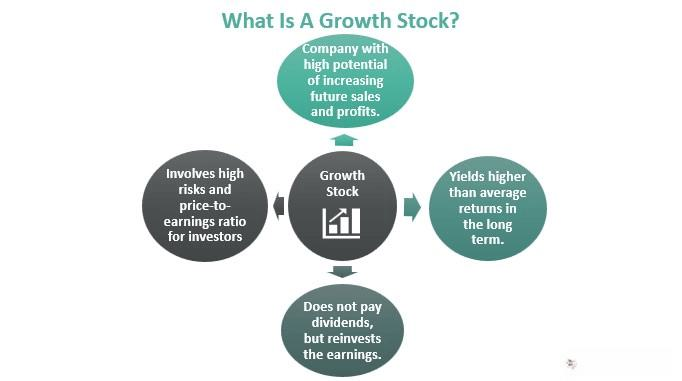

The investment landscape is undergoing rapid transformation, and it's crucial for investors to stay updated on emerging trends. This article examines the convergence of three pivotal aspects of modern investing: growth stocks, algorithmic trading (algo trading), and the stock market at large. As investors seek innovative ways to enhance returns, growth stocks and algo trading offer promising opportunities. This examination aims to clarify the meaning of these terms, their interplay, and the potential benefits of their integration. Whether you are an experienced trader or a newcomer, grasping these concepts is vital for achieving success in today's stock market.

## Table of Contents



## Understanding Growth Stocks

Growth stocks are characterized by their potential for above-average growth relative to other companies within the market. These stocks typically represent firms that reinvest their profits into the business rather than distributing them as dividends. This reinvestment strategy is often employed to drive further expansion and enhance the company's market position. Growth stocks are typically identified by several key attributes, including robust revenue increases, expanding market share, and the provision of innovative products or services. 

The attraction of growth stocks lies in their potential for substantial returns, as these companies are often poised to capitalize on emerging trends or unmet market needs. For instance, technology companies that introduce groundbreaking products often fall into this category. However, investing in growth stocks carries inherent risks. Such companies can experience significant market volatility due to their speculative valuations. The prices of growth stocks can be sensitive to fluctuations in investor sentiment and broader economic conditions, leading to considerable price swings.

Investors should perform careful evaluations of growth potential and financial fundamentals when considering growth stocks. Key metrics for analysis include revenue growth rates, profit margins, return on equity (ROE), and earnings growth projections. Additionally, qualitative factors such as the company's competitive position, management quality, and industry dynamics play a significant role in assessing potential investments.

Balancing risk and reward is essential when investing in growth stocks. While these stocks offer the possibility of high returns, the potential for risk should not be underestimated. Careful analysis and a well-diversified portfolio can help mitigate some of these risks, allowing investors to capitalize on the growth opportunities these stocks present.

## The Role of Algo Trading in Modern Investing

Algorithmic trading, commonly referred to as algo trading, utilizes computer algorithms to automate the trading process. This method revolutionizes the trading environment by enabling transactions at speeds and volumes that exceed human capability, thus allowing for more efficient market practices.

At its core, algo trading involves pre-programmed instructions accounting for variables such as timing, price, and [volume](/wiki/volume-trading-strategy), allowing for various strategic applications. One prevalent strategy is high-frequency trading ([HFT](/wiki/high-frequency-trading-strategies)), which seeks to capitalize on minuscule price discrepancies at rapid speeds, often involving thousands of trades per second. Another strategy, [arbitrage](/wiki/arbitrage), identifies and exploits price differences of identical or similar financial instruments on different markets or in various forms. Trend following, another favored strategy, relies on algorithms to automatically detect and act on trends, ensuring trades align with overarching market movements.

By eliminating emotional influences from trading decisions, algo trading seeks to achieve consistent and informed outcomes. Human traders can be swayed by bias or impulse, often contributing to inefficiencies or inconsistencies. However, algorithmic approaches operate purely on data and predefined criteria, aiming for optimized and rationalized execution.

Nevertheless, despite its benefits, algo trading is not without challenges. The approach demands robust and sophisticated technological infrastructures, incorporating advanced computing systems and complex software development. Additionally, effective risk management is crucial due to inherent market fluctuations and potential system errors. Algorithms must be designed to account for such risks, incorporating fail-safes to handle unexpected conditions and minimize losses.

Furthermore, regulators impose stringent guidelines on [algorithmic trading](/wiki/algorithmic-trading) practices to ensure fair and transparent market operations. These regulations address issues like market manipulation and ensure an even playing field for all market participants.

In summary, algorithmic trading reshapes how investments are managed by enhancing speed, efficiency, and consistency. Yet, it requires significant technological and regulatory considerations to navigate its complexities effectively. As technology continues to evolve, so too will the methodologies and impacts of algo trading in modern investing.

## The Synergy between Growth Stocks and Algo Trading

Combining growth stock investment strategies with algorithmic trading presents a promising approach for optimizing trading decisions and maximizing returns. Algorithms, powered by advanced data analytics and [machine learning](/wiki/machine-learning), can efficiently sift through large datasets to identify potential [growth stocks](/wiki/growth-stocks). These stocks are characterized by their potential for above-average growth, driven by factors such as revenue acceleration, expanding market segments, or innovative offerings.

For instance, by inputting historical financial data, market indicators, and other relevant metrics into machine learning models, investors can forecast future growth patterns of specific stocks. This capability allows for the identification of stocks with significant upside potential before they are widely recognized in the market. Consider using a simple Python algorithm to identify growth patterns:

```python
import pandas as pd
from sklearn.linear_model import LinearRegression

# Load data
data = pd.read_csv('stock_data.csv')

# Define features and target
X = data[['revenue_growth', 'market_share', 'r_and_d_investment']]
y = data['stock_price']

# Train linear regression model
model = LinearRegression()
model.fit(X, y)

# Predict future stock price
predicted_price = model.predict([[0.15, 0.05, 0.03]])
print("Predicted Stock Price:", predicted_price)
```

This approach not only aids in the discovery of promising stocks but also facilitates timely execution by trading algorithms that can respond instantly to market signals. High-frequency trading (HFT) systems, for example, can execute thousands of orders per second, capturing gains that may be fleeting in a rapidly changing market.

Furthermore, investment strategies that incorporate both growth stocks and algorithmic trading can optimize portfolio management. Algorithms can rebalance portfolios automatically, adjusting for market conditions to minimize risk exposure while maximizing potential returns. This real-time adaptability is crucial in volatile markets where traditional trading strategies may falter.

Capitalizing on market [volatility](/wiki/volatility-trading-strategies) also becomes more manageable through automated systems. Algorithms can exploit short-term price fluctuations to buy at lows and sell at highs, thereby enhancing profitability. By integrating sophisticated risk management protocols, algorithms can also mitigate potential losses arising from sharp market downturns or unexpected systemic disruptions.

Understanding how to effectively merge growth stock strategies with algorithmic trading is key to maintaining a competitive edge in the financial markets. With ongoing technological advancements and increased data availability, the synergy between these elements will likely become an indispensable tool for forward-thinking investors.

## Developing a Strategy for Success

Building a successful investment strategy that incorporates both growth stocks and algorithmic trading necessitates meticulous planning and research. Investors embarking on this path must first evaluate their individual risk tolerance, financial objectives, and technological capabilities. This triad of personal factors will guide the strategic choices regarding investment selection and the implementation of algorithmic systems.

A comprehensive understanding of one's risk tolerance is paramount. Risk tolerance influences the type of growth stocks one might pursue, as well as the extent to which algo trading is employed. For instance, more risk-averse individuals may prefer a conservative algorithmic strategy that focuses on minimizing volatilities, while those with a higher risk appetite might explore algorithms capable of exploiting high-growth opportunities with greater potential returns.

Financial goals also play a central role. Understanding both short-term and long-term investment goals aids in developing strategies that align with these timelines. Objectives such as saving for retirement, buying a house, or funding a child’s education will influence portfolio choices, mixing growth stocks with algorithmic trading approaches that yield desired returns.

The technological capabilities of the investor can significantly impact the decision to integrate algorithmic trading. This includes not only access to necessary hardware and software but also the skill to develop or manage complex trading algorithms. Collaborating with financial advisors or utilizing robo-advisors can be invaluable in this regard. These professionals and digital platforms bring expertise, tools, and resources that might otherwise be inaccessible to individual investors. Robo-advisors, in particular, automate many elements of portfolio management, providing recommendations that include growth stocks as part of a diversified investment strategy.

As the financial markets and available technology continually evolve, it is essential for investors to remain diligent in their education on market trends, technological advancements, and economic factors. This is a continuous process that demands attention to the latest developments in both the stock market and digital trading technologies. The rapidly changing nature of market dynamics and technological innovation requires investors to stay updated and flexible in adjusting their strategies.

Maintaining adaptability is crucial, as integration of technology in trading paradigms is expected to persist in evolving. This could involve experimenting with new algos, refining existing ones, or even altering one's mix of growth stocks and algorithmic trading techniques based on prevailing market conditions. Investors should be prepared to recalibrate their strategies in response to shifts in economic indicators or technological disruptions.

In summary, a deliberate approach that combines a comprehensive understanding of personal factors, along with collaboration and continuous learning, is essential for success. Investors who skillfully navigate the interplay between growth stocks and algorithmic trading can leverage these tools to achieve substantial returns while managing risks effectively.

## Risks and Considerations

Both growth stocks and algorithmic trading present certain risks that are critical for investors to understand. Market volatility is a significant concern when investing in growth stocks. Companies categorized as growth stocks often have high valuations based on expected future earnings, rather than current financial performance. This makes them particularly sensitive to changes in market sentiment, economic conditions, and [interest rate](/wiki/interest-rate-trading-strategies) fluctuations. A sudden shift in any of these factors can lead to rapid price changes, resulting in substantial gains or losses for investors. The volatility of growth stocks underscores the necessity for a well-considered risk management strategy.

Algorithmic trading, while offering advantages in speed and efficiency, is not without its challenges. Technologically driven, these systems can be susceptible to various forms of disruptions, including hardware failures, software bugs, and cyber-attacks. Such technical issues can lead to erroneous trades, impacting portfolios negatively. Additionally, algorithmic trading systems rely heavily on historical data and programmed criteria, which might not account for unprecedented market conditions or black swan events. Hence, robust testing and contingency planning are essential components of any algorithmic trading strategy.

Regulatory scrutiny is another crucial [factor](/wiki/factor-investing) that investors must consider, especially with algorithmic trading. This practice, due to its automated nature, raises concerns about market fairness, manipulation, and systemic risks. Regulatory bodies worldwide, such as the U.S. Securities and Exchange Commission (SEC) and the European Securities and Markets Authority (ESMA), have established guidelines and laws governing algorithmic trading to ensure transparency and fairness. Compliance with these regulations is mandatory, and failure to do so can result in penalties and legal consequences.

Ethical considerations also arise with algorithmic trading. Issues such as the potential for market manipulation and the disproportionate effect on retail investors raise questions about fairness and equity in trading practices. Investors and traders must consider the ethical implications of their trading strategies, ensuring they align with broader market integrity principles.

A comprehensive understanding of these risks not only aids in risk mitigation but also contributes to the creation of more resilient investment strategies. By balancing potential returns with the associated risks, investors can better navigate the complexities of modern investing. Employing methods such as diversification, rigorous back-testing, and continuous monitoring can fortify investment strategies against the inherent uncertainties present in growth stocks and algorithmic trading.

## Conclusion

The investment landscape is continuously evolving, driven by advancements in technology and changing market dynamics. Growth stocks and algorithmic trading typify this evolution, presenting investors with opportunities to enhance their investment outcomes significantly. These two components, when effectively combined, serve as powerful tools that can lead to improved financial performance.

Growth stocks are characterized by their potential for above-average growth, driven by innovation, market demand, and strategic reinvestment. Their potential for substantial returns attracts many investors, making them a staple in modern investment portfolios. Simultaneously, algorithmic trading leverages sophisticated algorithms and data analysis to execute trades with precision and speed, maximizing efficiency and potentially capturing market opportunities that human traders might miss.

Investors who diligently educate themselves about these tools and the broader market trends position themselves advantageously for financial success. The ability to adapt to new strategies and technological advancements is crucial. Those who remain informed and flexible can navigate the challenges and opportunities presented by modern investing.

A keen awareness of the inherent risks associated with both growth stocks and algorithmic trading is also essential. This risk awareness helps investors balance potential rewards with potential pitfalls, enabling the creation of resilient and adaptable investment strategies. As the stock market continues to evolve, maintaining this balance is imperative for sustained success.

Innovation should be embraced, yet it must be tempered with vigilance. By doing so, investors can confidently navigate the complexities of today's investment environment, leveraging the power of growth stocks and algorithmic trading to achieve their financial goals.

## References & Further Reading

[1]: Bergstra, J., Bardenet, R., Bengio, Y., & Kégl, B. (2011). ["Algorithms for Hyper-Parameter Optimization."](https://papers.nips.cc/paper/4443-algorithms-for-hyper-parameter-optimization) Advances in Neural Information Processing Systems 24.

[2]: ["Advances in Financial Machine Learning"](https://www.amazon.com/Advances-Financial-Machine-Learning-Marcos/dp/1119482089) by Marcos Lopez de Prado

[3]: ["Evidence-Based Technical Analysis: Applying the Scientific Method and Statistical Inference to Trading Signals"](https://www.amazon.com/Evidence-Based-Technical-Analysis-Scientific-Statistical/dp/0470008741) by David Aronson

[4]: ["Machine Learning for Algorithmic Trading"](https://github.com/stefan-jansen/machine-learning-for-trading) by Stefan Jansen

[5]: ["Quantitative Trading: How to Build Your Own Algorithmic Trading Business"](https://www.amazon.com/Quantitative-Trading-Build-Algorithmic-Business/dp/1119800064) by Ernest P. Chan