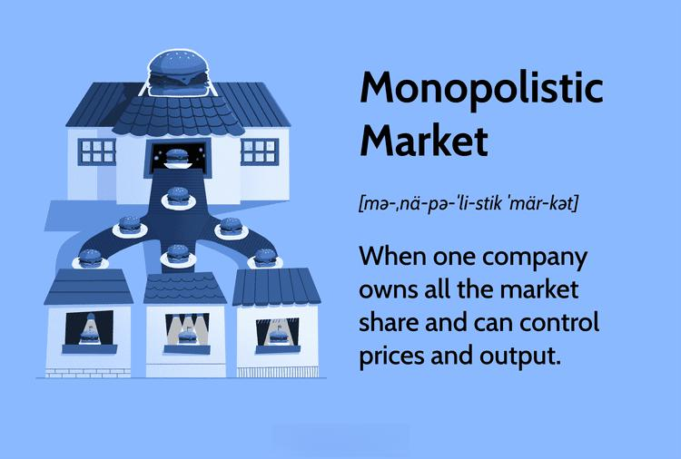

## Table of Contents

## What is a monopolistic market?

A monopolistic market is when one company is the only one selling a certain product or service. This means that if you want to buy that product or service, you have to buy it from that one company. There are no other choices. This can happen because the company might have a special technology, or it might be the only one allowed by the government to sell that thing.

In a monopolistic market, the company has a lot of power. It can set the price as high as it wants because people who need the product or service have no other place to go. This can be bad for customers because they might have to pay more money. Sometimes, the government watches monopolies closely to make sure they don't take advantage of people too much.

## How does a monopolistic market differ from a monopoly?

A monopolistic market and a monopoly are very similar, but there's a small difference. A monopoly is when one company is the only one selling a product or service in the whole market. It has total control over that product or service. On the other hand, a monopolistic market means that one company has a lot of control, but there might be a few other small companies trying to sell similar things. It's not as strict as a full monopoly.

In simple terms, think of a monopoly like a big kid who won't let anyone else play with a certain toy. No one else can even try to play with it. A monopolistic market is more like that big kid letting a few smaller kids play with different versions of the toy, but the big kid still has most of the control. Both situations can lead to higher prices and less choice for customers, but a monopolistic market has a bit more competition, even if it's not much.

## What are the key characteristics of monopolistic markets?

In a monopolistic market, one company has a lot of power over the price and supply of a product or service. This is because there are not many other companies selling the same thing. The big company can set higher prices because people who want to buy the product or service don't have many other choices. This can make it hard for new companies to start selling the same thing because they can't compete with the big company's prices or the way people know and trust the big company.

Even though there might be a few other small companies in a monopolistic market, they don't have much power. The big company can still do things like advertise a lot to make people think their product is the best, or they can make deals with stores to only sell their product. This can make it even harder for the small companies to grow. The government sometimes watches these markets to make sure the big company doesn't take advantage of people too much, but it's still tough for customers because they might have to pay more and have fewer choices.

## Can you explain product differentiation in monopolistic markets?

Product differentiation is a big thing in monopolistic markets. It means that the big company, and even the smaller ones, try to make their products a little different from each other. They do this so that people will think their product is better or special in some way. For example, they might change the color, add a new feature, or make the packaging look cool. This helps the companies stand out and makes people want to buy their product instead of someone else's.

In a monopolistic market, product differentiation is really important because it's one way for companies to keep their customers. Even though there might not be a lot of competition, if a company can make its product seem better or more interesting, people will keep buying it. This can also help the big company stay in control because if people think their product is the best, they won't want to try the smaller companies' products. So, even with just a few choices, product differentiation helps companies keep their edge in the market.

## How do firms in monopolistic markets compete?

In monopolistic markets, firms compete mainly through product differentiation. This means they try to make their products a bit different from others so that customers will think their product is better or more special. They might change the product's color, add new features, or make the packaging look cool. By doing this, they hope to attract more customers and keep the ones they already have. Even though there might not be a lot of other companies to compete with, making their product stand out is a big way for firms to stay ahead.

Another way firms in monopolistic markets compete is through marketing and advertising. They spend a lot of money to make sure people know about their product and think it's the best. They might use TV commercials, online ads, or even sponsor events to get their name out there. This helps them build a strong brand that people trust and want to buy from. Even if there are only a few other companies, good marketing can make a big difference in how many people choose to buy from one firm over another.

Sometimes, firms in monopolistic markets also compete by offering special deals or discounts. They might lower the price for a short time to get more people to try their product. This can help them get new customers and maybe even take some away from other companies. Even though the big company has a lot of control, these kinds of strategies can help smaller firms try to grow and compete better in the market.

## What role does advertising play in monopolistic markets?

Advertising is really important in monopolistic markets. It helps the big company, and even the smaller ones, tell people about their products and make them seem special. They use ads on TV, online, or even sponsor events to get their name out there. This way, they can build a strong brand that people trust and want to buy from. Even if there aren't many other companies to compete with, good advertising can make a big difference in how many people choose to buy from one company over another.

In a monopolistic market, the big company might use advertising to keep its power. They can spend a lot of money to make sure everyone knows their product is the best. This can make it hard for smaller companies to get noticed because people might not even know about their products. So, advertising helps the big company stay in control and makes it tough for new companies to start selling the same thing.

## How is pricing determined in monopolistic markets?

In monopolistic markets, the big company has a lot of power over pricing because there aren't many other companies selling the same thing. They can set the price higher if they want to because people who want to buy the product don't have many other choices. The big company looks at how much people are willing to pay and tries to find a price that will make them the most money. They might also think about how much it costs them to make the product and how much they want to earn.

Sometimes, smaller companies in a monopolistic market might try to compete by setting their prices a bit lower. They hope this will make people want to try their product instead of the big company's. But the big company can often use advertising and special deals to keep their prices high and still sell a lot. The government might watch these markets to make sure the big company doesn't set prices too high, but it can still be tough for customers because they might have to pay more and have fewer choices.

## What are the barriers to entry in monopolistic markets?

In monopolistic markets, it can be really hard for new companies to start selling their products. One big reason is that the big company already has a lot of customers who trust them. It's tough for a new company to convince people to try something different, especially if the big company has spent a lot of money on advertising to make their product seem like the best. The big company might also have special technology or patents that make it hard for new companies to make something similar.

Another barrier is the cost of getting started. It can be really expensive for a new company to make their product and get it out to people. They might need a lot of money to build factories, buy materials, and pay for advertising. The big company might be able to make their product cheaper because they've been doing it for a long time and have found ways to save money. This makes it even harder for new companies to compete on price.

Sometimes, the government can also make it hard for new companies to enter a monopolistic market. They might have rules that only let certain companies sell the product, or they might give the big company special rights. All these things together make it really tough for new companies to break into a monopolistic market and start selling their own products.

## How do monopolistic markets affect consumer choice?

In monopolistic markets, there aren't many choices for consumers. Usually, one big company has most of the control over a product or service, and there might be just a few smaller companies trying to sell similar things. This means that if you want to buy that product, you don't have a lot of options. The big company can set the prices high because people who need the product don't have many other places to go. This can make it harder for consumers to find what they want at a good price.

Because there's not much competition, the big company doesn't have to worry too much about making their product better or cheaper. They can spend a lot on advertising to make people think their product is the best, even if it's not. This can make it hard for new companies to start selling the same thing because they can't compete with the big company's prices or how well-known the big company is. So, consumers might end up paying more and having fewer choices because of how monopolistic markets work.

## What are the economic inefficiencies associated with monopolistic markets?

Monopolistic markets can lead to economic inefficiencies because the big company has a lot of control over the price and supply of a product. They can set the price higher than it would be if there were more competition. This means that people might have to pay more money for the product, and some people who can't afford the higher price might not buy it at all. This can lead to less of the product being sold than would be good for the economy. When fewer people can buy the product, it can slow down economic growth because people have less money to spend on other things.

Another inefficiency is that the big company might not have much reason to make their product better or cheaper. They don't have to worry about other companies taking their customers away, so they might not spend money on improving their product or finding ways to make it cheaper. This can mean that the product stays the same, even if it could be better. It also means that new companies might not be able to start selling the same thing because it's too hard to compete with the big company. This can stop new ideas and better products from coming into the market, which is bad for the economy because it stops growth and innovation.

## How do government regulations impact monopolistic markets?

Government regulations can help control monopolistic markets by making sure the big company doesn't take too much advantage of people. They might set rules about how high the company can set their prices, or they might watch to make sure the company isn't doing anything to stop new companies from starting up. The government can also break up a big company into smaller ones if they think it's too powerful. This can help make the market more fair and give people more choices.

But, government regulations can also make it harder for new companies to enter a monopolistic market. Sometimes, the government gives special rights to the big company, like patents or licenses, that make it hard for others to compete. These rules can protect the big company's power and keep the market from becoming more competitive. So, while regulations can help control the big company, they can also make it tough for new businesses to start and grow.

## What are some real-world examples of monopolistic markets and their characteristics?

A good example of a monopolistic market is the cable television industry in many parts of the United States. In some areas, there might be only one big cable company that provides TV services. This company can set high prices because people who want cable TV don't have many other choices. They might spend a lot on advertising to make people think their service is the best, even if it's not. This makes it hard for new companies to start offering cable TV because they can't compete with the big company's prices or how well-known the big company is.

Another example is the market for operating systems on personal computers. Microsoft's Windows has a big share of this market. They can set prices and make decisions about what features to include because they have a lot of control. Other companies, like Apple with macOS, do exist, but they have a much smaller part of the market. Microsoft spends a lot on advertising and making deals with computer makers to keep their control. This makes it hard for new operating systems to get started because people are used to Windows and trust it, even if it's not always the best choice for everyone.

## References & Further Reading

[1]: Pindyck, R. S., & Rubinfeld, D. L. (2012). ["Microeconomics"](https://archive.org/details/microeconomics0007pind). Prentice Hall.

[2]: Stigler, G. J. (1982). ["The Theory of Price"](https://archive.org/details/theoryofpricebyg0000geor). University of Chicago Press.

[3]: Posner, R. A. (2009). ["Antitrust Law, Second Edition"](https://press.uchicago.edu/ucp/books/book/chicago/A/bo3628468.html). University of Chicago Press.

[4]: Varian, H. R. (1992). ["Microeconomic Analysis"](https://archive.org/details/microeconomicana0000vari_g1b1). W. W. Norton & Company.

[5]: Schumpeter, J. A. (2013). ["Capitalism, Socialism and Democracy"](https://www.taylorfrancis.com/books/mono/10.4324/9780203202050/capitalism-socialism-democracy-joseph-schumpeter). Routledge.