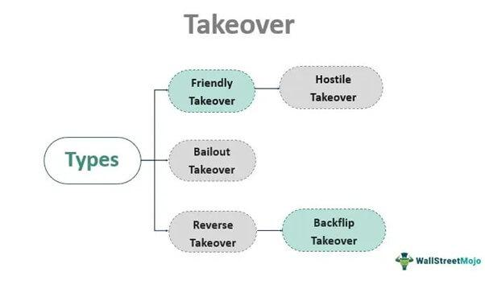

In a swiftly changing business environment, corporate strategy increasingly involves complex maneuvers such as takeovers, acquisitions, and the deployment of algorithmic trading. These elements are interlinked in ways that can both enhance and complicate business processes, offering significant opportunities for growth and competitive advantage.

A business takeover refers to one company's acquisition of control over another. This process can either be friendly, with the target company's management cooperating, or hostile, with the acquiring company pursuing the takeover against the management's wishes. Companies often pursue takeovers to access unique product offerings, secure consistent revenue streams, or strengthen their market position. These motivations reflect a broader strategy aimed at achieving strategic growth, expanding market share, and gaining a competitive edge.



Acquisitions, a closely related strategy, involve purchasing entire companies or specific business units and assets. They require detailed planning regarding financing, capital structure, and potential debt refinancing. Geographic proximity and managing litigation risks are also crucial considerations for minimizing operational disruptions and fostering successful integration.

Algorithmic trading (algo trading) has revolutionized financial markets by executing trades at speeds and volumes that human traders cannot match. It utilizes advanced algorithms to automate trading decisions and strategies, significantly improving market efficiency and reducing transaction costs. Strategies commonly employed in algo trading include market-making, arbitrage, and trend-following, each designed to optimize trading outcomes.

This article explores how these strategies intersect with the advent of algorithmic trading, examining its role as a significant game-changer in business takeovers and acquisitions. By understanding the dynamics of these interactions, businesses can leverage advanced technologies to navigate complex market landscapes, enhance strategic growth, and secure a leading competitive position.

## Table of Contents

## Understanding Business Takeovers

A business takeover occurs when one company gains control over another, fundamentally altering the management and operations of the target company. This control can be acquired through two primary approaches: a friendly takeover or a hostile takeover.

In a friendly takeover, the management and board of directors of the target company agree to the acquisition, often finding mutual benefit or strategic alignment with the acquiring firm. Such takeovers typically involve negotiations and discussions, ensuring that both parties have aligned interests concerning future business operations and objectives.

Conversely, a hostile takeover transpires when the target company's management opposes the acquisition. In such instances, the acquiring company might bypass management's consent and directly approach the shareholders, often through a public tender offer. Methods like 'creeping tender offers', where the acquiring company gradually purchases shares in the open market, also characterize hostile takeovers.

Key indicators of potential takeover targets include the company's strategic assets, such as unique product niches that differentiate it from competitors. Consistent revenue streams signify financial stability, making a company more appealing as it promises reliable income. Additionally, a robust market position, characterized by a sizable customer base and competitive advantage, enhances a company's attractiveness as a takeover candidate when firms aim for rapid market expansion or diversification.

The primary motivations behind takeovers include the pursuit of strategic growth opportunities. By acquiring another business with complementary or supplementary capabilities, an acquiring firm can rapidly expand its market reach and product offerings. Takeovers also allow firms to increase market share by absorbing a competitor and consolidate their market presence, often resulting in enhanced operational efficiencies and reduced competition.

Furthermore, takeovers serve as a mechanism to enhance competitive advantage by integrating the target company's resources, intellectual property, and human capital. These acquisitions can unlock synergies that drive innovation, improve production capabilities, and reduce costs, ultimately leading to a stronger market position.

In summary, business takeovers represent a dynamic strategy for companies seeking growth, market expansion, and improved competitive standing. By identifying and acquiring targets with strategic assets, companies can harness new opportunities and fortify their industry leadership.

## Acquisition Strategies and Considerations

Acquisitions are strategic maneuvers through which companies aim to expand their market presence, diversify their offerings, or secure competitive advantages. These transactions can encompass the purchase of entire companies or the acquisition of specific business units or valuable assets. The approach taken in an acquisition strategy critically influences the transaction's success and the long-term benefits for the acquirer.

A well-planned acquisition strategy considers numerous financial factors, including the cost structure and available financing options. Purchasers often rely on a mix of cash reserves, debt, and equity to fund acquisitions. The capital structure thus devised should ideally support the financial health of the acquiring firm without over-leveraging its balance sheet. According to a study by Kim and Mauborgne (2015), companies that manage their capital structures efficiently during acquisitions often maintain greater financial stability and flexibility.

Debt refinancing is another crucial consideration in acquisitions, taking into account the existing liabilities of the target company. Restructuring these debts, where applicable, can reduce financial burdens and create a more robust and sustainable financial framework post-acquisition. A notable example is the approach taken by Kraft Heinz in its acquisition of Heinz, where debt financing and refinancing were integral to the deal structure (Kim & Mauborgne, 2015).

Geographic proximity often comes into play as a strategic advantage in acquisitions. Companies gravitate towards targets that are closer to their existing operations to streamline management, reduce logistical costs, and facilitate closer collaboration. According to Porter (1980), adjacency can lead to synergies that enhance operational efficiencies and improve integration processes.

Mitigating litigation risks is also pivotal in acquisition planning, as legal disputes can significantly derail integration efforts and financially burden the acquirers. Conducting thorough due diligence is essential to identify and address potential legal challenges beforehand. The acquisition of WhatsApp by Facebook in 2014 exemplifies this, where careful legal groundwork helped the companies avoid significant litigation issues post-transaction (Karniel, I., & Lavie, D., 2017).

In sum, effective acquisition strategies require balancing financial considerations with strategic goals to optimize the value derived from such transactions. By carefully evaluating financing methods, capital structures, geographic considerations, and litigation risks, companies can successfully navigate the complexities of acquisitions and position themselves advantageously in their respective markets.

## Algo Trading: A Revolution in Financial Markets

Algorithmic trading, often referred to as algo trading, revolutionizes financial markets by utilizing automated platforms capable of executing trades at speeds and volumes far beyond human capabilities. This transformative approach leverages complex algorithms for decision-making, drawing from vast data sources and integrating advanced technologies. The primary mechanisms employed in [algorithmic trading](/wiki/algorithmic-trading) include strategies such as market-making, [arbitrage](/wiki/arbitrage), and trend-following, each contributing to enhanced market efficiency and reduced transaction costs.

Market-making is a strategy where programmatically driven algorithms provide [liquidity](/wiki/liquidity-risk-premium) to the market by quoting both buy and sell prices. This strategy ensures that financial instruments are more readily available for trade, stabilizing markets by mitigating sharp price fluctuations. The following Python snippet illustrates a basic market-making logic:

```python
class MarketMaker:
    def __init__(self, spread=0.01):
        self.spread = spread

    def quote(self, market_price):
        buy_price = market_price - self.spread / 2
        sell_price = market_price + self.spread / 2
        return buy_price, sell_price
```

Arbitrage strategies exploit price discrepancies in different markets or financial instruments, buying low in one market and selling high in another. These differences are often minuscule and can be leveraged efficiently only via algorithmic systems that operate at [high frequency](/wiki/high-frequency-trading). The rapid execution capability inherent in algos is crucial for capitalizing on these fleeting opportunities.

Trend-following strategies, another pillar of algorithmic trading, involve capitalizing on established market trends. By analyzing historical data patterns and employing predictive algorithms, traders can align their trades with enduring market movements rather than short-lived fluctuations. The integration of [machine learning](/wiki/machine-learning) techniques in these predictive algorithms further refines decision-making processes and enhances accuracy.

Algorithmic trading has transformed many facets of market dynamics, primarily through improving efficiency and managing transaction costs. The ability to process and analyze vast datasets in real-time enables faster and more informed decision-making, eliminating the lag associated with human intervention. Consequently, costs associated with trading are minimized, as algorithms reduce the bid-ask spread and transaction fees through high-frequency trades and optimal execution.

Algorithmic trading exemplifies the fusion of finance and technology, driving unprecedented changes in how markets operate. Its adoption continues to grow as financial institutions seek to harness technological advancements to remain competitive in a swiftly evolving environment.

## The Synergy between Acquisitions and Algorithmic Trading

Acquisitions in the technology and fintech sectors have increasingly become a strategic means to bolster a firm's algorithmic trading capabilities, thus enhancing overall market agility. When a firm acquires a company specializing in data analytics, it stands to gain significant advantages in the formulation and deployment of algorithmic trading systems. These analytics companies often possess sophisticated tools and methodologies for processing large volumes of financial data, which are crucial for developing effective trading algorithms. By integrating these technologies, the acquiring firm can achieve a more nuanced understanding of market trends and patterns, allowing for more informed and timely trading decisions.

Algorithmic trading systems benefit from big data and machine learning models, which can optimize trading strategies by continuously learning from market data. For example, machine learning algorithms can be trained to recognize patterns or anomalies in stock price movements, making real-time adjustments to trading strategies. Consider the use of a Python-based machine learning library like scikit-learn to implement a simple trading strategy that adapts based on past price movements:

```python
from sklearn.linear_model import LinearRegression
import numpy as np

# Assume historical price data
prices = np.array([100, 102, 101, 105, 107, 106]).reshape(-1, 1)
future_days = np.array([107, 108, 110]).reshape(-1, 1)

# Model training
model = LinearRegression().fit(prices[:-3], prices[1:-2])

# Predict future price
predicted_prices = model.predict(future_days)
```

By acquiring a data analytics firm, an organization can refine such predictive models, integrating more sophisticated variables such as market [volatility](/wiki/volatility-trading-strategies) indices or geopolitical events.

Furthermore, acquisition growth combined with advanced trading technologies fosters more effective navigation of market complexities. The merger of resources facilitates not only an expansion of technological infrastructure but also access to expert human capital skilled in implementing and optimizing algorithmic systems. This synergy allows the firm to respond rapidly to market signals, reducing lag times associated with trade executions. This rapid responsiveness enhances a firm's competitive edge, providing opportunities for increased profitability through more strategic market positioning.

Overall, aligning acquisitions with technological enhancements in trading systems produces a potent combination, enabling firms to master the intricate dynamics of modern financial markets. The strategic blending of acquisition and algorithmic trading can lead to a sustainable growth trajectory and a stronger market foothold, enabling businesses to thrive in an increasingly competitive landscape.

## Challenges in Combining Takeover and Algo Trading Strategies

Integrating new acquisitions with algorithmic trading strategies involves complex challenges that can impact the success of the merger and the stability of trading operations. One of the primary hurdles is the risk of cultural clashes. When a company acquires another, the differences in corporate cultures can hinder the smooth integration of staff, processes, and technologies. This discord can be exacerbated in sectors like tech and finance, where rapid adaptation is vital.

Regulatory compliance represents another significant challenge. The financial industry is heavily regulated, and both takeovers and algorithmic trading are subject to stringent oversight. Acquisitions may involve navigating antitrust laws, while algorithmic trading requires adherence to regulations aimed at ensuring market integrity and transparency. Companies must conduct thorough due diligence to prevent legal issues, which can be resource-intensive.

Technological hurdles are also prominent. Integrating disparate IT systems and trading platforms is necessary to achieve operational coherence. This integration must be executed with precision to prevent disruptions in trading activities. Algorithmic trading systems depend on real-time data feeds and low-latency execution, so any technological mismatch can impact performance.

Algorithmic trading, by nature, introduces volatility due to its high-frequency and high-[volume](/wiki/volume-trading-strategy) transactions. It necessitates robust oversight to manage systemic risks. Algorithms can amplify market movements, and in the case of malfunction or exploitation, they can destabilize markets rapidly. Therefore, continuous monitoring and updating of these systems are required to mitigate potential risks.

Balancing the integration of new acquisitions with algorithmic trading demands strategic planning aligned with long-term business objectives. A clear alignment helps streamline processes and focus resources more effectively. Proactive risk management is essential, involving the identification and assessment of potential hurdles and developing strategies to mitigate these risks. This may include creating comprehensive integration plans, investing in employee training to ease cultural transitions, and establishing strong governance frameworks to oversee algorithmic activities.

Organizations that successfully manage these challenges can harness the benefits of their acquisitions and advanced trading technologies to secure a competitive advantage in the market.

## Conclusion

Understanding the dynamics of business takeovers, corporate acquisitions, and algorithmic trading is pivotal for achieving strategic growth and maintaining a competitive edge in today’s business landscape. Each element plays a significant role in shaping corporate strategies and requires a nuanced understanding of their interactions and impacts on business operations.

Companies must carefully align their acquisition strategies with technological advancements and comply with regulatory requirements to derive optimal outcomes from these maneuvers. The integration of technology into acquisition strategies not only enhances operational efficiency but also ensures compliance with the ever-evolving legal frameworks governing mergers and acquisitions. This alignment can be achieved by leveraging advanced technologies such as machine learning and data analytics, which aid in evaluating potential acquisition targets, forecasting market trends, and assimilating acquired entities.

Moreover, harnessing the synergy between acquisitions and algorithmic trading offers firms the opportunity to secure sustainable growth and robust market positioning. Algorithmic trading, with its capability to process large volumes of data and execute trades at unprecedented speeds, enables businesses to navigate market complexities and capitalize on trading opportunities that might otherwise be inaccessible. By strategically acquiring firms in the tech or fintech sectors, businesses can bolster their trading capabilities, thus enhancing market agility and responsiveness.

In conclusion, the synergy between well-planned acquisitions and advanced trading technologies allows firms to better position themselves in competitive markets. By effectively managing these strategies, companies can foster sustainable growth and maintain a dominant position, ultimately enhancing shareholder value and ensuring long-term success.

## References & Further Reading

[1]: ["Advances in Financial Machine Learning"](https://www.amazon.com/Advances-Financial-Machine-Learning-Marcos/dp/1119482089) by Marcos Lopez de Prado

[2]: ["Quantitative Trading: How to Build Your Own Algorithmic Trading Business"](https://www.amazon.com/Quantitative-Trading-Build-Algorithmic-Business/dp/1119800064) by Ernest P. Chan

[3]: ["Machine Learning for Algorithmic Trading"](https://github.com/stefan-jansen/machine-learning-for-trading) by Stefan Jansen

[4]: Porter, M. E. (1980). ["Competitive Strategy: Techniques for Analyzing Industries and Competitors."](https://papers.ssrn.com/sol3/papers.cfm?abstract_id=1496175) Free Press.

[5]: Kim, W. C., & Mauborgne, R. (2015). ["Blue Ocean Strategy, Expanded Edition: How to Create Uncontested Market Space and Make the Competition Irrelevant"](https://www.amazon.com/Blue-Ocean-Strategy-Expanded-Uncontested/dp/1625274491) Harvard Business Review Press.