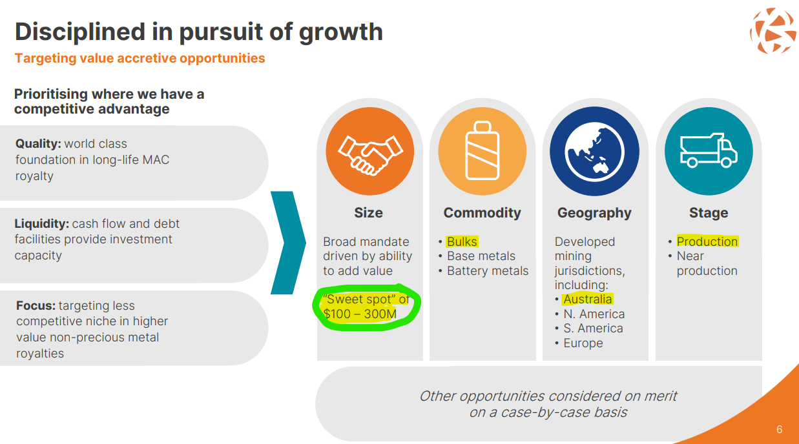

## Table of Contents

## What is a takeover target?

A takeover target is a company that another company wants to buy or take over. This happens when a bigger company thinks that buying the smaller company will help them grow, make more money, or get something special that the smaller company has, like a new technology or a popular product.

Sometimes, the bigger company will offer to buy all the shares of the smaller company. If the shareholders of the smaller company agree, the takeover happens. But if they don't agree, the bigger company might still try to buy enough shares to control the smaller company. This can lead to a lot of discussions and sometimes even fights between the companies.

## Why do companies become takeover targets?

Companies become takeover targets for a few main reasons. One big reason is that they might have something special that a bigger company wants. This could be a new technology, a popular product, or even a strong position in a certain market. The bigger company thinks that by buying the smaller company, they can use these special things to make more money or grow faster.

Another reason is that the smaller company might be struggling. Maybe it's not making enough money, or it's having trouble growing. A bigger company might see this as a chance to buy the smaller company at a lower price. They might think they can fix the problems and make the company successful again. So, being in a tough spot can make a company a target for a takeover.

## What are the common financial characteristics of takeover targets?

Takeover targets often have financial characteristics that make them attractive to bigger companies. One common trait is that they might be undervalued. This means the stock price of the company is lower than what the company is really worth. A bigger company might see this as a good deal and think they can buy the smaller company at a lower price and then make it worth more later.

Another financial characteristic is that takeover targets might have a lot of cash or assets that are not being used well. The bigger company might want to use these resources to help their own business grow. Also, if the smaller company is not making as much profit as it could, the bigger company might think they can come in and make changes to improve the profits.

Sometimes, takeover targets have a lot of debt. This can make them vulnerable because they might need help to pay it off. A bigger company might offer to buy the smaller company and take on its debt, thinking they can handle it better. So, having too much debt can make a company a target for a takeover.

## How does market performance influence a company's likelihood of being a takeover target?

When a company's stock price goes down a lot, it can become more likely to be a takeover target. This is because the company might seem like a good deal to a bigger company. If the stock price is low, the bigger company can buy a lot of shares without spending too much money. They might think that after they buy the company, they can make changes to make the stock price go up again and make more money.

On the other hand, if a company's stock price is doing really well, it might still be a takeover target. This can happen if the company has something special that a bigger company wants, like a new technology or a strong position in a market. Even though the stock price is high, the bigger company might think it's worth paying a lot to get that special thing. So, both good and bad market performance can make a company a target for a takeover.

## What role do industry conditions play in identifying takeover targets?

Industry conditions are very important when it comes to figuring out which companies might be takeover targets. If an industry is growing fast, companies in that industry can become targets because bigger companies want to be part of that growth. For example, if there's a new technology that's getting popular, companies that have that technology might be targets. Also, if an industry is changing a lot, like moving from old ways of doing things to new ways, companies that are good at the new ways might be targets.

On the other hand, if an industry is not doing well, companies in that industry might also become takeover targets. This can happen because their stock prices might be low, making them a good deal for bigger companies. Sometimes, a bigger company might think they can come in and fix the problems in the struggling industry and make money. So, whether an industry is doing well or not, the conditions in the industry can make some companies more likely to be takeover targets.

## How can a company's management and governance structure make it a takeover target?

A company's management and governance structure can make it a takeover target if it's not doing a good job. If the people running the company are not making good decisions or if they're not making enough money, the company might be seen as weak. A bigger company might think they can come in and do a better job. Also, if the people in charge are not listening to what the shareholders want, the shareholders might be happy to sell their shares to another company that promises to do better.

Another way a company's governance can make it a takeover target is if it's easy for another company to buy it. If the company's rules make it hard for the people in charge to stop a takeover, it can be a target. For example, if the shareholders can easily vote to sell the company, a bigger company might try to buy a lot of shares and take over. So, having a weak management team or rules that make it easy to be bought can make a company more likely to be a takeover target.

## What are the strategic reasons a company might be targeted for takeover?

A company might be targeted for takeover because it has something special that the bigger company wants. This could be a new technology, a popular product, or even a strong position in a certain market. The bigger company thinks that by buying the smaller company, they can use these special things to make more money or grow faster. For example, if a smaller company has a new way of doing things that is getting popular, a bigger company might want to buy it to stay ahead of other companies.

Another reason is that the smaller company might be struggling. Maybe it's not making enough money, or it's having trouble growing. A bigger company might see this as a chance to buy the smaller company at a lower price. They might think they can fix the problems and make the company successful again. So, being in a tough spot can make a company a target for a takeover. Sometimes, the bigger company wants to get rid of a competitor by buying it, which can also be a strategic reason for a takeover.

## How do regulatory environments affect the selection of takeover targets?

Regulatory environments can make a big difference in which companies are chosen as takeover targets. Some countries have strict rules about takeovers, which can make it harder for a bigger company to buy a smaller one. For example, if the government thinks that a takeover might hurt competition or go against the country's interests, they might stop it. This means that companies in industries that are closely watched by the government, like banking or energy, might be less likely to be takeover targets.

On the other hand, if the rules are not so strict, it can be easier for a bigger company to buy a smaller one. In places where the government doesn't get in the way too much, more companies might be seen as good targets. Also, if the rules are clear and easy to understand, it can make companies more attractive because the bigger company knows what to expect. So, the regulatory environment can either open up more chances for takeovers or make them harder to happen.

## What are the valuation methods used to assess potential takeover targets?

When a bigger company wants to buy a smaller one, they need to figure out how much the smaller company is worth. One way they do this is by using the Discounted Cash Flow (DCF) method. This method looks at how much money the smaller company is expected to make in the future and then figures out what that money is worth now. It's like trying to guess how much money the company will bring in over time and then deciding how much to pay for it today. Another way is the Comparable Company Analysis, where the bigger company looks at other companies that are similar to the one they want to buy. They see how much those other companies are worth and use that to guess the value of the target company.

Another valuation method is the Precedent Transactions method. This is where the bigger company looks at past deals where other companies were bought and sold. They see how much was paid for those companies and use that information to figure out how much they should pay for the target company. It's like looking at what people paid for similar houses in the past to decide how much to offer for a new house. All these methods help the bigger company decide if the smaller company is a good deal and how much they should offer to buy it.

## How do synergies impact the decision to pursue a takeover target?

Synergies are really important when a bigger company is thinking about buying a smaller one. Synergies mean that the two companies together can do better than they could do on their own. For example, the bigger company might be able to use the smaller company's technology to make more money, or they might be able to save money by combining their operations. When a bigger company sees these possible synergies, they might be more likely to want to buy the smaller company because they think it will help them grow and make more money.

But figuring out if the synergies are real can be hard. The bigger company has to think carefully about how much better things will be after the takeover. They have to look at things like how much money they can save, how much more they can sell, and if they can do things better together. If the bigger company thinks the synergies are big enough, they might decide to go ahead with the takeover. But if they think the synergies are not that great, they might decide it's not worth it to buy the smaller company.

## What are the defensive strategies companies use to avoid becoming takeover targets?

Companies can use different ways to stop other companies from taking them over. One way is called the "poison pill." This is when a company makes its stock less attractive if someone tries to buy a lot of it. For example, they might let other shareholders buy more stock at a lower price, making it harder for the buyer to get control. Another way is called the "golden parachute." This means that if the company is taken over, the top people in the company get a lot of money. This can make the takeover more expensive and less attractive to the buyer.

Another strategy is called "staggered board elections." This means that not all the board members are up for election at the same time. It takes longer for a buyer to get control of the board, making a takeover harder. Companies can also try to make themselves less attractive by taking on a lot of debt or selling off important parts of the business. This can make it harder for another company to see them as a good target. By using these strategies, companies can make it tougher for others to take them over.

## How can advanced data analytics and AI be used to identify potential takeover targets?

Advanced data analytics and AI can help companies find good takeover targets by looking at a lot of information quickly and finding patterns that people might miss. For example, AI can look at financial data, like how much money a company is making and how much it's worth, to see if it's a good deal. It can also check out what people are saying on social media or in the news about the company to see if it's doing well or having problems. By using all this information, AI can help a bigger company decide if a smaller company would be a good target to buy.

AI can also look at how well a company is doing compared to other companies in the same industry. It can see if the company is growing faster or slower than others and if it has something special that makes it stand out. This can help the bigger company figure out if buying the smaller company would help them grow or make more money. By using advanced data analytics and AI, companies can make smarter choices about which other companies to try to buy.

## References & Further Reading

[1]: ["Advances in Financial Machine Learning"](https://www.amazon.com/Advances-Financial-Machine-Learning-Marcos/dp/1119482089) by Marcos Lopez de Prado

[2]: ["Quantitative Trading: How to Build Your Own Algorithmic Trading Business"](https://www.amazon.com/Quantitative-Trading-Build-Algorithmic-Business/dp/1119800064) by Ernest P. Chan

[3]: ["Machine Learning for Algorithmic Trading"](https://github.com/stefan-jansen/machine-learning-for-trading) by Stefan Jansen

[4]: Porter, M. E. (1980). ["Competitive Strategy: Techniques for Analyzing Industries and Competitors."](https://papers.ssrn.com/sol3/papers.cfm?abstract_id=1496175) Free Press.

[5]: Kim, W. C., & Mauborgne, R. (2015). ["Blue Ocean Strategy, Expanded Edition: How to Create Uncontested Market Space and Make the Competition Irrelevant"](https://www.amazon.com/Blue-Ocean-Strategy-Expanded-Uncontested/dp/1625274491) Harvard Business Review Press.
