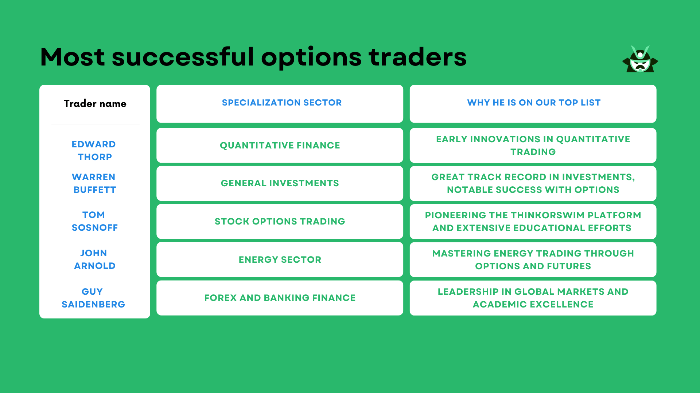

## Table of Contents

## What are the basic principles of options trading that every beginner should know?

Options trading involves buying and selling contracts that give you the right, but not the obligation, to buy or sell an asset at a specific price before a certain date. There are two types of options: calls and puts. A call option gives you the right to buy an asset, while a put option gives you the right to sell it. The price at which you can buy or sell the asset is called the strike price, and the date by which you must exercise your option is known as the expiration date. Understanding these basic terms is crucial for anyone starting in options trading.

Another important principle is the concept of premiums. When you buy an option, you pay a premium to the seller. This premium is influenced by factors like the asset's price, the strike price, the time until expiration, and the asset's volatility. As a beginner, it's helpful to know that options can be used for different purposes. Some traders use options to speculate on the future price movements of an asset, hoping to make a profit. Others use options to hedge their investments, reducing the risk of potential losses in their portfolio. Knowing why you're trading options can help you make better decisions.

Lastly, it's important to understand the risks involved in options trading. Options can be highly leveraged, meaning you can control a large amount of an asset with a relatively small investment. This leverage can lead to significant profits, but it can also result in substantial losses. It's wise for beginners to start with a clear understanding of their risk tolerance and to use strategies that align with their financial goals. Taking the time to learn and practice with smaller amounts can help build confidence and skill in options trading.

## How can a beginner identify the right options trading strategies for their risk tolerance?

To identify the right options trading strategies for your risk tolerance, start by understanding what level of risk you're comfortable with. Risk tolerance is about how much money you can afford to lose without it affecting your financial stability. If you're cautious and prefer to avoid big losses, look for strategies that limit your downside, like buying protective puts or selling covered calls. These strategies can help you manage risk by setting a maximum loss amount. On the other hand, if you're more adventurous and willing to take on more risk for potentially higher rewards, consider strategies like buying call options or selling put options. These can offer greater profit potential but also come with increased risk.

Once you know your risk tolerance, research different options strategies and see how they align with your comfort level. For example, if you want to keep things simple and safe, the "long call" strategy might be a good fit. This involves buying a call option, which gives you the right to buy a stock at a set price. It's straightforward and limits your loss to the premium you paid. If you're open to a bit more complexity, the "straddle" strategy could be interesting. This involves buying both a call and a put option with the same strike price and expiration date, betting on significant price movement either up or down. Remember, it's important to start small, practice with a demo account if possible, and gradually increase your involvement as you become more comfortable with the strategies and their risks.

## What are the common mistakes beginners make in options trading and how can they avoid them?

One common mistake beginners make in options trading is not understanding the basics well enough. They might jump into trading without knowing what terms like strike price, expiration date, or premiums mean. This can lead to confusion and bad decisions. To avoid this, beginners should take the time to learn the fundamentals before starting to trade. There are many free resources available online, like tutorials and courses, that can help. It's also a good idea to start with small amounts of money and practice with a demo account to get a feel for how options work without risking a lot.

Another mistake is not managing risk properly. Some beginners might go all in on a single trade, thinking they can make a big profit quickly. But options can be risky, and if the market moves against them, they could lose a lot of money. To avoid this, it's important to set clear limits on how much you're willing to lose on any one trade. Using strategies like stop-loss orders can help manage this risk. Also, diversifying your trades and not putting all your money into one option can help spread out the risk and protect your investment.

Lastly, many beginners fail to have a solid trading plan. They might trade based on emotions or tips from others, which can lead to impulsive decisions. A good trading plan should include clear goals, strategies that match your risk tolerance, and rules for when to enter and exit trades. Sticking to this plan can help keep emotions in check and make trading more disciplined. Regularly reviewing and adjusting your plan based on what you learn from your trades is also a smart move.

## How important is understanding market volatility for intermediate options traders?

Understanding market volatility is very important for intermediate options traders. Volatility is a measure of how much the price of an asset moves up and down. In options trading, volatility affects the price of options. If the market is very volatile, options prices go up because there's a higher chance the option will end up being profitable. On the other hand, if the market is calm and not moving much, options prices go down. Intermediate traders need to understand this because it helps them decide which options to buy or sell and when to do it.

Intermediate traders can use different strategies based on their understanding of volatility. For example, if they think volatility will increase, they might buy options to take advantage of the higher premiums. Or, if they think volatility will decrease, they might sell options to earn the premium. By keeping an eye on market volatility, intermediate traders can make smarter decisions and adjust their trading strategies to fit the current market conditions. This can help them manage risk better and potentially increase their profits.

## What role does technical analysis play in the decision-making process of an options trader?

Technical analysis helps options traders make decisions by looking at past price movements and chart patterns. Traders use this to try and guess where the price of a stock might go next. They look at things like support and resistance levels, which are price points where the stock often stops going down or up. They also use tools like moving averages, which smooth out price data to show trends over time. By studying these patterns and indicators, options traders can decide when to buy or sell options, hoping to make a profit.

Another important part of technical analysis for options traders is understanding momentum and volume. Momentum indicators, like the Relative Strength Index (RSI), show if a stock is overbought or oversold, which can signal if a price change might be coming. Volume tells traders how many shares are being traded, and a big change in volume can mean that a big move in the stock price might happen soon. By combining all this information, options traders can better time their trades and pick the right options strategies. This helps them manage risk and aim for better returns.

## How can an intermediate trader use options Greeks to improve their trading performance?

Options Greeks are important tools for intermediate traders because they help understand how different factors affect the price of an option. The most common Greeks are Delta, Gamma, Theta, and Vega. Delta tells you how much the option's price will change if the stock price changes by one dollar. Gamma shows how Delta changes as the stock price moves. Theta measures how much the option's value decreases as time passes, which is important because options have an expiration date. Vega shows how much the option's price changes with a change in the market's volatility. By understanding these Greeks, traders can make better choices about which options to buy or sell and when to do it.

Using the Greeks can help traders manage their risk and potentially increase their profits. For example, if a trader knows the Delta of an option, they can predict how the option's price will move with the stock price. This helps them decide if the option is a good buy or if they should sell it. Theta is useful for understanding how time decay affects the option's value, so traders can choose options with the right expiration date for their strategy. Vega helps traders see how changes in market volatility could impact their options, allowing them to adjust their positions accordingly. By keeping an eye on these Greeks, intermediate traders can fine-tune their strategies and make more informed trading decisions.

## What advanced options strategies should an experienced trader consider to maximize profits?

Experienced traders looking to maximize profits might consider using advanced strategies like the Iron Condor. This strategy involves selling an out-of-the-money call spread and an out-of-the-money put spread on the same stock with the same expiration date. The goal is to profit from the stock price staying within a certain range. By doing this, traders can earn the premium from both spreads, but it requires a good understanding of market conditions and careful management of the position. If the stock price stays between the two strike prices, the trader keeps the full premium, but if it moves outside this range, losses can occur.

Another strategy is the Butterfly Spread, which can be used when a trader expects little to no movement in the stock price. This involves buying an in-the-money call, selling two at-the-money calls, and buying an out-of-the-money call, all with the same expiration date. The maximum profit is achieved if the stock price is exactly at the middle strike price at expiration. This strategy limits both the potential profit and the risk, making it a good choice for experienced traders who want to take advantage of a stock's stability. Both the Iron Condor and Butterfly Spread require a deep understanding of options and the ability to predict market behavior accurately.

## How do successful options traders manage and mitigate risk in their trading activities?

Successful options traders manage and mitigate risk by using a variety of strategies. One key approach is diversification. Instead of putting all their money into one option, they spread it across different trades. This way, if one trade goes bad, they won't lose everything. They also use stop-loss orders, which automatically sell an option if its price drops to a certain level. This helps limit how much they can lose on a single trade. Another important tool is position sizing, where traders decide how much money to put into each trade based on their overall portfolio and risk tolerance.

In addition to these strategies, successful traders pay close attention to the Greeks, like Delta, Theta, and Vega, to understand how different factors affect their options. They use this information to adjust their positions and manage risk. For example, if they see that Theta is high, meaning the option is losing value quickly as time passes, they might close the position early to avoid further loss. They also use hedging strategies, like buying protective puts or selling covered calls, to protect their investments from big market swings. By combining these methods, experienced traders can better manage the risks that come with options trading.

## What psychological traits are essential for expert options traders to maintain discipline and focus?

Expert options traders need to have strong self-control to stay disciplined. They must stick to their trading plan and not let their emotions make them do things they shouldn't. This means they don't get too excited when they make money or too upset when they lose it. They understand that losses are part of trading, so they stay calm and keep following their strategy. Having patience is also important. They know that good opportunities don't come every day, so they wait for the right time to make their moves.

Another key trait is the ability to focus. Expert traders can block out distractions and concentrate on what's important, like analyzing the market and making smart decisions. They also need to be good at managing stress because options trading can be intense. By staying calm under pressure, they can think clearly and make the best choices for their trades. These psychological traits help them stay disciplined and focused, which is crucial for success in options trading.

## How do expert traders adapt their strategies to different market conditions?

Expert traders change their strategies based on what's happening in the market. If the market is calm and prices aren't moving much, they might use strategies like the Iron Condor or Butterfly Spread. These strategies work well when they think the stock price will stay in a certain range. They sell options to earn the premium and hope the stock stays where they want it to. If the market starts moving a lot, they might switch to strategies like buying calls or puts. These let them make money if the stock price goes up or down a lot. They use their understanding of market conditions to pick the right strategy at the right time.

When the market is going up, expert traders might use bullish strategies like buying call options or selling put options. They do this because they think the stock price will keep going up, and these strategies can make them money if they're right. But if the market starts going down, they might switch to bearish strategies, like buying put options or selling call options. These strategies help them make money when the stock price falls. By watching the market closely and knowing when to switch strategies, expert traders can make the most of different market conditions.

## What are the best practices for portfolio diversification among successful options traders?

Successful options traders diversify their portfolios by spreading their money across different types of options and stocks. They don't put all their money into one option or one stock. Instead, they might buy options on different companies in different industries. This way, if one industry or company does badly, they won't lose all their money. They also mix up their strategies, using some that make money if the stock price goes up and others that make money if it goes down. This helps them balance out their risk and potential rewards.

Another important part of diversification for options traders is to use different expiration dates. They might buy some options that expire soon and others that expire later. This can help them take advantage of short-term and long-term market movements. By spreading their trades across different times, industries, and strategies, successful options traders can protect their investments and increase their chances of making money in the long run.

## How do top options traders continue to educate themselves and stay ahead of market trends?

Top options traders keep learning by reading a lot. They look at financial news, market analysis reports, and books about trading. They also join trading communities online or go to trading seminars and workshops. This helps them learn from other traders and stay up-to-date with new strategies and ideas. By doing this, they can understand what's happening in the market and make better trading decisions.

To stay ahead of market trends, top options traders use technology. They use special software and tools to analyze market data and spot trends early. They also follow economic indicators and news that can affect the market. By keeping an eye on these things, they can predict where the market might go next and adjust their trading strategies accordingly. This constant learning and staying informed helps them stay successful in the fast-changing world of options trading.

## What are the traits of a successful options trader?

Managing risk is a fundamental aspect of successful options trading. In this rapidly evolving financial landscape, traders must ensure they have a comprehensive understanding of their position and exposure to market fluctuations. Effective risk management involves not only setting stop losses and limits but also diversifying their portfolios to mitigate unpredictable market swings.

A successful options trader often exhibits proficiency with numbers, necessitating a robust understanding of market indicators, particularly [volatility](/wiki/volatility-trading-strategies). Volatility is a critical element in options pricing models, such as the Black-Scholes model, which defines the price of an option based on several factors, including the underlying asset's volatility. A trader's ability to interpret changes in implied volatility can inform strategic decisions when entering and exiting positions. Mathematically, the Black-Scholes formula for a call option price $C$ is given by:

$$
C = S_0N(d_1) - X e^{-rt} N(d_2)
$$

where:

- $S_0$ is the current price of the stock,
- $X$ is the exercise price of the option,
- $r$ is the risk-free interest rate,
- $t$ is the time to expiry,
- $N$ is the cumulative distribution function of the standard normal distribution,
- $d_1$ and $d_2$ are intermediaries given by:
  \[ d_1 = \frac{\ln(S_0/X) + (r + \sigma^2/2) t}{\sigma \sqrt{t}}
$$
  \[ d_2 = d_1 - \sigma \sqrt{t}
$$
- $\sigma$ is the volatility of the stock.

Discipline and patience are essential traits that support traders in adhering to their predefined strategies and resisting the urge to act impulsively. The markets offer numerous opportunities, but acting too soon or without sufficient analysis can lead to suboptimal outcomes. By maintaining discipline, traders can ensure they act according to their risk management plans and strategic objectives.

Each trader's effectiveness can be enhanced by developing a personal trading style that aligns with their individual strengths and psychological disposition. For instance, some traders may thrive in high-volatility environments, utilizing aggressive strategies, while others may prefer more conservative approaches, focusing on stable, long-term gains. By identifying and honing a personal trading style, traders can better navigate market complexities and capitalize on their inherent strengths.

Interpreting news and market trends is another critical component of successful options trading. A trader's ability to analyze external information and separate substantial market shifts from mere hype enables more informed decision-making. This involves staying abreast of economic indicators, political developments, and financial reports that can influence market dynamics. Tools such as sentiment analysis algorithms can be employed for this purpose, capturing the market's mood and anticipating potential shifts based on real-time news and social media inputs:

```python
# Example of basic sentiment analysis using Python's TextBlob library
from textblob import TextBlob

def analyze_sentiment(text):
    analysis = TextBlob(text)
    return analysis.sentiment.polarity

# Example: Determining sentiment from a piece of financial news
news = "Market sees significant growth as economic stimulus takes effect"
sentiment_score = analyze_sentiment(news)

print(f"Sentiment score: {sentiment_score}")
```

In sum, mastering the traits of risk management, numerical aptitude, discipline, personalized strategy development, and market trend interpretation can significantly enhance an options trader's success. By dedicating efforts to these areas, traders build the foundation for sustained achievement in the financial markets.

## References & Further Reading

[1]: Bergstra, J., Bardenet, R., Bengio, Y., & Kégl, B. (2011). ["Algorithms for Hyper-Parameter Optimization."](https://dl.acm.org/doi/10.5555/2986459.2986743) Advances in Neural Information Processing Systems 24.

[2]: ["Advances in Financial Machine Learning"](https://www.amazon.com/Advances-Financial-Machine-Learning-Marcos/dp/1119482089) by Marcos Lopez de Prado

[3]: ["Evidence-Based Technical Analysis: Applying the Scientific Method and Statistical Inference to Trading Signals"](https://www.amazon.com/Evidence-Based-Technical-Analysis-Scientific-Statistical/dp/0470008741) by David Aronson

[4]: ["Machine Learning for Algorithmic Trading"](https://github.com/stefan-jansen/machine-learning-for-trading) by Stefan Jansen

[5]: ["Quantitative Trading: How to Build Your Own Algorithmic Trading Business"](https://www.amazon.com/Quantitative-Trading-Build-Algorithmic-Business/dp/1119800064) by Ernest P. Chan