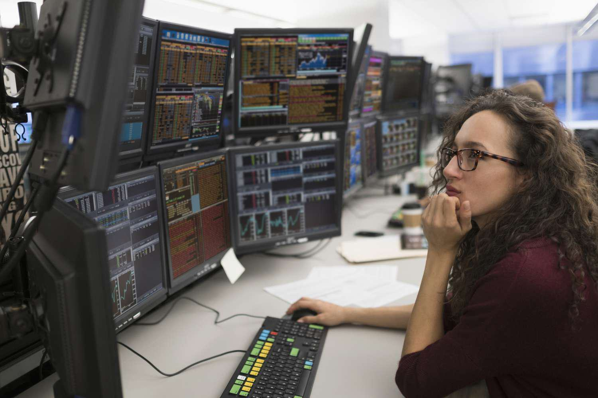

The world of finance is evolving rapidly, with options trading and algorithmic trading at the forefront. In recent years, these two domains have significantly transformed the landscape of trading, driven by technological advancements and dynamic market conditions. Whether a seasoned professional or a novice investor, understanding the confluence of these areas can provide a substantial edge in the financial markets.

Options trading offers a versatile and strategic approach to investing, where traders can speculate on the future price movements of underlying assets. It allows for strategies such as hedging, which can mitigate potential losses, or leverage, which can amplify returns. The critical traits of successful options traders, such as risk management, numerical proficiency, discipline, and market interpretation skills, are indispensable in navigating the complex mechanisms of options markets effectively.



On the other hand, algorithmic trading represents the cutting-edge of technological integration into trading strategies. It utilizes advanced software and algorithms to execute trades at speeds and efficiencies beyond human capabilities. For example, high-frequency trading, a subset of algo trading, leverages milliseconds to gain competitive advantages. The deployment of algorithms also supports various trading strategies, including trend-following, mean reversion, and statistical arbitrage, each offering unique benefits and challenges.

The intersection of options trading and algorithmic trading presents unique opportunities for traders to refine their strategies and enhance their operations. By combining the human traits essential to successful trading with algorithmic precision, traders can not only streamline their processes but also improve decision-making capabilities. Hybrid approaches allow traders to maintain the flexibility of human judgment while leveraging data-driven insights for optimal trading outcomes.

This article will explore the foundational traits of a successful options trader alongside the integral aspects of algo trading. By synthesizing these insights, traders can better leverage technology and strategy to elevate their trading performance. Furthermore, understanding the future trends where these domains are headed is crucial for staying ahead in the continuously advancing financial markets.

In essence, as financial markets become more sophisticated, the strategic integration of human intuition and technological innovation becomes increasingly crucial. The ability to adapt, learn, and innovate in this evolving landscape not only defines successful traders today but will continue to do so in the years to come.

## Table of Contents

## Traits of a Successful Options Trader

Managing risk is a fundamental aspect of successful options trading. In this rapidly evolving financial landscape, traders must ensure they have a comprehensive understanding of their position and exposure to market fluctuations. Effective risk management involves not only setting stop losses and limits but also diversifying their portfolios to mitigate unpredictable market swings.

A successful options trader often exhibits proficiency with numbers, necessitating a robust understanding of market indicators, particularly [volatility](/wiki/volatility-trading-strategies). Volatility is a critical element in options pricing models, such as the Black-Scholes model, which defines the price of an option based on several factors, including the underlying asset's volatility. A trader's ability to interpret changes in implied volatility can inform strategic decisions when entering and exiting positions. Mathematically, the Black-Scholes formula for a call option price $C$ is given by:

$$
C = S_0N(d_1) - X e^{-rt} N(d_2)
$$

where:

- $S_0$ is the current price of the stock,
- $X$ is the exercise price of the option,
- $r$ is the risk-free interest rate,
- $t$ is the time to expiry,
- $N$ is the cumulative distribution function of the standard normal distribution,
- $d_1$ and $d_2$ are intermediaries given by:
  \[ d_1 = \frac{\ln(S_0/X) + (r + \sigma^2/2) t}{\sigma \sqrt{t}}
$$
  \[ d_2 = d_1 - \sigma \sqrt{t}
$$
- $\sigma$ is the volatility of the stock.

Discipline and patience are essential traits that support traders in adhering to their predefined strategies and resisting the urge to act impulsively. The markets offer numerous opportunities, but acting too soon or without sufficient analysis can lead to suboptimal outcomes. By maintaining discipline, traders can ensure they act according to their risk management plans and strategic objectives.

Each trader's effectiveness can be enhanced by developing a personal trading style that aligns with their individual strengths and psychological disposition. For instance, some traders may thrive in high-volatility environments, utilizing aggressive strategies, while others may prefer more conservative approaches, focusing on stable, long-term gains. By identifying and honing a personal trading style, traders can better navigate market complexities and capitalize on their inherent strengths.

Interpreting news and market trends is another critical component of successful options trading. A trader's ability to analyze external information and separate substantial market shifts from mere hype enables more informed decision-making. This involves staying abreast of economic indicators, political developments, and financial reports that can influence market dynamics. Tools such as sentiment analysis algorithms can be employed for this purpose, capturing the market's mood and anticipating potential shifts based on real-time news and social media inputs:

```python
# Example of basic sentiment analysis using Python's TextBlob library
from textblob import TextBlob

def analyze_sentiment(text):
    analysis = TextBlob(text)
    return analysis.sentiment.polarity

# Example: Determining sentiment from a piece of financial news
news = "Market sees significant growth as economic stimulus takes effect"
sentiment_score = analyze_sentiment(news)

print(f"Sentiment score: {sentiment_score}")
```

In sum, mastering the traits of risk management, numerical aptitude, discipline, personalized strategy development, and market trend interpretation can significantly enhance an options trader's success. By dedicating efforts to these areas, traders build the foundation for sustained achievement in the financial markets.

## The Role of Algo Trading in Financial Markets

Algorithmic trading, often referred to as algo trading, is the use of computer programs to execute trades in financial markets based on pre-set strategies. This approach offers advantages in terms of speed and precision, which are superior to the capabilities of manual trading. By swiftly processing vast amounts of data and executing trades within milliseconds, algo trading has become a cornerstone of modern financial markets, particularly in the context of high-frequency trading ([HFT](/wiki/high-frequency-trading-strategies)).

One of the principal benefits of [algorithmic trading](/wiki/algorithmic-trading) is its ability to execute complex strategies quickly and accurately. This capability stems from sophisticated algorithms that can identify trading opportunities and act on them in fractions of a second. For example, in high-frequency trading, the ability to execute trades in milliseconds can be pivotal, as even the slightest delay can result in missed opportunities or increased costs due to price fluctuations.

Various algorithmic strategies cater to different trading goals, each bringing a unique approach to market participation:

1. **Trend-Following Strategies**: These algorithms capitalize on market momentum by identifying and following prevailing price trends. They rely on indicators such as moving averages and momentum oscillators to determine entry and exit points. The strategy is based on the hypothesis that prices tend to move in trends and will continue to do so in the future.

2. **Mean Reversion Strategies**: This method operates on the assumption that prices will revert to their mean or average over time. Algorithms implementing this strategy look for deviations from the mean and generate buy or sell signals accordingly. The approach assumes that if a price deviates significantly from its historical average, it is likely to return, offering a trading opportunity.

3. **Statistical Arbitrage**: A more complex strategy utilizing mathematical models to identify and exploit pricing inefficiencies between related financial instruments. This may involve pairs trading, where two related securities are simultaneously traded to capture perceived market mispricing. Here, tools such as cointegration tests are employed to assess the long-term equilibrium relationship between securities.

Algorithmic trading platforms like MetaTrader and TradeStation provide traders with advanced features to develop and test these strategies. MetaTrader, for example, offers a popular scripting language (MQL) that enables traders to create and backtest automated trading systems. These platforms are equipped with analytical tools, historical data, and simulated trading environments, allowing traders to refine their strategies before deploying them in live markets.

In summary, algorithmic trading plays a crucial role in financial markets by utilizing automated systems to execute trades with speed and precision. By employing diverse strategies, such as trend-following, mean reversion, and statistical [arbitrage](/wiki/arbitrage), alongside technological platforms like MetaTrader and TradeStation, traders can enhance their ability to navigate the complex and fast-paced world of trading.

## Combining Human Traits and Technology

The integration of personal traits such as patience and risk management with automated systems in trading presents a substantial advantage. This blend not only leverages the strengths of algorithmic precision but also benefits from the nuanced judgment that human experience can provide. Technology, in this context, serves to amplify a trader's ability to manage multiple positions and execute complex strategies effectively. 

Advanced algorithmic systems enable traders to quickly navigate through enormous sets of data, identify patterns, and execute trades with accuracy that far surpasses human capabilities. For instance, algorithmic models utilize statistical methods and [machine learning](/wiki/machine-learning) algorithms to predict price movements and make data-driven trading decisions. A simple linear regression model might be used to predict the future price of a stock based on historical data:

```python
import numpy as np
from sklearn.linear_model import LinearRegression

# Sample data: historical stock prices (in dollars)
X = np.array([[1], [2], [3], [4], [5]])  # Time periods
y = np.array([100, 110, 108, 115, 120])  # Stock prices

# Create a linear regression model
model = LinearRegression().fit(X, y)

# Predict the stock price for the next time period
future_time_period = np.array([[6]])
predicted_price = model.predict(future_time_period)
print(f"Predicted stock price: ${predicted_price[0]:.2f}")
```

While algorithms provide speed and efficiency, seasoned traders bring their instincts and experiences to bear, allowing them to adjust strategies in real-time. Human traits such as intuition, developed from years of observing market behaviors and anomalies, can provide insights that are not readily apparent from data analysis alone. Hence, technology should enhance human decision-making, rather than replace it.

The key to effective trading in today's markets lies in achieving a balance where technology serves as an augmentation tool for human insight. This balance ensures that traders can maximize their strengths by allowing algorithms to handle the structured and high-frequency tasks, while humans focus on strategic planning and qualitative assessments.

An essential part of this process involves learning from both successes and failures. An iterative approach in adapting trading strategies, informed by past experiences and algorithmic insights, fosters resilience and adaptability. Traders who harness the analytical power of technology while applying their judgment are better equipped to navigate the complexities of financial markets and achieve consistent success.

## Case Studies of Successful Traders

Profiles of traders who have successfully combined traditional and algorithmic trading strategies reveal a variety of paths to success, each marked by adaptability and innovative thinking. A common feature among these traders is their ability to harmonize data-driven approaches with instinctual decision-making, creating a holistic trading methodology.

#### Adaptation to Market Changes

Successful traders often demonstrate a keen ability to adapt to changing market conditions. This adaptability stems from a blend of quantitative analysis and qualitative insights. For instance, traders like Paul Tudor Jones have famously used traditional macroeconomic analysis combined with algorithmic models to predict market shifts. By employing a hybrid strategy, they can identify potential pivot points in market trends and adjust their positions accordingly.

Using data-driven strategies allows these traders to react to market movements with precision. Algorithmic systems can process large datasets quickly, providing traders with actionable insights. For example, a Python-based algorithm might be used to analyze historical volatility patterns to predict future price movements:

```python
import numpy as np
import pandas as pd

def calculate_historical_volatility(prices):
    returns = np.log(prices / prices.shift(1))
    return returns.std() * np.sqrt(252)  # Annualized volatility

price_data = pd.Series([100, 102, 101, 103, 105])
volatility = calculate_historical_volatility(price_data)
print(f"Historical Volatility: {volatility}")
```

While algorithms offer speed and precision, successful traders also rely on their instincts. Intuition, honed through years of experience, often informs when to override algorithmic signals, especially during unexpected market events.

#### Common Strategies in Options Trading

In options trading, successful traders frequently employ strategies that marry both traditional and technical analysis. Strategies such as straddles and strangles, combined with algorithmic execution, enable traders to capitalize on volatility without entirely depending on directional market plays. Algorithms assist in setting optimal entry and [exit](/wiki/exit-strategy) points, maximizing the probability of profit.

These traders also use statistical models to enhance options strategies. For example, a mean-reversion algorithm might be calibrated to identify when an asset is likely to revert to its historical mean, forming the basis for executing trades that capitalize on temporary price distortions.

#### Flexibility and Continuous Learning

Maintaining flexibility is crucial. Top traders are perpetually learning, incorporating market feedback into their strategies. They conduct regular post-trade analyses to understand what worked and what didn't, refining their approach using lessons learned. This iterative process ensures that strategies remain relevant as market dynamics evolve.

#### Broad Applications Across Markets

The trading styles of successful traders offer lessons applicable to various markets. Strategies that integrate algorithms with human oversight can be adapted to equities, [forex](/wiki/forex-system), and commodities trading. The principle of balancing quantitative models with qualitative insights transcends market boundaries, providing a blueprint for holistic trading practices. 

Overall, the journey of successful traders underscores the importance of a blended approach. By effectively combining data-driven decision-making with human judgment, they enhance their ability to navigate complex and unpredictable market landscapes.

## Future Trends in Options and Algo Trading

Algorithmic trading is on the cusp of significant transformations, largely driven by advancements in [artificial intelligence](/wiki/ai-artificial-intelligence) (AI) and machine learning (ML). These technologies provide traders with substantial predictive analytics capabilities which enhance decision-making by identifying patterns and trends that are not readily discernible through traditional analysis. Predictive models, powered by large datasets, enable traders to anticipate market movements, optimize trading strategies, and reduce risk. 

Options trading strategies are also evolving, with growing automation driven by technological advancements. Automated trading systems incorporate various options trading strategies, such as straddles and strangles, to facilitate the management of option portfolios with minimal human intervention. As these systems become more sophisticated, they can implement multivariate analysis to assess market conditions and execute trades based on probabilistic models. 

Big data and real-time analytics are integral to shaping dynamic and adaptive trading strategies. Traders now have access to vast amounts of data generated in real-time, allowing for instant analysis and quick adaptation to market changes. By utilizing machine learning algorithms, traders can process this data to generate actionable insights, leading to more informed decision-making.

Moreover, the accessibility of advanced algorithmic tools to retail traders marks a significant development in the trading landscape. Platforms offering user-friendly interfaces and advanced algorithms allow individual traders to employ strategies previously limited to institutional investors. This democratization of algorithmic trading tools opens up new opportunities for retail traders to compete more effectively in the markets.

Potential regulatory changes are another area to watch. As algorithmic and options trading grow more prevalent, regulatory bodies may introduce new rules to ensure market stability and transparency. These could include stricter standards for algorithm testing and validation, enhanced risk management protocols, and measures to mitigate the systemic risks associated with high-frequency trading. Traders and firms must stay informed about regulatory developments to ensure compliance and adapt their strategies accordingly.

This integration of AI, automation, big data, and accessible tools points toward a future where trading strategies are increasingly sophisticated, allowing traders to navigate the complexities of the financial markets more effectively.

## Conclusion

Combining successful trader traits with algorithmic trading tools offers a comprehensive strategic advantage that significantly enhances the capacity to navigate increasingly complex financial markets. The fusion of human intuition with advanced technological tools provides a dual-layered approach where qualitative insights and quantitative precision coalesce to deliver superior performance. 

Those traders who adeptly leverage technology while maintaining the nuance of human judgment are poised to excel. A trader's instinct and experience are often invaluable in identifying market conditions that algorithms alone might not detect. Algorithms can efficiently execute trades at unprecedented speeds, yet the ability to interpret emergent market shifts remains a distinctly human skill. 

As technology and markets evolve, continuous education becomes imperative. Whether it is understanding new regulations, novel financial instruments, or the latest in AI-driven analytics, traders must commit to lifelong learning. Tools and strategies can rapidly become obsolete, and what distinguishes enduring success is the ability to adapt. This involves a readiness to embrace technological advancements while refining personal skills and strategies.

Beyond the numerical analysis, successful trading is defined by the dynamic interplay of strategy, effective decision-making, and precise execution. This integrative approach demands not only technical expertise but also strategic foresight and disciplined implementation. A balanced trader is one who strategically aligns algorithmic capabilities with personal insights, carefully evaluating risk and reward to make informed decisions.

In closing, embracing innovation while maintaining a disciplined approach can lead to sustained success in financial markets. As data-driven strategies become more pervasive, the ability to harmonize human experience with machine precision will determine not just survival but thriving in the evolving landscape. Harnessing the power of both worlds requires vigilance, adaptability, and a commitment to continuous improvement, ensuring that traders remain at the forefront of market opportunities while adeptly navigating its inherent complexities.

## References & Further Reading

[1]: Bergstra, J., Bardenet, R., Bengio, Y., & Kégl, B. (2011). ["Algorithms for Hyper-Parameter Optimization."](https://dl.acm.org/doi/10.5555/2986459.2986743) Advances in Neural Information Processing Systems 24.

[2]: ["Advances in Financial Machine Learning"](https://www.amazon.com/Advances-Financial-Machine-Learning-Marcos/dp/1119482089) by Marcos Lopez de Prado

[3]: ["Evidence-Based Technical Analysis: Applying the Scientific Method and Statistical Inference to Trading Signals"](https://www.amazon.com/Evidence-Based-Technical-Analysis-Scientific-Statistical/dp/0470008741) by David Aronson

[4]: ["Machine Learning for Algorithmic Trading"](https://github.com/stefan-jansen/machine-learning-for-trading) by Stefan Jansen

[5]: ["Quantitative Trading: How to Build Your Own Algorithmic Trading Business"](https://www.amazon.com/Quantitative-Trading-Build-Algorithmic-Business/dp/1119800064) by Ernest P. Chan