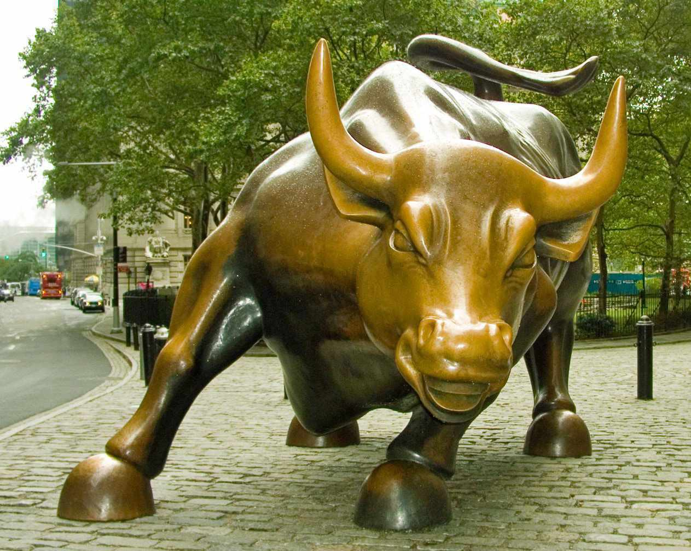

The Charging Bull, also known as the Wall Street Bull, stands as a prominent bronze sculpture situated in the heart of New York City's Financial District. Crafted by artist Arturo Di Modica, this iconic piece transcends its status as mere art, embodying the aggressive spirit and enduring optimism associated with Wall Street. The Bull's powerful symbolism aligns closely with financial markets, particularly bull markets, which characterize periods of strong economic growth and investor confidence. 

Its presence in the financial hub of Wall Street underscores its significance as a representation of prosperity, embodying the aspirations of investors and traders seeking fortune and opportunity. Beyond its artistic merit, the Charging Bull reflects the dynamic nature of Wall Street, capturing the essence of risk-taking and competition that drives global finance.



In recent years, the landscape of finance has undergone transformative changes, primarily due to the integration of technology and algorithmic trading. Algorithmic trading has emerged as a dominant force, redefining how financial markets operate and challenging traditional trading approaches. This evolution emphasizes the interplay between art and technology, as represented by the Charging Bull and the sophisticated algorithms shaping contemporary finance. 

This article examines the symbolism of the Charging Bull within this modern context, exploring its relevance as financial markets adapt to technological advancements. The discourse offers a reflection on how enduring symbols like the Charging Bull continue to interact with and inspire the evolving financial systems of today.

## Table of Contents

## The Symbolism of the Charging Bull

Crafted by the Italian-American artist Arturo Di Modica, the Charging Bull—also known as the Wall Street Bull—was installed as a guerrilla sculpture in Bowling Green Park, New York City, in December 1989. Di Modica designed the bronze statue as a statement piece, intending it to embody strength, perseverance, and a resilient spirit. His objective was to create a work of art that conveyed a message of optimism following the 1987 stock market crash, a significant financial downturn. The Charging Bull's installation was an unsolicited act; Di Modica had financed the project himself, spending approximately $360,000 to create and place the sculpture as a Christmas gift to the people of New York. 

The sculpture stands at an impressive 11 feet in height and weighs approximately 7,100 pounds. These dimensions contribute to its remarkable presence, commanding attention and evoking a sense of dynamism and power—key characteristics that Di Modica sought to impart through his work. The physical attributes of the sculpture—emphasized muscles, intense expression, and forward-postured stance—artistically translate the idea of relentless forward momentum, akin to the aggressive nature of a charging bull, which is a metaphor for bullish financial markets.

Symbolically, the Charging Bull embodies ongoing economic prosperity and reflects the optimism generally seen among investors during bull markets, periods characterized by rising stock prices and widespread market confidence. The bull is an established icon in financial terminology, representing market conditions where investor confidence is high, and the overall economy is robust. This aligns with Di Modica's intentions of conveying a message of strength and hope, signaling a brighter and more prosperous financial future after a period of instability.

Positioned strategically in the financial district of New York, a global hub for economic exchanges and the home of the New York Stock Exchange, the Charging Bull’s location amplifies its significance to trading culture. Standing in proximity to Wall Street, the sculpture not only enhances its relevance as an emblem of financial optimism but also intertwines the worlds of art and commerce. Its placement in such an iconic financial area underscores the sculpture's integration into the narrative of financial markets, where it has become an enduring symbol interacting continuously with the economic pulse of Wall Street.

## The Historical and Cultural Context

The Charging Bull sculpture, created by artist Arturo Di Modica, was unveiled in December 1989 in New York City's Financial District. This event took place in the aftermath of the 1987 stock market crash, known as Black Monday, which had a significant impact on global financial markets. The crash highlighted vulnerabilities in trading systems and sparked fears of a prolonged economic downturn. Against this backdrop, the Charging Bull emerged as a symbol of resilience and hope, embodying the possibility of recovery and strength in turbulent times.

Over the years, the Bull has evolved beyond its initial artistic and symbolic intentions. It has become an iconic attraction, drawing millions of tourists to Bowling Green Park annually. Visitors from around the world flock to the site, eager to capture the essence of Wall Street's bullish optimism through photographs and personal encounters with the imposing sculpture. This transformation from guerrilla art to a beloved urban landmark reflects the enduring resonance of Di Modica's creation with both the city's residents and its visitors.

The Charging Bull has also found itself at the center of various cultural and political narratives. Its presence in a highly visible and economically significant location makes it a compelling backdrop for public discourse on diverse issues. For instance, in 2017, the installation of the "Fearless Girl" statue facing the Bull sparked conversations about gender diversity and equality in corporate leadership. This interaction between artworks highlighted broader societal issues, demonstrating how the Bull can act as a canvas for contemporary cultural dialogues.

Furthermore, the sculpture's imagery has been appropriated in various protests and movements, reinforcing its role in civic expression. Whether invoked during discussions on financial inequities or debates over capitalism, the Charging Bull remains a potent symbol within public narratives, continually reflecting the evolving social and political landscape.

## The Rise of Algorithmic Trading on Wall Street

Algorithmic trading, commonly referred to as algo trading, involves the utilization of computer algorithms to efficiently execute large trading orders. This method predominantly operates by leveraging the speed and computational power of computers to perform trades at a frequency and precision that is unattainable by human traders. By executing pre-programmed trading instructions that take into account variables such as timing, price, and [volume](/wiki/volume-trading-strategy), algo trading optimizes trade execution in financial markets.

Wall Street, being a major hub of global finance, has been at the forefront of adopting and pioneering this advanced trading technology. The transition to [algorithmic trading](/wiki/algorithmic-trading) has significantly transformed financial markets worldwide by enhancing the efficiency and accuracy of trade execution. As a result, algo trading has outpaced traditional trading methods, in which traders manually initiate buy or sell orders.

A key feature of algorithmic trading is its ability to process vast amounts of data in real-time. Algorithms analyze multiple markets and a multitude of parameters to identify trading opportunities that align with the strategic objectives set by traders. This process is essential for high-frequency trading ([HFT](/wiki/high-frequency-trading-strategies)), a subset of algorithmic trading that focuses on executing a large number of orders within extremely short time frames. Algorithmic trading systems can react to market events in a fraction of a second, thereby capitalizing on opportunities for profit that might be invisible to slower market participants.

For example, in a Python-based algo trading system, one might use libraries such as NumPy for numerical computations, pandas for data manipulation, and APIs to access real-time stock data. An algorithm to predict stock price movements using historical data might include [machine learning](/wiki/machine-learning) models such as linear regression, decision trees, or neural networks. Below is a simple Python snippet demonstrating the setup for a moving average crossover strategy, a basic algorithmic trading method:

```python
import pandas as pd
import numpy as np

# Load historical price data
data = pd.read_csv('historical_stock_data.csv')

# Calculate moving averages
short_window = 40
long_window = 100

data['short_mavg'] = data['Close'].rolling(window=short_window, min_periods=1).mean()
data['long_mavg'] = data['Close'].rolling(window=long_window, min_periods=1).mean()

# Generate signals
data['signal'] = np.where(data['short_mavg'] > data['long_mavg'], 1.0, 0.0)
data['positions'] = data['signal'].diff()

# Display signals
print(data[['Date', 'signal', 'positions']].tail())
```

The prevalence of algorithmic trading marks a significant departure from traditional methods. Traditional trading relied heavily on the skill and intuition of human traders, whereas algorithmic trading emphasizes data-driven decision-making and automation. This shift has influenced trading strategies, risk management practices, and even the regulatory landscape governing financial markets. The adoption of algo trading continues to grow, reshaping the dynamics of how assets are traded and demanding constant innovation and adaptation in trading technologies and strategies.

## Intersection of Art and Finance

The Wall Street Bull stands as a striking artistic symbol alongside the swift evolution of financial practices, particularly algorithmic trading. Art and finance intersect in various ways that highlight the dual elements of human creativity and calculated precision, forming an intriguing dichotomy. This juxtaposition is embodied in the Charging Bull's dynamic posture, exuding a sense of perpetual [momentum](/wiki/momentum) which mirrors the rapid and unyielding progress of technological advancements in financial markets.

Algorithmic trading represents the cutting-edge frontier of financial innovation. It leverages complex mathematical models and algorithms to execute trades at a speed and frequency unimaginable to human traders. This method optimizes strategies based on large data sets and predictive analytics, enhancing the efficiency and efficacy of market transactions. The Charging Bull mirrors this relentless pace, capturing the essence of a market that never halts, reflective of epochs of economic growth heralded by bullish trends.

The metaphorical power of the Bull in contrast to the numeric precision of algorithmic trading offers a lens to understand the evolution of financial markets. Today, finance is as much about emotion-driven confidence as it is about data-driven decision-making. The Bull's enduring presence in the Financial District serves as a reminder of the market's emotional core—where optimism takes physical form—and a counterbalance to the abstraction of algorithms that govern modern trading.

Art, embodied by the Charging Bull, reflects the narrative and identity of Wall Street, capturing its historic exuberance while algo trading signifies an era of digitized, optimization-centric finance. This confluence highlights a broader dialogue between tradition and technology, indicating how historical symbols and modern innovations can coexist and define the future trajectory of finance.

## Conclusion

Arturo Di Modica's Charging Bull persists as an enduring symbol of optimism and fortitude, capturing the essence of bullish markets characterized by confidence and upward momentum. In the dynamic landscape of Wall Street, where the traditional ethos of finance meets cutting-edge innovation, the Bull embodies this persistent spirit of optimism.

Advancements like algorithmic trading underscore Wall Street's ability to adapt to the demands of modern financial trends. Algorithmic trading revolutionizes market operations through the use of complex algorithms to execute trades at unprecedented speed and volume. This shift towards automation emphasizes efficiency and precision, marking a stark contrast to more traditional, human-driven trading methods.

This evolving landscape forms a dichotomy between art and technology. The Charging Bull stands as a testament to unwavering strength, while algorithmic trading illustrates the fast-paced evolution within financial markets. The interplay between tradition and innovation encourages a meaningful dialogue where legacy meets advancement.

As technologies continue to evolve, they do not overshadow the symbolic power of the Bull but rather enhance its relevance. This interplay orchestrates an ongoing narrative between the steadfast virtues of strength and the technological revolution, which defines market operations today. Consequently, the Charging Bull and its legacy persist not only as artistic icons but as dynamic components of a continually adapting financial ecosystem.

## References & Further Reading

[1]: Di Modica, Arturo. ["The Story Behind Wall Street's 'Charging Bull'"](https://connectwith.art/art/arturo-di-modica-and-his-legacy-the-charging-bull/). The Wall Street Journal.

[2]: Lopez de Prado, Marcos. ["Advances in Financial Machine Learning"](https://www.amazon.com/Advances-Financial-Machine-Learning-Marcos/dp/1119482089). Wiley.

[3]: Aronson, David R. ["Evidence-Based Technical Analysis: Applying the Scientific Method and Statistical Inference to Trading Signals"](https://www.amazon.com/Evidence-Based-Technical-Analysis-Scientific-Statistical/dp/0470008741). Wiley.

[4]: Jansen, Stefan. ["Machine Learning for Algorithmic Trading - Second Edition"](https://github.com/stefan-jansen/machine-learning-for-trading). Packt Publishing.

[5]: Chan, Ernest P. ["Quantitative Trading: How to Build Your Own Algorithmic Trading Business"](https://github.com/ftvision/quant_trading_echan_book). Wiley.