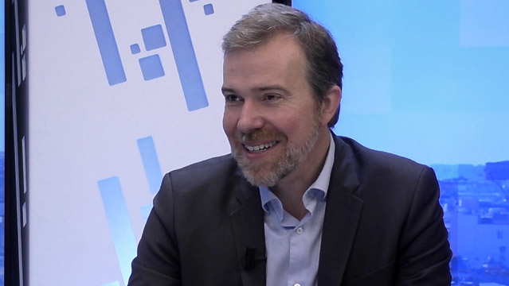

## Table of Contents

## Who is Charles-Albert Lehalle?

Charles-Albert Lehalle is a French mathematician and researcher who specializes in the field of quantitative finance. He is well-known for his work in market microstructure, which is the study of how financial markets operate at a very detailed level. Lehalle has spent many years working on developing mathematical models and algorithms that help understand and predict the behavior of financial markets.

He has worked in both academic and industry settings. Lehalle has held positions at major financial institutions like Société Générale and BNP Paribas, where he applied his research to improve trading strategies. Additionally, he has taught at universities and published numerous papers on topics like optimal trading, liquidity, and high-frequency trading. His contributions have made a significant impact on how financial markets are analyzed and operated.

## What is Charles-Albert Lehalle's educational background?

Charles-Albert Lehalle studied at the École Polytechnique, a famous school in France for science and engineering. After that, he went to École Nationale des Ponts et Chaussées, where he learned more about applied mathematics and engineering. These schools helped him build a strong base in math and science, which he used later in his career.

He also got a PhD in applied mathematics from the University of Paris-Dauphine. His PhD work was about using math to solve problems in finance. This education gave him the skills to work on complex financial models and understand how markets work.

## What are some of the key positions Charles-Albert Lehalle has held in his career?

Charles-Albert Lehalle has worked in many important jobs in finance and research. He started at Société Générale, a big French bank, where he was the Global Head of Quantitative Research. In this job, he used math to help the bank make better trading decisions. After that, he moved to BNP Paribas, another big bank, where he was the Head of Quantitative Research for the Investment Solutions division. There, he helped develop new ways to trade and manage money.

Later, Lehalle worked at Capital Fund Management (CFM), a company that uses math and computers to invest money. He was the Head of Quantitative Research there, helping to create strategies for trading. In addition to his industry roles, Lehalle has also been a professor and researcher. He taught at École Polytechnique and worked at the Centre de Recherche en Économie et Statistique (CREST), where he did research on how markets work and how to trade better.

## What contributions has Charles-Albert Lehalle made to the field of finance?

Charles-Albert Lehalle has made big contributions to finance by using math to understand and improve trading. He worked at big banks like Société Générale and BNP Paribas, where he helped them make better decisions about buying and selling stocks. He did this by creating models that predict how the market will move. These models help traders know when to buy or sell to make more money and avoid losing money. His work has changed how banks and big investors do their trading.

Lehalle also worked at Capital Fund Management, where he used math to create new ways to invest money. He helped develop strategies that use computers to trade very quickly, which is called high-frequency trading. This kind of trading can make a lot of small profits very fast. Besides working in banks, Lehalle has been a teacher and researcher. He taught at École Polytechnique and did research at CREST. His research has helped people understand how markets work and how to trade better. Overall, his work has had a big impact on how financial markets operate.

## How has Charles-Albert Lehalle influenced the development of algorithmic trading?

Charles-Albert Lehalle has played a big role in making [algorithmic trading](/wiki/algorithmic-trading) better. He used math to create models that help computers make smart trading decisions. These models look at a lot of data to guess how the market will move. This helped traders at big banks like Société Générale and BNP Paribas to buy and sell stocks in a smarter way. His work made it easier for them to make money and avoid losing it.

Lehalle also helped develop high-frequency trading, which is when computers trade very fast to make small profits many times. At Capital Fund Management, he worked on strategies that use this kind of trading. His ideas have changed how banks and big investors trade. By teaching at places like École Polytechnique and doing research at CREST, he shared his knowledge and helped others learn how to use computers for trading. His work has made a big difference in how financial markets work.

## What are some of the notable publications authored by Charles-Albert Lehalle?

Charles-Albert Lehalle has written many important papers about finance and trading. One of his well-known works is "Market Microstructure in Practice," which he wrote with his co-author. This book explains how markets work in detail and how to use math to trade better. It's used by people who want to understand and improve their trading strategies.

Another important paper he wrote is called "Optimal Trading Strategies under a Volume Constraint." In this paper, Lehalle talks about how to buy and sell stocks in a way that makes the most money while keeping the amount of trading under control. This is useful for traders who need to trade a lot without affecting the market too much. His work has helped many people in finance learn how to trade smarter.

## What specific research topics has Charles-Albert Lehalle focused on in recent years?

In recent years, Charles-Albert Lehalle has focused a lot on understanding how to trade better using computers. He's been looking into how to make trading strategies that can work well even when the market is changing a lot. This kind of research helps traders make smart decisions quickly, which is really important in today's fast-moving markets. Lehalle has been working on models that can predict what will happen in the market and help traders buy and sell at the best times.

Another area Lehalle has been researching is how to manage risk when trading. He's trying to find ways to trade that keep the risk low while still making good profits. This is important for big investors who need to be careful with their money. His work helps them understand how to balance making money with keeping their investments safe. By sharing his findings, Lehalle helps others in finance learn how to trade more safely and effectively.

## How does Charles-Albert Lehalle's work impact market microstructure?

Charles-Albert Lehalle's work has made a big difference in understanding how markets work at a very small level, which is called market microstructure. He uses math to look at things like how orders are placed, how prices change, and how traders behave. His research helps people see the tiny details that can affect the whole market. For example, Lehalle has created models that show how buying and selling stocks can change the price and how traders can use this information to trade better. This helps traders make smarter decisions and can make markets work more smoothly.

Lehalle's work also helps with something called high-frequency trading, where computers trade very quickly. He has developed strategies that let computers make many small trades to make a profit. His research has shown how to do this without messing up the market too much. By understanding the small details of market microstructure, Lehalle's work helps traders and investors make better choices. This can make the market more efficient and fair for everyone.

## What awards or recognitions has Charles-Albert Lehalle received for his work?

Charles-Albert Lehalle has been recognized for his important work in finance and trading. One of the big honors he received is being named a fellow of the Society for Financial Econometrics. This is a special group of people who do great research in finance. Being a fellow shows that his work is respected and valued by other experts in the field.

He has also been invited to speak at many important conferences around the world. These invitations show that people want to learn from his research and ideas. Lehalle's work has made a big difference in how people understand and trade in financial markets, and these awards and recognitions show that his contributions are appreciated.

## What are Charles-Albert Lehalle's views on the future of quantitative finance?

Charles-Albert Lehalle thinks that the future of quantitative finance will be all about using even more advanced math and computers to understand and trade in markets. He believes that as technology gets better, traders will use more complex models to predict what will happen in the market. These models will look at huge amounts of data very quickly to make smart trading decisions. Lehalle also thinks that [machine learning](/wiki/machine-learning), which is when computers learn from data, will become very important. This could help traders find patterns and make better choices without needing to know everything about the market beforehand.

Lehalle also believes that the future of quantitative finance will need to focus a lot on managing risk. As markets change and become more complicated, it will be important for traders to use math to keep their investments safe. He thinks that new tools and methods will be developed to help traders balance making money with avoiding big losses. Overall, Lehalle sees a future where quantitative finance uses technology and math to make trading smarter and safer for everyone involved.

## How has Charles-Albert Lehalle collaborated with other experts in his field?

Charles-Albert Lehalle has worked with many other experts in finance and math to make trading better. He has written papers and [books](/wiki/algo-trading-books) with other researchers, sharing ideas and learning from each other. For example, he wrote "Market Microstructure in Practice" with a co-author. This book helped people understand how markets work and how to use math for trading. By working together, Lehalle and his colleagues have come up with new ways to look at the market and make smarter trading decisions.

Lehalle also works with people in industry and academia. At big banks like Société Générale and BNP Paribas, he teamed up with traders and other researchers to create models that help the banks trade better. He has also worked with other professors and students at places like École Polytechnique and CREST. These collaborations help everyone learn more about finance and come up with new ideas. Lehalle's teamwork has led to important discoveries and has helped make the field of quantitative finance stronger.

## What ongoing projects or initiatives is Charles-Albert Lehalle currently involved in?

Charles-Albert Lehalle is currently working on projects that use advanced math and computers to improve trading. He is focusing a lot on using machine learning to help traders make better decisions. This means he is trying to teach computers to learn from market data and predict what will happen next. By doing this, he hopes to make trading strategies that can adapt quickly to changes in the market. This could help traders make more money and avoid big losses.

Lehalle is also involved in research about how to manage risk in trading. He is working on new models that can help traders keep their investments safe while still making good profits. This is important because the market can be unpredictable, and traders need to be careful. His work could lead to new tools that help traders balance making money with keeping their investments secure. By sharing his findings, Lehalle helps others in the finance world learn how to trade more safely and effectively.

