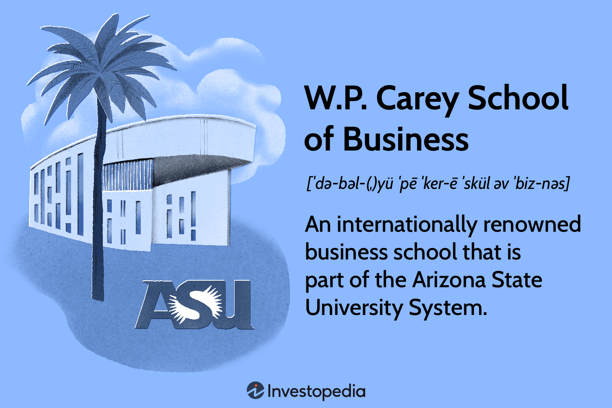

Charles P. Carey is a distinguished business leader and finance executive based in Chicago. With an extensive career in the financial sector, he has made significant contributions to the development and advancement of algorithmic trading. Throughout his career, Carey has held influential roles that have not only shaped his personal success but have also had a notable impact on the wider finance industry. His journey through various pivotal positions and accomplishments highlights his expertise and the breadth of his influence. This article explores his professional path, achievements, and the lasting mark he has left on finance.

## Table of Contents

## Early Career and Background

Charles P. Carey embarked on his professional journey in the financial sector following his graduation from Western Illinois University, where he earned a degree in business administration. This educational foundation provided him with essential skills and knowledge, setting the stage for a prolific career in finance.

Carey’s involvement in financial markets commenced in 1978 when he became a member of the Chicago Board of Trade (CBOT). This marked the beginning of a deep and influential engagement with the trading community, positioning Carey at the heart of Chicago’s vibrant financial ecosystem. As a member of CBOT, he quickly became involved in the intricacies of trading and market operations, gaining valuable insights into the complexities of exchange functions.

His leadership capabilities quickly elevated him within the organization, culminating in his role as the chairman of the CBOT. During his tenure, Carey played a pivotal role in steering the exchange through significant developments, one of the most noteworthy being the strategic merger with the Chicago Mercantile Exchange (CME). This merger was a landmark event in the history of financial exchanges, creating the largest and most diverse derivatives exchange in the world at the time. Carey's leadership and vision were instrumental in navigating the complexities of such a significant integration, which brought together two major entities to enhance trading capabilities and market reach.

## Key Roles and Achievements

Charles P. Carey's career is marked by significant roles and achievements, most notably his instrumental involvement in the merger of the Chicago Board of Trade (CBOT) and the Chicago Mercantile Exchange (CME). This merger, finalized in 2007, was a pivotal moment in the history of financial markets, creating the CME Group—the largest and most diverse derivatives marketplace in the world. Carey's strategic insight and leadership during this period earned him the position of vice-chairman of the CME Group from 2007 to 2010.

Throughout his tenure, Carey played a crucial role in steering the organization towards greater innovation and expansion. His expertise in the industry and dedication to enhancing trading practices led to the successful integration of the two major exchanges. By aligning their operations and systems, Carey helped create a more efficient, global trading platform that set the stage for further advancements in trading technology and market reach.

As a board member of the CME Group, Carey has continued to wield considerable influence over the organization's strategic direction. His ongoing contribution has ensured that the CME Group maintains its leadership in the derivatives market, while also adopting cutting-edge trading technologies. Carey's vision and commitment to progress have been instrumental in maintaining the CME Group’s relevance and competitiveness in a rapidly evolving financial landscape.

In recognition of his exceptional contributions to the finance industry, Carey was inducted into the Futures Hall of Fame in 2024. This prestigious honor celebrates individuals who have made lasting impacts on the futures markets through innovative practices, leadership, and dedication. Carey's induction into the Hall of Fame underscores his enduring legacy and highlights the broad-reaching effects of his work on the global financial stage.

## HC Technologies and Algo Trading

Charles P. Carey co-founded HC Technologies in 2007 alongside Joseph Niciforo, marking significant progress in the development and implementation of [algorithmic trading](/wiki/algorithmic-trading) strategies. This company is renowned for employing advanced trading algorithms and engaging in proprietary trading across a diverse range of asset classes. 

HC Technologies has crafted an environment where technology meets financial market expertise, allowing them to capitalize on market inefficiencies through algorithmic strategies. These strategies utilize vast quantities of financial data, coupled with mathematical models, to identify trading opportunities. By applying [machine learning](/wiki/machine-learning) and [artificial intelligence](/wiki/ai-artificial-intelligence), the firm can predict market movements and execute trades at optimal times, enhancing the efficiency and profitability of their trades.

Under Carey's leadership, HC Technologies has become a formidable player in the algorithmic trading sector. The firm’s reputation is bolstered by strategic partnerships with organizations like LaunchPad Trading and Tudor Investment Corporation, which allow for collaborative development and testing of innovative trading systems. These partnerships emphasize HC Technologies' commitment to staying at the forefront of trading technology and innovation.

Through continuous advancement in trading technology and strategic industry partnerships, HC Technologies under Carey’s stewardship not only maintains a competitive edge but also contributes significantly to the evolution of algorithmic trading. Their approach ensures they remain at the cutting edge, with the ability to swiftly adapt to changing market conditions and capitalize on emerging opportunities.

## Philanthropic Efforts

Charles Carey has extended his influence beyond the financial markets by actively participating in philanthropic endeavors. As the chairman of the CME Group Foundation, Carey has played a significant role in directing resources toward efforts that foster education and community development. Established in 2008, the foundation aims to leverage its substantial financial endowment to effect positive change in society. 

The CME Group Foundation primarily focuses on enhancing education, particularly in the areas of early childhood education, K-12 education, and college and career success. It prioritizes funding initiatives that are designed to improve educational outcomes, especially for underserved communities. By concentrating on these critical stages of educational development, the foundation seeks to create a support system that extends from early learning through to advanced education and career readiness.

Moreover, the foundation has been involved in community development projects, supporting programs that address various social issues and contribute to the well-being of individuals and families. These initiatives include providing financial support to non-profit organizations that work on economic development, health, and wellness throughout the greater Chicago area and beyond.

Carey's leadership in the foundation demonstrates his commitment to using his financial acumen and resources for the public good, enhancing both educational infrastructure and community vitality. This philanthropic work represents a significant aspect of his career, reflecting a commitment to corporate responsibility and social impact.

## Conclusion

Charles Carey's journey from a burgeoning trader to a towering figure in the financial industry is both inspiring and influential. His early start at the Chicago Board of Trade laid the foundation for a career characterized by strategic vision and impactful achievements. Notably, Carey's pivotal role in the merger of CBOT and CME has left an indelible mark on the trading landscape. The integration of these two major exchanges not only created a leading powerhouse in derivatives trading but also set a precedent for future consolidations in the industry, streamlining operations and enhancing market efficiency.

Carey's work in algorithmic trading through HC Technologies is a testament to his forward-thinking approach. By harnessing advanced trading algorithms, the firm has solidified its position in a competitive market, indicating Carey's ability to adapt and innovate amidst rapidly evolving financial technologies. This specialization in algorithmic trading reflects his deep understanding of market dynamics and technological advancements, further affirming his influence in modern finance.

Moreover, Carey's philanthropy, particularly through the CME Group Foundation, highlights his commitment to giving back to the community. By championing educational initiatives and community development, Carey ensures that his impact is felt beyond the boardroom.

As the finance sector continues to evolve, Charles Carey's contributions will remain vital. His legacy in business and finance is not only defined by his past achievements but also by his ongoing influence and the pathways he has forged for future innovation in trading and financial markets.

## References & Further Reading

[1]: Fort, B. (2008). ["Chicago Board of Trade and Chicago Mercantile Exchange Merger."](https://en.wikipedia.org/wiki/Chicago_Board_of_Trade) Reuters.

[2]: ["Advances in Financial Machine Learning"](https://www.amazon.com/Advances-Financial-Machine-Learning-Marcos/dp/1119482089) by Marcos Lopez de Prado.

[3]: Jain, P. (2005). ["Financial Market Design and the Equity Premium: Electronic Versus Open Outcry Markets."](https://onlinelibrary.wiley.com/doi/10.1111/j.1540-6261.2005.00822.x) National Bureau of Economic Research.

[4]: ["Quantitative Trading: How to Build Your Own Algorithmic Trading Business"](https://www.amazon.com/Quantitative-Trading-Build-Algorithmic-Business/dp/1119800064) by Ernest P. Chan.

[5]: ["Machine Learning for Algorithmic Trading"](https://github.com/stefan-jansen/machine-learning-for-trading) by Stefan Jansen.