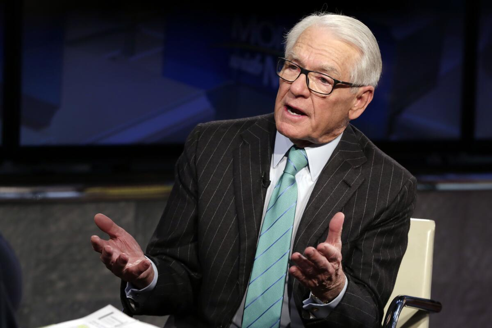

## Table of Contents

## What is zero commission trading?

Zero commission trading means you don't pay any fees to buy or sell stocks, ETFs, or other investments. Usually, when you trade, the company you use charges a small fee for each trade. But with zero commission trading, you can make as many trades as you want without worrying about these costs.

This can save you a lot of money, especially if you trade often. It's great for people who are just starting to invest because it makes it easier to try different investments without extra costs. However, remember that while you don't pay a commission, there might be other fees or costs to consider, like fees for certain services or account maintenance.

## Who is Charles Schwab and why is his perspective important?

Charles Schwab is a businessman who started a company called Charles Schwab Corporation. It's a big company that helps people invest their money. He started it a long time ago, in 1971. His company was one of the first to let people trade stocks on their own, without needing to call a broker. This was a big change and made investing easier for a lot of people.

Charles Schwab's perspective is important because he has seen how investing has changed over many years. He believes in making investing simple and affordable for everyone. His ideas have helped shape how people invest today. For example, his company was one of the first to offer zero commission trading, which means people can buy and sell stocks without paying extra fees. This has made investing more accessible to more people.

## When did Charles Schwab introduce zero commission trading?

Charles Schwab introduced zero commission trading in October 2019. This was a big change because it meant people could buy and sell stocks without paying any fees for each trade. Before this, people had to pay a small amount of money every time they wanted to trade.

This move by Charles Schwab made a big impact on the investing world. Other companies started to offer zero commission trading too, to keep up. It made investing easier and cheaper for a lot of people, especially those who were just starting out.

## How does zero commission trading benefit investors?

Zero commission trading helps investors by letting them buy and sell stocks without paying any fees for each trade. This can save them a lot of money, especially if they trade often. For example, if someone used to pay $5 every time they bought or sold a stock, with zero commission trading, they keep that $5. Over time, not paying these fees can add up to a lot of savings.

It also makes investing easier for people who are just starting out. Without worrying about extra costs, new investors can try different investments and learn without losing money to fees. This can encourage more people to start investing because it feels less risky and more affordable. Overall, zero commission trading can help more people build their savings and reach their financial goals.

## What are the potential drawbacks of zero commission trading according to Charles Schwab?

Charles Schwab has pointed out that while zero commission trading can save investors money, it might also lead to some problems. One issue is that people might trade too much because they don't have to pay for each trade. This can be risky because the stock market can go up and down a lot. If someone trades too often, they might lose money instead of making it.

Another thing to think about is that even though you don't pay for trades, there might be other costs. For example, some companies might charge for other services or have fees for keeping your account open. So, it's important to look at all the costs, not just the trading fees, when choosing where to invest your money. Charles Schwab wants people to be careful and understand all the details before they start trading a lot.

## How has zero commission trading impacted the brokerage industry?

Zero commission trading has changed the brokerage industry a lot. When big companies like Charles Schwab started offering zero commission trades, other companies had to do the same to keep their customers. This made trading cheaper for everyone, which is good for people who want to invest. But it also means that the companies that offer these services have to find other ways to make money, like charging for different services or getting money from other parts of their business.

This change has made the industry more competitive. Companies are always trying to find new ways to attract customers, like offering better tools for investing or more educational resources. It has also made investing more popular because more people can try it without worrying about extra costs. Overall, zero commission trading has pushed the brokerage industry to focus more on helping people invest better and smarter.

## What strategies does Charles Schwab recommend for investors in a zero commission environment?

Charles Schwab suggests that in a zero commission environment, investors should focus on making smart choices rather than just trading a lot. Since you don't have to pay for each trade, it might be tempting to buy and sell stocks all the time. But Schwab says it's important to think about your long-term goals and not just try to make quick money. Instead of trading every day, he recommends looking at your investments over time and making changes that fit with your plans for the future.

Another thing Schwab advises is to pay attention to other costs even if trading is free. Some companies might charge for other services or have fees for keeping your account open. So, it's a good idea to read all the details and understand what you might have to pay for. Schwab also encourages investors to keep learning about the market and to use the tools and resources that brokerages offer to make better decisions. By focusing on these strategies, investors can make the most of zero commission trading without taking too many risks.

## How does Charles Schwab sustain profitability with zero commission trading?

Charles Schwab makes money even though they offer zero commission trading by finding other ways to earn. One big way they do this is by charging interest on the money that customers keep in their accounts. When people have money sitting in their Schwab accounts, the company can use that money to make loans or invest it. They make money from the difference between what they pay customers in interest and what they earn from using that money.

Another way Charles Schwab stays profitable is by offering other services that people pay for. For example, they might charge for things like research tools, special investment advice, or managing your money for you. These services can be really helpful, and people are often willing to pay for them. By focusing on these other sources of income, Charles Schwab can keep offering zero commission trading while still making a profit.

## What are Charles Schwab's views on the future of trading fees?

Charles Schwab believes that the future of trading fees will keep moving towards lower costs for everyone. He thinks that zero commission trading is here to stay and will become even more common. This is because more and more people want to invest without paying a lot of extra money. Companies will have to keep up with this trend if they want to keep their customers happy. Schwab believes that this will make investing easier and more accessible for everyone, which is a good thing.

However, Schwab also thinks that while trading fees might go down, companies will find other ways to make money. They might charge for different services or make money from the money people keep in their accounts. So, even though trading might be free, there could still be other costs to think about. Schwab wants investors to be aware of these other costs and to make smart choices about where they invest their money.

## How does Charles Schwab compare zero commission trading to traditional commission-based trading?

Charles Schwab sees zero commission trading as a big improvement over traditional commission-based trading. In the old way, every time you wanted to buy or sell a stock, you had to pay a fee. This could add up quickly, especially if you traded a lot. But with zero commission trading, you don't have to pay these fees. This makes it easier for people to try investing without worrying about losing money to fees, which is great for people just starting out.

However, Schwab also points out that zero commission trading isn't perfect. While you don't pay to trade, there might be other costs to think about. Some companies might charge for other services or have fees for keeping your account open. So, it's important to look at all the costs, not just the trading fees, when deciding where to invest. Schwab believes that zero commission trading is a good step forward, but it's still important for investors to be careful and make smart choices.

## What role does technology play in Charles Schwab's zero commission trading model?

Technology is really important for Charles Schwab's zero commission trading. It helps make trading easier and cheaper for everyone. With technology, people can use their computers or phones to buy and sell stocks without needing to call someone. This saves a lot of time and money because the company doesn't need as many people to help with trades. Instead, they can use computers to do a lot of the work, which means they can offer zero commission trading without losing money.

Also, technology helps Charles Schwab offer other services that people might pay for. They have special tools and apps that help people make better choices about their investments. These tools can show you information about the stock market and help you plan for the future. By using technology to offer these extra services, Charles Schwab can still make money even though they don't charge for trading. This way, they can keep offering zero commission trading and still be a successful business.

## How does Charles Schwab address concerns about the quality of service with the shift to zero commission trading?

Charles Schwab understands that some people might worry about the quality of service when they switch to zero commission trading. They want to make sure that even though trading is free, they still give good help to their customers. Schwab does this by using technology to make things easier and faster, but they also keep real people around to help when you need it. If you have questions or need advice, you can still talk to someone who knows a lot about investing.

Schwab also offers a lot of tools and resources to help people make smart choices about their money. They have apps and websites that give you information about the stock market and help you plan for the future. By using these tools, you can feel confident that you're making good decisions, even if you're not paying for each trade. Schwab believes that by focusing on helping people in these ways, they can keep their service strong and keep their customers happy.

## References & Further Reading

[1]: Burton, J. (2019). ["Charles Schwab Eliminates Online Trading Commissions, Pressuring Rivals."](https://pressroom.aboutschwab.com/press-releases/press-release/2019/In-Conjunction-With-Chuck-Schwabs-New-Book-Invested-Schwab-Removes-the-Final-Pricing-Barrier-to-Investing-Online-by-Eliminating-U.S.-Stock-ETF-and-Options-Commissions/default.aspx) The Wall Street Journal.

[2]: Browning, E. S. (2019). ["Race to Zero Commissions in Stock Trading Leaves Small Investors Winning."](https://freepages.rootsweb.com/~belldietz/genealogy/Everybody%20Lineage-o/p7562.htm) The Wall Street Journal.

[3]: ["The Man Who Changed Everything: Charles Schwab's Revolution in Investment."](https://www.aboutschwab.com/story-of-an-investing-revolution) Investopedia.

[4]: O'Hara, M. (2015). ["High Frequency Market Microstructure."](https://www.sciencedirect.com/science/article/pii/S0304405X15000045) Journal of Financial Economics, 116(2), 257-270.

[5]: Harris, L. (2003). ["Trading and Exchanges: Market Microstructure for Practitioners."](https://academic.oup.com/book/52292) Oxford University Press.