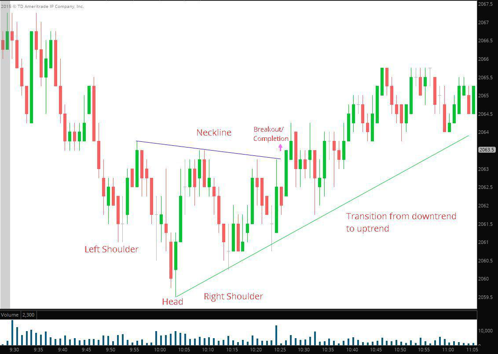

## Table of Contents

## What is chart confirmation and why is it important in technical analysis?

Chart confirmation is when different technical indicators or patterns on a chart show the same thing about a stock's price movement. It means that if one indicator suggests the price might go up, another indicator should also suggest the same thing for it to be a strong signal. This helps traders feel more confident about their decisions.

It's important in technical analysis because it helps reduce the chance of making a wrong guess about where the price is going. If only one indicator is used, it might give a false signal. But when multiple indicators agree, it's like getting a second or third opinion from a doctor, making the prediction more reliable. This can lead to better trading decisions and potentially more successful trades.

## How does chart confirmation differ from other technical analysis tools?

Chart confirmation is different from other technical analysis tools because it focuses on making sure that more than one indicator or pattern agrees on the same thing about a stock's price movement. Other tools, like moving averages or RSI (Relative Strength Index), look at the price data in their own way to predict where the price might go next. But chart confirmation doesn't predict on its own; it checks if the predictions from these other tools are trustworthy by seeing if they all say the same thing.

For example, if a moving average shows that a stock's price is trending up, chart confirmation would look at another indicator, like the RSI, to see if it also shows an upward trend. If both agree, it's a stronger signal that the price might really go up. This is different from using just one tool, which might give a false signal because it's looking at the data from only one angle. Chart confirmation helps traders feel more confident by making sure that different pieces of evidence support the same conclusion.

## What are the basic components of a chart that are used for confirmation?

The basic components of a chart that are used for confirmation include price data, time frames, and various technical indicators. Price data shows the stock's price movements over time, which can be displayed as lines, bars, or candlesticks. Time frames can be short, like minutes or hours, or long, like days or months. These help traders see trends and patterns over different periods. Technical indicators, like moving averages or the RSI, are calculated from the price data and provide additional insights into the stock's momentum, strength, or potential direction.

To use these components for confirmation, traders look for agreement between different indicators or patterns. For example, if a moving average shows an upward trend and the RSI also indicates that the stock is not overbought, this agreement can confirm that the price might continue to rise. By checking multiple components, traders can feel more confident in their analysis and make more informed decisions about buying or selling a stock.

## Can you explain the process of confirming a trend using chart patterns?

Confirming a trend using chart patterns involves looking at the price movements on a chart to see if they match a known pattern that suggests the trend will continue. For example, if you see a "head and shoulders" pattern, it might mean the price is going to go down. But to be sure, you need to check other parts of the chart too. You look at the trend lines, which are lines drawn along the highs or lows of the price movements, to see if they also show the same trend. If the trend lines and the pattern both say the price is going down, then you have a confirmed trend.

Another way to confirm a trend is by using other chart patterns like "flags" or "pennants." These patterns often show a short pause in the trend before it continues. If you see a flag pattern after a strong upward move in the price, it might mean the price will keep going up. To confirm this, you would check if the moving average, which is a line that shows the average price over time, is also going up. If the flag pattern and the moving average both show an upward trend, then you have a strong confirmation that the price is likely to keep rising.

## What are the most common chart patterns used for confirmation?

The most common chart patterns used for confirmation are head and shoulders, double tops and bottoms, and flags and pennants. A head and shoulders pattern looks like a head with two shoulders and often means the price might go down. Double tops and bottoms are when the price hits the same high or low twice, which can mean the price might reverse. Flags and pennants look like small pauses in the price movement and can show that the current trend will keep going.

To confirm a trend, traders look at these patterns along with other parts of the chart. For example, if a head and shoulders pattern suggests the price will go down, traders will check if the trend lines, which are lines drawn along the highs or lows of the price, also show a downward trend. If both the pattern and the trend lines agree, it's a strong sign that the price will likely go down. Similarly, if a flag pattern shows a pause in an upward trend, traders will look at the moving average, which is a line showing the average price over time, to see if it's also going up. If the flag and the moving average both point up, it's a good confirmation that the price will keep rising.

## How do volume and price action contribute to chart confirmation?

Volume and price action are important parts of chart confirmation because they help show how strong a trend is. Volume is the number of shares traded, and when it goes up during a price move, it means more people are buying or selling, making the trend more reliable. If a stock's price goes up and the [volume](/wiki/volume-trading-strategy) is high, it's a good sign that the price will keep going up. On the other hand, if the price goes up but the volume is low, it might not be a strong trend, and the price could change direction soon.

Price action is how the price moves on the chart, showing things like highs, lows, and patterns. When price action matches what the volume is showing, it helps confirm the trend. For example, if the price is making higher highs and the volume is also increasing, it confirms that the upward trend is strong. If the price is moving in a certain pattern, like a head and shoulders or a flag, and the volume supports this pattern, it gives traders more confidence that the pattern is a good signal for what the price will do next.

## What role do indicators and oscillators play in confirming chart signals?

Indicators and oscillators help confirm chart signals by giving extra information about the price movement. They are like tools that look at the price data in different ways to see if the trend is strong or if it might change soon. For example, a moving average is an indicator that shows the average price over time. If the price is above the moving average and going up, it can confirm that the upward trend is strong. Oscillators, like the RSI, measure how fast the price is moving and if it's overbought or oversold. If the RSI shows the price is not overbought while the price is going up, it adds more confidence to the upward trend.

Using indicators and oscillators together with chart patterns helps traders make better decisions. If a chart pattern, like a head and shoulders, suggests the price might go down, traders will look at the indicators and oscillators to see if they agree. If the moving average is also going down and the RSI shows the price is not oversold, it confirms the downward trend. This way, traders can feel more sure about their predictions because they are not just relying on one piece of information. It's like getting a second opinion from a doctor to make sure the diagnosis is right.

## How can traders use moving averages to confirm chart trends?

Traders use moving averages to confirm chart trends by looking at how the price moves compared to the moving average line. A moving average is a line on the chart that shows the average price of a stock over a certain time, like 50 days or 200 days. If the price is above the moving average and going up, it means the upward trend is strong. On the other hand, if the price is below the moving average and going down, it confirms that the downward trend is strong. By comparing the price to the moving average, traders can see if the trend they see on the chart is really happening.

For example, if a trader sees a chart pattern like a flag that suggests the price will keep going up, they will look at the moving average to see if it agrees. If the moving average is also going up and the price is above it, it confirms the upward trend. This helps traders feel more confident in their decisions because they are not just relying on one piece of information. Using moving averages along with chart patterns helps traders make better choices about when to buy or sell a stock.

## What are some advanced techniques for confirming chart breakouts?

To confirm chart breakouts, traders often use a technique called volume analysis. When a stock's price breaks out of a pattern, like moving above a resistance line, it's important to see if the volume is high. High volume means more people are buying the stock, which makes the [breakout](/wiki/breakout-trading) more likely to be real and not just a false signal. If the price breaks out but the volume is low, it might not be a strong move, and the price could fall back down soon. So, traders look for high volume to confirm that the breakout is strong and the price will likely keep going in the new direction.

Another advanced technique is using multiple time frames. Traders look at the same stock on different time frames, like daily and weekly charts, to see if the breakout is confirmed across all of them. If the price breaks out on the daily chart and also on the weekly chart, it's a stronger signal that the breakout is real. This helps traders feel more confident because they are seeing the same thing happen over different periods of time. By using multiple time frames and volume analysis together, traders can better confirm chart breakouts and make more informed trading decisions.

## How does one interpret conflicting signals in chart confirmation?

When you see conflicting signals on a chart, it means different parts of the chart are saying different things about where the price might go. For example, the price might be going up, but the volume is low, or the moving average might be going down while the price is going up. This can be confusing because it's hard to know which signal to trust. When this happens, it's important to take a closer look at the chart and think about why the signals might be different. Sometimes, one signal might be stronger than the other, or there might be other things happening in the market that are affecting the price.

To deal with conflicting signals, traders often wait for more information before making a decision. They might look at more indicators or wait for the price to move more clearly in one direction. It's also helpful to check the news or other market events that could be causing the confusion. By taking their time and looking at the bigger picture, traders can make better choices even when the signals on the chart don't agree. This way, they can avoid making quick decisions that might be wrong and wait for a clearer sign of what the price will do next.

## What are the limitations and potential pitfalls of relying on chart confirmation?

Relying on chart confirmation can have some limitations and pitfalls. One big problem is that chart confirmation is not always right. Even if different parts of the chart agree, the price can still do something unexpected. This is because the stock market is affected by many things, like news or big events, that charts can't always predict. Also, sometimes the signals on the chart can be hard to read or can be seen in different ways by different people. This can make traders unsure and can lead to bad decisions.

Another issue is that chart confirmation can make traders wait too long to act. If they are waiting for all the signals to agree, they might miss out on good chances to buy or sell. This can be a problem, especially in a fast-moving market where prices can change quickly. Also, relying too much on chart confirmation can make traders ignore other important information, like what's happening in the economy or with the company they are looking at. So, while chart confirmation can be helpful, it's important not to depend on it too much and to look at the bigger picture too.

## How can chart confirmation be integrated into a comprehensive trading strategy?

Chart confirmation can be a useful part of a complete trading plan. It helps traders feel more sure about their choices by checking if different parts of the chart agree on where the price might go. For example, if a trader sees a pattern like a head and shoulders that says the price might go down, they can look at other things like the moving average or the volume to see if they also show a downward trend. If all these parts agree, the trader can feel more confident in deciding to sell the stock. But it's important to remember that chart confirmation is just one tool and should be used with other information, like news about the company or what's happening in the economy.

Using chart confirmation in a trading plan means looking at it along with other ways to predict price movements. Traders can use it to double-check their ideas before they buy or sell a stock. But they should also pay attention to things like how the company is doing or what the overall market is doing. Sometimes, the chart might show one thing, but other information might suggest something different. So, a good trading plan uses chart confirmation to help make decisions but doesn't rely on it completely. By combining chart confirmation with other tools and information, traders can make smarter choices and hopefully do better in the market.

## How can data interpretation be used for effective trading?

Interpreting market data effectively requires a deep understanding of how various technical indicators and chart patterns interact to provide actionable insights. Among the most widely used indicators in technical analysis are the Relative Strength Index (RSI) and the Moving Average Convergence Divergence (MACD). These tools are essential for assessing market [momentum](/wiki/momentum) and identifying potential trading opportunities.

The Relative Strength Index (RSI) is a momentum oscillator that measures the speed and change of price movements. It is calculated using the formula:

$$
\text{RSI} = 100 - \left( \frac{100}{1 + \text{RS}}} \right)
$$

where RS is the average of x days' up closes divided by the average of x days' down closes. RSI provides insight into whether a market is overbought or oversold. Typically, an RSI above 70 indicates an overbought condition, while an RSI below 30 suggests an oversold market. Traders leverage these signals to anticipate potential price reversals and make informed entry or exit decisions.

The Moving Average Convergence Divergence (MACD) is another critical tool used to assess momentum. It comprises the MACD line, which is the difference between the 12-day and 26-day exponential moving averages (EMA), and a signal line, which is usually a 9-day EMA of the MACD line. The formulae can be expressed as follows:

$$
\text{MACD} = \text{EMA}_{12} - \text{EMA}_{26}
$$

A bullish signal occurs when the MACD line crosses above the signal line, indicating upward momentum, while a bearish signal is given when it crosses below, suggesting downward momentum. Such signals assist traders in timing their trades, managing risk by adjusting stops or targets, and validating other chart indicators.

Effective data interpretation often involves integrating multiple indicators and chart patterns to obtain a holistic view of the market. For example, combining RSI and MACD signals can provide a more robust confirmation of trend strength or potential reversals. Additionally, chart patterns like double tops, head and shoulders, or flags can be used in conjunction with these indicators to bolster analysis accuracy.

Ultimately, by harnessing a combination of technical indicators, traders can better comprehend market conditions, enhance their strategy's reliability, and optimize their trading decisions. This integrated approach to data interpretation allows for more precise timing of entry and [exit](/wiki/exit-strategy) points, contributing to effective risk management and potentially increasing profitability.

## References & Further Reading

[1]: Bergstra, J., Bardenet, R., Bengio, Y., & Kégl, B. (2011). ["Algorithms for Hyper-Parameter Optimization."](https://dl.acm.org/doi/10.5555/2986459.2986743) Advances in Neural Information Processing Systems 24.

[2]: ["Advances in Financial Machine Learning"](https://www.amazon.com/Advances-Financial-Machine-Learning-Marcos/dp/1119482089) by Marcos Lopez de Prado

[3]: ["Evidence-Based Technical Analysis: Applying the Scientific Method and Statistical Inference to Trading Signals"](https://www.amazon.com/Evidence-Based-Technical-Analysis-Scientific-Statistical/dp/0470008741) by David Aronson

[4]: ["Machine Learning for Algorithmic Trading"](https://github.com/stefan-jansen/machine-learning-for-trading) by Stefan Jansen

[5]: ["Quantitative Trading: How to Build Your Own Algorithmic Trading Business"](https://www.amazon.com/Quantitative-Trading-Build-Algorithmic-Business/dp/1119800064) by Ernest P. Chan