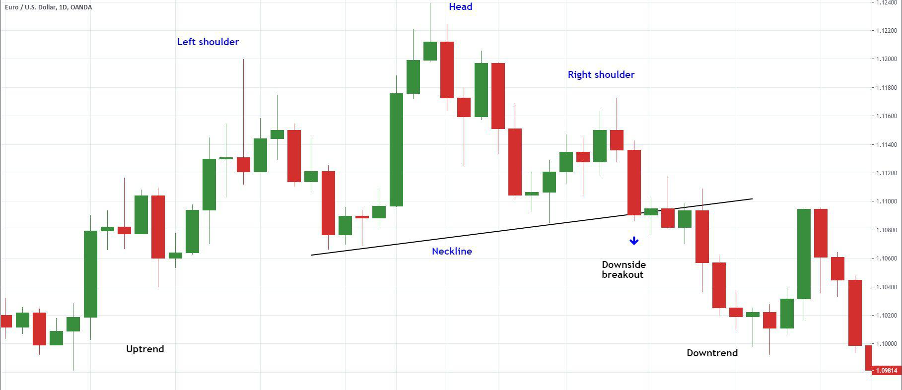

In trading, understanding and utilizing chart patterns is a crucial skill for technical analysts. By analyzing historical price data, traders can recognize patterns that help predict future price movements, thereby enabling informed decision-making. Chart patterns provide a visual representation of the ongoing psychological dynamics in the market, reflecting the interplay between supply and demand. As traders look for strategic entry and exit points, these formations serve as vital tools for market analysis.

This article explores the common chart formations integral to technical analysis, highlighting their significance and potential application in algorithmic trading. Chart patterns like Double Tops and Bottoms, Head and Shoulders, and Triangles are among the most recognized and utilized formations by traders aiming to identify trends and market reversals. By interpreting these patterns, traders can anticipate shifts in momentum, whether bullish or bearish, which are crucial for developing sound trading strategies.



As trading technologies continue to advance, the role of chart patterns in the digital trading age becomes even more pronounced. Algorithmic trading, which automates processes based on predefined rules, has seen a surge in incorporating these traditional analysis methods. The combination of human insight and machine efficiency offers traders a competitive edge, enhancing both the speed and accuracy of their market predictions. This article serves as a guide through the intricacies of chart patterns, offering insights into how they have evolved to meet the needs of contemporary trading practices.

## Table of Contents

## Understanding Chart Formations

Chart formations are essential tools in technical analysis, serving as visual representations of market psychology and behavior over time. These patterns materialize within the historical price data of a security, facilitating the prediction of potential future price movements. Traders meticulously analyze these formations to identify momentum shifts and possible trend reversals, which can aid in making informed entry and exit decisions in the market.

A diverse array of chart formations exist, each with unique characteristics and implications concerning market trends. Among the most recognized patterns are Double Tops and Bottoms, Head and Shoulders, Wedges, Triangles, and Channels. These formations are categorized primarily based on their predictive implications for bullish or bearish market trends.

**Double Tops and Bottoms** are considered reversal patterns that suggest a change in trend direction. A Double Top indicates a potential shift from an uptrend to a downtrend, forming when the price reaches a high point twice with a moderate descent between the highs. Conversely, a Double Bottom suggests a reversal from a downtrend to an uptrend, characterized by the price reaching a low point twice with a slight rebound in between.

**Head and Shoulders** formations also indicate reversal trends. The classic Head and Shoulders (formed at market tops) comprises three peaks: the higher middle peak (head) flanked by two lower peaks (shoulders). The inverse Head and Shoulders (formed at market bottoms) mirrors this pattern upside-down, marking a potential upward reversal.

**Wedges** are consolidation patterns that signal pauses before the continuation of an existing trend. They are categorized into rising and falling wedges. A rising wedge suggests a bearish reversal, where new highs are made but with diminishing strength. Conversely, a falling wedge suggests a bullish reversal, with progressively lower lows indicating weakening selling pressure.

**Triangles** can be ascending, descending, or symmetrical and provide insights into both continuation and reversal scenarios. An **Ascending Triangle** is typically bullish, with a flat top and rising bottom trendline, implying that buyers are more aggressive than sellers. A **Descending Triangle** is bearish, featuring a flat bottom line and declining top trendline, indicating sellers’ stronger control. Symmetrical Triangles may signal a continuation, dependent on the direction of the breakout from the pattern.

**Channels** are bound by parallel trendlines and signal the direction of the trend. Within this formation, prices oscillate between support and resistance lines. An upward channel indicates a bullish trend, while a downward channel suggests a bearish trend. The key to trading channels lies in buying at support (lower trendline) and selling at resistance (upper trendline).

Each of these chart formations serves as a strategic tool, providing traders with critical insights to navigate the financial markets effectively by pinpointing optimal entry and [exit](/wiki/exit-strategy) points. While chart patterns offer valuable indications of market sentiment, their accuracy can improve when corroborated with additional technical indicators such as [volume](/wiki/volume-trading-strategy), moving averages, and [momentum](/wiki/momentum) oscillators.

## Technical Analysis and Chart Patterns

Technical analysis is an essential discipline within the trading field, fundamentally centered on identifying chart patterns to anticipate market trends. These chart formations, derived from historical price data of securities, are used by traders to discern potential ongoing trends or reversals. This comprehension is crucial for constructing effective technical strategies.

Chart formations, such as Double Tops or Triangles, serve as graphical representations of price movements. By analyzing these formations, traders can infer the likelihood of a continuation or change in trend direction. For instance, a Head and Shoulders formation typically signals a reversal, helping traders decide on strategic entry and exit points. The precise reading of these patterns, therefore, provides an advantageous insight into future market dynamics.

To maximize the effectiveness of trading strategies, understanding the probabilities and characteristics of each specific chart pattern is imperative. This knowledge empowers traders to seize opportunities by aligning their actions with anticipated market behaviors.

Despite their utility, chart patterns should not be used in isolation. A comprehensive analytical framework is necessary to enhance reliability. This broader framework includes the examination of trading volumes and the use of technical indicators such as the Relative Strength Index (RSI) and the Moving Average Convergence Divergence (MACD). 

For example, the RSI, which measures the speed and change of price movements, can help confirm the strength of a trend indicated by a chart pattern. Similarly, the MACD, through its calculation of the difference between short-term and long-term moving averages, offers additional confirmation of trend direction. The formula for MACD is typically expressed as:

$$
\text{MACD} = \text{EMA}_{\text{short-term}} - \text{EMA}_{\text{long-term}}
$$

where $\text{EMA}_{\text{short-term}}$ and $\text{EMA}_{\text{long-term}}$ are exponential moving averages over specified short and long periods, respectively.

By integrating these indicators with chart pattern analysis, traders can attain a more nuanced understanding of market conditions, enabling them to make informed trading decisions. Thus, technical analysis, enriched by a multifaceted analytical approach, remains a cornerstone for effective market forecast and strategic decision-making.

## Incorporating Chart Patterns into Algo Trading

Algo trading, or [algorithmic trading](/wiki/algorithmic-trading), revolutionizes the trading process by automating decisions through pre-defined rules and patterns. This approach significantly enhances the efficiency and speed of executing trading strategies, and one of the core components in creating these strategies is the integration of chart patterns.

Chart formations, such as Double Tops, Head and Shoulders, and Triangles, serve as the foundational elements within trading algorithms. They help in predicting future market movements by analyzing historical price data to identify potential trends and reversal signals. These patterns provide crucial insights, allowing algorithms to execute trades at optimal entry and exit points, thus maximizing potential profits or minimizing losses.

To ensure that algo trading strategies utilizing chart patterns are robust, [backtesting](/wiki/backtesting) is employed. Backtesting involves applying the developed algorithm to historical market data to evaluate its performance. By simulating trades over this data, traders can assess the algorithm’s reliability and consistency in predicting market movements. This process of iterative refinement helps in identifying any flaws or biases within the algorithm, allowing for necessary adjustments before its deployment in live trading environments.

The integration of advanced pattern recognition techniques within algorithms further optimizes both the speed and accuracy of trading operations. With the aid of [machine learning](/wiki/machine-learning), complex algorithms can now identify chart patterns more efficiently and with greater precision. For instance, convolutional neural networks (CNNs), commonly used in image recognition, can be adapted for recognizing chart formations in trading data. Here is a basic example in Python, using TensorFlow and Keras to create a CNN for pattern recognition:

```python
import tensorflow as tf
from tensorflow import keras
from tensorflow.keras import layers

# Define a simple CNN model
model = keras.Sequential([
    layers.Conv2D(filters=32, kernel_size=(3, 3), activation='relu', input_shape=(64, 64, 1)),
    layers.MaxPooling2D(pool_size=(2, 2)),
    layers.Flatten(),
    layers.Dense(128, activation='relu'),
    layers.Dense(10, activation='softmax')
])

# Compile the model
model.compile(optimizer='adam', loss='categorical_crossentropy', metrics=['accuracy'])

# Assume `training_data` and `training_labels` are the dataset of chart images and their labels
# model.fit(training_data, training_labels, epochs=10, batch_size=32)
```

This example demonstrates how traditional image recognition can be leveraged for detecting and analyzing chart patterns, such as identifying a Head and Shoulders pattern from historical market data.

Incorporating chart patterns into algo trading not only automates decision-making but also adapts real-time to the ebb and flow of financial markets. As the technology continues to evolve, the accuracy and sophistication of pattern-based algorithms will likely see further advancements, empowering traders to maintain a competitive edge in various market conditions.

## Chart Formations vs. Candlestick Patterns

Chart formations and candlestick patterns are essential tools for traders aiming to predict price movements in financial markets. While both methods serve the same overarching purpose, they differ significantly in presentation and application.

Chart formations are visual patterns that typically develop over an extended period. Examples of such patterns include Wedges, Head and Shoulders, and Double Tops and Bottoms. These formations often reflect long-term trends and provide traders with insights into potential reversals or continuations in the market. For instance, a Head and Shoulders pattern may indicate a forthcoming trend reversal, giving traders an opportunity to anticipate and react strategically to market changes. The analysis of chart formations involves studying the overall shape and the breaking points within a price chart, offering a bird's-eye view of market dynamics.

In contrast, candlestick patterns provide insights derived from short-term price actions. Patterns such as Doji, Hammer, or Three Black Crows emerge within individual trading sessions. A candlestick chart represents open, high, low, and close prices, where each 'candlestick' displays the trading range for a given period. For example, a Doji, with virtually the same opening and closing price, suggests indecision in the market, which may precede a price reversal. These patterns are particularly useful for day traders and those engaging in short-term trading, offering a more granular look at market sentiment and potential price shifts.

The distinction between chart formations and candlestick patterns allows traders to approach market analysis from different time perspectives. Chart formations cater to those interested in longer-term trends, while candlestick patterns are geared toward capturing short-lived moves in the market. When used together, these techniques provide a comprehensive view of potential market outlooks. By combining the broader trends indicated by chart formations with the immediate insights offered by candlestick patterns, traders can achieve a more robust and nuanced understanding of future price movements, enhancing their decision-making process across various trading horizons. Integrating both approaches ensures that traders do not miss significant signals, regardless of the time frame or market conditions they are operating in.

## Limitations and Considerations

Chart patterns, while instrumental in technical analysis and algorithmic trading, do not provide absolute predictions. Various market conditions can disrupt the anticipated outcomes that these patterns suggest. One prevalent issue is the occurrence of false breakouts, where a price may temporarily breach a level of support or resistance only to revert back, leading traders into potential losses. Such false signals can trick traders into premature entries or exits based on incomplete patterns.

Economic changes and geopolitical events also significantly impact the reliability of chart patterns. Factors like [interest rate](/wiki/interest-rate-trading-strategies) shifts, economic sanctions, or political instability can overpower historical price tendencies, rendering pattern-based forecasts ineffective. Consequently, relying solely on chart patterns could lead traders to overlook broader market signals.

For effective trading, integrating chart pattern analysis with other technical indicators is essential. Indicators such as the Relative Strength Index (RSI), Moving Average Convergence Divergence (MACD), and trading volumes can provide additional layers of context. These tools help in confirming the validity of a pattern before making trading decisions.

Moreover, robust risk management strategies are vital when using chart patterns. Setting stop-loss orders is a fundamental method for protecting against excessive losses in case the market moves unfavorably. It's a practical approach to limit potential downsides by defining a pre-set loss threshold. Additionally, diversifying positions across different assets or markets reduces the risk associated with concentrating investments in a single area, mitigating the adverse effects of an incorrect pattern interpretation.

In conclusion, while chart patterns offer valuable insights, traders must employ a comprehensive strategy that combines pattern analysis with broader market indicators and sound risk management practices to optimize their trading performance.

## Conclusion: The Future of Chart Patterns in Trading

Chart patterns remain essential tools in technical analysis and algorithmic trading. As technology evolves, traders benefit from enhanced capabilities in pattern recognition and automated trading. The integration of [artificial intelligence](/wiki/ai-artificial-intelligence) (AI) and machine learning offers significant potential for improving the precision of pattern-based trading systems.

Advanced algorithms can now parse vast quantities of data to identify subtle patterns unheard of in earlier times. This has allowed traders to uncover insights that were previously invisible to human analysts. For example, machine learning models like neural networks can be trained to recognize complex multi-dimensional patterns, offering predictions with heightened accuracy. Python libraries such as TensorFlow and PyTorch facilitate the development and deployment of these sophisticated models.

The landscape of trading is further enhanced by automated systems that execute trades based on pre-configured rules derived from chart patterns. This automation reduces the delay associated with human intervention, enabling traders to capture opportunities in fast-moving markets. Moreover, algorithmic systems support backtesting on historical data, ensuring that chart formations consistently yield reliable predictive outcomes.

As AI continues to advance, algorithmic trading strategies become more robust. Traders capable of mastering chart formations will enhance their strategic arsenal, enabling them to gain a significant edge across diverse market conditions. The continued evolution of pattern recognition, combined with rapid advancements in computational technology, promises a future where trading strategies become increasingly sophisticated and precise. This ongoing progress ensures that chart patterns will retain their vital role in the analytical toolkit of tomorrow's traders.

## References & Further Reading

[1]: Bergstra, J., Bardenet, R., Bengio, Y., & Kégl, B. (2011). ["Algorithms for Hyper-Parameter Optimization."](https://papers.nips.cc/paper/4443-algorithms-for-hyper-parameter-optimization) Advances in Neural Information Processing Systems 24.

[2]: ["Advances in Financial Machine Learning"](https://www.amazon.com/Advances-Financial-Machine-Learning-Marcos/dp/1119482089) by Marcos Lopez de Prado

[3]: ["Evidence-Based Technical Analysis: Applying the Scientific Method and Statistical Inference to Trading Signals"](https://www.amazon.com/Evidence-Based-Technical-Analysis-Scientific-Statistical/dp/0470008741) by David Aronson

[4]: ["Machine Learning for Algorithmic Trading"](https://github.com/stefan-jansen/machine-learning-for-trading) by Stefan Jansen

[5]: ["Quantitative Trading: How to Build Your Own Algorithmic Trading Business"](https://www.amazon.com/Quantitative-Trading-Build-Algorithmic-Business/dp/1119800064) by Ernest P. Chan