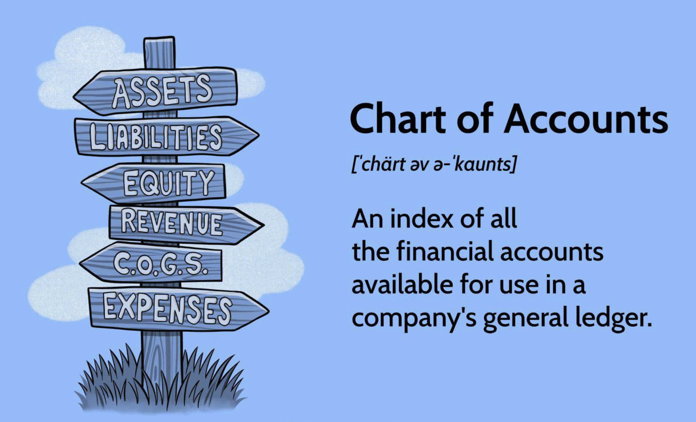

## Table of Contents

## What is a Chart of Accounts?

A Chart of Accounts is like a list that a business uses to keep track of all its money stuff. It has different categories where you can put all your money transactions, like money coming in, money going out, and money you own or owe. Each category has a special number, so it's easy to find and organize everything.

Think of it as a filing system for your business's money. It helps you see where your money is coming from and where it's going. This way, you can make better decisions about how to spend or save your money, and it makes things easier when you need to do your taxes or check how your business is doing.

## Why is a Chart of Accounts important for a business?

A Chart of Accounts is really important for a business because it helps keep track of all the money stuff in an organized way. It's like a map that shows where every dollar is coming from and where it's going. This makes it easier for the business to see if they're making money or losing it. Without a Chart of Accounts, it would be hard to know if the business is doing well or if there are problems that need fixing.

It also makes things simpler when it's time to do taxes or to show the financial health of the business to others, like banks or investors. By having all the money information in one place and sorted into categories, it's easier to prepare reports and make sure everything is correct. This can save a lot of time and help the business make smart choices about how to use their money in the future.

## How does a Chart of Accounts help in organizing financial data?

A Chart of Accounts helps in organizing financial data by giving each type of money transaction its own special spot. It's like having different folders for different kinds of money stuff, such as money you earn from selling things, money you spend on supplies, or money you owe to others. Each folder has a number, so it's easy to find and put transactions in the right place. This way, all the money information is sorted neatly and you can see at a glance how much money is in each category.

This organization makes it easier to understand where the money is coming from and where it's going. When you need to look at how the business is doing, you can quickly pull up the numbers from each category and see if you're making more money than you're spending, or if there are areas where you need to cut back. It also helps when it's time to do taxes or share financial information with others, like banks or investors, because everything is already sorted and easy to find.

## What are the basic components of a Chart of Accounts?

The basic components of a Chart of Accounts are the different categories that help a business keep track of its money. These categories include assets, which are things the business owns like cash or equipment; liabilities, which are things the business owes like loans or bills; equity, which is the owner's investment in the business; revenue, which is the money the business earns from selling things or services; and expenses, which are the costs the business has to pay to keep running, like rent or salaries.

Each of these categories is given a special number, called an account number. This makes it easy to organize and find all the money transactions. For example, all the money coming in from sales might go into an account numbered 4000, while all the money spent on office supplies might go into an account numbered 6000. This way, when you need to check how much money is coming in or going out, you can quickly look at the right account number and see the total.

Using these components, a Chart of Accounts helps businesses see their financial health clearly. It makes it easier to understand where the money is coming from and where it's going, which is really helpful for making good decisions about how to use the money. It also makes it simpler to do things like taxes or show financial reports to others, because everything is sorted and easy to find.

## How should accounts be numbered in a Chart of Accounts?

In a Chart of Accounts, accounts should be numbered in a way that makes sense and is easy to follow. Usually, you start with a big group of numbers for each main type of account, like assets, liabilities, equity, revenue, and expenses. For example, you might use numbers starting with 1 for assets, 2 for liabilities, 3 for equity, 4 for revenue, and 5 for expenses. This helps you quickly know which big group an account belongs to just by looking at the first number.

After that, you can use more numbers to break down each big group into smaller parts. For example, within the asset group, you might use 1000 for cash, 1100 for accounts receivable, and 1200 for inventory. This way, the numbers get more specific as they go, so you can easily find and organize all the different kinds of accounts. It's important to keep the numbering simple and logical so everyone in the business can understand and use the Chart of Accounts easily.

## Can you explain the difference between asset, liability, equity, revenue, and expense accounts?

Asset accounts are like the things a business owns that have value. This can be money in the bank, stuff like computers or vehicles, or even money that people owe the business for things they bought but haven't paid for yet. Liability accounts are the opposite; they're the things a business owes to others. This can be money the business borrowed, like a loan, or bills that need to be paid, like rent or utilities. Equity accounts show how much of the business is owned by the people who started it or invested in it. It's like the business's net worth, calculated by taking all the assets and subtracting all the liabilities.

Revenue accounts keep track of the money coming into the business from selling things or services. It's the income the business makes. Expense accounts are about the money the business spends to keep running. This includes things like salaries for employees, rent for the office, or supplies needed for work. By keeping these different types of accounts separate, a business can see clearly where its money is coming from and where it's going, which helps in making smart decisions about how to manage the money.

## How do you customize a Chart of Accounts to fit specific business needs?

To customize a Chart of Accounts for a specific business, you start by understanding what the business does and what kind of money transactions it has. If a business sells products, it will need accounts for tracking inventory and sales. If it's a service business, it might need accounts for tracking different types of services and the costs associated with providing those services. You can add or remove accounts to match the business's activities. For example, a restaurant might need accounts for food costs, while a software company might need accounts for research and development expenses.

Once you know what accounts you need, you can organize them in a way that makes sense for the business. You might group similar accounts together, like all the different types of expenses in one section, or you might want to keep accounts that are used often at the beginning of the list for easy access. You can also decide how to number the accounts to fit the business's needs. For example, if a business has a lot of different types of revenue, you might want to use a range of numbers like 4000 to 4999 just for revenue accounts. By customizing the Chart of Accounts, the business can keep its financial records organized and easy to understand.

## What are the best practices for maintaining a Chart of Accounts?

Keeping a Chart of Accounts up to date is really important. You should check it often to make sure all the accounts are still needed and that new ones are added if the business starts doing new things. If an account isn't used anymore, you can take it out or move it to a different spot. This keeps everything neat and easy to find. It's also good to talk to your accountant or the people who use the Chart of Accounts to see if there are any changes they need. By doing this, you make sure the Chart of Accounts stays useful and helps the business keep track of its money the right way.

Another good thing to do is to keep the Chart of Accounts simple and clear. Don't add too many accounts that aren't needed because that can make things confusing. Use numbers that make sense and are easy to remember. For example, keeping similar accounts close together in the numbering system helps people find what they need quickly. Also, make sure everyone in the business knows how to use the Chart of Accounts and understands what each account is for. This way, everyone can help keep the financial records organized and accurate.

## How does a Chart of Accounts integrate with accounting software?

A Chart of Accounts works well with accounting software because it helps the software know where to put all the money transactions. When you use accounting software, you enter money coming in or going out, and the software uses the Chart of Accounts to sort these transactions into the right spots. Each account in the Chart of Accounts has a special number, so the software can easily match the transactions to the right accounts. This makes it easier to keep everything organized and up to date without having to do a lot of extra work.

Most accounting software lets you set up or change the Chart of Accounts to fit your business. You can add new accounts if you need them, or take out old ones that you don't use anymore. This way, the software stays useful as your business changes and grows. By keeping the Chart of Accounts updated in the software, you can get quick reports and see how your business is doing financially, which helps you make good decisions about money.

## What common mistakes should be avoided when setting up a Chart of Accounts?

One common mistake when setting up a Chart of Accounts is making it too complicated. When you add too many accounts or use numbers that are hard to understand, it can confuse people and make it tough to keep track of where money is coming from and going. It's better to keep things simple and only add accounts that you really need. This way, everyone in the business can use the Chart of Accounts easily and it stays helpful for keeping financial records organized.

Another mistake to avoid is not updating the Chart of Accounts as the business changes. If your business starts doing new things or stops doing old things, you need to add new accounts or take out old ones to match. If you don't do this, the Chart of Accounts won't be useful anymore because it won't show the right picture of your business's money. It's a good idea to check the Chart of Accounts regularly and make changes when you need to, so it keeps working well with your business.

## How can a Chart of Accounts be used for financial analysis and reporting?

A Chart of Accounts helps with financial analysis and reporting by organizing all the money transactions into clear categories. When you need to look at how the business is doing, you can use the Chart of Accounts to quickly pull up numbers from different accounts. For example, if you want to see how much money the business made from selling things, you can look at the revenue accounts. If you want to know how much money the business spent on things like rent or supplies, you can check the expense accounts. This makes it easier to see where the money is coming from and where it's going, which is really helpful for understanding the business's financial health.

Using the Chart of Accounts for reporting is also simple because it keeps everything sorted and easy to find. When you need to make reports for things like taxes or to show to banks or investors, you can use the numbers from the Chart of Accounts to fill in the reports. This saves time and helps make sure the reports are correct. By having all the money information in one place and organized, the Chart of Accounts makes it easier to prepare reports and analyze the business's financial performance.

## What advanced features can be implemented in a Chart of Accounts for complex businesses?

For complex businesses, a Chart of Accounts can be set up with advanced features to handle more detailed financial tracking. One useful feature is the ability to use sub-accounts, which let you break down big categories into smaller, more specific parts. For example, if a business has different departments, you can use sub-accounts to keep track of the expenses for each department separately. This makes it easier to see how each part of the business is doing financially. Another feature is the use of custom account codes, which can be set up to match the specific needs of the business, like tracking different types of revenue or costs in more detail.

Another advanced feature is the integration with other systems, like inventory management or payroll software. This means the Chart of Accounts can automatically update with information from these other systems, saving time and reducing the chance of mistakes. For businesses that operate in different countries or have multiple currencies, the Chart of Accounts can also be set up to handle multiple currencies and comply with different accounting standards. By using these advanced features, a complex business can keep its financial records organized and get a clear picture of its financial performance, even when things get complicated.

## References & Further Reading

[1]: ["Understanding the Chart of Accounts: A Critical Component of Your Accounting System"](https://cpahalltalk.com/chart-of-accounts/) - Investopedia

[2]: ["Financial Statement Analysis and Security Valuation"](https://www.mheducation.com/highered/product/Financial-Statement-Analysis-and-Security-Valuation-Penman.html) by Stephen H. Penman

[3]: ["Accounting Information Systems"](https://www.investopedia.com/terms/a/accounting-information-system-ais.asp) by Marshall B. Romney and Paul J. Steinbart

[4]: ["Advances in Financial Machine Learning"](https://www.amazon.com/Advances-Financial-Machine-Learning-Marcos/dp/1119482089) by Marcos Lopez de Prado

[5]: ["Quantitative Trading: How to Build Your Own Algorithmic Trading Business"](https://www.amazon.com/Quantitative-Trading-Build-Algorithmic-Business/dp/1119800064) by Ernest P. Chan

[6]: ["The Essentials of Risk Management"](https://www.amazon.com/Essentials-Risk-Management-Third-ebook/dp/B0BXFFPW5V) by Michel Crouhy, Dan Galai, and Robert Mark