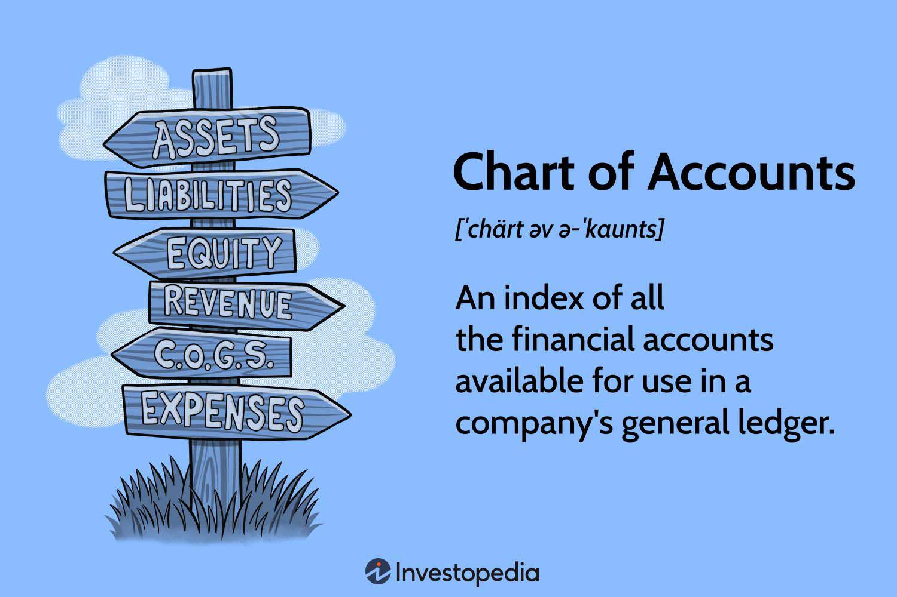

In today's dynamic business landscape, maintaining an organized and efficient financial structure is crucial for any company's success. A well-structured financial framework not only ensures regulatory compliance but also enhances decision-making capabilities by providing stakeholders with clear and accurate financial insights. A fundamental component of this structure is the Chart of Accounts (COA), a tool that provides a detailed listing of every financial account in the general ledger. This comprehensive listing is essential for accurately categorizing and recording financial transactions, allowing for precise tracking of assets, liabilities, revenues, and expenses.

The organization of financial data through a COA ensures that businesses can readily access and analyze their financial performance, aiding in strategic planning and operational management. By grouping financial accounts into major categories, such as assets, liabilities, equity, revenue, and expenses, a COA helps maintain clarity and consistency in financial reporting. This clarity is crucial not only for internal management but also for external stakeholders, including investors, auditors, and regulatory bodies.



This article explores the role of COA in accounting, its importance in financial organization, and its intersection with algorithmic trading. Algorithmic trading, which relies heavily on accurate and comprehensive financial data, benefits significantly from a well-maintained COA. By providing a structured and transparent view of financial accounts, a COA supports the development and implementation of algorithmic models, enhancing the precision of trade strategies and risk management processes.

In summary, the Chart of Accounts serves as a cornerstone of effective financial management, guiding businesses toward informed decision-making and strategic growth in a competitive financial environment.

## Table of Contents

## Understanding the Chart of Accounts (COA)

A Chart of Accounts (COA) functions as an organized framework for categorizing all financial transactions within a company. As an indexed system, the COA simplifies the tracking and management of financial data by providing a structured approach to record-keeping and financial analysis. This system is pivotal for effective financial management and reporting.

The COA is typically divided into several major categories, each representing a distinct area of financial activity. These categories include:

1. **Assets**: This category encompasses resources owned by the company that hold economic value, such as cash, inventory, property, and equipment. Assets are usually further classified into current assets (e.g., accounts receivable and cash equivalents) and non-current assets (e.g., long-term investments and fixed assets).

2. **Liabilities**: These are the obligations or debts a company owes to external parties. Liabilities are classified into current liabilities, which are due within a year (e.g., accounts payable and short-term loans), and long-term liabilities, which extend beyond a year (e.g., long-term debt and lease obligations).

3. **Equity**: Equity represents the residual interest in the assets of the company after liabilities are deducted. It includes common stock, retained earnings, and additional paid-in capital. This section reflects the owner's claim on the company’s assets.

4. **Revenue**: This category includes income generated from the core business operations, such as sales revenue, service fees, and other types of income that contribute to the company’s gross turnover.

5. **Expenses**: Expenses represent the costs incurred in the process of earning revenue, covering operating expenses like salaries, rent, utilities, and depreciation. Proper categorization of expenses is essential for accurate profit and loss analysis.

A consistent COA format is crucial for ensuring the accuracy and clarity of financial reporting. By maintaining a standardized structure, businesses can easily compile and compare financial statements over different periods, which simplifies the process of financial analysis. For instance, using a numerical code system within the COA allows for swift identification and association of transactions with the corresponding category, enhancing administrative efficiency.

Here is a simple example of how a COA could be structured in a Python dictionary:

```python
chart_of_accounts = {
    '1000': 'Cash',
    '1010': 'Accounts Receivable',
    '2000': 'Accounts Payable',
    '3000': 'Common Stock',
    '4000': 'Sales Revenue',
    '5000': 'Cost of Goods Sold',
    '6000': 'Rent Expense'
}
```

In this structure, each key represents a unique account number, while the associated value gives the account name. This categorization enables businesses to allocate resources efficiently and supports compliance with financial regulations, thus bolstering overall financial health.

## Importance of COA in Financial Organization

In today's business environment, the Chart of Accounts (COA) serves as a critical component for the organization and management of a company's financial resources. It establishes a structure that ensures consistency and clarity in financial reporting by categorizing each financial transaction under a specific account. By maintaining such organization, businesses are able to streamline the process of accessing and assessing their financial data.

A well-structured COA is not only beneficial for internal management purposes but also essential in achieving compliance with established accounting standards like Generally Accepted Accounting Principles (GAAP) and International Financial Reporting Standards (IFRS). These standards require that financial statements present a true and fair view of a company’s financial performance and position, which can be more easily achieved through an organized COA. The COA provides a framework that supports accurate data entry and reporting, reducing the risk of errors that could lead to legal issues or financial misstatements.

The strategic importance of a COA extends to its role in supporting a company’s ability to track financial transactions efficiently. This tracking is pivotal for strategic planning and management. For instance, analyzing trends in revenue and expenses over time can enable businesses to make data-driven decisions about where to invest resources or where to cut costs. It allows for a clear understanding of financial results, thus facilitating effective budgeting and forecasting.

In addition to these benefits, a robust COA aids management by offering detailed insights into different segments of the business. This segmentation helps in evaluating the financial impacts of various business activities and initiatives. Consequently, businesses can implement performance measurement systems that align with their strategic objectives, thereby enhancing operational efficiency and growth potential.

In summary, the COA is foundational to a company's financial structure, impacting many facets of a business's operational and strategic capabilities. Its influence stretches from ensuring regulatory compliance to aiding in financial analysis for long-term planning. By efficiently organizing financial data, the COA empowers businesses to maintain adaptive, informed, and strategic management practices.

## Setting Up a Chart of Accounts

Creating a Chart of Accounts (COA) is a vital step in establishing an effective financial management system. It begins with defining categories for all account types, ensuring a comprehensive representation of the business's financial structure. The COA is typically split into major classifications such as assets, liabilities, equity, revenue, and expenses. Each account within these categories is assigned a distinct numerical code, enabling straightforward identification and retrieval. 

For example, asset accounts might begin with the number '1', liabilities with '2', equity with '3', and so forth. This coding system simplifies the organization and analysis of financial data, enhancing the clarity of financial reporting.

The structure of a COA should align with the specific operational and reporting needs of a business. It is essential for the COA to accommodate the unique characteristics of a company’s operations, industry standards, and regulatory requirements. This involves anticipating the potential complexities and changes a business might face, ensuring that the COA can adapt as the company expands or evolves over time.

In this context, flexibility is key. A business might begin with a relatively simple COA to match its current scale, but it should be designed to scale up, incorporating more detailed or additional accounts as necessary. For instance, a startup might initially have a few broad expense categories, but as it grows, it may need to subdivide these into more specific classifications to provide better insights and control over spending.

Utilizing accounting software can greatly streamline the setup and ongoing management of a COA. Software solutions offer features that automate many aspects of financial account management, reducing the risk of human error and increasing accuracy. They provide tools for easily adding or modifying accounts, generating reports, and integrating other financial data, thereby enhancing both efficiency and reliability. Furthermore, many accounting platforms offer templates and best practices that can guide users through the process of building their COA, ensuring compliance with standards like GAAP (Generally Accepted Accounting Principles) or IFRS (International Financial Reporting Standards).

By carefully crafting a COA tailored to an organization's needs and leveraging technological tools, businesses can ensure their financial management system is robust, adaptable, and efficient. This foundation not only supports clear financial reporting but also facilitates strategic planning and decision-making, crucial for achieving long-term objectives.

## Algorithmic Trading and COA

Algorithmic trading involves the use of computer algorithms to execute trading orders with minimal human intervention. These algorithms require precise financial data to make informed trading decisions, underscoring the significance of an organized Chart of Accounts (COA). An efficiently structured COA provides comprehensive insights into a company's financial status, serving as a foundation upon which algorithmic models can operate robustly.

The integration of COA with trading platforms allows for enhanced analytical capabilities. This integration facilitates the precise categorization of financial data, which aids in constructing and [backtesting](/wiki/backtesting) algorithms for optimal trading strategies. By ensuring that financial accounts are accurately recorded and categorized, the COA helps to refine trading strategies, improving overall efficiency and reducing potential risks. For example, accurate revenue and expense data can influence algorithmic decisions regarding buying or selling assets, thereby maximizing financial returns.

Moreover, COA supports [algorithmic trading](/wiki/algorithmic-trading) by maintaining financial transparency, which is critical for compliance and auditing purposes. A well-maintained COA captures detailed transaction histories, offering rich datasets for regression analysis, statistical modeling, and risk management. The transparency afforded by a detailed COA ensures that algorithmic trading systems operate under a clear and auditable framework, which is vital for maintaining investor trust and regulatory compliance.

For instance, in Python, data from a COA can be utilized to perform analysis, like calculating moving averages or other statistical metrics that an algorithm might use:

```python
import pandas as pd

# Sample data representing a simplified COA
data = {'Account': ['Sales', 'Expenses', 'Assets'], 'Amount': [200000, 150000, 500000]}
df = pd.DataFrame(data)

# Calculate moving average of amounts, which can be a part of the algorithm
df['Moving_Average'] = df['Amount'].rolling(window=2).mean()
print(df)
```

In summary, the alignment of COA with algorithmic trading systems is pivotal for accurate data interpretation, fostering strategic decision-making through reliable financial insight. By ensuring data accuracy and transparency, COA enables the development of robust trading algorithms that can adapt to dynamic financial markets while managing risk effectively.

## Best Practices for Managing COA

To effectively manage a Chart of Accounts (COA), it is essential to maintain a balance between simplicity and comprehensiveness. A well-structured COA should be adaptable, allowing it to evolve alongside the business's growth and increasing complexity. This scalability ensures that the COA remains relevant and useful as the organization expands or changes its focus.

Regular reviews and updates of the COA are crucial. This process involves assessing the COA to ensure it aligns with any modifications in business operations or accounting standards. Keeping the COA current not only helps in accurate financial reporting but also facilitates compliance with ever-evolving accounting regulations, such as the Generally Accepted Accounting Principles (GAAP) and International Financial Reporting Standards (IFRS). 

Incorporating technology is a vital component of COA management. Modern accounting software systems provide tools that streamline the setup and continuous administration of the COA, enhancing both accuracy and efficiency. These systems often include features that allow for easy integration with other business applications, enabling seamless financial reporting and data access. For example, many software solutions offer the ability to automate the categorization of transactions, reducing the likelihood of errors and saving time.

Moreover, utilizing technology can promote greater data transparency and accessibility, allowing different departments within the organization to access necessary financial information without compromising data security. This access is crucial for strategic planning and decision-making processes.

In essence, the best practices for managing a COA involve a careful combination of maintaining a streamlined yet flexible structure, consistently revisiting and refining the accounts, and leveraging technology to support these efforts. This approach ensures that the COA remains a valuable tool for financial management and strategic business growth.

## Conclusion

An efficient Chart of Accounts (COA) serves as a fundamental element of effective financial management, steering businesses toward informed decision-making processes. By providing a structured approach to organizing financial data, a robust COA supports both accounting precision and the facilitation of advanced financial activities such as algorithmic trading. It serves as a critical underpinning of a company's economic health and strategic abilities, thereby playing a pivotal role in maintaining financial clarity and consistency.

A well-maintained COA not only ensures compliance with accounting standards but also enhances the accuracy and reliability of financial records, thus improving a company's ability to plan strategically and manage resources effectively. By implementing best practices in COA management—such as keeping the system simple yet comprehensive, regularly updating it to reflect operational changes, and leveraging technology for integration—a company can significantly bolster its financial reporting capabilities. These practices support seamless data access and analysis, critical for sustaining operations in a competitive financial environment. 

In conclusion, the strategic organization and management of a Chart of Accounts empower businesses to navigate complex financial landscapes, make data-driven decisions, and maintain agility in a rapidly evolving market.

## References & Further Reading

[1]: ["Understanding the Chart of Accounts: A Critical Component of Your Accounting System"](https://cpahalltalk.com/chart-of-accounts/) - Investopedia

[2]: ["Financial Statement Analysis and Security Valuation"](https://www.mheducation.com/highered/product/Financial-Statement-Analysis-and-Security-Valuation-Penman.html) by Stephen H. Penman

[3]: ["Accounting Information Systems"](https://www.investopedia.com/terms/a/accounting-information-system-ais.asp) by Marshall B. Romney and Paul J. Steinbart

[4]: ["Advances in Financial Machine Learning"](https://www.amazon.com/Advances-Financial-Machine-Learning-Marcos/dp/1119482089) by Marcos Lopez de Prado

[5]: ["Quantitative Trading: How to Build Your Own Algorithmic Trading Business"](https://www.amazon.com/Quantitative-Trading-Build-Algorithmic-Business/dp/1119800064) by Ernest P. Chan

[6]: ["The Essentials of Risk Management"](https://www.amazon.com/Essentials-Risk-Management-Third-ebook/dp/B0BXFFPW5V) by Michel Crouhy, Dan Galai, and Robert Mark