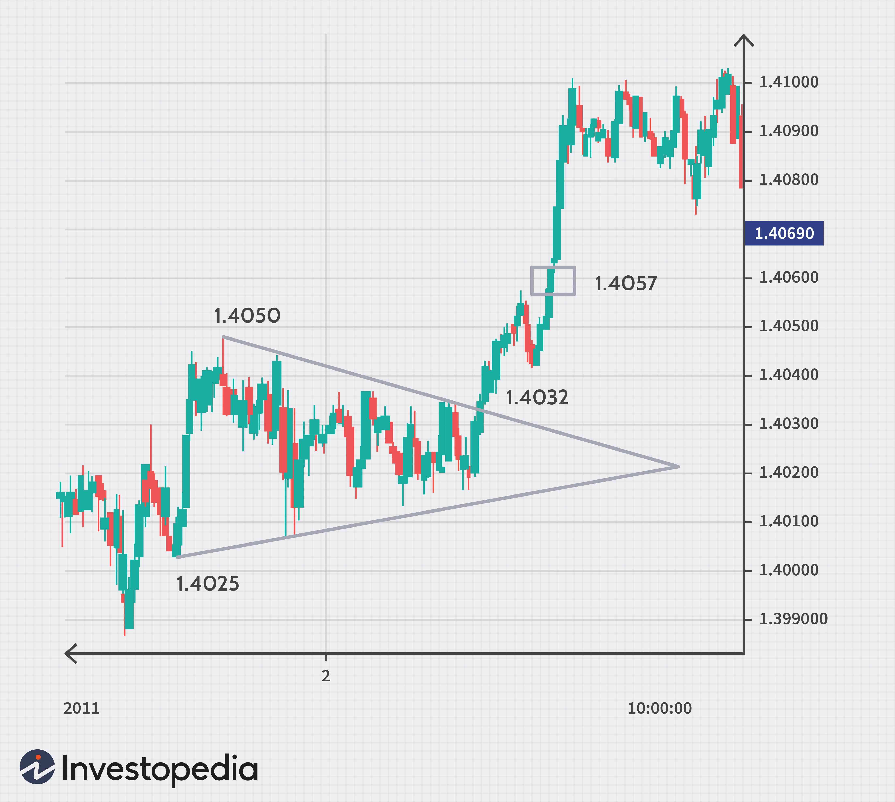

Chart patterns are fundamental instruments used by technical analysts and traders to identify potential trends and make informed decisions in both stock and commodity markets. These patterns manifest naturally over time and serve as indicators of market dynamics, providing valuable signals for probable future movements. The intrinsic function of chart patterns in trading lies in their ability to aid in forecasting price directions through visual patterns observed on price charts. By examining these patterns, traders can predict potential reversals or continuations in market trends, thereby enabling more strategic trade executions.

## Table of Contents



## Understanding Traditional Chart Patterns

Traditional chart patterns have long served as key tools in market analysis, providing invaluable insights into the collective psychology of market participants. These patterns have been scrutinized and utilized by traders for over a century to forecast potential price movements by recognizing specific shapes and formations on historical price charts. 

The core utility of these chart patterns lies in their ability to signal whether a market trend is likely to continue or reverse. Among the most frequently observed patterns are reversal patterns, such as Double Top and Head and Shoulders, and continuation patterns like Triangles and Channels.

**Reversal Patterns**

Reversal patterns indicate an upcoming change in the prevailing market trend. The Double Top pattern is characterized by two peaks at approximately the same price level, suggesting that the upward [momentum](/wiki/momentum) might be waning and a downtrend could follow. Conversely, the Double Bottom pattern indicates a potential upward reversal upon forming two troughs at similar price levels.

The Head and Shoulders pattern is another powerful reversal indicator. In a head and shoulders top, the market experiences a peak (shoulder), a higher peak (head), and a lower peak (second shoulder), often signaling the end of an uptrend. A similar inverse pattern suggests the potential end of a downtrend.

**Continuation Patterns**

Continuation patterns suggest that a trend is likely to proceed in its current direction following a consolidation phase. Triangles, be they ascending, descending, or symmetrical, are popular continuation patterns. These formations represent a market in consolidation, with eventual [breakout](/wiki/breakout-trading)s typically reaffirming the original trend once specific price levels are breached.

Channels, another form of continuation pattern, define price movements within parallel lines, indicating ongoing bullish or bearish trends. A breakout from these channels can further solidify the existing market trend direction.

Understanding these traditional chart patterns empowers traders by equipping them with visual cues and actionable insights. By applying these patterns, traders aim to enhance their decision-making processes and improve precision in predicting potential market shifts. 

For detailed exploration on the subject, readers might reference classic texts like "Technical Analysis of Stock Trends" by Robert D. Edwards and John Magee, which meticulously cover a broad spectrum of chart patterns and their applications in modern trading.

## Harmonic Patterns Explained

Harmonic patterns in trading leverage specific Fibonacci ratio alignments to anticipate potential market reversals. This approach introduces a structured mathematical methodology to market analysis, distinguishing it from other more subjective forms of technical analysis. The primary idea behind harmonic patterns is that pricing patterns repeat themselves and can be measured using Fibonacci ratios.

One widely recognized harmonic pattern is the Gartley pattern. Created by H.M. Gartley in 1932, it identifies potential reversals through a formation that involves particular price movements aligned with Fibonacci levels. The Gartley pattern is structured as follows:

- An initial impulse wave (XA) sets the pattern in motion.
- This is followed by a retracement move (AB) correcting the initial impulse, often reaching the 61.8% retracement of the XA leg.
- The market then rebounds to a BC leg, which typically retraces 38.2% to 88.6% of the AB leg.
- Finally, the CD leg completes the pattern, a move that can extend 127.2% to 161.8% of the BC leg, aligning closely near the 78.6% retracement of the XA impulse.

Another prominent harmonic pattern is the Bat pattern, discovered by Scott Carney. This pattern focuses on more intense retracements and projections:

- The Bat pattern begins with an impulse wave and then retraces sharply by 38.2% to 50% of the XA move (AB).
- Subsequent legs mirror the Gartley pattern but with the CD leg retracing to precisely the 88.6% level of the XA move.

The Butterfly pattern, on the other hand, crucially emphasizes the potential for extended CD legs that extend beyond the starting point of the XA leg. This pattern suggests significant potential reversals and is characterized by a CD leg extending to 127.2% or even 161.8% of the XA leg.

Understanding and applying these harmonic patterns can guide traders to identify high-probability trading opportunities. Traders often use software tools and programming language like Python to identify these patterns automatically, given their complexity and precision requirements. For instance, a simple Python snippet utilizing libraries like pandas and numpy might detect Fibonacci retracement levels to assist in identifying harmonic patterns:

```python
import pandas as pd
import numpy as np

def fibonacci_retracement(price_series, level):
    max_price = np.max(price_series)
    min_price = np.min(price_series)
    difference = max_price - min_price
    return min_price + difference * level

# Example usage
price_series = pd.Series([1.0, 1.2, 0.9, 1.4, 1.3])
retracement_61_8 = fibonacci_retracement(price_series, 0.618)
```

In summary, harmonic patterns provide a framework where Fibonacci ratios play a crucial role in predicting market reversals, thus offering traders potential high-probability entry and [exit](/wiki/exit-strategy) points in their trading strategies.

## The Role of Candlestick Patterns

Candlestick patterns graphically represent price movements by visually displaying the open, high, low, and close prices of a security within a specific time frame. These patterns are believed to forecast specific market behaviors due to the recurring human behaviors and psychological influences they capture. A single candlestick consists of a body, which represents the difference between the opening and closing prices, and wicks or shadows that indicate the high and low prices within the period.

Steve Nison introduced these patterns to Western traders in the early 1990s through his pioneering work, which highlighted the value of candlestick patterns in technical analysis. Among the myriad formations, the Doji and Engulfing patterns are particularly well-known. A Doji occurs when the opening and closing prices are virtually equal, suggesting indecision or a potential reversal point in the market. In contrast, the Engulfing pattern consists of a smaller candlestick followed by a larger one of opposite color, which completely "engulfs" the previous candle, signifying a possible reversal.

Traders utilize candlestick patterns by establishing rules to recognize these formations in a predefined manner for reliable market predictions. For instance, many traders look for confirmation signals before entering a trade based on a candlestick pattern. Confirmation might include a subsequent price movement that aligns with the prediction suggested by the pattern. By using predefined rules, such as validating a Bullish Engulfing pattern with higher-than-average trading [volume](/wiki/volume-trading-strategy), traders can refine predictions and increase reliability.

Predictive modeling and [algorithmic trading](/wiki/algorithmic-trading) further aid traders in recognizing these patterns through coding. For example, Python libraries like `pandas` can be employed to automate pattern recognition:

```python
import pandas as pd

def identify_doji(data):
    # Calculate the difference between open and close prices
    body_size = abs(data['Open'] - data['Close'])
    # Consider Doji if the body size is minimal
    return body_size < (data['High'] - data['Low']) * 0.1

# Example usage with price data
price_data = pd.DataFrame({
    'Open': [100, 105, 102],
    'High': [110, 108, 107],
    'Low': [95, 101, 100],
    'Close': [100, 103, 102]
})

doji_signals = price_data.apply(identify_doji, axis=1)
print(doji_signals)
```

This Python script can help in systematically identifying Doji patterns within a given dataset, allowing traders to react promptly to potential market changes. Candlestick patterns, when integrated into trading strategies with disciplined recognition and confirmation practices, can significantly enhance market analysis and decision-making efficiency.

## Integration of Chart Patterns in Algorithmic Trading

Algorithmic trading leverages chart pattern recognition for automated trade decisions by integrating complex mathematical models and computing capabilities to increase speed and accuracy in trading. The core advantage of algorithmic trading lies in its ability to handle vast amounts of data and execute trades based on established patterns without the emotional biases that often hinder human traders.

At the heart of algorithmic trading is the use of predefined rules, which guide the system to identify specific chart patterns and predict potential market movements. These rules are often based on historical data and technical analysis techniques. By employing statistical and machine learning methods, algorithms can analyze historical price patterns and volume data, identifying key patterns such as head and shoulders, triangles, and other formations with a high level of precision. 

For instance, a basic algorithmic strategy might feature a simple moving average crossover as a trigger: when a short-term moving average crosses above a long-term moving average, the algorithm might interpret this as a buying opportunity. This strategy can be enhanced by incorporating more sophisticated pattern recognition, like identifying double tops or bottoms to confirm the breakout direction. Here's a simplified Python example illustrating a moving average crossover strategy:

```python
import pandas as pd
import numpy as np

def moving_average_crossover_strategy(data, short_window=40, long_window=100):
    # Calculate moving averages
    data['Short_MA'] = data['Close'].rolling(window=short_window, min_periods=1).mean()
    data['Long_MA'] = data['Close'].rolling(window=long_window, min_periods=1).mean()

    # Create signals
    data['Signal'] = 0
    data['Signal'][short_window:] = np.where(data['Short_MA'][short_window:] > data['Long_MA'][short_window:], 1, 0)

    # Generate trading orders
    data['Positions'] = data['Signal'].diff()

    return data

# Example usage
# df = pd.read_csv('historical_stock_data.csv')
# strategy_output = moving_average_crossover_strategy(df)
# print(strategy_output[['Close', 'Short_MA', 'Long_MA', 'Signal', 'Positions']].tail())
```

Moreover, advanced algorithms can incorporate [machine learning](/wiki/machine-learning) techniques to improve pattern recognition and predictive capabilities further. Technologies such as [neural network](/wiki/neural-network)s and ensemble methods can enhance the system's ability to "learn" and adapt over time, accommodating more patterns and variations.

Algorithmic trading systems must continuously be evaluated and refined to adapt to changing market conditions. Traders and developers use [backtesting](/wiki/backtesting) methods to validate their algorithms against historical data, ensuring that the strategies perform well and yield consistent results. This rigorous testing process helps in minimizing risk and optimizing trade execution strategies, aligning them more closely with expected outcomes.

In conclusion, integrating chart patterns into algorithmic trading transforms traditional technical analysis tools into robust, automated systems that can handle the complexities and rapid pace of modern financial markets. By employing predefined rules and advanced computational techniques, traders can enhance their decision-making processes, manage risks more effectively, and ultimately achieve better trading outcomes.

## Challenges and Considerations

Chart patterns, while instrumental in technical analysis, come with their own set of challenges that traders must navigate meticulously. One prominent challenge is the subjective nature of pattern interpretation. The visual analysis inherently involves the trader's judgment, which can vary greatly between individuals. This subjectivity often leads to differing conclusions from the same data set, which can affect trading outcomes significantly.

Algorithmic systems have been introduced to mitigate some of these biases, but they present their own challenges. These systems need to be exceptionally well-designed to effectively recognize pattern variations, a task complicated by the often unpredictable nature of market conditions. Designing algorithms that can adapt to these variations without constant human intervention requires not only robust initial programming but also ongoing development to incorporate new data and market insights.

Furthermore, traders cannot rely solely on algorithms to navigate the complexities of changing market conditions. Continuous evaluation and adjustment of these algorithms are imperative to maintain their relevance and efficiency. This necessitates a rigorous process of back-testing using updated data sets and regular refinement of parameters. Traders must also ensure that their algorithms incorporate features that account for unforeseen market shifts, which can be achieved through machine learning techniques and dynamic input variables.

For example, consider an algorithm designed to recognize a Head and Shoulders pattern. Such a pattern involves three peaks, with the middle being the highest (head) and the outer peaks (shoulders) being lower and roughly equal in height. Detecting these patterns algorithmically requires precise calibration. Python libraries, such as numpy for numerical calculations and pandas for data manipulation, can be used to programmatically identify these patterns. Despite this, the algorithm must frequently reassess its criteria based on recent market data to stay accurate.

```python
import numpy as np
import pandas as pd

def detect_head_and_shoulders(prices):
    peaks = find_peaks(prices)  # Hypothetical function to find peaks
    if len(peaks) >= 3:
        head = peaks[1]
        shoulders = [peaks[0], peaks[2]]
        if prices[head] > max(prices[shoulders]) and abs(prices[shoulders[0]] - prices[shoulders[1]]) < threshold:
            return "Head and Shoulders pattern detected"
    return "No pattern detected"

# Assume `prices` is a pandas series of historical price data and `threshold` a predefined margin for shoulder height similarity.
```

Ultimately, the challenge lies in striking a balance between leveraging the historical insights of chart patterns and employing modern computational tools to adapt to the ever-evolving landscape of financial markets. Traders must remain vigilant and flexible, continuously fine-tuning their methodologies to harness the full potential of these analytical tools.

## Conclusion

Chart patterns remain a pivotal aspect of technical analysis, providing crucial insights into market behavior that help traders anticipate market trends. The effectiveness of these patterns lies in their ability to visually represent market psychology, reflecting the underlying sentiments that drive price movements. By identifying key patterns, traders gain valuable foresight into potential price directions, enabling them to make informed trading decisions.

The fusion of pattern recognition with algorithmic trading offers substantial benefits, notably in enhancing decision-making and market responsiveness. Algorithms, by rapidly processing large swathes of data, can recognize and act on patterns with precision and without the inefficiencies introduced by human emotions. This melding of traditional analysis with advanced computational methods delivers a more comprehensive and adaptive approach to trading.

For effective implementation, traders must strike a balance between historical insights and modern computational tools. While traditional chart patterns provide a foundation grounded in market psychology, algorithmic trading ensures swift and accurate execution. However, this combination demands a continuous evaluation of algorithms to adapt to evolving market conditions. Traders must remain vigilant and flexible, adjusting their strategies to reflect the dynamic nature of financial markets.

In conclusion, the integration of chart patterns with algorithmic trading systems holds promise for more robust technical analysis. This approach not only supports traders in better anticipating trends but also paves the way for more efficient and agile market responses. As markets continue to evolve, the synergy between historical pattern analysis and cutting-edge technology will be key to navigating the complexities of modern trading.

## References & Further Reading

[1]: Robert D. Edwards and John Magee. ["Technical Analysis of Stock Trends"](https://www.amazon.com/Technical-Analysis-Stock-Trends-8th/dp/0814406807)

[2]: H.M. Gartley. ["Profits in the Stock Market"](https://www.amazon.com/Profits-Stock-Market-Charts-Gartley/dp/0939093073)

[3]: Scott Carney. ["Harmonic Trading, Volume One: Profiting from the Natural Order of the Financial Markets"](https://www.amazon.com/Harmonic-Trading-One-Profiting-Financial/dp/0137051506)

[4]: Steve Nison. ["Japanese Candlestick Charting Techniques"](https://www.amazon.com/Japanese-Candlestick-Charting-Techniques-Second/dp/0735201811)

[5]: Marcos Lopez de Prado. ["Advances in Financial Machine Learning"](https://www.amazon.com/Advances-Financial-Machine-Learning-Marcos/dp/1119482089)

[6]: David Aronson. ["Evidence-Based Technical Analysis: Applying the Scientific Method and Statistical Inference to Trading Signals"](https://www.amazon.com/Evidence-Based-Technical-Analysis-Scientific-Statistical/dp/0470008741) 

[7]: Stefan Jansen. ["Machine Learning for Algorithmic Trading, Second Edition"](https://github.com/PacktPublishing/Machine-Learning-for-Algorithmic-Trading-Second-Edition)