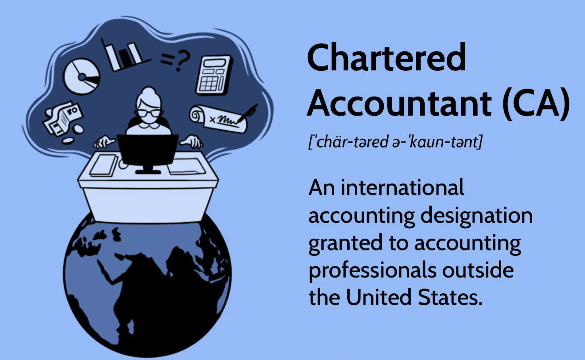

## Table of Contents

## What is a chartered accountant?

A chartered accountant, often called a CA, is a professional who helps people and businesses with their money matters. They make sure that the financial records are correct and follow the rules. They also give advice on how to save money on taxes and how to manage finances better.

Chartered accountants need to study a lot and pass tough exams to get their special title. Once they become CAs, they can work in many different places like big companies, small businesses, or even start their own firms. They are very important because they help keep everything financial honest and clear.

## What qualifications are needed to become a chartered accountant?

To become a chartered accountant, you need to finish a certain amount of education first. Usually, you need a bachelor's degree in accounting or a related field. After that, you have to join a professional body like the Institute of Chartered Accountants in your country. This body will have its own set of exams that you need to pass. These exams can be very hard and cover topics like financial reporting, auditing, taxation, and business strategy.

Once you pass the exams, you need to get some real-world experience. This usually means working under a qualified chartered accountant for a few years. This period is called an articling period or training contract. During this time, you learn how to apply what you studied in real-life situations. After you finish your training and meet all the requirements, the professional body will give you the title of chartered accountant. This shows that you have the knowledge and skills to help people and businesses with their financial needs.

## What are the primary roles of a chartered accountant?

A chartered accountant's main job is to make sure a company's money records are correct and follow the law. They check the financial statements to make sure everything is right and nothing is missing. They also help companies follow the rules set by the government about how to keep their [books](/wiki/algo-trading-books). This is important because it helps the company stay out of trouble and keeps everything honest.

Another big part of their job is giving advice on how to save money on taxes. They know a lot about tax laws and can help a business pay less tax in a legal way. They also help with planning how to use the company's money wisely. This can mean figuring out the best way to spend money or invest it to make the business grow.

Lastly, chartered accountants often help with big decisions like buying or selling parts of the business. They look at the numbers to see if it's a good idea. They also help when a company is having money problems, trying to find ways to fix things before it's too late. Their job is really important because they help keep the business healthy and on the right track.

## How does a chartered accountant assist in financial reporting?

A chartered accountant helps with financial reporting by making sure that a company's financial statements are correct and clear. They check all the numbers and make sure everything adds up right. They also make sure the company follows the rules about how to show their money in reports. This is important because it helps everyone who looks at the reports, like investors or banks, understand how the company is doing financially.

Chartered accountants also explain the financial reports to people who might not understand them well. They can break down complicated information into simple terms. This way, the company's leaders can make good decisions based on the financial reports. By doing all this, chartered accountants help keep the company honest and trustworthy to everyone who cares about its financial health.

## What are the responsibilities of a chartered accountant in tax planning and compliance?

A chartered accountant helps with tax planning by finding ways for a business or person to pay less tax legally. They know all the tax rules and can suggest the best ways to save money. For example, they might advise on what to buy or invest in to get tax breaks. They also look at the whole year's finances to plan how to handle taxes smartly, making sure the business keeps more of its money.

In terms of tax compliance, a chartered accountant makes sure that all tax forms are filled out correctly and sent in on time. They keep track of all the deadlines and rules to avoid any fines or problems with the tax office. They also help during tax audits by making sure all the records are in order and ready to show. This way, they help the business stay out of trouble and keep everything running smoothly.

## How do chartered accountants contribute to auditing processes?

Chartered accountants help a lot with auditing. They check the company's money records to make sure everything is right and honest. They look at all the numbers and documents to see if they match up. If they find any mistakes or problems, they tell the company how to fix them. This helps make sure the financial reports are true and can be trusted by others like investors or banks.

They also make sure the company follows all the rules about how to keep their books. This is important because it helps the company stay out of trouble with the law. During an audit, chartered accountants might ask a lot of questions and look at a lot of papers. They do this to make sure nothing is missing or wrong. By doing all this, they help keep the company's finances clear and honest.

## What role does a chartered accountant play in budgeting and financial forecasting?

A chartered accountant helps a company make a budget by looking at how much money they have and how they plan to spend it. They use their knowledge to figure out the best way to use the money so the company can meet its goals. They look at past spending and income to make a plan for the future. This helps the company know how much money they can spend on things like new projects or hiring more people.

Chartered accountants also help with financial forecasting. This means they try to guess what will happen with the company's money in the future. They look at things like how the economy is doing, what the company has done before, and any big changes coming up. By doing this, they can help the company plan for different situations, like if they might make more or less money. This helps the company be ready for whatever might happen and make smart choices about their money.

## How can a chartered accountant help in managing business risks?

A chartered accountant helps a business manage risks by looking at the money side of things. They check the financial records to find any problems that could cause trouble later. They also think about what could go wrong, like not having enough money to pay bills or losing money because of bad decisions. By spotting these risks early, they can help the business make plans to avoid them. For example, they might suggest saving more money or not spending on things that are too risky.

Chartered accountants also help by making sure the business follows all the rules and laws. This can stop the business from getting into legal trouble, which is a big risk. They keep an eye on changes in laws and tell the business how to stay safe. By doing all this, they help the business be ready for problems and keep running smoothly.

## What are the ethical responsibilities of a chartered accountant?

A chartered accountant has to follow strict ethical rules. They need to be honest and fair in everything they do. This means they can't lie or hide information when they are working with a company's money. They also have to keep the information they know about a company private and not share it with others. This is important because people and businesses trust them to handle their money the right way.

Chartered accountants also have to avoid any conflicts of interest. This means they can't work on something if it might make them choose between what's best for them and what's best for their client. They need to tell their clients if there's any chance of this happening. By following these rules, chartered accountants help keep the trust that people have in them and make sure they are doing their job the right way.

## How do chartered accountants use technology in their daily tasks?

Chartered accountants use technology a lot to make their work easier and faster. They use special computer programs to keep track of money and make reports. These programs can add up numbers quickly and make sure everything is correct. They also use the internet to look up rules and laws about money, so they can make sure their clients are following them. This helps them give good advice and stay up to date.

Another way technology helps is by letting chartered accountants work from anywhere. They can use their computers or phones to connect with clients and share information easily. This is really useful when they need to check something quickly or help someone who is far away. By using technology, chartered accountants can do their job better and help their clients more effectively.

## What advanced skills are required for a chartered accountant to handle complex financial scenarios?

To handle complex financial scenarios, a chartered accountant needs to have strong analytical skills. This means they have to be good at looking at a lot of numbers and figuring out what they mean. They need to understand how different parts of a business's money work together and how changes in one part can affect others. For example, if a company wants to grow, the chartered accountant has to figure out how much it will cost and how it will change the company's money situation. They also need to be good at using computer programs that can help them see patterns and make predictions about the future.

Another important skill is the ability to think strategically. This means chartered accountants need to be able to see the big picture and plan for the long term. They have to think about what might happen in the future and help the business prepare for it. This could mean planning for things like economic changes or new laws that might affect the company's money. They also need to be good at talking to people and explaining complicated ideas in a simple way, so everyone in the business can understand and make good decisions.

## How can a chartered accountant provide strategic advice to enhance business growth?

A chartered accountant can help a business grow by looking at its money and finding ways to make more of it. They can suggest where to spend money to make the business bigger, like investing in new projects or hiring more people. They also look at how the business is doing now and plan for the future. By understanding the numbers, they can tell the business owners what might happen if they make certain choices. This helps the business pick the best way to grow without taking too many risks.

Another way a chartered accountant helps is by making sure the business saves money where it can. They know a lot about taxes and can find ways to pay less, which means more money for the business to use for growth. They also look at the costs of running the business and suggest ways to spend less without hurting the business. By giving this kind of advice, a chartered accountant helps the business use its money wisely and grow in a smart way.

## References & Further Reading

[1]: Torres-Reyna, O. (2008). ["Getting Started in Algo Trading."](http://user.keio.ac.jp/~nagakura/R/Panel101R.pdf) Princeton University Press.

[2]: Aldridge, I. (2013). ["High-Frequency Trading: A Practical Guide to Algorithmic Strategies and Trading Systems."](https://www.ahmetbeyefendi.com/wp-content/uploads/2020/07/High-Frequency-Trading-Irene-Aldridge.pdf) Wiley Finance.

[3]: Varian, H. R. (2014). ["Big Data: New Tricks for Econometrics."](https://www.aeaweb.org/articles?id=10.1257/jep.28.2.3) Journal of Economic Perspectives, 28(2), 3-27.

[4]: Deloitte. (2018). ["Technology trends in accounting for 2019."](https://www.deloitte.com/global/en/Industries/tmt/perspectives/gx-technology-industry-outlook.html) Deloitte Insights.

[5]: PwC. (2020). ["Accounting and AI: Leading the way forward in financial reporting."](https://kpmg.com/xx/en/our-insights/ai-and-technology/ai-in-financial-reporting-and-audit.html) PwC Global.