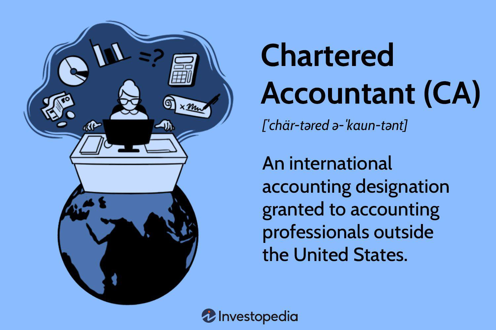

Chartered Accountants (CAs) play an indispensable role in ensuring the financial health of organizations within the ever-changing landscape of finance and business. These professionals are integral not only for their traditional responsibilities of managing accounting and tax duties but also for providing strategic insights that keep organizations competitive. In this context, a noteworthy area where their expertise is becoming vital is algorithmic trading, a burgeoning trend in financial markets.

Algorithmic trading, also known as algotrading, refers to the use of computer algorithms to automate trading activities—executing orders based on pre-set conditions without human intervention. As financial markets increasingly adopt algorithmic trading to enhance efficiency, transparency, and speed, the role of CAs becomes even more crucial. Their deep understanding of financial systems and analytical skills enable them to assess the financial impact and viability of algorithmic trading strategies. By offering invaluable insights into risk management, regulatory compliance, and financial forecasting, CAs aid organizations in navigating the complexities of modern trading environments.



Moreover, CAs are equipped to leverage technological advancements, incorporating data analytics and artificial intelligence into their work. This empowers them to provide accurate and timely financial data, further supporting organizations in their decision-making processes. As the role of technology in finance continues to expand, the ability of CAs to adapt to these changes reinforces their position as indispensable assets in the financial industry.

Overall, CAs are not just accountants; they are strategic partners who ensure that organizations remain financially robust and compliant in an increasingly complex market. As algorithmic trading continues to reshape the financial landscape, the expertise and adaptability of Chartered Accountants will remain pivotal to maintaining this balance.

## Table of Contents

## What Is a Chartered Accountant?

A Chartered Accountant (CA) is a highly qualified professional who specializes in accounting, auditing, taxation, and financial management. Recognized globally, CAs possess comprehensive knowledge and skills essential for various financial and business functions. The qualification of a Chartered Accountant is internationally acknowledged as a mark of excellence and professionalism in the accounting profession.

CAs are pivotal in the preparation and review of financial statements, ensuring their accuracy and compliance with applicable laws and regulations. They play a critical role in auditing financial statements, providing assurance that the financial records of an organization are accurate, complete, and in adherence with accounting standards such as the International Financial Reporting Standards (IFRS). Moreover, Chartered Accountants are adept in tax planning and compliance, assisting businesses and individuals in optimizing their tax liabilities while ensuring compliance with tax laws.

In the dynamic and intricate financial landscapes that businesses encounter today, the expertise of Chartered Accountants is indispensable. They provide strategic financial advisory services, helping organizations make informed decisions that enhance financial performance and sustainability. This includes offering guidance on investment opportunities, risk management, and cost management, thus contributing to the overall strategic growth and development of businesses.

The multifaceted role of CAs extends to various industries, including public practice, corporate sectors, government agencies, and non-profit organizations. Their proficiency in financial management, auditing, and advisory services makes them a valuable asset to any organization looking to maintain robust financial health and achieve strategic business objectives.

## Duties and Responsibilities of Chartered Accountants

Chartered Accountants (CAs) play an essential role in maintaining the integrity and functionality of financial systems within organizations. One of their primary responsibilities is ensuring accurate financial reporting, which involves integrating compliance with international accounting standards such as the International Financial Reporting Standards (IFRS) and the Generally Accepted Accounting Principles (GAAP). This function is crucial for fostering transparency, enabling investors, regulators, and stakeholders to make informed decisions based on meaningful and reliable financial data.

In addition to financial reporting, CAs are proficient in managing complex tax structures, advising businesses on optimizing tax strategies to minimize liabilities while adhering strictly to the legal frameworks. Their expertise in taxation covers everything from calculating income tax, managing VAT returns, to international tax planning, positioning businesses advantageously on the global stage.

Strategic business advisory is another significant domain where CAs provide substantial value. They utilize their comprehensive understanding of financial data to contribute to long-term business planning and strategy development. By analyzing financial reports and market trends, CAs advise on mergers and acquisitions, capital restructuring, and investment opportunities. This strategic input is vital for businesses looking to enhance profitability and achieve sustainable growth.

Auditing constitutes a critical aspect of a CA's duties, where they examine financial statements to ensure their accuracy and compliance with applicable regulations. The auditing process includes thorough inspections of accounting records and transactions, assessing internal controls, and verifying the organization’s assets and liabilities. Through auditing, CAs provide assurance that financial statements are free from material misstatement, reflecting the true financial position of the company. This function not only alleviates risks of fraud but also strengthens stakeholder confidence in the organization's operations and reporting integrity.

The rigorous execution of these responsibilities by Chartered Accountants underscores their indispensable role in securing the financial health and regulatory adherence of organizations across various industries.

## Impact of Technology in Accounting

The integration of technology in accounting has significantly reshaped the landscape of financial management. As [algorithmic trading](/wiki/algorithmic-trading) gains prominence, CAs are compelled to harness technological tools to not only meet contemporary demands but also to offer sophisticated financial solutions. This evolution has seen Chartered Accountants embrace advanced software for enhanced data analysis and financial forecasting accuracy. Such software solutions enable the refinement of data into actionable insights, imperative for strategic financial planning in an era marked by swift market fluctuations.

The adoption of automation and [artificial intelligence](/wiki/ai-artificial-intelligence) stands as a pivotal transformation in the accounting sector. Automation streamlines repetitive tasks, reducing human error and allowing accountants to focus on more strategic activities. In the context of risk management, AI assists CAs by offering predictive analytics, which can forecast market trends and potential risks. This capability equips accountants to preemptively develop strategies to mitigate financial risks, thereby safeguarding investments and ensuring compliance with regulatory standards.

AI-driven algorithms are also integral to strategic decision-making processes, providing real-time data that can guide investment strategies and corporate governance decisions. For instance, [machine learning](/wiki/machine-learning) algorithms can process vast datasets more efficiently than traditional methods, offering insights that were previously unattainable. These advancements enable Chartered Accountants to play a critical role in advising and implementing data-driven strategies that align with organizational objectives.

Incorporating technology into accounting practices not only enhances the accuracy and efficiency of financial reporting but also positions Chartered Accountants as indispensable advisors in navigating the complexities of algorithmic trading and broader financial markets. As these technological trends continue to evolve, CAs must remain agile, ensuring their skills and tools adapt to meet the changing demands of the industry.

## Role of Chartered Accountants in Algorithmic Trading

Chartered Accountants (CAs) play a pivotal role in the domain of algorithmic trading by providing insightful analysis and oversight to ensure that trading strategies are financially sound. Their in-depth understanding of financial principles enables them to evaluate the effectiveness and profitability of algorithmic trading strategies, which rely heavily on sophisticated algorithms to execute trades at high speed and volumes.

One of the crucial roles of CAs in this area is ensuring compliance with regulatory requirements. Regulatory bodies around the world have set various rules to govern algorithmic and high-frequency trading, primarily to maintain market stability and transparency. CAs are equipped to interpret these regulations and ensure that the algorithms employed by their organizations adhere to the specific compliance standards. This involves regular audits and assessments of the trading algorithms to verify their compliance with the standards set by financial regulatory authorities.

CAs are also tasked with assessing the risks associated with high-frequency trading ([HFT](/wiki/high-frequency-trading-strategies)). HFT, which involves executing a large number of orders at extremely high speeds, carries unique financial and systemic risks such as market manipulation, technology failures, and systemic risk amplification. Chartered Accountants evaluate these risks using advanced risk assessment models and offer strategic advice on mitigating potential vulnerabilities. This may include suggesting modifications to trading algorithms, recommending robust risk management frameworks, or advising on the diversification of trading strategies to reduce overall risk exposure.

Additionally, CAs contribute to the improvement of algorithmic trading strategies by providing financial analysis and advice. They can assess the historical performance of trading algorithms, helping to identify patterns and trends that can enhance future algorithmic development. The data-driven approach used by CAs aids in refining algorithms to maximize performance while minimizing risks and ensuring that the trading activities align with the broader financial goals of the organization.

In summary, Chartered Accountants are integral to the functioning and evolution of algorithmic trading. Through meticulous regulatory compliance, comprehensive risk assessment, and strategic guidance, they ensure that algorithmic trading activities are not only profitable but also sustainable and compliant with financial regulations.

## Educational Path and Continuous Learning

Becoming a Chartered Accountant (CA) is a rigorous and demanding educational journey that requires a significant investment of time and effort. Candidates must typically complete a series of comprehensive educational and professional exams to attain this prestigious title. The pathway usually begins with a bachelor's degree in accounting, finance, or a related field, which provides foundational knowledge in financial principles and business practices. Subsequently, aspiring CAs must enroll in a professional accounting body recognized in their country, such as the Institute of Chartered Accountants in England and Wales (ICAEW) or the American Institute of Certified Public Accountants (AICPA) in the United States.

A critical component of the CA qualification process is passing a series of exams that test core competencies in accounting, auditing, taxation, financial reporting, and business strategy. These exams are designed to assess a candidate's technical proficiency and analytical abilities, ensuring that they are well-equipped to handle the complexities of financial management and reporting.

Continuous professional development (CPD) is a mandatory obligation for all Chartered Accountants. Given the fast pace of change in global financial markets and advancements in technology, CAs must remain informed about the latest industry standards, regulatory changes, and emerging financial technologies. CPD involves a combination of structured learning activities, such as attending seminars, workshops, and conferences, and unstructured activities like self-directed research and study.

To further enhance their expertise, Chartered Accountants often pursue additional certifications and credentials. These might include certifications in areas such as forensic accounting, financial forensics, or information systems auditing. Specializations in areas like fraud examination (Certified Fraud Examiner, CFE) or information technology auditing (Certified Information Systems Auditor, CISA) are increasingly sought after, reflecting the growing importance of technology and data analytics in accounting practices.

By continuously updating their skills and knowledge, Chartered Accountants ensure they remain at the forefront of the profession, capable of providing insightful advice on both traditional financial matters and modern challenges presented by technological innovation.

## Future Trends in Chartered Accountancy

The future of chartered accountancy is set to be heavily influenced by technological advancements, with artificial intelligence (AI) and blockchain playing pivotal roles. These technologies are transforming traditional accounting practices and ushering in new opportunities for Chartered Accountants (CAs).

AI integration in accounting is enabling more efficient data processing, predictive analytics, and decision-making support. For instance, AI algorithms can automate routine tasks such as data entry and transaction categorization, allowing CAs to focus on strategic analysis and advisory roles. Machine learning models are also used to detect anomalies and predict financial outcomes, thus enhancing accuracy in financial reporting and risk management. A simple Python example of anomaly detection might use libraries like `scikit-learn` to identify patterns in financial data:

```python
from sklearn.ensemble import IsolationForest
X = [[2000], [3000], [1500], [4000], [10000], [2000]]  # sample transaction data
iso_forest = IsolationForest(contamination=0.1)  # assuming 10% outliers
y_pred = iso_forest.fit_predict(X)
anomalies = [X[i] for i in range(len(y_pred)) if y_pred[i] == -1]
print("Anomalies:", anomalies)
```

Blockchain technology, known for its transparency and security, is revolutionizing auditing processes. By facilitating immutable records and real-time verification of transactions, blockchain minimizes errors and fraud risks. This technology provides a more efficient audit trail, compelling CAs to adapt to these innovations and expand their skill sets to include blockchain literacy.

Managing big data has become critical in the context of algorithmic trading, where large volumes of data are analyzed rapidly to inform trading decisions. CAs are increasingly tasked with interpreting this data to offer insights and reduce financial risks. They employ statistical models and data analytics tools to provide actionable information that helps in optimizing trading strategies and ensuring regulatory compliance.

Furthermore, as the focus on sustainability and corporate social responsibility (CSR) intensifies, CAs are playing an integral role in guiding organizations through sustainable practices. This includes advising on environmental regulations, social impact reporting, and transparent governance. CAs are essential in helping companies align their financial goals with broader societal expectations, making CSR a significant component of their advisory services.

In summary, the evolving landscape of chartered accountancy is characterized by the integration of advanced technologies like AI and blockchain, the management of big data, and a heightened emphasis on sustainability and CSR. These shifts are redefining the role of CAs, requiring them to continuously adapt and embrace new skills to stay relevant in the rapidly changing financial environment.

## Conclusion

Chartered Accountants (CAs) have never been more essential than in today's rapidly evolving financial landscape, particularly with the rise of algorithmic trading. As financial systems grow increasingly complex, the demand for the precise expertise and steadfast integrity that CAs offer becomes paramount. Their role extends far beyond traditional accounting functions; they are now pivotal in ensuring the seamless integration of advanced financial technologies.

The ability of CAs to navigate intricate financial systems stems from their rigorous training and deep understanding of both theoretical and practical aspects of finance. This proficiency allows them to interpret vast amounts of financial data accurately and derive actionable insights crucial for algorithmic trading. They ensure that these advanced trading strategies comply with stringent regulatory requirements while mitigating associated risks. Moreover, their strategic insights drive financial innovation, allowing businesses to remain competitive in dynamic markets.

A testament to their enduring relevance is the adaptability of CAs. As the financial sector continues to integrate disruptive technologies like artificial intelligence and blockchain, CAs remain committed to lifelong learning. This commitment to continuous professional development enables them to keep pace with rapid technological advancements. By pursuing additional certifications and staying abreast of industry trends, Chartered Accountants ensure they are equipped with the latest knowledge and skills necessary to tackle emerging challenges.

In conclusion, the evolution of financial systems and the proliferation of algorithmic trading solidify the indispensable role of Chartered Accountants. Their unmatched expertise, coupled with an unwavering dedication to ethical standards and ongoing education, ensures that they remain at the forefront of industry changes. As financial innovation continues to transform the landscape, CAs will play a crucial role in shaping the future of accounting and finance, safeguarding organizational success in an increasingly complex world.

## References & Further Reading

[1]: Torres-Reyna, O. (2008). ["Getting Started in Algo Trading."](http://user.keio.ac.jp/~nagakura/R/Panel101R.pdf) Princeton University Press.

[2]: Aldridge, I. (2013). ["High-Frequency Trading: A Practical Guide to Algorithmic Strategies and Trading Systems."](https://www.ahmetbeyefendi.com/wp-content/uploads/2020/07/High-Frequency-Trading-Irene-Aldridge.pdf) Wiley Finance.

[3]: Varian, H. R. (2014). ["Big Data: New Tricks for Econometrics."](https://www.aeaweb.org/articles?id=10.1257/jep.28.2.3) Journal of Economic Perspectives, 28(2), 3-27.

[4]: Deloitte. (2018). ["Technology trends in accounting for 2019."](https://www.deloitte.com/global/en/Industries/tmt/perspectives/gx-technology-industry-outlook.html) Deloitte Insights.

[5]: PwC. (2020). ["Accounting and AI: Leading the way forward in financial reporting."](https://kpmg.com/xx/en/our-insights/ai-and-technology/ai-in-financial-reporting-and-audit.html) PwC Global.