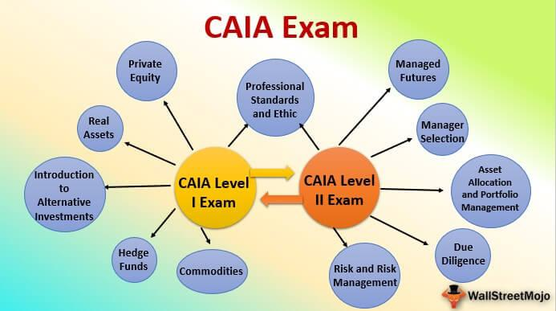

In the rapidly evolving world of finance, there is a burgeoning demand for specialized knowledge in the area of alternative investments. This demand is primarily driven by the need for strategies that go beyond traditional asset classes, such as stocks and bonds, to include more complex forms of investment. Alternative investments, which encompass a broad range of assets including hedge funds, private equity, venture capital, and real estate, offer the potential for higher returns and diversification but require a nuanced understanding for effective management.

To address this growing demand, the Chartered Alternative Investment Analyst (CAIA) certification serves as a vital credential. It is specifically designed to equip finance professionals with the requisite expertise in alternative investment vehicles. As a globally recognized certification, the CAIA designation underscores a professional's ability to analyze and manage complex financial products and strategies.



This article explores the significance of the CAIA certification in today's financial landscape. It examines how CAIA prepares professionals to navigate alternative investments, which often require a nuanced approach compared to traditional investments, and also investigates into the relationship between CAIA-acquired competencies and the emerging field of algorithmic trading. In an era where algorithmic trading is becoming synonymous with efficiency and precision in trading activities, a specialized understanding as encouraged by the CAIA certification can offer considerable advantages. Through this discussion, the article highlights the relevance and growing importance of the CAIA credential for professionals seeking to advance their careers in the competitive field of alternative investments.

## Table of Contents

## Understanding CAIA Certification

The Chartered Alternative Investment Analyst (CAIA) certification is a distinguished professional designation, recognized globally for its focus on alternative investments. The certification is targeted towards professionals who manage asset classes such as hedge funds, private equity, real estate, and derivatives—each of which offers unique risk and return profiles compared to traditional investment vehicles like stocks and bonds. The CAIA program aims to equip candidates with specialized knowledge in these areas, ensuring they are well-versed in both theory and practical applications.

The CAIA program is structured around a rigorous two-level examination model. The first level serves as a foundational primer, covering the fundamentals of alternative investments, including asset allocation, and risk-return analyses specific to alternative asset classes. It also addresses the unique features and complexities of different types of alternative investments.

Level II of the CAIA program shifts to focus on more advanced topics. It involves a detailed exploration of investment strategies, professional standards, and ethics, and includes a comprehensive review of complex asset pricing and hedge fund strategies among other concepts. The program emphasizes the critical assessment of risk management and governance, ensuring that certified professionals can effectively navigate the challenges associated with alternative investments.

By completing the CAIA certification, candidates demonstrate their capability to handle the dynamic and often high-pressure environment of alternative investments. This structured program, by design, ensures that graduates possess the necessary skills to contribute meaningfully to investment management firms, hedge funds, private equity firms, and similar entities that rely heavily on alternative investment strategies.

## Alternative Investments Explained

Alternative investments constitute a broad category of asset classes that include, but are not limited to, hedge funds, venture capital, real estate, commodities, private equity, and derivatives. These asset classes are often distinguished from traditional investments such as stocks, bonds, and cash due to their unique characteristics and risk-return profiles.

Hedge funds are private investment pools that employ a variety of strategies to maximize returns. They can invest in anything—land, real estate, stocks, derivatives, and even currencies, employing long and short positions, leverage, and [arbitrage](/wiki/arbitrage) to seek returns. Venture capital involves investing in early-stage companies with high growth potential, while real estate investments pertain to acquiring, managing, or selling real property with the expectation of generating income and appreciation gains.

One of the defining traits of alternative investments is their potential for higher returns compared to traditional investments, albeit often accompanied by increased risk and complexity. Alternative investments tend to have a lower correlation with standard asset classes, meaning they can provide diversification benefits to an investment portfolio, reducing overall risk.

Managing these investments effectively necessitates a specialized set of skills and a deep understanding of complex financial instruments and markets. The Chartered Alternative Investment Analyst (CAIA) certification is specifically tailored to equip professionals with the required knowledge to navigate these investment vehicles. The CAIA curriculum covers a comprehensive array of topics, including risk management, performance measurement, and asset allocation, all crucial for effectively managing alternative investments. This certification provides professionals with the analytical framework and strategic insight needed to capitalize on the opportunities within this niche segment of the financial markets.

## The Role of Algorithmic Trading

Algorithmic trading involves the use of computer algorithms to execute trading decisions automatically based on predefined criteria. These algorithms consider various factors such as timing, price, and [volume](/wiki/volume-trading-strategy) to conduct trades with high precision and speed. This approach minimizes human intervention, thereby reducing the likelihood of emotional or inconsistent decision-making.

In recent years, [algorithmic trading](/wiki/algorithmic-trading) has gained prominence within the management of alternative investments. The primary appeal of algorithmic trading lies in its efficiency and ability to rapidly analyze and respond to market data. These attributes are particularly advantageous when dealing with alternative assets, which often require swift execution to capitalize on market inefficiencies.

Alternative investment vehicles such as hedge funds and derivatives, which are key components of the Chartered Alternative Investment Analyst (CAIA) certification curriculum, significantly benefit from algorithmic trading strategies. These strategies allow for the swift adaptation to market conditions and can help in achieving better risk-adjusted returns.

A CAIA certified professional, through their extensive training in investment management, gains a deeper understanding of the intricacies associated with these trading methodologies. The curriculum prepares them to design and implement robust trading systems, taking into account the unique characteristics of alternative investments. This competence includes an understanding of quantitative techniques that underpin algorithmic strategies.

For instance, consider a scenario where a [hedge fund](/wiki/hedge-fund-trading-strategies) manager employs an algorithm to manage a portfolio comprising alternative assets. The algorithm uses statistical models to identify optimal entry and [exit](/wiki/exit-strategy) points. Here's a basic example of what such a trading algorithm might look like in Python:

```python
import pandas as pd
import numpy as np

# Sample function to decide trading action based on moving averages
def trading_signal(prices, short_window=40, long_window=100):
    signals = pd.DataFrame(index=prices.index)
    signals['price'] = prices
    # Create short simple moving averages over the short window
    signals['short_mavg'] = prices.rolling(window=short_window, min_periods=1).mean()
    # Create long simple moving averages over the long window
    signals['long_mavg'] = prices.rolling(window=long_window, min_periods=1).mean()
    # Create signals based on moving average crossover
    signals['signal'] = 0.0
    signals.loc[signals['short_mavg'] > signals['long_mavg'], 'signal'] = 1.0
    signals.loc[signals['short_mavg'] < signals['long_mavg'], 'signal'] = -1.0
    return signals

# Dummy data and usage
dummy_prices = pd.Series(np.random.randn(1000), index=pd.date_range('2022-01-01', periods=1000))
signals = trading_signal(dummy_prices)
```

This code exemplifies a basic moving average crossover strategy, which is a common form of algorithmic trading strategy. It identifies buying and selling points by comparing short-term and long-term moving averages of asset prices. The algorithmic trading model automates these decisions based on predefined parameters, ensuring disciplined and timely trading actions.

In summary, the increasing application of algorithmic trading to alternative investments is driven by the need for greater execution efficiency and precision. The CAIA certification empowers professionals with the necessary skills to develop and manage these sophisticated strategies, thus enhancing their effectiveness in the alternative investment sector.

## Benefits of CAIA Certification

Earning the Chartered Alternative Investment Analyst (CAIA) designation equips professionals with a specialized skill set that positions them uniquely within the financial industry. This certification is particularly valuable for those focusing on alternative investments. CAIA designation provides individuals with the analytical tools and insights necessary to excel in niche fields such as hedge funds, private equity, and risk management. By featuring a curriculum that is primarily concentrated on alternative investments, the CAIA program fosters a deep understanding of the complexities and nuances inherent in these asset classes, which are often absent in more broadly-focused financial training programs.

The CAIA designation enhances career opportunities by specifically targeting an area of finance that has shown considerable growth and demand. Professionals holding the CAIA credential are attractive candidates for roles that require expertise in evaluating and managing alternative investments, enabling them to differentiate themselves in competitive job markets. The skills acquired through the CAIA program are aligned with the practical demands of fields where alternative investments play a crucial role, providing credential holders with a competitive edge in portfolio management, investment analysis, and risk assessment.

Moreover, the CAIA designation offers significant benefits in terms of global recognition. Accredited by a reputable institution, the certification is recognized around the world as a mark of expertise in alternative investments. This recognition facilitates professional networking and growth, offering CAIA charterholders access to a global community of finance professionals. This network enhances collaboration opportunities, access to exclusive events, and insights into the latest industry trends and practices.

In summary, obtaining the CAIA certification not only positions professionals as specialists within the dynamic field of alternative investments but also enhances career prospects and professional development by providing global recognition and a strong professional network.

## Comparison with CFA

The Chartered Alternative Investment Analyst (CAIA) and Chartered Financial Analyst (CFA) certifications are both prestigious credentials in the financial industry, yet they cater to different career paths and areas of expertise. Understanding the distinctions between these two certifications is crucial for professionals aiming to align their qualifications with their career objectives.

The CFA program is renowned for its comprehensive coverage of a wide range of financial topics. It encompasses areas such as equity and fixed-income analysis, portfolio management, corporate finance, and ethical standards in investment practices. This broad spectrum makes the CFA designation highly suitable for those pursuing careers in investment analysis, portfolio management, and financial advisory roles. The CFA curriculum's extensive coverage allows candidates to gain a holistic understanding of financial markets and instruments, enhancing their capability to operate across various sectors within the financial industry.

In contrast, the CAIA certification is tailored specifically towards alternative investments. It provides in-depth insights into asset classes like hedge funds, private equity, real estate, commodities, and derivatives. Professionals obtaining the CAIA designation are equipped with specialized knowledge and skills to manage and assess alternative investment portfolios effectively. This specialization makes CAIA particularly appealing for those seeking to focus on investment vehicles that deviate from traditional stocks and bonds, offering the potential for higher returns and diversification benefits.

Choosing between the CAIA and CFA certifications should, therefore, align with one's career focus. Those interested in gaining broad financial expertise and working across diverse financial roles might find the CFA designation more beneficial. On the other hand, finance professionals aspiring to specialize in the rapidly growing field of alternative investments might consider the CAIA certification as a more strategic choice. Ultimately, the decision depends on whether a professional seeks a generalized financial acumen or a focused expertise in niche investment strategies.

## Concluding Thoughts

The Chartered Alternative Investment Analyst (CAIA) certification provides substantial benefits, particularly for those interested in specializing in alternative investments. Its focused curriculum equips professionals with a deep understanding of complex investment vehicles, which is crucial in navigating the intricacies of hedge funds, private equity, real estate, and derivatives. This level of expertise is indispensable for individuals aiming to maximize returns and mitigate risks, factors that are essential in achieving long-term investment success. 

As the financial landscape continues to change with advancements in technology and shifts in market dynamics, the demand for specialized knowledge grows. The CAIA certification meets this demand, acting not only as a credential but also as a catalyst for professional growth. It enables individuals to stay ahead of trends such as algorithmic trading, which is becoming increasingly prevalent in portfolio management within alternative investments. Mastery of these contemporary tools is vital, as they offer efficiency and precision, surpassing traditional trading methods.

Moreover, the CAIA designation significantly enhances career prospects. It positions professionals as specialists, delivering a competitive edge in job markets that value unique skills and in-depth knowledge. This specialization is instrumental in accessing opportunities across various sectors like hedge funds, wealth management, and risk management, which are integral to the broader financial ecosystem. The global recognition of this certification further facilitates networking, opening doors to international opportunities and collaborations with peers across the industry.

In conclusion, the CAIA certification stands as a strategic choice for those intent on advancing their careers in alternative investments. Its comprehensive and specialized curriculum not only builds expertise but also provides a platform for career development in an ever-evolving financial sector. As professionals seek to differentiate themselves, obtaining a certification like CAIA serves as a tactical advantage, fostering both personal and professional growth.

## References & Further Reading

[1]: ["CAIA Association: Chartered Alternative Investment Analyst Program"](https://caia.org/) - Official site for CAIA certification resources and exam information.

[2]: Lo, Andrew W. (2008). ["Hedge Funds: An Analytic Perspective."](https://www.jstor.org/stable/j.ctt7rq28) - Princeton University Press.

[3]: Lhabitant, François-Serge. (2004). ["Hedge Funds: Quantitative Insights."](https://www.amazon.com/Hedge-Funds-Quantitative-Fran%C3%A7ois-Serge-Lhabitant/dp/047085667X) - John Wiley & Sons.

[4]: Agarwal, Vikas & Naik, Narayan Y. (2004). ["Risks and Portfolio Decisions Involving Hedge Funds."](https://www.jstor.org/stable/1262669) - Review of Financial Studies.

[5]: López de Prado, Marcos. (2018). ["Advances in Financial Machine Learning."](https://www.amazon.com/Advances-Financial-Machine-Learning-Marcos/dp/1119482089) - Wiley Finance.

[6]: Jorion, Philippe. (2007). ["Value at Risk: The New Benchmark for Managing Financial Risk."](https://link.springer.com/article/10.1007/s11408-007-0057-3) - McGraw-Hill.