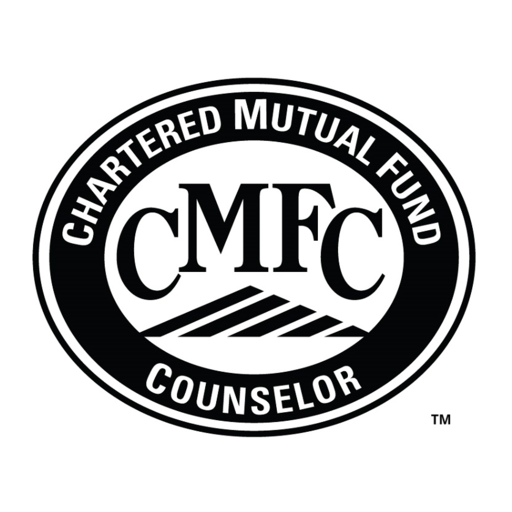

## Table of Contents

## What is a Chartered Mutual Fund Counselor (CMFC)?

A Chartered Mutual Fund Counselor (CMFC) is a professional certification for people who work with mutual funds. It is given by the College for Financial Planning. People who want to become a CMFC need to study and pass an exam. The exam tests their knowledge about mutual funds, how to invest in them, and how to help clients with their investments.

The CMFC program teaches people about different types of mutual funds, how to analyze them, and how to build a good investment plan for clients. It also covers important topics like taxes, retirement planning, and how to talk to clients about their investments. Having a CMFC certification shows that a person has a good understanding of mutual funds and can help clients make smart investment choices.

## What are the primary responsibilities of a CMFC?

A Chartered Mutual Fund Counselor (CMFC) has the main job of helping people invest in mutual funds. They look at different mutual funds and pick the ones that would be good for their clients. They think about what their clients want and need, and then they suggest the best mutual funds to meet those goals. They also keep an eye on how the mutual funds are doing and make changes if needed to keep their clients' investments on track.

Another important part of a CMFC's job is to explain things to their clients in a way that is easy to understand. They talk about how mutual funds work, what the risks are, and how they can help clients reach their financial goals. They also help clients with other things like planning for retirement and figuring out their taxes. By doing all of this, a CMFC helps their clients make smart choices about their money and investments.

## How does one become a Chartered Mutual Fund Counselor?

To become a Chartered Mutual Fund Counselor (CMFC), you need to complete a program offered by the College for Financial Planning. This involves studying a [course](/wiki/best-algorithmic-trading-courses) that covers everything about mutual funds, like how to pick them, what to look for, and how to help clients with their investments. After finishing the course, you have to pass an exam that tests your knowledge on these topics.

The exam is important because it shows that you really understand mutual funds and can help clients make good choices. Once you pass the exam, you get the CMFC certification. This means you can work with clients to help them invest in mutual funds and plan for their financial future.

## What educational background is required to pursue a CMFC designation?

To pursue a CMFC designation, you don't need a specific college degree, but having some education in finance or business can help. The most important thing is to complete the CMFC program offered by the College for Financial Planning. This program teaches you all about mutual funds, how to pick them, and how to help clients with their investments.

After finishing the program, you need to pass an exam. The exam checks if you understand mutual funds well enough to help clients make good choices. Once you pass, you get the CMFC certification, which shows you are ready to work with clients on their investments.

## What is the curriculum like for the CMFC program?

The CMFC program teaches you everything you need to know about mutual funds. It covers different types of mutual funds, like stock funds, bond funds, and funds that mix different investments. You will learn how to pick the best mutual funds for your clients by looking at things like how much they cost, how they have done in the past, and what risks they might have. The program also teaches you how to build a good investment plan that fits what your clients want and need.

Another important part of the CMFC curriculum is learning about other things that affect investments, like taxes and planning for retirement. You will learn how to help your clients with their taxes and how to make sure their investments help them reach their retirement goals. The program also teaches you how to talk to your clients about their investments in a way that is easy for them to understand. By the end of the program, you will know how to help your clients make smart choices about their money and investments.

## How long does it typically take to complete the CMFC certification?

The time it takes to complete the CMFC certification can be different for everyone. It depends on how fast you can study and learn the material. The program usually takes about 6 to 12 months to finish. This includes the time you spend studying and preparing for the exam.

If you already know a lot about finance or investments, you might be able to finish the program faster. But if you are new to these topics, it might take you a bit longer to understand everything. The important thing is to take your time and make sure you really understand the material before you take the exam.

## What are the costs associated with obtaining a CMFC certification?

The cost to get a CMFC certification can change a bit, but you should expect to pay around $1,200 to $1,500 for the whole program. This price includes the study materials, the exam fee, and any other costs that come with the program. It's a good idea to check the latest prices on the College for Financial Planning's website because they might change.

Besides the main cost, you might also have to pay for other things like textbooks or online resources if you need them. Some people also choose to take extra classes or get a tutor to help them study, which can add to the total cost. But these extra costs are not required, so you can decide if you need them based on how well you are doing with your studies.

## What are the continuing education requirements for maintaining a CMFC designation?

To keep your CMFC designation, you need to do continuing education every year. This means you have to take courses to learn more about mutual funds and other things that can help your clients. You need to finish at least 16 hours of continuing education each year. This helps you stay up-to-date with the latest information and rules about mutual funds.

The courses you take for your continuing education can be about different topics, like new types of mutual funds, changes in the law, or better ways to help your clients. You can find these courses from the College for Financial Planning or other places that are approved. By doing this, you make sure you are always ready to give the best advice to your clients and keep your CMFC certification.

## How does a CMFC designation benefit financial advisors and their clients?

A CMFC designation helps financial advisors by showing they know a lot about mutual funds. This makes them more trusted by clients because they can pick the best mutual funds for their needs. Advisors with a CMFC can explain things clearly, so clients understand their investments better. This also helps advisors stand out from others in their field, making it easier to get and keep clients.

For clients, having a financial advisor with a CMFC means they get expert help with their investments. The advisor can create a plan that fits their goals, like saving for retirement or paying less in taxes. Clients feel more confident because their advisor knows a lot about mutual funds and can guide them through the ups and downs of investing. This leads to better choices and a more secure financial future.

## What are the career opportunities available for someone with a CMFC certification?

With a CMFC certification, you can work in many different places in the financial world. You could be a financial advisor at a big bank or an investment firm, helping people pick the best mutual funds for their goals. You might also work at a brokerage, where you help clients buy and sell mutual funds. Another option is to work at a mutual fund company, where you can help create and manage funds for investors.

Besides these, you could also start your own financial planning business. With your CMFC certification, you can show clients that you know a lot about mutual funds and can help them make smart investment choices. This can be a good way to build your own business and help people reach their financial goals. No matter where you work, having a CMFC certification can open up many doors in the finance industry.

## How does the role of a CMFC compare to other financial certifications like CFP or CFA?

A Chartered Mutual Fund Counselor (CMFC) focuses mainly on mutual funds. They learn how to pick the best funds for their clients, understand how funds work, and help with things like retirement planning and taxes. The CMFC program is shorter and more focused than other certifications like the Certified Financial Planner (CFP) or the Chartered Financial Analyst (CFA). It's great for people who want to specialize in mutual funds and help clients with their investments in this area.

A Certified Financial Planner (CFP) looks at a bigger picture of financial planning. They learn about many different parts of money management, like investments, taxes, retirement, and estate planning. The CFP program is more comprehensive and takes longer to complete than the CMFC. It's good for someone who wants to help clients with all parts of their finances. On the other hand, a Chartered Financial Analyst (CFA) focuses on investment analysis and portfolio management. The CFA program is very detailed and covers a wide range of topics in finance and investments. It's perfect for people who want to work in investment analysis or manage big investment portfolios. Each certification has its own focus and can lead to different career paths in the finance world.

## What advanced strategies can a CMFC employ to enhance client portfolios?

A CMFC can use advanced strategies to make their clients' portfolios better. One way is by using asset allocation, which means [picking](/wiki/asset-class-picking) the right mix of different types of investments like stocks, bonds, and cash. By spreading the money across different investments, a CMFC can help lower the risk and maybe get better returns. Another strategy is called rebalancing. This means checking the portfolio regularly and making changes to keep it in line with the client's goals. If one type of investment does really well, it might become too big a part of the portfolio, so the CMFC would sell some of it and buy more of other types to keep things balanced.

Another important strategy is tax-efficient investing. A CMFC can pick mutual funds that help clients pay less in taxes. This can be done by choosing funds that do not pay out a lot of dividends or by using tax-advantaged accounts like IRAs or 401(k)s. Also, a CMFC might use dollar-cost averaging, which means investing a fixed amount of money at regular times, no matter what the market is doing. This can help clients buy more shares when prices are low and fewer when prices are high, which can lead to better long-term results. By using these strategies, a CMFC can help clients reach their financial goals more effectively.

## References & Further Reading

[1]: ["Advances in Financial Machine Learning"](https://www.amazon.com/Advances-Financial-Machine-Learning-Marcos/dp/1119482089) by Marcos Lopez de Prado

[2]: ["Evidence-Based Technical Analysis: Applying the Scientific Method and Statistical Inference to Trading Signals"](https://www.amazon.com/Evidence-Based-Technical-Analysis-Scientific-Statistical/dp/0470008741) by David Aronson

[3]: ["Machine Learning for Algorithmic Trading"](https://github.com/stefan-jansen/machine-learning-for-trading) by Stefan Jansen

[4]: ["Quantitative Trading: How to Build Your Own Algorithmic Trading Business"](https://www.amazon.com/Quantitative-Trading-Build-Algorithmic-Business/dp/1119800064) by Ernest P. Chan