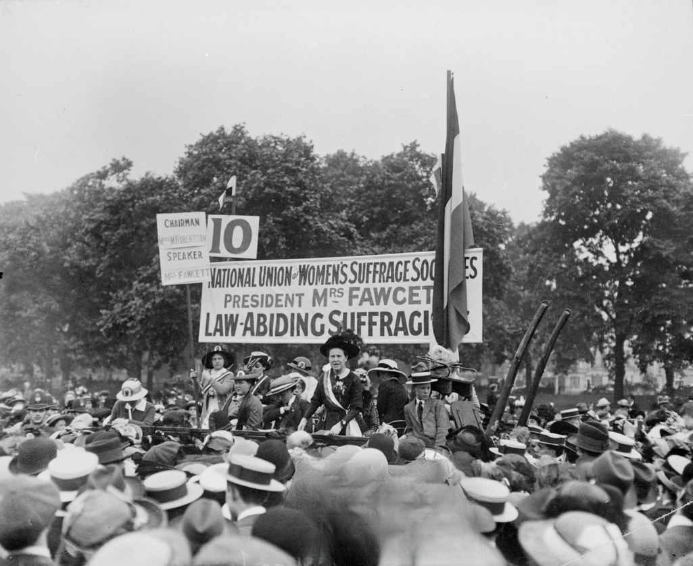

Chartism was a pivotal political movement in 19th century Britain that emerged as a response to the stark economic inequalities faced by the working class. Chartists championed for political reforms that promised greater democracy and representation, with key demands including universal male suffrage, secret ballots, and the establishment of annual parliaments. The movement gained traction through a series of organized meetings, mass petitions, and public demonstrations, serving as a powerful voice against the entrenched systems of power.

In contrast to the political upheavals of the 19th century, the modern era has witnessed the rise of algorithmic trading, a technologically driven approach to financial markets. Algorithmic trading involves the use of complex algorithms and computational models to analyze data and execute trading decisions. This form of trading operates on principles of speed, precision, and data analysis, significantly transforming traditional trading methodologies.



This article will explore the intriguing evolution of Chartism and highlight its unexpected connection to the principles underpinning modern algorithmic trading. While separated by time and domain, both Chartism and algorithmic trading embody systematic approaches to achieving their respective goals—be it social reform or financial gain. The analytical nature inherent in algorithmic trading, relying on data-driven decisions, mirrors the Chartists' reliance on observations and patterns to advocate for change.

By analyzing these connections, we seek to understand how historical movements like Chartism have influenced and paved the way for contemporary socio-economic practices, including automated trading systems. Such an analysis provides valuable insights into how the legacies of past movements continue to manifest in today's technological and financial sectors.

## Table of Contents

## Understanding Chartism

Chartism emerged in the 1830s in Britain, representing a concerted response to the pronounced economic inequalities and political disenfranchisement experienced by the working class. This movement was rooted in the quest for a more equitable society and aimed to address the severe social grievances of the time.

At the heart of Chartism were the People's Charter of 1838 and its six main demands, which sought substantial political reform. These demands included universal male suffrage, the secret ballot for elections, and the establishment of annual parliaments to ensure greater accountability. Additionally, the Charter called for the abolition of property qualifications for Members of Parliament (MPs), payment for MPs to allow wider participation in governance, and equal electoral districts to address disparities in representation (Thompson, D. (1984). *The Chartists: Popular Politics in the Industrial Revolution*. Pantheon Books).

Despite facing considerable resistance from the authorities and upper classes, Chartism profoundly influenced the British political landscape. The movement was characterized by its inclusive nature, bringing together diverse groups from different regions. Chartist activists organized large-scale meetings, demonstrations, and conventions, through which they mobilized public support. They utilized petitions as a strategic tool to communicate their demands directly to Parliament, with some of these petitions gathering millions of signatures.

The Chartists' efforts were met with repression, including arrests, trials, and imprisonments of key leaders, as well as violent confrontations, such as the Newport Rising of 1839. Despite these challenges, the persistence of Chartism played a critical role in gradually pushing through reforms, laying the groundwork for future legislative changes. The demand for voting rights and democratic representation eventually saw fulfillment in various forms through subsequent reforms in the late 19th and early 20th centuries.

In essence, Chartism was defined by its systemic advocacy for change and its pioneering methods of mass mobilization and petitioning. This movement not only amplified the voices of the disenfranchised but also set a precedent for future social and political activism, influencing subsequent generations in their struggle for civil rights and equal opportunities.

## Key Figures and Events in Chartism

William Lovett and Feargus O’Connor are two of the foremost figures associated with the Chartist movement, which emerged in response to the widespread socio-economic inequality of early 19th century Britain. William Lovett, a cabinet maker by trade, played a vital role in crafting the People's Charter, the central document of the movement that outlined the six key demands believed to be essential for political reform: universal male suffrage, secret ballots, annual parliaments, equal electoral districts, abolition of property qualifications for Parliament members, and payment for MPs. Lovett was known for his moderate stance, believing in moral force rather than physical force, to achieve political goals [1].

Feargus O’Connor, in contrast, was a more radical advocate and the charismatic leader of the movement's physical force faction. An Irishman by birth, O'Connor was instrumental in popularizing Chartism across England through his fiery speeches and his editorship of the Northern Star, the voice of the Chartist movement. O’Connor’s passionate rhetoric and use of mass mobilization were critical in drawing widespread support from the working class, although his approach often led to divisions within the movement [2].

Among the notable events in Chartism were the Newport Rising of 1839 and the mass petitions submitted to the British parliament. The Newport Rising, which took place in South Wales, was a pivotal yet tragic event where around 10,000 Chartists, led by John Frost, marched to demand the release of fellow Chartists. This confrontation resulted in a violent clash, leading to over 20 fatalities as government troops fired on the crowd [3]. This uprising highlighted the tensions and the desperation felt by many of its supporters, even though it was ultimately suppressed.

The Chartists also sought to leverage political mechanisms by presenting petitions to parliament, the most significant being in 1839, 1842, and 1848. Despite collecting millions of signatures, these petitions were rejected, largely due to the conservative nature of the political institutions of the time. The rejection of the 1848 petition, amid widespread political upheaval in Europe, marked the pinnacle of Chartist activism, with subsequent efforts waning due to the lack of immediate success and shifting economic conditions in Britain [4].

While the formal [momentum](/wiki/momentum) of Chartism declined after 1848, due in part to the economic improvements that diminished some of its urgent grievances, its influence endured. The gradual implementation of several of its demands in the subsequent decades attests to the lasting impact of Chartist advocacy on the British political system [5].

**References**:
1. Chase, M. (2007). "Chartism: A New History". Manchester University Press.
2. Epstein, J. (1982). "The Lion of Freedom: Feargus O'Connor and the Chartist Movement 1832–1842." Croom Helm.
3. Jones, D.J.V. (1985). "The Last Rising: The Newport Insurrection of 1839". Oxford University Press.
4. Taylor, M. (1995). "The Decline of British Radicalism, 1847–1860". Oxford Historical Monographs.
5. Pickering, P.A., & Tyrell, A. (2010). "The People's Bread: A History of the Anti-Corn Law League". Bloomsbury Academic.

## The Rise of Algorithmic Trading

Algorithmic trading, commonly referred to as 'algo trading', employs computer algorithms to execute trades at speeds and frequencies that are impossible for human traders. The approach uses complex mathematical models and statistical analyses to determine trading decisions. At its core, [algorithmic trading](/wiki/algorithmic-trading) is data-driven, utilizing historical market data to forecast future price movements. This analytical methodology resonates with the principles of Chartism, wherein data on social and economic patterns were instrumental in advocating for reforms.

The foundation of algorithmic trading lies in its systematic and repetitive nature, allowing for the execution of numerous trades in a fraction of a second. This capability is harnessed through high-frequency trading ([HFT](/wiki/high-frequency-trading-strategies)), which takes advantage of minimal price fluctuations and executes trades rapidly. The efficiency of algorithmic trading is heightened by leveraging historical data, often using concepts like mean reversion, momentum, or statistical [arbitrage](/wiki/arbitrage).

For example, a simple algorithmic trading strategy could involve the moving average crossover, where a program is designed to monitor two moving averages—a short-term and a long-term one. The trigger for buy/sell signals occurs when the short-term average crosses above or below the long-term average. The pseudo-code in Python might look something like this:

```python
import pandas as pd

def moving_average_crossover_strategy(prices, short_window, long_window):
    signals = pd.DataFrame(index=prices.index)
    signals['price'] = prices
    signals['short_mavg'] = prices.rolling(window=short_window, min_periods=1).mean()
    signals['long_mavg'] = prices.rolling(window=long_window, min_periods=1).mean()
    signals['signal'] = 0.0  
    signals['signal'][short_window:] = np.where(signals['short_mavg'][short_window:] > signals['long_mavg'][short_window:], 1.0, 0.0)     
    signals['positions'] = signals['signal'].diff()

    return signals
```

This algorithm looks for buy signals when the short moving average surpasses the long moving average, illustrating the basic principles of trend-following systems in algorithmic trading.

With the advancements in technology and access to extensive data, algorithmic trading has become an integral component of modern financial markets, often eclipsing traditional manual methods. The automation of trading operations reduces human error, increases efficiency, and allows traders to exploit opportunities around the clock without needing continuous human presence. These automated systems are equipped to analyze vast amounts of market data, identify trading signals, and execute transactions autonomously, reflecting a significant shift in market dynamics. 

The impact of algorithmic trading is profound, influencing market [liquidity](/wiki/liquidity-risk-premium) and price discovery processes. It reshapes the traditional landscape of financial trading and continues to evolve with advancements in [machine learning](/wiki/machine-learning) and [artificial intelligence](/wiki/ai-artificial-intelligence), further emboldening its capability to process complex datasets for deriving valuable market insights.

## Parallels Between Chartism and Algorithmic Trading

Both Chartism and algorithmic trading utilize structured methodologies to realize their respective aims—Chartism for political reform and algorithmic trading for financial profit. Chartism, a socio-political movement of the 19th century, was grounded in the pursuit of systematic change through precise organization and mobilization. Its leaders emphasized logistic planning, visible in their organized protests, petitions, and demands for systemic political change. The movement was driven by the need to analyze and respond to socio-economic patterns, much like modern data analytics.

Algorithmic trading inherits a similar systematic approach, though applied to the financial markets. It employs data-driven algorithms to analyze historical price movements, optimize trading strategies, and execute trades automatically. This method heavily relies on pattern recognition and statistical analysis, akin to the structured advocacy seen in Chartism. Algorithmic traders use historical data to predict future market trends, optimizing for efficiency and accuracy, much like how Chartists advocated for changes based on patterns of social and political inequity.

Technological advancements have finessed these systemic principles, transforming them to suit contemporary contexts. The introduction of high-frequency trading, powered by sophisticated computer algorithms, exemplifies this evolution. Python code, for example, has become integral in developing and executing trading strategies due to its robust libraries like NumPy for numerical analysis and pandas for data manipulation. Here is a basic example of how Python can be used to analyze trading data:

```python
import pandas as pd
import numpy as np

# Load historical price data
data = pd.read_csv('price_data.csv')  
prices = data['Close']

# Calculate moving average as a simple indicator
window_size = 20
moving_average = prices.rolling(window=window_size).mean()

# Trading strategy based on moving average crossover
buy_signals = np.where(prices > moving_average, 1, 0)

print("Buy signals based on moving average strategy:", buy_signals)
```

In this manner, both Chartism and algorithmic trading are characterized by their reliance on systematic, data-driven approaches to problem-solving. While Chartists aimed to reshape societal structures using the data available to them, algorithmic trading leverages vast amounts of financial data to refine and optimize trading strategies. The evolution from social advocacy to automated financial trading illustrates the enduring relevance of structured, analytical methods in achieving diverse objectives.

## Conclusion

Chartism laid down foundational principles of equality and systemic reform that echo in modern practices such as algorithmic trading. The Chartist movement's emphasis on universal suffrage and equal representation set a precedent for inclusion and accessibility that resonates with the democratization seen in today's financial markets. Just as the Chartists sought to dismantle barriers to political participation, algorithmic trading has lowered entry barriers in financial markets, allowing a broader range of participants to engage effectively.

Understanding historical movements like Chartism offers valuable insights into contemporary innovations and societal advancements. The systematic and data-driven approach of the Chartists mirrors the methodologies employed in algorithmic trading today. This movement's reliance on structured advocacy and organized petitions parallels the precision and strategy required in automated trading systems.

The legacy of the Chartist movement manifests in the democratization and technological advancements within financial markets. Algorithmic trading capitalizes on technological progress to optimize trading efficiency, ensure transparency, and foster competitive participation, echoing the Chartists' pursuit of fairness and reform. As the financial industry continues to evolve, the principles of equality and systematic change championed by Chartism serve as guiding beacons, influencing the ongoing transformation towards more inclusive and technologically sophisticated markets.

## References & Further Reading

[1]: Chase, M. (2007). *Chartism: A New History*. Manchester University Press.

[2]: Epstein, J. (1982). *The Lion of Freedom: Feargus O'Connor and the Chartist Movement 1832–1842*. Croom Helm.

[3]: Jones, D.J.V. (1985). *The Last Rising: The Newport Insurrection of 1839*. Oxford University Press.

[4]: Taylor, M. (1995). *The Decline of British Radicalism, 1847–1860*. Oxford Historical Monographs.

[5]: Pickering, P.A., & Tyrell, A. (2010). *The People's Bread: A History of the Anti-Corn Law League*. Bloomsbury Academic.

[6]: Lopez de Prado, M. (2018). *Advances in Financial Machine Learning*. Wiley.

[7]: Aronson, D. (2006). *Evidence-Based Technical Analysis: Applying the Scientific Method and Statistical Inference to Trading Signals*. Wiley.

[8]: Jansen, S. (2018). *Machine Learning for Algorithmic Trading*. Packt Publishing.

[9]: Chan, E. P. (2008). *Quantitative Trading: How to Build Your Own Algorithmic Trading Business*. Wiley.