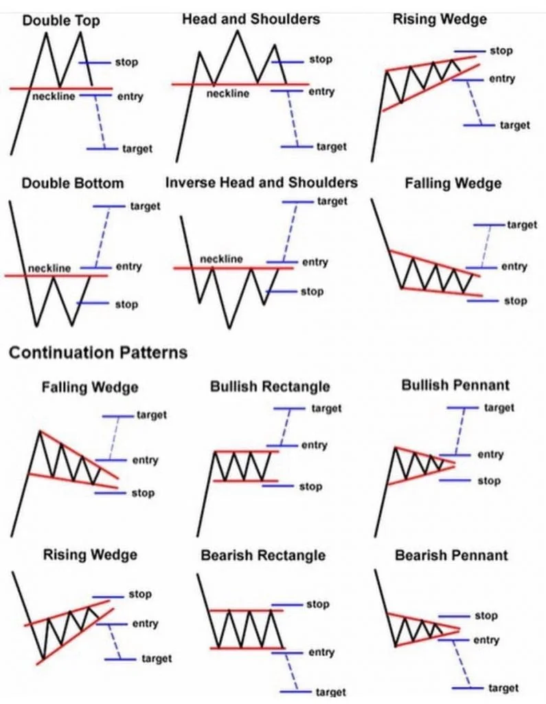

## Table of Contents

## What is Chartism in trading?

Chartism in trading is a method where traders use charts to predict how prices of things like stocks or currencies will move. They look at past price movements and patterns on charts to guess what might happen next. This approach is also called technical analysis. Traders who use chartism believe that all the information they need is shown in the price movements on the charts, so they don't need to look at other things like news or company reports.

The main idea behind chartism is that history tends to repeat itself. So, if traders can spot a pattern that has happened before, they think it might happen again. They use different tools and shapes, like lines and waves, to find these patterns. Some common patterns they look for are called "head and shoulders" or "double tops." By studying these charts, traders try to decide the best times to buy or sell, hoping to make a profit from their predictions.

## How did Chartism originate and evolve over time?

Chartism started a long time ago, around the 1800s. People back then noticed that prices of things like stocks and commodities seemed to follow certain patterns. One of the first people to write about this was Charles Dow. He created the Dow Theory, which is a big part of chartism. Dow thought that by looking at the price movements over time, you could guess what might happen next. This idea caught on, and more people started using charts to trade.

Over the years, chartism grew and changed. More and more tools were invented to help traders see patterns better. Things like moving averages, which smooth out price data, and indicators like the Relative Strength Index (RSI) were developed. These tools made it easier for traders to spot trends and decide when to buy or sell. Today, chartism is a big part of what's called technical analysis, and it's used all over the world by traders on computers and smartphones. Even though it's much more advanced now, the basic idea is still the same: looking at past prices to predict the future.

## What are the basic principles of Chartism?

The basic principles of Chartism, or technical analysis, are all about looking at charts to figure out where prices might go next. The main idea is that everything you need to know about a stock or a currency is shown in its price movements. Chartists believe that prices move in patterns that repeat over time. So, if you can spot a pattern that's happened before, you might be able to predict what will happen next. This is based on the idea that market behavior is influenced by human emotions like fear and greed, which tend to create the same kinds of patterns again and again.

Another important principle is that the market discounts everything. This means that all the news, events, and other information about a stock or currency are already reflected in its price. So, chartists don't need to look at news reports or company earnings; they just focus on the charts. They use different tools, like trend lines and indicators, to help them see these patterns more clearly. By understanding these basic principles, chartists try to make better trading decisions and hopefully make a profit.

## What are the most common chart patterns used in Chartism?

In Chartism, traders often look for certain patterns on charts to help them predict what might happen next. Some of the most common patterns are called head and shoulders, double tops and bottoms, and triangles. The head and shoulders pattern looks like a head with two shoulders on either side. It usually means that the price might go down soon. Double tops and bottoms look like the letter "M" or "W." A double top means the price might go down, while a double bottom means it might go up. Triangles can be ascending, descending, or symmetrical, and they show that the price might break out soon, either up or down.

Another popular pattern is the flag and pennant. These patterns look like small rectangles or tiny triangles that come after a big move in price. They usually mean that the price will keep moving in the same direction as before, but a bit slower. Cup and handle patterns look like a cup with a small handle on the side. They often mean that the price will go up soon. These patterns help traders see what the market might do next, but they're not perfect. Traders use them along with other tools to make the best guesses about where prices are headed.

## How can a beginner start applying Chartism in their trading?

To start using Chartism in trading, a beginner should first get familiar with reading charts. Charts show how the price of something, like a stock or currency, changes over time. You can find these charts on many trading websites and apps. Start by looking at simple line charts, which are easy to understand. They just show the price moving up and down over time. Once you're comfortable with that, try looking at bar charts or candlestick charts, which give you more information about the price changes during each time period. Practice spotting patterns like head and shoulders, double tops and bottoms, and triangles on these charts. The more you practice, the better you'll get at recognizing these patterns.

Next, learn about some basic tools that can help you see these patterns more clearly. Moving averages are one of the simplest tools to start with. They smooth out the price data and can help you see the overall trend. You can also try using indicators like the Relative Strength Index (RSI), which can tell you if a stock is overbought or oversold. Don't rush into trading right away. Start by watching the market and practicing with a demo account where you can trade without using real money. This way, you can see how well your predictions work without risking any money. As you get more confident, you can start making small trades and gradually increase your involvement. Remember, Chartism is not perfect, and it's important to keep learning and adjusting your strategies as you go.

## What are the key tools and indicators used in Chartist analysis?

In Chartist analysis, traders use a few key tools to help them read charts and make predictions. One of the most basic tools is the moving average, which smooths out price data to show the overall trend. Traders often use two moving averages, a short-term one and a long-term one, to see when they cross each other. This crossing can signal a good time to buy or sell. Trend lines are another simple tool. They're just lines drawn on the chart to show the direction of the price. If the price keeps going up and touching the line, it might keep going up. If it keeps going down and touching the line, it might keep going down.

Indicators are also very important in Chartist analysis. The Relative Strength Index (RSI) is a popular one. It measures how fast the price is going up or down and tells you if a stock is overbought or oversold. If the RSI is over 70, the stock might be overbought and could go down soon. If it's under 30, it might be oversold and could go up soon. The Moving Average Convergence Divergence (MACD) is another useful indicator. It shows the relationship between two moving averages and can help you see when the trend might be changing. By using these tools and indicators together, traders can make better guesses about where the price might go next.

## How does Chartism differ from other forms of technical analysis?

Chartism is a type of technical analysis that focuses on looking at patterns in price charts to predict future price movements. It's all about studying the shapes and lines on the charts, like head and shoulders or triangles, to guess what the market might do next. Chartists believe that all the important information about a stock or currency is already shown in its price movements, so they don't need to look at other things like news or company reports. They use tools like moving averages and trend lines to help them see these patterns better.

While Chartism is a part of technical analysis, other forms of technical analysis might use more complex math or computer programs to make predictions. For example, some traders use quantitative analysis, which involves lots of numbers and calculations to find patterns. Others might use algorithmic trading, where computers follow set rules to buy and sell automatically. Chartism is simpler and more about looking at the charts with your own eyes, while these other methods often rely on more advanced technology and math.

## What are the strengths and limitations of using Chartism in trading?

Chartism is great for traders because it's easy to use and doesn't need fancy tools or math. You just look at the charts to spot patterns like head and shoulders or triangles. This can help you guess where the price might go next. It's also good for all kinds of markets, like stocks, currencies, or commodities. Plus, it's quick to learn, so even beginners can start using it without a lot of training. Many traders like it because it focuses on what the market is actually doing, not just what people think or say.

But Chartism has some problems too. It's not always right because patterns don't always mean the same thing every time. Sometimes, the price can do something totally different from what the pattern says. Also, it can be hard to spot the right patterns, especially when the market is moving fast. Chartism doesn't look at other important things like news or company reports, which can also affect prices. So, it's best to use Chartism along with other ways of looking at the market to make the best guesses about what might happen next.

## How can advanced Chartists refine their strategies for better performance?

Advanced chartists can refine their strategies by combining different chart patterns and indicators to get a clearer picture of the market. Instead of relying on just one pattern, like a head and shoulders, they can look at several patterns at once. For example, they might use a head and shoulders pattern along with a moving average crossover to confirm a trend. By using more than one tool, they can make more accurate predictions about where the price might go next. They can also try different time frames, like looking at both daily and weekly charts, to see if the patterns match up. This can help them feel more confident in their trading decisions.

Another way advanced chartists can improve is by keeping a trading journal. This means writing down all their trades, including what patterns they saw and what happened next. By looking back at their journal, they can see which patterns worked well and which ones didn't. This helps them learn from their mistakes and get better over time. They can also use backtesting, which means trying out their strategies on old price data to see how they would have worked in the past. This can give them a good idea of what might work in the future. By always learning and adjusting their strategies, advanced chartists can keep getting better at predicting the market.

## What role does psychology play in Chartism and how can it be managed?

Psychology is a big part of Chartism because it's all about how people feel when they trade. When traders see certain patterns on the charts, they might feel excited or scared. These feelings can make them want to buy or sell too quickly, without thinking it through. Chartism is based on the idea that these feelings make the same patterns happen again and again. So, understanding how emotions affect trading can help chartists make better guesses about where the price might go next.

To manage psychology in Chartism, traders need to stay calm and not let their feelings control their decisions. One way to do this is by having a trading plan and sticking to it, no matter what the market does. This means deciding ahead of time when to buy or sell and how much money to risk. It's also helpful to take breaks and not trade all the time. This can keep traders from getting too excited or too worried. By controlling their emotions, chartists can make smarter choices and do better in the long run.

## How can Chartism be integrated with other trading methodologies for a holistic approach?

Chartism can be used with other trading methods to make a complete plan that looks at the market from different angles. For example, chartists can use fundamental analysis, which looks at things like company earnings and economic reports, to get a better idea of what's going on. By combining chart patterns with this information, traders can see if the price movements make sense with what's happening in the real world. They might also use quantitative analysis, which uses math and numbers to find patterns. This can help confirm the patterns they see on the charts and make their predictions more accurate.

Another way to mix Chartism with other methods is by using algorithmic trading. This means using computer programs to follow set rules for buying and selling. Chartists can program these rules based on the patterns they see, and the computer can do the trading automatically. This can help take the emotion out of trading and make sure the plan is followed exactly. By using Chartism along with other ways of looking at the market, traders can make better decisions and have a more complete understanding of what might happen next.

## What are some case studies or examples where Chartism significantly impacted trading outcomes?

One famous example of Chartism impacting trading outcomes is the story of Jesse Livermore. He was a stock trader in the early 1900s who used chart patterns to make big profits. Livermore became famous for spotting a head and shoulders pattern in the stock market just before the 1929 crash. He noticed that the price was making lower highs and lower lows, which told him the market was going to fall. By using Chartism, he was able to short sell stocks before the crash and make a lot of money while many others lost everything. This shows how understanding chart patterns can help traders make big moves at the right time.

Another example is the use of Chartism by George Soros in his famous bet against the British pound in 1992. Soros and his team at Quantum Fund used chart patterns to see that the pound was overvalued and likely to fall. They noticed a double top pattern, which suggested the price might go down soon. By using this pattern along with other economic indicators, Soros made a huge trade that earned him over a billion dollars in one day. This case shows how combining Chartism with other analysis can lead to very successful trades. It also shows that even big investors use chart patterns to guide their decisions.

## References & Further Reading

[1]: Chase, M. (2007). *Chartism: A New History*. Manchester University Press.

[2]: Epstein, J. (1982). *The Lion of Freedom: Feargus O'Connor and the Chartist Movement 1832–1842*. Croom Helm.

[3]: Jones, D.J.V. (1985). *The Last Rising: The Newport Insurrection of 1839*. Oxford University Press.

[4]: Taylor, M. (1995). *The Decline of British Radicalism, 1847–1860*. Oxford Historical Monographs.

[5]: Pickering, P.A., & Tyrell, A. (2010). *The People's Bread: A History of the Anti-Corn Law League*. Bloomsbury Academic.

[6]: Lopez de Prado, M. (2018). *Advances in Financial Machine Learning*. Wiley.

[7]: Aronson, D. (2006). *Evidence-Based Technical Analysis: Applying the Scientific Method and Statistical Inference to Trading Signals*. Wiley.

[8]: Jansen, S. (2018). *Machine Learning for Algorithmic Trading*. Packt Publishing.

[9]: Chan, E. P. (2008). *Quantitative Trading: How to Build Your Own Algorithmic Trading Business*. Wiley.