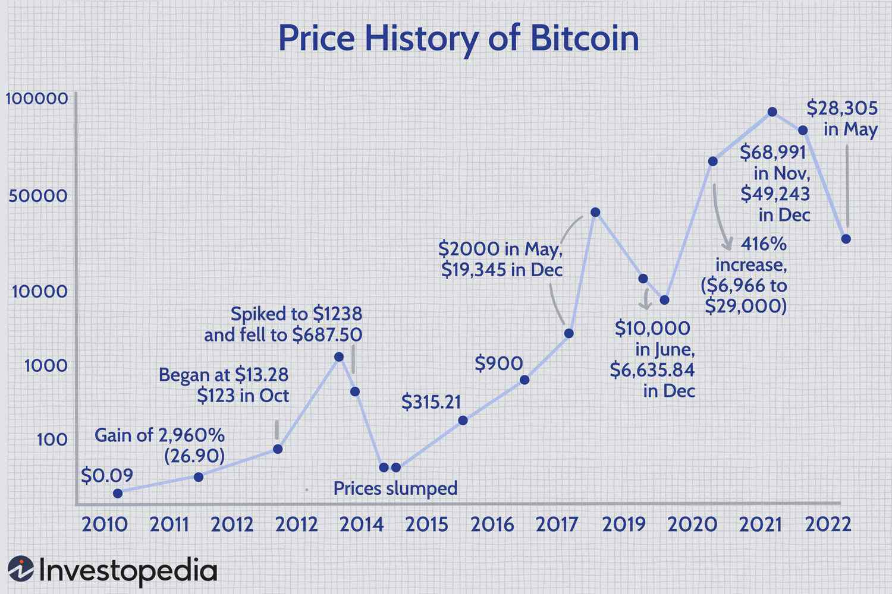

Cryptocurrency trading has emerged as an exciting opportunity for investors seeking high returns, driven by the potential for significant profit in a relatively short timeframe. The dynamic nature of the crypto market, characterized by high volatility and rapid price fluctuations, means that proper analysis and decision-making tools are essential for navigability and success. This necessitates a structured approach to crypto analysis, the backbone of informed trading decisions.

Crypto analysis is fundamentally about deciphering the market through various methodologies and tools. It involves studying different types of charts to track price movements, trends, and patterns, providing a visual representation of market data that is crucial for predicting future price directions. Additionally, employing algorithms further refines this analytical process, allowing traders to make data-driven decisions rather than relying solely on gut instinct or emotion.



This article delves into various approaches to crypto analysis, emphasizing the significance of investment charts, which serve as indispensable instruments for visualizing historical and real-time market data. Moreover, it explores the role of algorithmic trading within the cryptocurrency space, where strategically designed algorithms execute trades at optimal times based on preset conditions. Together, these analytical tools enable traders to engage with the market confidently, seeking to maximize their returns while managing risks effectively.

## Table of Contents

## Understanding Cryptocurrency Investment Charts

Cryptocurrency investment charts are essential tools that enable traders to track and visualize the performance of digital assets over time. These charts facilitate a detailed understanding of price movements and assist in the identification of trading patterns. By providing a graphical representation of historical price data, they help investors make informed decisions based on observable trends and information.

There are several types of charts commonly used in cryptocurrency trading, each serving distinct purposes and catering to varying analytic needs. Line charts, bar charts, and candlestick charts are among the most popular formats.

**Line Charts** are the simplest form of investment charts, plotting a line across a series of closing prices over a specified period. This format offers a straightforward visual of the overall price trend, making it particularly useful for a quick assessment of the general direction of the market. However, line charts may lack detailed information, such as opening, high, and low prices within the same timeframe.

**Bar Charts** offer more information than line charts. Each bar in the chart represents a specific time period and displays the open, high, low, and close prices. The top of the vertical bar represents the highest price during the period, and the bottom shows the lowest price. The closing price is typically denoted with a horizontal line on the right side of the bar, while the opening price is marked similarly on the left. This format provides a fuller picture of market dynamics, enabling traders to identify potential price swings and volatility.

**Candlestick Charts** are widely favored for their detailed visual information and aesthetic appeal, similar to bar charts. Each candlestick represents a specific time period, with the rectangular body showing the difference between the opening and closing prices. If the closing price is higher than the opening price, the candlestick is often colored green or white, indicating a bullish period. Conversely, if the closing price is lower, the candlestick is colored red or black, denoting a bearish period. The wicks or shadows of the candlestick reflect the high and low prices within the period, offering comprehensive insight into price action and potential trend reversals.

Selecting the appropriate chart type depends on an investor's specific strategy and the information they aim to obtain from historical data. Traders focusing on trends might prefer line charts for their clarity and simplicity, while those seeking a deeper understanding of market behavior might find the detailed view of candlestick or bar charts more beneficial.

Ultimately, a successful trading strategy often involves integrating insights from various charts, tailored to individual preferences and analytic objectives. By mastering these visual tools, investors can enhance their ability to forecast market movements and effectively manage their portfolios in the volatile [cryptocurrency](/wiki/cryptocurrency) landscape.

## Technical Analysis in Crypto Markets

Technical analysis involves examining historical price movements to predict future price trends, and it applies equally to cryptocurrencies, stocks, and commodities. Traders utilize this method to identify opportunities by analyzing charts and employing technical indicators that provide insights into market dynamics.

One primary tool for technical analysis in crypto markets is the Moving Average Convergence Divergence (MACD) indicator. MACD is a trend-following [momentum](/wiki/momentum) indicator that illustrates the relationship between two moving averages of a security’s price. It comprises two components: the MACD line, which is derived by subtracting the 26-period Exponential Moving Average (EMA) from the 12-period EMA, and the signal line, a 9-period EMA of the MACD line. Traders often look for MACD crossovers as potential buy or sell signals. A formula for the MACD line is:

$$
\text{MACD} = \text{EMA}_{12} - \text{EMA}_{26}
$$

Another widely-used tool is the Relative Strength Index (RSI), a momentum oscillator that measures the speed and change of price movements. RSI scales from 0 to 100, with readings above 70 typically indicating an overbought condition and readings below 30 suggesting an oversold state. The RSI formula is given by:

$$
\text{RSI} = 100 - \left( \frac{100}{1 + \frac{\text{Average Gain}}{\text{Average Loss}}} \right)
$$

Bollinger Bands, comprising a middle band (a simple moving average) and two outer bands (standard deviations above and below the middle band), are used to detect [volatility](/wiki/volatility-trading-strategies) and overbought or oversold conditions. When the price nears the upper band, the security is considered overbought; nearing the lower band signals an oversold condition.

Effective technical analysis also involves identifying support and resistance levels. Support is a price level where a downtrend can pause due to demand concentration, whereas resistance is a price level where a rising trend can pause due to selling pressure. Recognizing these levels helps traders make decisions about entry and [exit](/wiki/exit-strategy) points.

Identifying market trends, whether upward, downward, or sideways, is fundamental to successful technical analysis. Trend lines, drawn over highs and lows, assist in visualizing the market direction. Combining trend analysis with technical indicators enhances prediction accuracy and strategic decision-making.

Overall, technical analysis provides a systematic approach to understanding price action and market sentiment, critical for traders navigating the volatile cryptocurrency markets.

## Algorithmic Trading in Cryptocurrency

Algorithmic trading in cryptocurrency refers to the employment of computer algorithms to conduct trading activities at optimal times, based on predefined conditions and quantitative models. This approach capitalizes on the high volatility and 24/7 operating hours of the cryptocurrency markets, facilitating strategies such as high-frequency trading and [arbitrage](/wiki/arbitrage) that benefit from rapid price fluctuations and market inefficiencies.

At the core of [algorithmic trading](/wiki/algorithmic-trading) is the ability to analyze large datasets and identify trading opportunities faster than a human trader ever could. Algorithms can be designed to recognize patterns, compute complex statistical analyses, and execute trades precisely when the criteria are met. This process eliminates emotional decision-making, a common pitfall in manual trading.

The key to effective algorithmic trading lies in developing models that can accurately predict future price movements. Strategies often involve quantitative techniques such as [statistical arbitrage](/wiki/statistical-arbitrage), which samples historical price data to exploit price discrepancies between cryptocurrencies. For example, if a pricing anomaly is detected between Bitcoin and Ethereum across different exchanges, algorithms can engage in arbitrage - simultaneously buying low on one exchange and selling high on another.

Algorithmic trading thrives on the [liquidity](/wiki/liquidity-risk-premium) and fragmentation of the crypto market. High-frequency trading ([HFT](/wiki/high-frequency-trading-strategies)) specifically takes advantage of minor price movements within short timeframes. HFT algorithms execute millions of transactions per second to capture these opportunities. Here's a simple Python example that outlines what an HFT strategy might look like:

```python
import ccxt  # Cryptocurrency Exchange Trading Library
import time

exchange = ccxt.binance()  # Connect to the Binance exchange

while True:
    order_book = exchange.fetch_order_book('BTC/USDT')  # Fetch market data
    bid_price = order_book['bids'][0][0]
    ask_price = order_book['asks'][0][0]

    spread = ask_price - bid_price

    if spread > 0.01:  # Check if the spread meets criteria
        amount = 1.0  # Trade amount
        exchange.create_limit_buy_order('BTC/USDT', amount, bid_price)
        exchange.create_limit_sell_order('BTC/USDT', amount, ask_price)

    time.sleep(1)  # Execute the strategy every second
```

This script uses the `ccxt` library to connect to Binance, fetches the [order book](/wiki/order-book-trading-strategies) for the BTC/USDT trading pair, and places buy and sell orders if the spread is greater than a certain threshold. Such a strategy, although simplified here, is indicative of how HFT algorithms might operate to exploit minute price advantages.

Investors often use trading bots and automated systems to enhance their trading efficiency and capture both short-term gains and arbitrage opportunities. These systems are designed to operate seamlessly within the market structure, handling large volumes of transactions without fatigue or emotional bias.

In conclusion, algorithmic trading offers significant advantages in navigating the volatile crypto market. By utilizing advanced computer algorithms, investors can execute precise trading strategies that optimize returns on investment and mitigate the risk of human error.

## Popular Crypto Analysis Tools

Trading platforms such as TradingView, Coinigy, and Kraken Pro are pivotal in the world of cryptocurrency by offering advanced tools that facilitate comprehensive market analysis. These platforms equip traders with real-time charts, technical indicators, and extensive market data, all of which are essential for making well-informed trading decisions.

TradingView is renowned for its user-friendly interface and extensive library of indicators, which caters to both novice and experienced traders. The platform supports a community-driven environment where users can create, share, and employ custom scripts using the Pine Script programming language. This flexibility allows traders to tailor technical indicators to suit their distinct strategies and preferences.

Coinigy, another significant player in cryptocurrency analysis, aggregates data from various exchanges, providing a unified interface for technical analysis. One of Coinigy's standout features is its extensive API support, which enables developers to build and integrate bespoke trading solutions. Additionally, Coinigy offers a portfolio management system, allowing traders to keep track of their assets across multiple exchanges and wallets through a single platform.

Kraken Pro focuses on offering an enriched trading experience through its robust set of charting tools and technical indicators. Kraken Pro is particularly advantageous for users of the Kraken exchange, as it offers seamless integration and access to advanced order types and margin trading features. This integration ensures that traders can efficiently execute their strategies without the need to navigate multiple platforms.

The choice of which tool to use greatly depends on individual user preferences and specific trading strategies. Factors such as ease of use, customization options, exchange integration, and cost considerations play a critical role in determining which platform best meets a trader's needs. Whether a trader opts for TradingView's community features, Coinigy's API capabilities, or Kraken Pro's exchange integration, selecting the right tool can significantly enhance the ability to perform thorough crypto analysis and optimize trading outcomes.

## Conclusion

The dynamic nature of cryptocurrency markets necessitates investors to adopt robust analysis techniques and tools to optimize their trading strategies. Markets characterized by high volatility and rapid shifts in sentiment can either amplify gains or exacerbate losses. Consequently, employing systematic approaches is vital for managing risk and capitalizing on market opportunities.

Technical analysis and algorithmic trading serve as powerful methods in this regard, enabling traders to base decisions on data rather than emotions. Technical analysis involves a thorough study of price movements and patterns, aided by indicators like Moving Average Convergence Divergence (MACD), Relative Strength Index (RSI), and Bollinger Bands. These tools help in discerning market trends, support, and resistance levels, providing a framework within which traders can navigate the unpredictable crypto landscape.

Algorithmic trading further augments this capability by automating decision-making processes. With algorithms, trades can be executed at optimal times, based on predefined criteria. This is particularly advantageous given the crypto market's round-the-clock nature, ensuring that trading opportunities are not missed due to human limitations. Algorithms can also manage high-frequency trading and arbitrage strategies, potentially enhancing profitability by leveraging minute market inefficiencies.

Lastly, the adept use of investment charts and technical indicators is indispensable for any successful cryptocurrency trader. Charts such as line, bar, and candlestick not only offer a visual representation of price movements but also help in identifying patterns and trends. Selecting the appropriate type of chart correlates with the trader's strategy and the specific insights they aim to derive from historical data.

In summary, success in cryptocurrency trading hinges on strategic application of technical analysis and algorithmic trading, supported by well-interpreted investment charts. These tools together empower traders to make informed, data-driven decisions, effectively managing risks and capitalizing on potential gains in an ever-evolving market environment.

## References & Further Reading

[1]: Bergstra, J., Bardenet, R., Bengio, Y., & Kégl, B. (2011). ["Algorithms for Hyper-Parameter Optimization."](https://dl.acm.org/doi/10.5555/2986459.2986743) Advances in Neural Information Processing Systems 24.

[2]: ["Advances in Financial Machine Learning"](https://www.amazon.com/Advances-Financial-Machine-Learning-Marcos/dp/1119482089) by Marcos Lopez de Prado

[3]: ["Evidence-Based Technical Analysis: Applying the Scientific Method and Statistical Inference to Trading Signals"](https://www.amazon.com/Evidence-Based-Technical-Analysis-Scientific-Statistical/dp/0470008741) by David Aronson

[4]: ["Machine Learning for Algorithmic Trading"](https://github.com/PacktPublishing/Machine-Learning-for-Algorithmic-Trading-Second-Edition) by Stefan Jansen

[5]: ["Quantitative Trading: How to Build Your Own Algorithmic Trading Business"](https://books.google.com/books/about/Quantitative_Trading.html?id=j70yEAAAQBAJ) by Ernest P. Chan