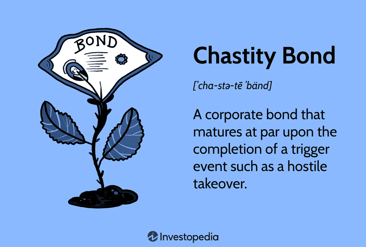

## Table of Contents

## What is a Chastity Bond?

A Chastity Bond is a type of financial agreement where one person agrees to give up control of their money to someone else for a certain period of time. This is often used as a way to help people save money or to prevent them from spending too much. The person who gives up control is usually trying to meet a financial goal, like saving for a big purchase or paying off debt.

In a Chastity Bond, the person who controls the money is usually a trusted friend, family member, or a professional financial advisor. They hold onto the money and only release it when certain conditions are met, like reaching a savings goal or when the agreed-upon time is up. This can help the person saving money stay disciplined and focused on their financial goals.

## How does a Chastity Bond work?

A Chastity Bond works by having one person give control of their money to someone else for a set time. This person is usually trying to save money or stop spending too much. They pick someone they trust, like a friend, family member, or a money expert, to take care of their money. The person in charge keeps the money safe and only gives it back when certain goals are met or when the time is up.

For example, if someone wants to save for a new car, they might put their money into a Chastity Bond. They tell the person in charge to only give the money back when they have enough saved for the car. This helps them stay focused and not spend the money on other things. It's like having a helper to make sure they reach their money goal.

## What are the historical origins of Chastity Bonds?

The idea of Chastity Bonds is not very old. It started to become popular in the early 2000s when people were looking for new ways to save money and control their spending. At that time, many people were struggling with debt and wanted to find a way to be more disciplined with their money. The concept of giving control of money to someone else for a set period was seen as a creative solution to help people meet their financial goals.

Before the term "Chastity Bond" was used, similar ideas existed in different forms. For example, people have always used savings accounts with restrictions or savings clubs where members saved together and helped each other stay on track. The modern Chastity Bond took these ideas and made them more formal and structured, often involving a contract or agreement between the saver and the person in charge of the money. This helped make the process more official and gave people a clear path to follow to achieve their savings goals.

## What materials are commonly used to make Chastity Bonds?

Chastity Bonds are not physical objects, so they are not made from materials like metal or plastic. Instead, they are financial agreements between two people. These agreements are usually written on paper or stored electronically as a document. The paper or digital document explains the terms of the agreement, like how much money is involved and when it can be released.

Sometimes, people might use a safe or a locked box to store the money or important documents related to the Chastity Bond. The safe or box can be made from metal or strong plastic to keep the contents secure. But the Chastity Bond itself is just the agreement, not the physical container.

## How do you choose the right Chastity Bond for personal use?

Choosing the right Chastity Bond for personal use starts with figuring out what you want to achieve. Do you want to save up for something big like a car or a house? Or do you want to stop spending too much money? Once you know your goal, you can decide how much money you need to save and how long it will take. This will help you set the terms of the Chastity Bond, like how much money you'll give to the person in charge and when they can give it back to you.

Next, you need to pick the right person to take care of your money. This should be someone you trust completely, like a close friend or family member. You might also want to think about using a professional, like a financial advisor, if you want expert help. Make sure you talk to this person about your goals and the rules of the Chastity Bond. Write everything down in an agreement so both of you know what to do. This way, you can feel confident that your money is in good hands and you'll reach your savings goal.

## What are the safety considerations when using a Chastity Bond?

When using a Chastity Bond, it's important to think about safety. You need to pick someone you trust a lot to take care of your money. This person should be honest and good at keeping things safe. Make sure you write down all the rules and goals in an agreement. This helps make sure everyone knows what to do and can help prevent problems.

Another safety tip is to keep the money in a safe place. You can use a locked box or a safe to store the money or the agreement. Make sure only the person in charge can open it. It's also a good idea to check in with them sometimes to see how things are going. This way, you can make sure everything is okay and your money is safe.

## How can Chastity Bonds be integrated into a relationship?

Chastity Bonds can be a helpful tool in a relationship when both partners want to save money for something special, like a vacation or a new home. One partner can give control of their money to the other partner, who will keep it safe until they reach their goal. This can help them stay focused and save money faster. It's important that both partners trust each other and talk about their goals and the rules of the Chastity Bond. They should write everything down in an agreement so there are no surprises.

Using a Chastity Bond in a relationship can also help partners work together better on their money goals. They can check in with each other to see how they're doing and make sure they're on the right track. This can make them feel closer and more like a team. But they need to be careful and make sure they pick the right time and way to use a Chastity Bond. If one partner feels pressured or unhappy about it, it might cause problems in the relationship. So, it's good to talk a lot and make sure both partners feel good about the plan.

## What are the psychological effects of using a Chastity Bond?

Using a Chastity Bond can make someone feel more disciplined and in control of their money. When a person gives their money to someone else to hold, it can help them stick to their savings goals. They might feel proud and happy when they see their money growing without being tempted to spend it. This can also make them feel less stressed about money because they know someone else is helping them stay on track.

On the other hand, using a Chastity Bond can sometimes cause stress or worry. If a person doesn't fully trust the one holding their money, they might feel anxious about whether their money is safe. Also, if they need the money back sooner than planned, it can lead to frustration or arguments. It's important for both people to talk openly and feel comfortable with the agreement to avoid these feelings.

## How do you maintain and clean a Chastity Bond?

Maintaining a Chastity Bond means keeping the agreement strong and clear. You should talk to the person holding your money often. Check in with them to see how your savings are doing and make sure they are still okay with helping you. If anything changes, like your savings goal or how long you want to save, you should update the agreement. Write down any new rules or goals so both of you know what to do. This helps keep everything smooth and working well.

Cleaning a Chastity Bond isn't about washing it, but about keeping the money safe and organized. If you're using a safe or a locked box to store the money or the agreement, make sure it's clean and secure. Keep the keys or the combination safe and only let the person in charge have access. If you're keeping the agreement on paper, store it in a safe place where it won't get dirty or damaged. If it's a digital document, make sure your computer or phone is clean and free from viruses that could harm the file. This way, your Chastity Bond stays safe and effective.

## What are the legal implications of using a Chastity Bond?

Using a Chastity Bond can have some legal things to think about. When you give your money to someone else, you should write down all the rules in an agreement. This agreement helps make sure both people know what to do and can help if there are any problems. It's a good idea to talk to a lawyer to make sure the agreement is okay and follows the law. If you don't have a good agreement, it might be hard to get your money back if something goes wrong.

Also, if the person holding your money does something wrong with it, like spending it or losing it, you might need to go to court to get it back. This can be hard and take a lot of time. So, it's really important to pick someone you trust a lot and make sure the agreement is clear and legal. Talking to a lawyer can help you understand all the legal stuff and keep your money safe.

## How have Chastity Bonds evolved with modern technology?

Chastity Bonds have changed a lot because of new technology. Now, people can use apps and websites to keep track of their money and savings goals. Instead of using a safe or a locked box, they can use a digital wallet or a special savings account that only lets them take out money when they reach their goal. This makes it easier and safer to use a Chastity Bond because everything is online and can be watched all the time.

Also, people can now use smart contracts on the internet to make their Chastity Bond agreements. A smart contract is like a computer program that follows the rules you set up. Once you put your money into the smart contract, it will only give it back when you meet your savings goal or when the time is up. This way, you don't need to trust someone else to hold your money; the computer does it for you. This makes Chastity Bonds more reliable and easier to use for everyone.

## What are the advanced features available in high-end Chastity Bonds?

High-end Chastity Bonds come with some cool features that make them even better at helping people save money. One big feature is the ability to set up different savings goals within the same bond. This means you can save for a vacation, a new car, and an emergency fund all at once, with different rules for each goal. Another feature is the option to have automatic savings. This means money can be taken from your paycheck and put straight into the Chastity Bond without you having to do anything. This makes saving easier and helps you reach your goals faster.

Another advanced feature in high-end Chastity Bonds is the use of smart technology to keep everything safe and easy to track. You can use an app on your phone to see how much you've saved and how close you are to your goals anytime you want. Some high-end Chastity Bonds also let you set up rewards for reaching your savings goals, like a small treat or a fun activity. This can make saving money more fun and keep you motivated. Overall, these advanced features make high-end Chastity Bonds a powerful tool for anyone who wants to save money and reach their financial goals.

## References & Further Reading

[1]: Bergstra, J., Bardenet, R., Bengio, Y., & Kégl, B. (2011). ["Algorithms for Hyper-Parameter Optimization."](https://dl.acm.org/doi/10.5555/2986459.2986743) Advances in Neural Information Processing Systems 24.

[2]: ["Advances in Financial Machine Learning"](https://www.amazon.com/Advances-Financial-Machine-Learning-Marcos/dp/1119482089) by Marcos Lopez de Prado

[3]: ["Evidence-Based Technical Analysis: Applying the Scientific Method and Statistical Inference to Trading Signals"](https://www.amazon.com/Evidence-Based-Technical-Analysis-Scientific-Statistical/dp/0470008741) by David Aronson

[4]: ["Machine Learning for Algorithmic Trading"](https://github.com/stefan-jansen/machine-learning-for-trading) by Stefan Jansen

[5]: ["Quantitative Trading: How to Build Your Own Algorithmic Trading Business"](https://www.amazon.com/Quantitative-Trading-Build-Algorithmic-Business/dp/1119800064) by Ernest P. Chan