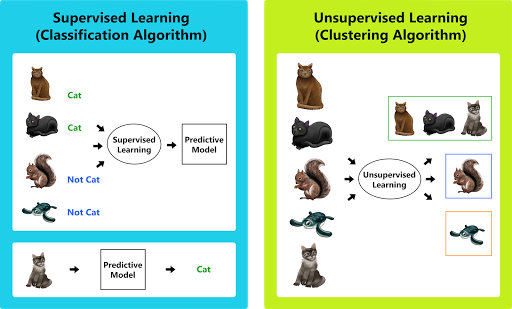

## Table of Contents

## What is chat machine learning?

Chat machine learning is a type of artificial intelligence that helps computers understand and create human-like text. It uses a lot of data, like text from books or the internet, to learn how people talk and write. By looking at this data, the computer can figure out patterns and rules for language. This helps the computer to have conversations with people in a way that sounds natural.

One popular method for chat machine learning is using something called a neural network. This is a type of computer program that is good at finding patterns in data. It works a bit like a brain, with many connected parts that can learn from examples. When you train a neural network with a lot of text, it can start to predict what words should come next in a sentence. This makes it possible for the computer to generate responses that fit well in a conversation.

## How does chat machine learning differ from traditional chatbots?

Chat machine learning and traditional chatbots work differently. Traditional chatbots follow a set of rules or scripts to respond to users. They look for specific words or phrases in what you say and then pick a response from a list of pre-written answers. This means they can only handle certain kinds of questions and might not understand if you ask something in a different way.

On the other hand, chat machine learning uses artificial intelligence to learn from a lot of text data. It doesn't just follow rules; it tries to understand the patterns and meanings in language. This allows it to have more natural conversations because it can generate new responses based on what it has learned. So, even if you ask a question in a new way, a machine learning chatbot can often still understand and reply correctly.

In summary, traditional chatbots are like following a recipe, while chat [machine learning](/wiki/machine-learning) is more like learning to cook by tasting and experimenting with different ingredients. This makes machine learning chatbots more flexible and better at understanding and responding to a wide range of questions and topics.

## What are the basic components of a chat machine learning system?

A chat machine learning system has several key parts that work together to understand and generate human-like text. The first part is the data, which is a large collection of text from various sources like [books](/wiki/algo-trading-books), websites, and conversations. This data is used to train the system so it can learn patterns and rules of language. The second part is the model, which is usually a [neural network](/wiki/neural-network) designed to process and generate text. The model takes in the data and learns from it, improving its ability to understand and create responses over time.

The third part is the training process, where the model is fed the data and adjusts its internal parameters to better predict and generate text. This process can involve techniques like backpropagation, where the model learns from its mistakes and refines its predictions. The final part is the interface, which allows users to interact with the system. This could be a chat window or a voice interface, and it's where the user inputs their questions or statements, and the system generates its responses based on what it has learned.

Together, these components create a system that can engage in natural conversations with users. The data provides the foundation, the model processes and learns from the data, the training process refines the model's abilities, and the interface allows for practical interaction. This combination makes chat machine learning systems flexible and capable of handling a wide range of conversational topics.

## What types of algorithms are commonly used in chat machine learning?

Chat machine learning often uses a type of algorithm called a neural network. One popular kind of neural network used for this is the Recurrent Neural Network (RNN). RNNs are good at understanding sequences, like words in a sentence. They can remember what came before and use that information to predict what should come next. A special type of RNN called Long Short-Term Memory (LSTM) is even better at this because it can remember things from much earlier in the sequence. This makes LSTMs very useful for chat machine learning because they can keep track of longer conversations.

Another important algorithm is the Transformer. Transformers are newer and different from RNNs because they don't process words one at a time. Instead, they look at all the words in a sentence at once. This makes them faster and often better at understanding the context of words. The most famous example of a Transformer is the model behind ChatGPT, called the Generative Pre-trained Transformer (GPT). Transformers use something called attention mechanisms, which help them focus on the most important parts of the text. This makes them very good at generating natural-sounding responses in chat machine learning systems.

## How can chat machine learning improve customer service?

Chat machine learning can make customer service better in many ways. It can answer customer questions quickly and at any time of the day. This means customers don't have to wait on hold or for an email response. The system can understand what customers are asking and give helpful answers, even if the question is asked in a new way. This makes customers happier because they get the help they need faster.

Also, chat machine learning can learn from past conversations. This means it gets better over time at understanding what customers need and how to solve their problems. It can handle many customers at the same time, so the company can help more people without hiring more staff. This saves money and makes the customer service process smoother and more efficient.

## What are the challenges in training a chat machine learning model?

Training a chat machine learning model can be tough because it needs a lot of good data. The data has to be clean and cover many different ways people talk and write. If the data is not good, the model might learn the wrong things and give bad answers. Also, training can take a long time and needs powerful computers. This can be expensive and hard to manage.

Another challenge is making sure the model understands the context and meaning of what people say. Words can mean different things depending on the situation, and the model needs to figure this out. Sometimes, the model might give answers that sound right but are actually wrong or don't make sense. This is called a "hallucination," and it's a big problem in chat machine learning. To fix this, people have to keep checking and fixing the model, which takes a lot of work.

## How do you evaluate the performance of a chat machine learning system?

Evaluating a chat machine learning system involves checking how well it understands and responds to users. One common way is to use metrics like accuracy, which measures how often the system gives the right answer. Another metric is the F1 score, which balances precision (how many of the system's answers are correct) and recall (how many correct answers the system finds). These metrics help show if the system is good at understanding and answering questions correctly. People also use human evaluations, where real people talk to the system and rate how helpful and natural the responses are. This gives a good idea of how well the system works in real life.

Another important part of evaluation is looking at how the system handles different kinds of conversations. This can be done with something called perplexity, which measures how well the system predicts the next word in a sentence. A lower perplexity means the system is better at understanding language. People also check for things like coherence, which is how well the responses make sense and stay on topic, and relevance, which is how well the answers match the questions. By using a mix of these methods, people can get a full picture of how good a chat machine learning system is and where it needs to improve.

## What are some popular platforms or tools for developing chat machine learning applications?

There are many popular platforms and tools that people use to make chat machine learning applications. One of the most well-known is TensorFlow. It's a free tool made by Google that helps you build and train machine learning models. Another popular tool is PyTorch, which is also free and easy to use. It's good for making neural networks and is used a lot in research and by companies. Both TensorFlow and PyTorch have lots of examples and help online, so they're good choices for people starting out.

Another tool that's very popular is the Hugging Face Transformers library. This tool makes it easy to use pre-trained models like BERT and GPT, which are very good at understanding and generating text. It's great for people who want to make a chat system without starting from scratch. There are also platforms like Dialogflow and Microsoft Bot Framework that help you build chatbots. These platforms give you tools to make your chatbot understand and respond to users, and they often work well with other services like messaging apps.

## How can chat machine learning be integrated with other AI technologies?

Chat machine learning can work together with other AI technologies to make systems that are more powerful and useful. For example, it can be combined with speech recognition, which lets computers understand what people are saying. This means a chat machine learning system can have conversations with people using voice, not just text. Another way it can be integrated is with image recognition. This lets the system understand pictures that people send and talk about them. By working with other AI technologies, chat machine learning can handle more types of information and give better answers to users.

Another important integration is with natural language processing (NLP) tools. NLP helps the system understand the meaning behind what people say, not just the words. When chat machine learning and NLP work together, the system can have more natural and helpful conversations. It can also be combined with machine learning models that predict what people might want or need next. This makes the system smarter and more personalized, so it can give better suggestions and help to users.

## What are the ethical considerations when deploying chat machine learning systems?

When we use chat machine learning systems, we need to think about being fair and honest. These systems learn from a lot of data, and if the data has biases, like treating some people unfairly because of their race or gender, the system might do the same. We need to check the data carefully and make sure the system treats everyone the same. Also, we should always tell people when they are talking to a machine and not a human. Being honest about this helps people trust the system more.

Another big thing to think about is keeping people's information safe. Chat machine learning systems can learn a lot about people from what they say. We need to make sure this information stays private and is not used in ways that could hurt people. It's also important to think about how these systems might affect jobs. If they take over work that people used to do, we need to find ways to help those people. By thinking about these things, we can make sure chat machine learning systems are used in a way that is good for everyone.

## How does transfer learning apply to chat machine learning?

Transfer learning helps chat machine learning by using what a model already knows from one task to do well in another. Imagine you learned how to ride a bike. Now, if you want to learn how to ride a scooter, you can use what you already know about balancing and steering. In chat machine learning, a model might start by learning from a huge amount of text, like books or the internet. This helps it understand how language works. Then, when you want the model to chat about a specific topic, like cooking, you can use what it already knows about language to help it learn about cooking faster.

This method saves a lot of time and effort because you don't have to start from scratch. Instead of training a new model just for cooking, you can take a model that already understands language and fine-tune it with cooking data. This makes the model better at talking about cooking without needing as much new data or time. Transfer learning is like giving the model a head start, making it easier and quicker to build chat systems that are good at specific topics.

## What are the future trends in chat machine learning?

In the future, chat machine learning will get even better at understanding and talking like humans. One big trend will be making models that can understand more than just text. They will be able to use voice, pictures, and even videos to have more natural conversations. This means you might be able to show a picture to a chat system and ask about it, and the system will understand and answer you correctly. Another trend is making chat systems more personalized. They will learn about you over time and give answers that fit your interests and needs better. This will make talking to chat systems feel more like talking to a friend who knows you well.

Another important trend is making chat machine learning systems safer and more ethical. As these systems get better, people will want to make sure they are fair and do not harm anyone. This means working on ways to remove bias from the data the systems learn from, so they treat everyone the same. Also, keeping your information private will be a big focus. Companies will need to make sure that what you say to a chat system stays safe and is not used in ways you don't want. By working on these things, chat machine learning will become a tool that helps people in many ways, while also being fair and respectful.