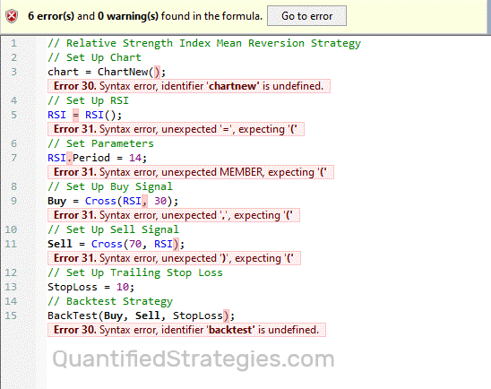

ChatGPT, developed by OpenAI, is a cutting-edge language model that has brought transformative changes across various industries, including the field of algorithmic trading. As an AI-driven tool, ChatGPT has the ability to analyze large datasets and generate coherent, human-like text, which makes it an invaluable asset in the context of trading. By leveraging its capabilities, traders can enhance their decision-making processes, optimize strategy development, and improve execution efficiency.

This article examines how ChatGPT is effectively utilized in trading, particularly its role in forming and executing algorithmic trading strategies. Traders can employ ChatGPT to gain insights into market dynamics, generate and test new trading strategies, and ultimately make more informed trading decisions. The integration of AI in trading is not merely a trend but a significant shift towards data-driven, automated decision-making, promising enhanced performance and reduced human biases.



By exploring the advantages of incorporating ChatGPT into trading practices and acknowledging potential challenges, traders can better understand how to capitalize on this technology. While AI offers powerful tools, its effective use requires a strategic approach that complements human intuition and experience. Understanding the implications of AI on trading practices, and how to utilize ChatGPT for improved strategy development, can position traders for success in the ever-evolving financial markets.

## Table of Contents

## What is ChatGPT?

ChatGPT is an advanced AI language model developed by OpenAI, designed to generate human-like text based on input it receives. Using Generative Pre-trained Transformers (GPT) architecture, ChatGPT processes and produces text by analyzing patterns within large datasets of written material. It is highly adept at understanding and generating natural language output, making it a versatile tool in numerous applications, including algorithmic trading.

In the context of algo trading, ChatGPT can assist traders by performing tasks such as sentiment analysis, coding strategies, and generating prediction models. These capabilities are powered by sophisticated techniques such as the 'attention mechanism', which helps the model focus on relevant parts of the input data, and 'beam search', a heuristic search algorithm that expands potential outputs by exploring the most promising options. 

The attention mechanism is particularly vital as it enhances the model's ability to discern relevant context, thereby improving the quality and accuracy of its output. This mechanism allows the model to weigh different parts of the input data, assigning higher importance to more relevant features, a process that can be mathematically represented by the equation:

$$
\text{Attention}(Q, K, V) = \text{softmax}\left(\frac{QK^T}{\sqrt{d_k}}\right)V
$$

where $Q$, $K$, and $V$ are matrices representing the query, key, and value weights, respectively, and $d_k$ is the dimensionality of the keys.

Additionally, ChatGPT's ability to generate quality outputs is enhanced through beam search, which is widely used for generating sequences of words. Beam search maintains a fixed number of "beam" or "paths" during decoding, thereby balancing computational tractability and performance. Example code to demonstrate a simplistic version of beam search might look like this in Python:

```python
def beam_search(decoder, beam_width, max_length):
    sequences = [[list(), 1.0]]
    for _ in range(max_length):
        all_candidates = list()
        for seq, score in sequences:
            next_words = decoder(seq)
            for word, prob in next_words.items():
                candidate = [seq + [word], score * -log(prob)]
                all_candidates.append(candidate)
        ordered = sorted(all_candidates, key=lambda tup: tup[1])
        sequences = ordered[:beam_width]
    return sequences[0][0]
```

ChatGPT's proficiency in generating human-like text and performing complex language-related tasks enables it to support [algorithmic trading](/wiki/algorithmic-trading) by offering nuanced insights and robust strategy generation capabilities.

## How ChatGPT Enhances Algorithmic Trading

ChatGPT enhances algorithmic trading by offering solutions that automate the coding of trading strategies, leveraging historical and real-time market data. By analyzing vast datasets, ChatGPT can identify patterns and trends that inform the formulation of effective trading strategies. This automation not only speeds up the process of developing new strategies but also allows traders to adopt a data-driven approach to their trading.

One of the critical benefits of using ChatGPT in trading is its ability to generate [backtesting](/wiki/backtesting) models. These models allow traders to simulate how a particular strategy would have performed using historical data before risking actual capital in live markets. This process helps in identifying potential pitfalls and strengths of a strategy, providing invaluable insights that can be used to fine-tune parameters or altogether redesign a trading strategy.

Moreover, ChatGPT excels in conducting sentiment analysis, which is crucial for understanding market trends and investor sentiment. By analyzing news articles, social media, and financial reports, ChatGPT can gauge public sentiment about a particular stock or market, providing traders with a nuanced perspective that quantitative data alone might not reveal. This sentiment analysis can be particularly valuable in crafting strategies that account for sudden market shifts driven by news events or changes in market sentiment.

To illustrate, consider a scenario where a trader wants to develop a strategy based on sentiment trends. Here’s a simple Python example of how ChatGPT output can assist in coding such a strategy:

```python
import pandas as pd
from sentiment_analysis_tool import analyze_sentiment

# Load historical data
historical_data = pd.read_csv('market_data.csv')

# Analyze sentiment for each period
historical_data['Sentiment'] = historical_data['News'].apply(analyze_sentiment)

# Define a simple trading strategy based on sentiment
def trading_strategy(data):
    signals = []
    for index, row in data.iterrows():
        if row['Sentiment'] > 0.5:  # Assume >0.5 indicates positive sentiment
            signals.append('Buy')
        elif row['Sentiment'] < -0.5:  # Assume <-0.5 indicates negative sentiment
            signals.append('Sell')
        else:
            signals.append('Hold')
    return signals

# Apply the strategy
historical_data['Signal'] = trading_strategy(historical_data)
```

This sample program demonstrates the ease with which traders can integrate sentiment analysis into their trading models, thanks to ChatGPT. By automating these processes, traders can focus on strategy refinement and decision-making, confident in the knowledge that their underlying data analysis is robust and comprehensive.

In conclusion, ChatGPT provides traders with sophisticated tools for strategy generation, market analysis, and backtesting, supporting them in making informed, strategic trading decisions.

## Advantages of Using ChatGPT in Trading

ChatGPT has emerged as a valuable asset in the trading sector, predominantly due to its ability to generate trading strategies and backtests with remarkable speed and efficiency. By automating the labor-intensive process of strategy development and testing, ChatGPT enables traders to allocate their time and effort toward other critical facets of their operations. 

One significant advantage is the flexibility ChatGPT offers in analysis types, ranging from technical to fundamental. Technical analysis involves examining historical market data, primarily price and [volume](/wiki/volume-trading-strategy), to forecast future movements. ChatGPT can assist by quickly processing vast datasets and providing insights into potential price patterns or trends. For instance, utilizing technical indicators such as moving averages, traders can script analysis models in Python:

```python
import pandas as pd
import numpy as np

def moving_average_strategy(prices, short_window=40, long_window=100):
    signals = pd.DataFrame(index=prices.index)
    signals['signal'] = 0.0

    signals['short_mavg'] = prices['Close'].rolling(window=short_window, min_periods=1, center=False).mean()
    signals['long_mavg'] = prices['Close'].rolling(window=long_window, min_periods=1, center=False).mean()

    signals['signal'][short_window:] = np.where(signals['short_mavg'][short_window:] > signals['long_mavg'][short_window:], 1.0, 0.0)   
    signals['positions'] = signals['signal'].diff()

    return signals
```

In relation to [fundamental analysis](/wiki/fundamental-analysis), ChatGPT offers support in evaluating economic, financial, and other qualitative and quantitative factors to measure securities' intrinsic values. By parsing and analyzing extensive document sets—whether earnings reports, news articles, or analyst opinions—ChatGPT aids in gathering comprehensive perspectives that might influence market movements.

Furthermore, ChatGPT enables a reduction in human error. This is particularly critical as operator biases and mistakes in data interpretation can lead to severe financial losses. The model provides consistent and unbiased results across extensive datasets, ensuring decisions are made based on robust, data-driven insights without the typical errors or biases associated with manual analysis. Leveraging these abilities, traders can rely on high-quality outputs that guide their strategy formulation and execution decisions. 

In essence, ChatGPT acts as a powerful tool that augments a trader's capabilities, providing them with robust analytical flexibility and error mitigation advantages, which are crucial for maintaining a competitive edge in the fast-paced trading landscape.

## Key Considerations and Risks

ChatGPT, as a powerful AI language model, provides substantial assistance in algorithmic trading, yet it is accompanied by important considerations and risks. Its reliance on vast datasets to generate responses introduces the potential for biases inherent in the training data. These biases could inadvertently influence trading strategies, leading to skewed predictions or insights that do not align with real-world market dynamics. For instance, if the training data is biased towards past bullish trends, the generated strategies may favor optimistic outcomes, disregarding current market downturns.

Moreover, an overreliance on ChatGPT's predictions might result in complacency, where traders trust the AI’s outputs without adequate scrutiny. While the model can produce highly sophisticated trading strategies, it does not replace the critical thinking and contextual understanding provided by human judgment. Traders must remain vigilant to ensure that their objectives and risk tolerance are reflected in the strategies they implement.

A significant technical skill set requirement also poses a challenge: understanding and utilizing ChatGPT’s output often necessitates a level of code literacy to effectively debug and optimize AI-generated strategies. Python or C++ proficiency, for example, is often required to refine strategies and ensure they perform optimally in a live trading environment. Consider the following simple Python snippet for generating a mean-reversion strategy, which users might need to modify based on market conditions:

```python
import numpy as np

def simple_moving_average(values, window):
    weights = np.repeat(1.0, window) / window
    smas = np.convolve(values, weights, 'valid')
    return smas

def mean_reversion(prices, window, threshold):
    moving_averages = simple_moving_average(prices, window)
    signals = []
    for price, average in zip(prices[window-1:], moving_averages):
        if price < average - threshold:
            signals.append('Buy')
        elif price > average + threshold:
            signals.append('Sell')
        else:
            signals.append('Hold')
    return signals

# Example usage
prices = [10, 11, 10.5, 12, 11, 10.8]
window = 3
threshold = 0.2
print(mean_reversion(prices, window, threshold))
```

Finally, while ChatGPT contributes to reducing manual workload and can enhance decision-making, human oversight remains crucial. Traders need to continuously monitor AI-driven strategies to ensure their alignment with evolving market conditions and trading goals. As financial markets are dynamic and multifaceted, combining AI tools with human expertise offers the most reliable approach to effective trading.

## Strategies Enabled by ChatGPT

AI-driven strategies enabled by ChatGPT encompass an array of sophisticated trading techniques, paramount among them being mean reversion, [momentum](/wiki/momentum) trading, and complex technical setups. These methodologies exploit the computational proficiency and advanced linguistic capabilities of ChatGPT to offer innovative approaches in the trading sector.

### Mean Reversion

Mean reversion is a strategy based on the premise that asset prices and historical returns eventually return to their long-term mean or average level. ChatGPT aids in this strategy by analyzing large datasets to identify deviations from the mean. By utilizing [machine learning](/wiki/machine-learning) to process historical prices, ChatGPT can generate statistical predictions on the likelihood of price reversions, thereby allowing traders to make informed decisions about when to enter or [exit](/wiki/exit-strategy) trades. A simple mean reversion strategy can be modeled using the formula:

$$

\text{Position} = -\beta (\text{Price} - \text{Mean}) 
$$

where $\beta$ represents the sensitivity or confidence level in the price reverting to its mean.

### Momentum Trading

Momentum trading capitalizes on the strength of existing market trends. This strategy involves identifying stocks that are exhibiting significant price movements and trading in the direction of these trends. ChatGPT enhances this strategy by processing both historical price data and sentiment analysis, obtaining a more holistic view of the market momentum. It can predict momentum shifts by evaluating correlated asset movements and investor sentiment, offering insights that could be instrumental in timing the trades effectively.

### Complex Technical Setups

For traders seeking a more intricate approach, ChatGPT supports complex technical setups involving multiple indicators and cross-market analyses. By processing technical indicators such as moving averages, RSI (Relative Strength Index), and MACD (Moving Average Convergence Divergence), it generates sophisticated entry and exit signals. These signals can be dynamically adjusted based on real-time data, allowing for reactive adjustments to rapidly changing market conditions. Here is a simplified example of incorporating ChatGPT in generating technical analysis signals:

```python
import numpy as np
import pandas as pd

# Example of SMA and RSI calculation
def calculate_tech_indicators(data):
    data['SMA'] = data['Close'].rolling(window=20).mean()
    delta = data['Close'].diff()
    gain = (delta.where(delta > 0, 0)).rolling(window=14).mean()
    loss = (-delta.where(delta < 0, 0)).rolling(window=14).mean()

    RS = gain / loss
    data['RSI'] = 100 - (100 / (1 + RS))
    return data

# Example usage
# df = pd.read_csv('market_data.csv')
# df_with_indicators = calculate_tech_indicators(df)
```

### Stock and Market Analysis

ChatGPT’s natural language processing capabilities make it highly effective for qualitative market analysis. By performing sentiment analysis on news articles, social media updates, and financial reports, ChatGPT synthesizes market sentiment, providing traders with contextual information that complements traditional quantitative analysis. This multi-faceted view helps identify potential catalysts or risk factors that could influence a stock's trajectory, allowing for well-rounded entry and exit strategies. For instance, analyzing sentiment associated with news headlines can help anticipate market reactions, thereby refining entry points.

By combining quantitative data analysis with qualitative sentiment insights, ChatGPT offers traders a powerful toolset for enhancing trading strategies, enabling more informed and precise decisions across a spectrum of trading paradigms.

## Integrating ChatGPT with Trading Platforms

To effectively deploy trading strategies generated by ChatGPT, integration with trading platforms that support algorithmic trading is necessary. These platforms serve as the execution points where the theoretical strategies are tested and applied in real-time market conditions. Among the popular platforms that can seamlessly integrate AI-generated codes are TradingView, MetaTrader 4 (MT4), MetaTrader 5 (MT5), and custom broker APIs.

TradingView is a widely used platform known for its robust charting tools and Pine Script scripting language. Traders can convert ChatGPT outputs into Pine Script code, allowing them to backtest and automate strategies. For example, a simple moving average crossover strategy generated by ChatGPT can be input into TradingView's editor, enabling automatic alerts or orders when specific market conditions are met.

MetaTrader platforms, MT4 and MT5, are known for their versatility and extensive use in Forex trading. Integration involves converting ChatGPT's Python or text-based strategy outputs into MQL4 or MQL5 code, the languages used by MT4 and MT5, respectively. An example of this conversion might involve the translation of a strategy's logic into a function that, when conditions are satisfied, executes buy or sell orders through the platform's trading parameters.

Custom broker APIs provide another avenue for traders to implement AI-driven strategies. These APIs often support languages such as Python, allowing direct deployment of ChatGPT's generated scripts into trading environments. A Python script, for example, can include logic for risk management, order execution, and position tracking, making it a comprehensive tool for algorithmic trading. The following is a basic structure for integrating such a script with a broker API:

```python
import broker_api  # hypothetical API import

# Initialize API client
client = broker_api.Client(api_key='your_api_key')

# Define the strategy from ChatGPT
def trading_strategy(data):
    # Implement logic
    if data['indicator'] > threshold:
        return 'BUY'
    elif data['indicator'] < threshold:
        return 'SELL'
    return 'HOLD'

# Fetch market data
market_data = client.get_market_data()

# Execute strategy
decision = trading_strategy(market_data)
client.execute_order(decision)
```

In this example, the AI-generated strategy evaluates market data and decides whether to buy, sell, or hold a position. The choice is sent directly to the trading platform through the API, ensuring that strategies are executed precisely as intended.

Integration not only facilitates the transition from strategy creation to implementation but also enables real-time adjustments and monitoring. Traders leveraging this integration can ensure that ChatGPT-generated strategies are aligned with current market dynamics, enhancing the potential for profitability and risk management.

## Challenges and Future Directions

AI-driven tools like ChatGPT are reshaping the landscape of algorithmic trading by enabling traders to develop and execute complex strategies with minimal manual intervention. However, these advancements bring about certain challenges that need careful consideration. One of the main issues is the necessity for continual monitoring and adjustment of AI-generated strategies. Trading strategies are not static; they require updates and refinements to adapt to changing market conditions, unexpected geopolitical events, or economic data releases. These dynamics introduce an element of uncertainty that AI models must account for, making it crucial for traders to provide continuous oversight.

Another challenge is the potential for biases embedded in the training data. ChatGPT and similar AI systems operate based on large datasets sourced from historical data, news articles, social media, and more. If these datasets contain inherent biases or are not reflective of current market trends, the output might yield skewed or suboptimal strategies. It is imperative for practitioners to identify and mitigate these biases to ensure reliable decision-making.

Overreliance on AI models poses another risk. While AI can process vast amounts of data and provide insights at an unprecedented speed, it does not replace human intuition or the ability to make judgment calls based on experience and market sentiment. Traders must be cautious not to become overly dependent on AI outputs, instead using them as a supplement to human expertise.

Furthermore, understanding and troubleshooting AI-generated code is crucial for successful integration into existing trading platforms. Although models like ChatGPT can automate code generation, traders must possess a certain level of coding literacy to debug and optimize these strategies effectively. Without this knowledge, the potential for executing flawed strategies increases, which could result in financial losses.

Looking to the future, advancements in AI offer promising avenues for enhancing trading tools like ChatGPT. Enhancements in contextual understanding and predictive accuracy could allow AI models to interpret complex market scenarios more accurately. For example, by incorporating advancements in natural language processing, AI could better understand and react to nuanced market sentiment reflected in news headlines or social media trends. Additionally, improvements in machine learning algorithms could result in more precise predictions of market movements, adapting to evolving market landscapes with greater agility. 

As the technology continues to evolve, traders who harness these developments and integrate them into their workflow will likely gain a competitive edge. Cultivating an understanding of AI's capabilities and limitations will be key to leveraging these tools effectively, ensuring that they complement, rather than replace, traditional trading strategies.

## Conclusion

ChatGPT is reshaping the landscape of trading by equipping traders with advanced tools for strategy development, backtesting, and execution. Its ability to handle vast amounts of data and generate insights has empowered traders to make more informed decisions, ultimately leading to more robust trading strategies. By leveraging ChatGPT, traders can benefit from an AI that not only enhances their analytical capabilities but also streamlines the process of testing and deploying trading strategies. 

While ChatGPT offers substantial benefits, it is important to recognize that it cannot replace human intuition and experience. Human oversight is crucial in interpreting AI-generated insights and ensuring that they align with broader trading objectives and ethical considerations. When integrated thoughtfully, ChatGPT can significantly enhance a trader’s ability to formulate and execute profitable strategies, acting as a valuable ally rather than a replacement for human judgment. 

As technology continues to evolve, trading tools like ChatGPT will become increasingly sophisticated. Staying informed about these advancements and mastering their application will be vital for traders looking to maintain a competitive edge. The future of trading will likely see a seamless blend of machine intelligence and human expertise, leading to a more dynamic and efficient market environment. Embracing such AI tools while maintaining a critical and informed approach will be key to success in this rapidly evolving field.

## References & Further Reading

[1]: Bergstra, J., Bardenet, R., Bengio, Y., & Kégl, B. (2011). ["Algorithms for Hyper-Parameter Optimization."](https://proceedings.neurips.cc/paper/2011/file/86e8f7ab32cfd12577bc2619bc635690-Paper.pdf) Advances in Neural Information Processing Systems 24.

[2]: ["Advances in Financial Machine Learning"](https://www.amazon.com/Advances-Financial-Machine-Learning-Marcos/dp/1119482089) by Marcos Lopez de Prado

[3]: ["Evidence-Based Technical Analysis: Applying the Scientific Method and Statistical Inference to Trading Signals"](https://www.amazon.com/Evidence-Based-Technical-Analysis-Scientific-Statistical/dp/0470008741) by David Aronson

[4]: ["Machine Learning for Algorithmic Trading"](https://github.com/stefan-jansen/machine-learning-for-trading) by Stefan Jansen

[5]: ["Quantitative Trading: How to Build Your Own Algorithmic Trading Business"](https://books.google.com/books/about/Quantitative_Trading.html?id=j70yEAAAQBAJ) by Ernest P. Chan