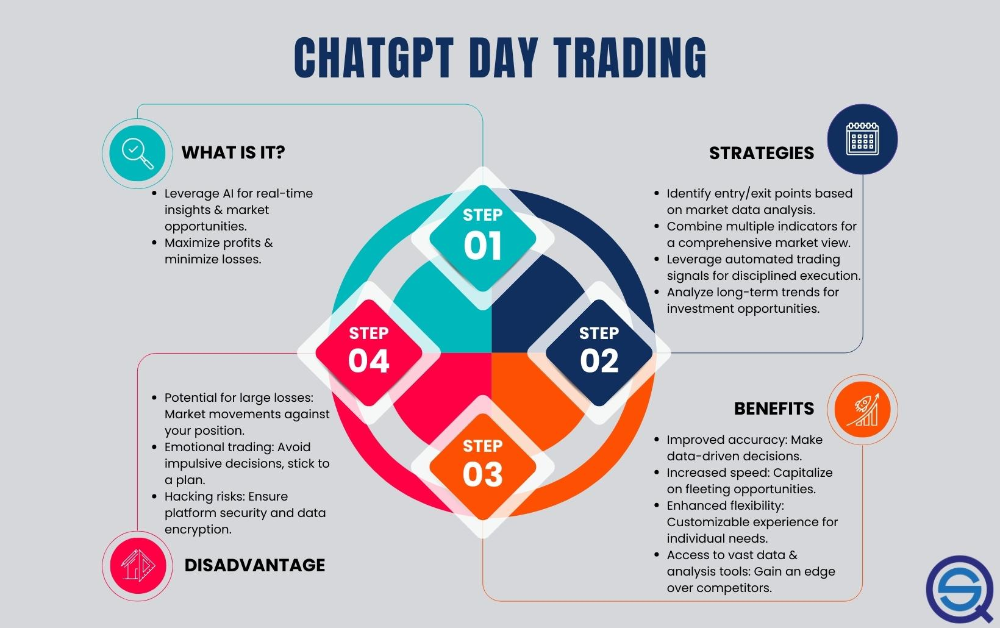

## Table of Contents

## What is ChatGPT and how can it be used in trading?

ChatGPT is a type of computer program made by a company called OpenAI. It's really good at understanding and making human-like text. You can talk to it like you're talking to a friend, and it can answer questions, tell stories, or help with many other things. It learns from a lot of text on the internet, so it knows about many different topics.

In trading, ChatGPT can be helpful in a few ways. First, it can help traders learn about the market by answering questions about stocks, currencies, or other things people trade. It can explain simple ideas or even help with more complicated ones. Second, it can help traders stay organized by setting reminders or helping them keep track of important dates and events. But, it's important to remember that while ChatGPT can give information and help, it's not perfect and shouldn't be the only thing traders use to make decisions.

## What are the basic trading strategies that beginners can implement using ChatGPT?

Beginners can use ChatGPT to learn about and implement simple trading strategies like trend following and breakout trading. In trend following, ChatGPT can help traders identify whether a stock, currency, or commodity is going up or down over time. By asking ChatGPT to analyze recent price movements, beginners can decide to buy if the trend is up or sell if it's down. This strategy is all about following the market's direction and can be a good starting point for new traders.

Breakout trading is another strategy beginners can explore with ChatGPT's help. This involves watching for prices to move outside of a certain range, which could signal a big move in the market. Traders can ask ChatGPT to look at historical price data to spot these ranges and then wait for a [breakout](/wiki/breakout-trading) to happen. If a price breaks out upwards, it might be a good time to buy, and if it breaks downwards, it might be a good time to sell. ChatGPT can make it easier to understand these concepts and apply them to real trading situations.

Remember, while ChatGPT can provide information and guidance, it's important for beginners to also do their own research and not rely solely on AI for trading decisions. Using ChatGPT as a tool to learn and understand basic strategies can be very helpful, but combining this with other resources and perhaps even advice from experienced traders will lead to better results in the long run.

## How does ChatGPT help in analyzing market trends for trading?

ChatGPT can help traders understand market trends by answering questions about what's happening in the market. If you're curious about why a stock is going up or down, you can ask ChatGPT. It can look at recent news, price movements, and other data to give you a simple explanation. This can help you see if the market is in an uptrend, where prices are generally going up, or a downtrend, where prices are generally going down. Knowing this can help you decide whether to buy or sell.

Also, ChatGPT can help you keep track of trends over time. If you want to know how a stock has been doing over the last few months or years, you can ask ChatGPT to look at the historical data. It can tell you if the stock has been steadily increasing, decreasing, or moving sideways. This information is useful because it helps you see the bigger picture and make better trading decisions based on long-term patterns rather than just short-term changes.

## What are the key indicators and data points that ChatGPT uses for trading decisions?

ChatGPT uses several key indicators and data points to help with trading decisions. It looks at price movements to see if a stock or other asset is going up or down. It can also look at trading volumes, which show how many people are buying and selling. High volumes can mean the market is very interested in that asset. Another thing ChatGPT can consider is technical indicators like moving averages, which help smooth out price data to see trends more clearly. It might also look at support and resistance levels, which are price points where the asset tends to stop and reverse.

In addition to these technical aspects, ChatGPT can analyze fundamental data, like a company's earnings reports or economic news that might affect the market. It can look at news articles and other sources to understand why prices are changing. For example, if a company announces good earnings, ChatGPT can help explain why the stock price might go up. It can also keep track of economic indicators like interest rates or employment numbers, which can influence the overall market. By combining all this information, ChatGPT can give traders a clearer picture of what's happening and why, helping them make more informed decisions.

## How can ChatGPT assist in risk management for trading?

ChatGPT can help with risk management by answering questions about how much money you should risk on a single trade. It can explain simple ideas like setting stop-loss orders, which are like safety nets that automatically sell your stock if it drops too much. This way, you don't lose more money than you're okay with losing. ChatGPT can also help you understand how to spread your money across different investments, which is called diversification. By not putting all your eggs in one basket, you can lower the chance of losing a lot of money if one investment goes bad.

Another way ChatGPT can assist is by helping you keep track of your trades and how much you're winning or losing. It can remind you to review your trades regularly to see if you're doing well or if you need to change your strategy. This helps you stay disciplined and not take too many risks. By asking ChatGPT about different risk management techniques, you can learn how to protect your money better and trade more safely.

## What are some intermediate strategies for using ChatGPT in trading?

For intermediate traders, ChatGPT can be used to explore more advanced strategies like swing trading. This involves holding onto stocks or other assets for a few days or weeks to take advantage of expected upward or downward movements. ChatGPT can help by analyzing historical price data and technical indicators like the Relative Strength Index (RSI) or Moving Average Convergence Divergence (MACD). By asking ChatGPT to look at these indicators, traders can identify good times to buy or sell, aiming to catch the "swings" in the market. This strategy requires a bit more understanding of the market, but with ChatGPT's help, intermediate traders can make more informed decisions.

Another strategy is mean reversion, where traders bet that prices will eventually return to their average after moving too far in one direction. ChatGPT can assist by calculating the average price over a period and spotting when the current price is significantly above or below this average. If a stock is too high, traders might sell, expecting it to fall back to the average. If it's too low, they might buy, expecting it to rise. ChatGPT can help explain these concepts and provide the necessary data to implement this strategy effectively. This way, intermediate traders can use ChatGPT to refine their approach and potentially increase their chances of making profitable trades.

## How can ChatGPT be integrated with other trading tools and platforms?

ChatGPT can be integrated with other trading tools and platforms to make trading easier and more effective. For example, you can use ChatGPT to get real-time market updates by connecting it to a trading platform that provides live data. This way, you can ask ChatGPT questions about what's happening in the market right now, and it can give you quick answers based on the latest information. You can also set up ChatGPT to send alerts or reminders through trading apps, helping you stay on top of important events or price changes without constantly watching the market.

Another way to use ChatGPT with other tools is by connecting it to technical analysis software. This can help you understand charts and indicators better. You can ask ChatGPT to explain what a specific chart pattern means or how to use a particular indicator. By doing this, you can make more informed trading decisions because you'll have a better understanding of the technical side of trading. Plus, combining ChatGPT with these tools can save you time because it can quickly analyze data and give you insights that might take longer to figure out on your own.

## What are the advanced algorithms and machine learning models used by ChatGPT for trading?

ChatGPT uses advanced algorithms and machine learning models to help with trading. One of the main things it uses is natural language processing (NLP), which helps it understand and create human-like text. This is useful for trading because it can read and explain news articles, financial reports, and other important information that can affect the market. It can also use this to answer traders' questions about what's happening and why prices are changing. Another important part is its ability to analyze large amounts of data quickly. This means it can look at historical price data, trading volumes, and other indicators to spot patterns and trends that might be hard for humans to see.

In addition to NLP, ChatGPT can use machine learning models like neural networks to predict future market movements. These models can learn from past data to make guesses about what might happen next. For example, they can look at how prices have moved in the past and use that information to predict if a stock might go up or down. This is helpful for traders who want to make decisions based on data-driven predictions. While ChatGPT can't make perfect predictions because the market is always changing, these advanced algorithms and models give traders a powerful tool to help them understand and navigate the market better.

## How does ChatGPT handle high-frequency trading and what strategies are effective?

High-frequency trading is all about making lots of trades very quickly, often using computers to do it. ChatGPT can help with high-frequency trading by giving quick answers to questions about the market. It can look at real-time data and tell you what's happening right now. But, ChatGPT itself doesn't make the trades. Instead, it can help traders understand the market better and make decisions faster. For example, if a trader needs to know why a stock's price just changed, ChatGPT can explain it quickly, helping the trader decide what to do next.

Some effective strategies for high-frequency trading that ChatGPT can help with include [arbitrage](/wiki/arbitrage) and [market making](/wiki/market-making). Arbitrage is when traders buy something in one place and sell it in another for a higher price. ChatGPT can help by quickly finding price differences in different markets. Market making is when traders buy and sell the same thing to make a small profit on each trade. ChatGPT can help by analyzing the best times to buy and sell to keep making these small profits. While ChatGPT can provide valuable information and insights, it's important for traders to use other tools and their own judgment too, because high-frequency trading needs very fast and accurate decisions.

## What are the limitations and potential pitfalls of using ChatGPT for trading?

Using ChatGPT for trading can be really helpful, but it also has some limitations. One big problem is that ChatGPT can't always give you the most up-to-date information. The market changes very fast, and if you're relying on ChatGPT, you might miss out on important news or price changes that happen right after you ask a question. Also, ChatGPT doesn't actually make trades for you. It can give you ideas and explain things, but you still need to use other tools to actually buy and sell stocks or other things you're trading. This means you have to be careful and not just trust what ChatGPT says without checking other sources too.

Another thing to watch out for is that ChatGPT can sometimes give wrong or confusing information. It's really good at understanding language, but it might not always get the details right, especially when it comes to complicated trading strategies or specific market conditions. If you're new to trading, this can be tricky because you might make decisions based on what ChatGPT says, only to find out later that it wasn't the best advice. So, it's important to use ChatGPT as a helper, not as your only guide. Always do your own research and maybe even talk to experienced traders to make sure you're making smart choices.

## How can expert traders customize ChatGPT to fit specific trading strategies?

Expert traders can customize ChatGPT to fit specific trading strategies by using it to analyze and interpret data in ways that align with their unique approaches. For instance, if a trader focuses on momentum trading, they can ask ChatGPT to look at specific indicators like the Relative Strength Index (RSI) or the Moving Average Convergence Divergence (MACD) to identify when stocks are gaining or losing momentum. By setting up custom prompts and questions, traders can get tailored insights that help them decide when to buy or sell based on their strategy. They can also use ChatGPT to keep track of multiple stocks or assets, making it easier to manage a complex portfolio according to their specific rules and criteria.

Another way expert traders can customize ChatGPT is by integrating it with other trading tools and platforms. For example, they can connect ChatGPT to real-time data feeds and technical analysis software to get instant updates and detailed chart analyses. This integration allows traders to ask ChatGPT specific questions about current market conditions or technical patterns, getting answers that directly apply to their trading strategies. By combining ChatGPT's language processing capabilities with the precision of other trading tools, expert traders can create a powerful system that supports their decision-making process and helps them execute their strategies more effectively.

## What future developments in AI and machine learning could impact ChatGPT's trading capabilities?

Future developments in AI and machine learning could make ChatGPT even better at helping with trading. One big thing that might happen is that AI could get better at understanding and predicting the market in real-time. Right now, ChatGPT can give you information and help you understand what's happening, but it can't always keep up with the super fast changes in the market. If AI gets better at processing and analyzing data super quickly, ChatGPT could give you instant updates and predictions, making it easier for you to make quick trading decisions.

Another important development could be in the area of personalized learning. This means that AI could learn more about your specific trading style and preferences, and then give you advice that's just right for you. Imagine if ChatGPT could remember all the trades you've made and use that information to suggest new trades that fit your strategy perfectly. This kind of personalized advice could make trading a lot easier and more successful for you.

## What is ChatGPT?

ChatGPT is an advanced AI language model developed by OpenAI, designed to generate human-like text based on input it receives. Using Generative Pre-trained Transformers (GPT) architecture, ChatGPT processes and produces text by analyzing patterns within large datasets of written material. It is highly adept at understanding and generating natural language output, making it a versatile tool in numerous applications, including algorithmic trading.

In the context of algo trading, ChatGPT can assist traders by performing tasks such as sentiment analysis, coding strategies, and generating prediction models. These capabilities are powered by sophisticated techniques such as the 'attention mechanism', which helps the model focus on relevant parts of the input data, and 'beam search', a heuristic search algorithm that expands potential outputs by exploring the most promising options. 

The attention mechanism is particularly vital as it enhances the model's ability to discern relevant context, thereby improving the quality and accuracy of its output. This mechanism allows the model to weigh different parts of the input data, assigning higher importance to more relevant features, a process that can be mathematically represented by the equation:

$$
\text{Attention}(Q, K, V) = \text{softmax}\left(\frac{QK^T}{\sqrt{d_k}}\right)V
$$

where $Q$, $K$, and $V$ are matrices representing the query, key, and value weights, respectively, and $d_k$ is the dimensionality of the keys.

Additionally, ChatGPT's ability to generate quality outputs is enhanced through beam search, which is widely used for generating sequences of words. Beam search maintains a fixed number of "beam" or "paths" during decoding, thereby balancing computational tractability and performance. Example code to demonstrate a simplistic version of beam search might look like this in Python:

```python
def beam_search(decoder, beam_width, max_length):
    sequences = [[list(), 1.0]]
    for _ in range(max_length):
        all_candidates = list()
        for seq, score in sequences:
            next_words = decoder(seq)
            for word, prob in next_words.items():
                candidate = [seq + [word], score * -log(prob)]
                all_candidates.append(candidate)
        ordered = sorted(all_candidates, key=lambda tup: tup[1])
        sequences = ordered[:beam_width]
    return sequences[0][0]
```

ChatGPT's proficiency in generating human-like text and performing complex language-related tasks enables it to support [algorithmic trading](/wiki/algorithmic-trading) by offering nuanced insights and robust strategy generation capabilities.

## What strategies are enabled by ChatGPT?

AI-driven strategies enabled by ChatGPT encompass an array of sophisticated trading techniques, paramount among them being mean reversion, [momentum](/wiki/momentum) trading, and complex technical setups. These methodologies exploit the computational proficiency and advanced linguistic capabilities of ChatGPT to offer innovative approaches in the trading sector.

### Mean Reversion

Mean reversion is a strategy based on the premise that asset prices and historical returns eventually return to their long-term mean or average level. ChatGPT aids in this strategy by analyzing large datasets to identify deviations from the mean. By utilizing [machine learning](/wiki/machine-learning) to process historical prices, ChatGPT can generate statistical predictions on the likelihood of price reversions, thereby allowing traders to make informed decisions about when to enter or [exit](/wiki/exit-strategy) trades. A simple mean reversion strategy can be modeled using the formula:

$$

\text{Position} = -\beta (\text{Price} - \text{Mean}) 
$$

where $\beta$ represents the sensitivity or confidence level in the price reverting to its mean.

### Momentum Trading

Momentum trading capitalizes on the strength of existing market trends. This strategy involves identifying stocks that are exhibiting significant price movements and trading in the direction of these trends. ChatGPT enhances this strategy by processing both historical price data and sentiment analysis, obtaining a more holistic view of the market momentum. It can predict momentum shifts by evaluating correlated asset movements and investor sentiment, offering insights that could be instrumental in timing the trades effectively.

### Complex Technical Setups

For traders seeking a more intricate approach, ChatGPT supports complex technical setups involving multiple indicators and cross-market analyses. By processing technical indicators such as moving averages, RSI (Relative Strength Index), and MACD (Moving Average Convergence Divergence), it generates sophisticated entry and exit signals. These signals can be dynamically adjusted based on real-time data, allowing for reactive adjustments to rapidly changing market conditions. Here is a simplified example of incorporating ChatGPT in generating technical analysis signals:

```python
import numpy as np
import pandas as pd

# Example of SMA and RSI calculation
def calculate_tech_indicators(data):
    data['SMA'] = data['Close'].rolling(window=20).mean()
    delta = data['Close'].diff()
    gain = (delta.where(delta > 0, 0)).rolling(window=14).mean()
    loss = (-delta.where(delta < 0, 0)).rolling(window=14).mean()

    RS = gain / loss
    data['RSI'] = 100 - (100 / (1 + RS))
    return data

# Example usage
# df = pd.read_csv('market_data.csv')
# df_with_indicators = calculate_tech_indicators(df)
```

### Stock and Market Analysis

ChatGPT’s natural language processing capabilities make it highly effective for qualitative market analysis. By performing sentiment analysis on news articles, social media updates, and financial reports, ChatGPT synthesizes market sentiment, providing traders with contextual information that complements traditional quantitative analysis. This multi-faceted view helps identify potential catalysts or risk factors that could influence a stock's trajectory, allowing for well-rounded entry and exit strategies. For instance, analyzing sentiment associated with news headlines can help anticipate market reactions, thereby refining entry points.

By combining quantitative data analysis with qualitative sentiment insights, ChatGPT offers traders a powerful toolset for enhancing trading strategies, enabling more informed and precise decisions across a spectrum of trading paradigms.

## References & Further Reading

[1]: Bergstra, J., Bardenet, R., Bengio, Y., & Kégl, B. (2011). ["Algorithms for Hyper-Parameter Optimization."](https://proceedings.neurips.cc/paper/2011/file/86e8f7ab32cfd12577bc2619bc635690-Paper.pdf) Advances in Neural Information Processing Systems 24.

[2]: ["Advances in Financial Machine Learning"](https://www.amazon.com/Advances-Financial-Machine-Learning-Marcos/dp/1119482089) by Marcos Lopez de Prado

[3]: ["Evidence-Based Technical Analysis: Applying the Scientific Method and Statistical Inference to Trading Signals"](https://www.amazon.com/Evidence-Based-Technical-Analysis-Scientific-Statistical/dp/0470008741) by David Aronson

[4]: ["Machine Learning for Algorithmic Trading"](https://github.com/stefan-jansen/machine-learning-for-trading) by Stefan Jansen

[5]: ["Quantitative Trading: How to Build Your Own Algorithmic Trading Business"](https://books.google.com/books/about/Quantitative_Trading.html?id=j70yEAAAQBAJ) by Ernest P. Chan