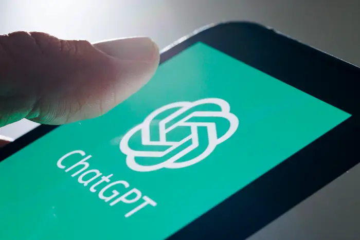
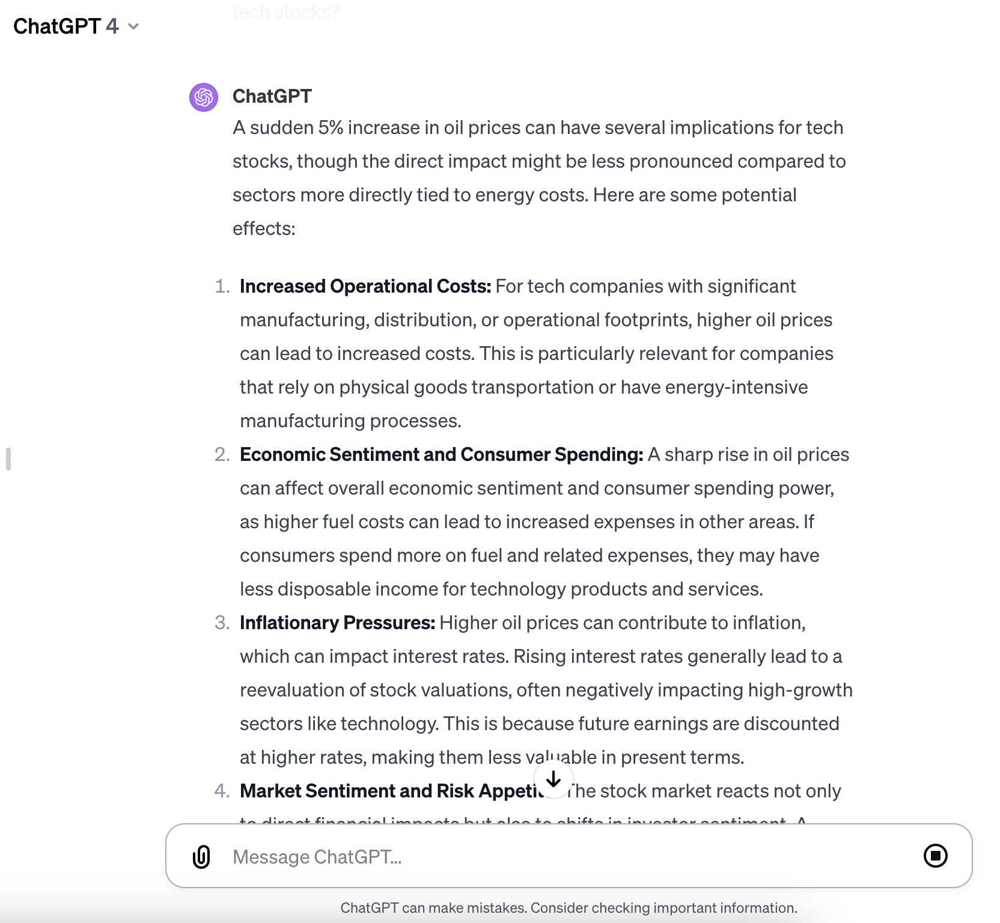
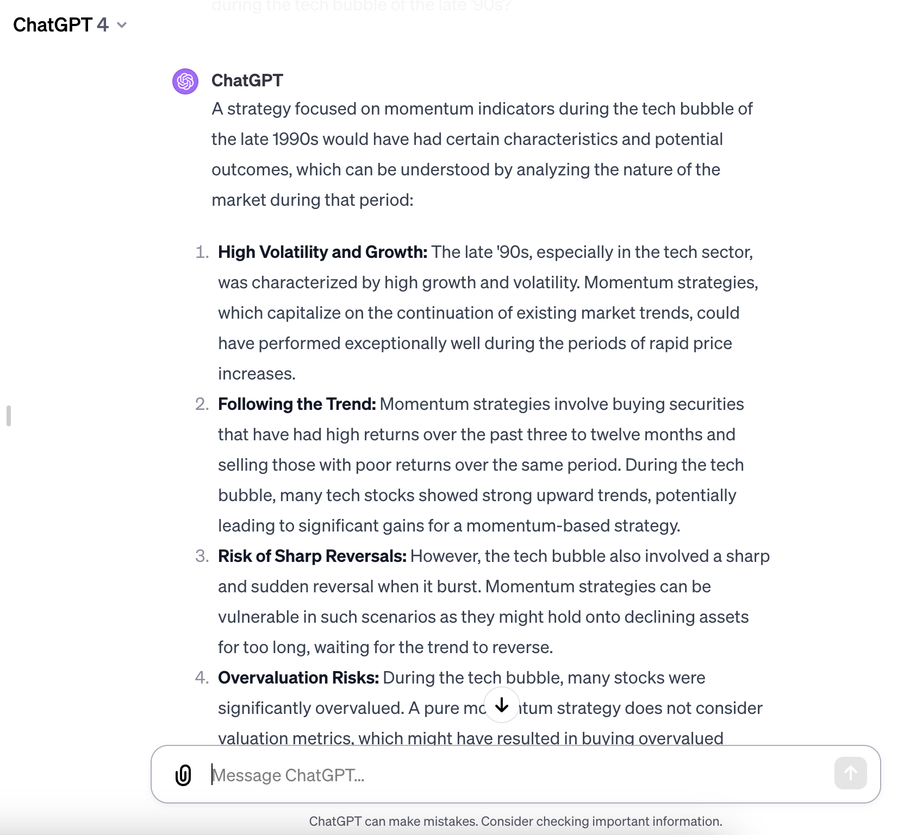
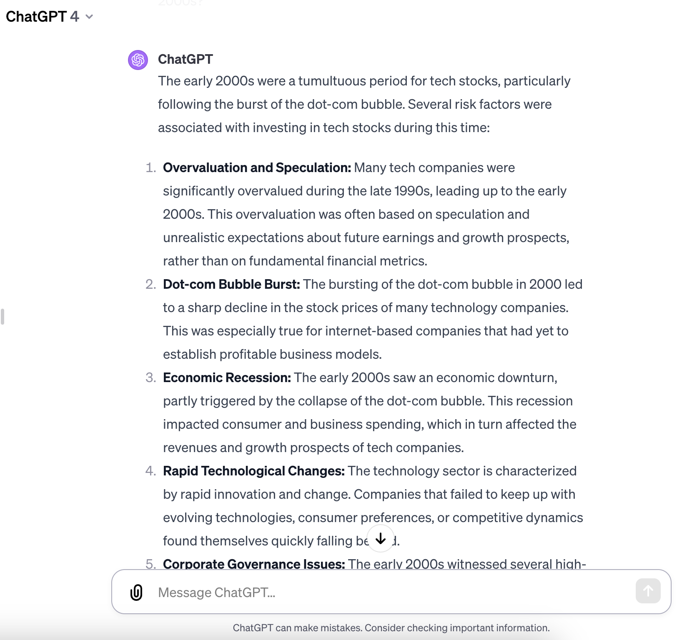

Algorithmic trading, at its core, involves leveraging computer programs to execute a set of predefined trading instructions based on various criteria such as time, volume, and price. This method, driven by speed and precision, has transformed trading floors globally, rendering manual trading methods less prevalent. As technology advanced, the intersection of algorithmic trading and artificial intelligence (AI) became inevitable. AI, with its capability to process vast amounts of data, identify patterns, and make predictions, introduced a new dimension to trading that extended far beyond the capabilities of standard algorithms.

Enter ChatGPT. Originally designed as a conversational AI by OpenAI, ChatGPT's potential in trading has recently captured significant attention. It's not just about executing trades anymore; it's about harnessing the AI's ability to adapt, learn, and provide insights based on continuous data intake. The model's dynamic nature, combined with its expansive knowledge base, has positioned it as a game-changer for traders looking for more than just automated trade execution.

This article investigates deep into ChatGPT's world, exploring its capabilities, advantages, and how it's revolutionizing the very fabric of algorithmic trading. We aim to provide a comprehensive guide for those curious about or actively looking to integrate ChatGPT into their trading arsenal.

## Table of Contents

## Understanding ChatGPT: A Brief Overview

ChatGPT, developed by OpenAI, is built upon the GPT (Generative Pre-trained Transformer) architecture, a form of deep learning model that leverages large amounts of data to generate human-like text based on the input it receives. The GPT models are designed using transformers, which have the ability to handle long-range dependencies in data, making them ideal for complex tasks such as natural language processing. In essence, the model is pre-trained on vast datasets and then fine-tuned for specific tasks. This training methodology enables ChatGPT to understand context, make inferences, and provide detailed, relevant outputs.

One of the standout features of ChatGPT that renders it suitable for trading applications is its adaptability. The model isn't just a static algorithm; it's a dynamic system capable of learning and adapting. This means, for traders, ChatGPT can process large [volume](/wiki/volume-trading-strategy)s of market data, recognize emerging patterns faster than the human eye, and suggest potential strategies or alterations to existing ones. Furthermore, with its vast knowledge base, ChatGPT can integrate insights from various financial sectors, news, and historical data, offering traders a more holistic view of the market.

When comparing ChatGPT to traditional trading algorithms, the differences become starkly evident. Traditional trading algorithms are rule-based, meaning they operate based on a predefined set of instructions and lack the ability to adapt to new information unless reprogrammed. In contrast, ChatGPT, with its [machine learning](/wiki/machine-learning) backbone, can adapt its strategies based on new data, ensuring traders are always equipped with the most up-to-date information and strategies. This adaptability can be the difference between capitalizing on a market opportunity and missing it entirely.

However, it's important to note that while ChatGPT offers significant advantages, it doesn't render traditional algorithms obsolete. Traditional trading algorithms, with their deterministic nature, can be more predictable and stable in certain market conditions. It's the fusion of the deterministic approach of traditional algorithms with the adaptability of ChatGPT that holds the potential to redefine [algorithmic trading](/wiki/algorithmic-trading).

## Harnessing the Power of ChatGPT for Trading

### Strategy Development with ChatGPT

Strategy development in trading is a multifaceted process that involves understanding market behaviors, analyzing historical data, and predicting future trends. ChatGPT, given its [deep learning](/wiki/deep-learning) foundation and ability to process vast amounts of data in real-time, plays a transformative role in this domain.

Interacting with ChatGPT allows traders to brainstorm and refine strategies dynamically. Instead of statically setting a trading rule and hoping for the best, traders can now pose hypothetical scenarios to ChatGPT, seeking its insights based on its vast knowledge base. For instance, a trader might ask, "What would be the implications of a sudden 5% increase in oil prices on tech stocks?" ChatGPT can draw from historical events, contextual data, and its trained understanding to provide insights that might not be immediately obvious even to seasoned traders.

By leveraging ChatGPT in the strategy development phase, traders not only gain a tool that provides insights based on massive data sets but also an adaptable ally that can respond to the ever-changing landscape of the markets. The fusion of human intuition with ChatGPT's analytical prowess promises a more responsive, informed, and adaptable approach to trading in the modern era[1].

### Backtesting and Strategy Evaluation

Backtesting, a crucial step in the trading world, involves testing a strategy on historical data to gauge its potential effectiveness. The objective is to ascertain how a strategy would have performed in the past, giving traders a semblance of its potential future performance.

ChatGPT's vast knowledge base, coupled with its natural language processing capabilities, offers a fresh approach to [backtesting](/wiki/backtesting). Instead of sifting through endless lines of historical data manually or using rigid algorithms, traders can engage with ChatGPT, posing complex queries about past market behaviors. For instance, traders can ask, "How would a strategy focused on [momentum](/wiki/momentum) indicators have fared during the tech bubble of the late '90s?" ChatGPT can analyze the provided strategy against its extensive database, considering market conditions, [volatility](/wiki/volatility-trading-strategies), and other relevant [factor](/wiki/factor-investing)s from that period.

The real marvel, however, is the speed and efficiency with which ChatGPT operates. Traditional backtesting tools often require specific coding, manual adjustments, and can be time-consuming, especially when considering multiple variables. With ChatGPT, the time from posing a question to receiving an insightful analysis is dramatically reduced. This efficiency enables traders to quickly iterate, refining strategies and testing them against multiple historical scenarios in a fraction of the time.

Moreover, the feedback from ChatGPT isn't just a binary outcome of profit or loss. It can provide context, highlighting potential strengths and weaknesses of a strategy, areas where it might have struggled due to specific market events, or periods where it outperformed.

By utilizing ChatGPT in backtesting and strategy evaluation, traders stand to benefit from rapid, contextual insights that can significantly inform their forward-looking trading decisions.

### Risk Management and Optimization

In the dynamic world of trading, risk management remains a cornerstone for success. Proactively identifying, assessing, and managing potential pitfalls can make the difference between profit and ruin. ChatGPT, with its profound language processing and analytical capabilities, serves as a potent tool for this critical function.

To comprehend the vast landscape of potential risks, traders often rely on a mix of qualitative assessments and quantitative models. Here, ChatGPT can distill complex market data, news, and historical patterns into actionable insights. For instance, by querying "What were the risk factors associated with tech stocks in the early 2000s?" traders can gain an understanding of both market-specific and broader economic risks, guiding their future decisions.

Beyond merely identifying risks, ChatGPT's real strength lies in its adaptability. The AI can process and react to new information swiftly. As market conditions change or new data emerges, traders can obtain real-time feedback. If there's an unexpected news event, like a geopolitical incident or a sudden regulatory change, traders can immediately consult with ChatGPT to gauge the potential impact on their portfolio and recalibrate strategies accordingly.

## Practical Tips for Traders

Trading with ChatGPT brings forth a confluence of human intuition and AI-backed analytics. But to harness this synergy, traders must be aware of the best practices, the potential pitfalls, and the intricacies of tweaking system parameters.

**Best Practices When Trading with ChatGPT:**

1. **Continuous Learning:** Just as ChatGPT thrives on learning from vast data, traders should regularly update their knowledge base. This ensures that the queries posed to ChatGPT are well-informed and specific.
2. **Clear Communication:** While ChatGPT is designed to understand human language, it's pivotal to phrase questions and instructions unambiguously. This minimizes misinterpretations and ensures accurate feedback.
3. **Diversify Data Sources:** For more accurate market analysis, feed ChatGPT with a variety of quality data sources. This includes historical price data, real-time news feeds, and macroeconomic indicators.
4. **Stay Engaged:** Relying solely on ChatGPT without human oversight can be risky. Active participation and continuous monitoring can avert unwanted trading decisions.

**Potential Pitfalls and How to Avoid Them:**

1. **Over-reliance:** While ChatGPT is powerful, it's not infallible. Blindly following its advice without cross-checking or employing human judgment can lead to unfavorable outcomes.
2. **Data Quality:** Garbage in, garbage out. If the data input to ChatGPT is flawed or biased, the predictions or advice it provides will be skewed. Ensure that the data sources are reliable.
3. **Latency Issues:** In high-frequency trading scenarios, a millisecond can make a significant difference. Ensure that your system's infrastructure is optimized to minimize any lags in communication with ChatGPT.
4. **Misinterpretation:** Sometimes, ChatGPT might provide insights based on its training but might miss the context. Always apply a layer of human interpretation to its responses.

**Adjusting Parameters and Settings for Best Performance:**

1. **Custom Training:** If possible, fine-tune ChatGPT with specific financial datasets. This refines its understanding of market nuances, leading to better-informed responses.
2. **Feedback Loop:** Create a mechanism where the results of trading decisions, whether profitable or not, are fed back into ChatGPT. This iterative feedback refines its subsequent suggestions.
3. **Adjust Response Time:** For traders not engaged in high-frequency trading, allowing ChatGPT slightly more response time can lead to more thoughtful and comprehensive answers.
4. **API Limits:** Be aware of any API call limitations when integrating ChatGPT into your trading platform. Efficiently structure your queries to retrieve maximum relevant information within the call limits.

In essence, while ChatGPT revolutionizes algorithmic trading by providing profound insights, the onus remains on traders to judiciously amalgamate these insights with their expertise for the best outcomes.

## ChatGPT vs. Traditional and Other Automated Trading Systems

ChatGPT has emerged as a powerful contender in the algorithmic trading arena, but how does it stack up against traditional and other automated trading systems? Let's dive into an analytical comparison.

**Strengths of ChatGPT:**

1. **Natural Language Processing (NLP):** Unlike many traditional systems, ChatGPT's core strength lies in its advanced NLP capabilities. This allows traders to interact with the system in a conversational manner and extract insights from unstructured data sources like news articles or financial reports[2].
2. **Adaptability:** Machine learning underpins ChatGPT, enabling it to learn and adapt over time. While some automated systems operate on predefined rules, ChatGPT can adjust its recommendations based on new data and feedback loops.
3. **Integration with ML Models:** ChatGPT can seamlessly integrate with other machine learning models, adding layers of sophistication to trading strategies and predictions.
4. **Real-time Strategy Adaptation:** With its quick processing capabilities, ChatGPT can analyze market conditions in real-time and suggest immediate strategy adaptations, offering a dynamic edge.

**Weaknesses of ChatGPT:**

1. **Lack of Domain-specific Knowledge:** Out of the box, ChatGPT doesn’t possess specialized financial domain knowledge. It often requires custom training or supplementary data to be truly effective in the trading context.
2. **Dependency on Quality Data:** Like any AI, the effectiveness of ChatGPT heavily depends on the quality and relevance of the data it's trained on or interacts with.
3. **Over-reliance Risk:** Due to its conversational ease, traders might be tempted to rely solely on ChatGPT's recommendations, sidelining human judgment which is crucial, especially in volatile or unpredictable market scenarios.

**Scenarios Favoring ChatGPT:**

- **News-driven Trading:** For strategies based on news events or sentiment analysis, ChatGPT's NLP prowess makes it a prime choice.
- **Mixed Data Sources:** In situations where trading insights are drawn from a mix of structured and unstructured data, ChatGPT can integrate and process diverse data efficiently.

**Scenarios Favoring Traditional Systems:**

- **High-frequency Trading:** Traditional systems designed specifically for high-speed trades might outperform ChatGPT in terms of sheer transaction speed.
- **Well-defined Rule-based Strategies:** For markets or strategies that thrive on well-defined rules and don’t require frequent adaptability, traditional automated systems may be more reliable.

In summary, while ChatGPT offers innovative advantages, especially in NLP and adaptability, it isn't a one-size-fits-all solution. Traders should evaluate their specific needs, strategies, and market scenarios before choosing between ChatGPT and other systems.

## The Road Ahead: The Future of ChatGPT in Trading

With the continuous advancement in both AI and the financial sector, the fusion of these domains is becoming more sophisticated and influential. As a focal point in this amalgamation, ChatGPT's role in trading is anticipated to undergo significant evolution.

Emerging trends reveal an increasing emphasis on **real-time data processing and decision-making**. As financial markets become more dynamic, the demand for real-time insights and strategy adjustments grows. ChatGPT's natural language processing capabilities can be harnessed to interpret live news feeds, social media sentiments, and more, translating them into actionable trading strategies.

**Personalized trading experiences** are another frontier. Just as consumer tech tailors user experiences, future iterations of ChatGPT could potentially provide traders with insights and strategies customized to their individual trading styles, risk appetites, and portfolio preferences.

In summation, the nexus of AI and trading, with ChatGPT at its helm, heralds a transformative era. As the boundaries of technology are pushed further, the trading world should brace itself for innovations that redefine traditional practices and offer unprecedented opportunities.

## Conclusion

The rise of ChatGPT in the trading realm isn't just a fleeting trend—it represents a transformative shift towards integrating sophisticated [artificial intelligence](/wiki/ai-artificial-intelligence) into the core of trading strategies. We've delved deep into how ChatGPT's architecture and capabilities make it not only possible but also advantageous to use in crafting, adapting, and refining trading algorithms.

The blending of ChatGPT with trading isn't just about automation; it's about harnessing the power of AI to make more informed, timely, and intelligent decisions in an ever-evolving market. The diverse range of tools and platforms emerging to integrate ChatGPT into the trading ecosystem further underlines its increasing importance.

But, as with any tool, its real value is unlocked when wielded with knowledge, understanding, and a penchant for continuous learning. To all traders—whether you're a seasoned pro or just starting your journey—we urge you to dive into the world of AI-driven trading with ChatGPT. Experiment, learn from both successes and setbacks, and continually adapt to reap the rewards that this AI revolution in trading promises.

## Frequently Asked Questions

**Can ChatGPT predict stock prices?**

ChatGPT is not a forecasting tool but can aid in analyzing market data, sentiment, and news. For price predictions, integration with specific forecasting models is recommended.

**How secure is ChatGPT in trading applications?**

While ChatGPT itself is secure, when integrating it into trading platforms, ensure that all data transmissions are encrypted and systems are regularly audited for vulnerabilities.

**Is ChatGPT better than traditional trading algorithms?**

ChatGPT offers a novel approach by leveraging natural language processing. While it has advantages in analyzing unstructured data and real-time adaptation, its effectiveness compared to traditional algorithms depends on the specific use case and implementation.

**How do I train ChatGPT with my trading data?**

Detailed tutorials are available that guide users through the process of feeding financial data into ChatGPT, allowing the model to understand and adapt to specific trading scenarios.

**Are there any costs associated with using ChatGPT for trading?**

While ChatGPT can be accessed for free, advanced features, higher compute power, and specific integrations might incur costs. Always check the licensing terms when integrating into commercial platforms.

## References & Further Reading

[1] Radford, A., et al. (2019). [Language Models are Unsupervised Multitask Learners](https://d4mucfpksywv.cloudfront.net/better-language-models/language_models_are_unsupervised_multitask_learners.pdf). OpenAI.

[2]: Brown, T. B., et al. (2020). [Language Models are Few-Shot Learners](https://arxiv.org/abs/2005.14165). NeurIPS.