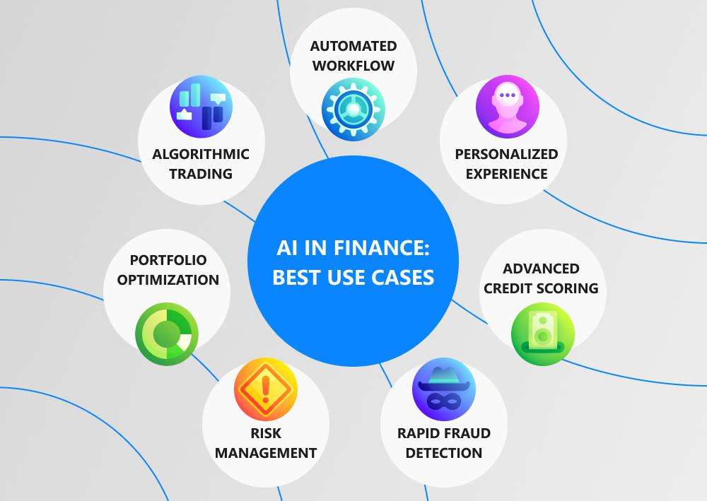

In the fast-paced world of financial markets, traders and investors are constantly seeking ways to enhance their strategies and maximize returns. One approach that has garnered significant attention in recent years is algorithmic trading, often referred to as algo trading. This method leverages sophisticated algorithms to automate trading decisions and executions, offering the potential for improved efficiency and reduced human error.

Algorithmic trading utilizes computer programs to execute trades based on a set of pre-defined rules and parameters. These algorithms are designed to process vast amounts of market data swiftly, allowing for decisions to be made much faster than a human trader could manage. The primary advantages include increased speed, accuracy, and the ability to handle complex data sets free from emotional bias. For instance, a trader might program an algorithm to buy or sell assets based on specific conditions like price movements or technical indicators.



However, one of the barriers to entry has traditionally been the cost associated with developing and maintaining such systems. Historically, these systems required significant investment in both technology infrastructure and skilled professionals to create and manage effective algorithms. Large financial institutions with deep pockets were typically the only entities able to afford these systems, leaving smaller players with limited options.

In this article, we will explore the concept of cheap intelligence for financial markets through the lens of algo trading and highlight some cost-effective solutions available today. These advances open up opportunities for a wider range of market participants to leverage sophisticated trading strategies without the prohibitive costs previously associated with algorithmic trading. We will examine how recent technological advancements and the democratization of financial tools have begun to level the playing field, offering new possibilities for both institutional and retail investors.

## Table of Contents

## What is Algorithmic Trading?

Algorithmic trading, often abbreviated as algo trading, is a method of executing trades utilizing computer programs that adhere to a set of pre-defined rules and parameters. These algorithms are crafted to make trading decisions based on real-time market data inputs, allowing for transactions to be carried out faster and more frequently than is possible through manual human intervention. 

The speed and efficiency of algorithmic trading provide several key advantages. Algorithms can process large volumes of data in milliseconds, offering decision-making and execution times that far surpass human capabilities. This rapid action not only increases the volume of trades that can be conducted but also enhances the market [liquidity](/wiki/liquidity-risk-premium) and ensures timely exploitation of small price discrepancies in the market. Additionally, algorithmic trading minimizes the emotional biases that can influence human traders, thereby promoting more rational and objective trading decisions.

The rules that underpin [algorithmic trading](/wiki/algorithmic-trading) can be constructed around various factors, such as timing, price, quantity, and any mathematically derived model. For instance, a simple algorithmic trading rule might incorporate the moving average crossover strategy, where a buy signal is generated when a shorter-term moving average crosses above a longer-term moving average, and a sell signal is triggered when the opposite occurs. This can be expressed as:
$$
\text{Signal} = \begin{cases} 
\text{Buy}, & \text{if } MA_{\text{short}} > MA_{\text{long}} \\
\text{Sell}, & \text{if } MA_{\text{short}} < MA_{\text{long}} 
\end{cases}
$$
where $MA_{\text{short}}$ and $MA_{\text{long}}$ represent the short-term and long-term moving averages, respectively.

Beyond simple strategies, more complex algorithms might incorporate statistical models, such as mean reversion or [arbitrage](/wiki/arbitrage) strategies. Python, a versatile and widely-used programming language, is frequently employed to develop and implement these algorithms due to its comprehensive libraries and ease of use. An example of a simple mean reversion strategy might involve buying a stock when its current price is a certain percentage below its historical average price over a defined period and selling when it rises above this average. Such strategies can be coded to execute automatically, maintaining predefined criteria and thresholds at all times, and ensuring consistent adherence to the trading strategy. 

Overall, algorithmic trading revolutionizes market engagement by fostering precision and reliability through extensive data analysis and computational decision-making capabilities.

## Cost Barriers in Traditional Algo Trading

Historically, the development of algorithmic trading systems has been constrained by significant financial and technical barriers. A major [factor](/wiki/factor-investing) contributing to these challenges is the high cost of infrastructure required to support such systems. Setting up a robust infrastructure involves acquiring high-performance computing resources, which are necessary to process and analyze vast amounts of market data quickly. Additionally, the need for reliable and low-latency data feeds, which provide real-time market information, further escalates the costs. These data feeds are essential for the precise execution of trades, yet they often come with substantial subscription fees, making them accessible primarily to large financial institutions with substantial budgets.

Another cost-intensive aspect of traditional algo trading is the development and maintenance of sophisticated algorithms. Crafting effective algorithms necessitates the collaboration of skilled programmers and financial analysts who can design, test, and refine trading strategies. This requirement for specialized expertise not only increases the initial investment but also results in ongoing operational expenses tied to retaining talent and continuously updating the algorithms to adapt to changing market conditions.

Furthermore, regulatory requirements and compliance add additional layers of complexity and expense. Building systems that adhere to legal trading standards involves implementing comprehensive monitoring, reporting mechanisms, and safeguards against unauthorized trading activities. This regulatory compliance demands further investment in both technology and human resources, as failure to comply can result in severe penalties.

Collectively, these factors have historically positioned algorithmic trading as a domain primarily dominated by large institutions, where the economies of scale could offset the substantial costs. However, with technological advancements and the rise of affordable trading platforms, these barriers are gradually diminishing, opening opportunities for smaller players to enter the market.

## Cheap Intelligence: The Rise of Affordable Solutions

Recent advancements in technology and the democratization of financial tools have made algorithmic trading more accessible and affordable. This transformation has been facilitated by platforms such as TradeStation, [Interactive Brokers](/wiki/interactive-brokers-api), and TrendSpider, which offer powerful tools for retail investors to design and execute algorithmic strategies without incurring prohibitive costs.

TradeStation provides robust algo trading capabilities with no account minimums, allowing a wide spectrum of traders to utilize their platform. By offering a range of analytical resources and a straightforward interface, it empowers users to create sophisticated trading algorithms. The cost structure is designed to accommodate traders at various levels, making high-frequency trading and [backtesting](/wiki/backtesting) achievable for those with less capital.

Interactive Brokers similarly offers an array of tools tailored to different types of traders. The platform features flexible pricing tiers and access to a comprehensive API for custom algorithm development. This flexibility ensures that both novice and experienced traders can implement and benefit from algorithmic strategies. Additionally, Interactive Brokers facilitates global market access, providing users the ability to diversify and optimize their trading portfolios efficiently.

TrendSpider takes a unique approach by focusing on automating technical analysis. The platform provides a suite of tools designed to identify and execute trades based on technical signals, reducing the need for extensive manual input. Users can leverage the platform's automated chart pattern recognition and backtesting features to refine their strategies and improve accuracy. The inclusion of drag-and-drop interfaces and pre-built templates further lowers the barrier to entry, enabling individuals without programming skills to engage in algorithmic trading.

These platforms exemplify how technological progress has paved the way for more individuals to access sophisticated trading mechanisms. By lowering costs and simplifying complex processes, they allow traders to enhance their market participation and potentially increase their returns. As a result, a broader audience can now employ algorithmic trading approaches previously reserved for large financial institutions.

## Popular Affordable Algo Trading Platforms

TradeStation serves as a prominent platform in the algorithmic trading domain, known for its robust capabilities and accessibility to a broad spectrum of traders. Notably, TradeStation imposes no account minimums, effectively lowering the entry barrier for individual traders and small to medium-sized trading entities. The platform provides a comprehensive suite of tools, including EasyLanguage, a proprietary coding language that simplifies the customization of trading strategies and system development. This characteristic allows traders to automate trades based on specific algorithms without extensive programming knowledge, facilitating enhanced precision and efficiency in trade executions.

Interactive Brokers stands out by offering flexible pricing structures, accommodating a diverse array of trading preferences and requirements. Its pricing tiers are designed to cater to both low-[volume](/wiki/volume-trading-strategy) retail traders and high-frequency institutional traders, making it an attractive choice for a broad demographic. The platform also includes an Advanced Programming Interface (API), which empowers developers to craft custom algorithms that can operate seamlessly across different financial instruments and markets. This API is particularly valuable for traders with bespoke trading strategies or those seeking to integrate complex algorithms into their trading operations.

TrendSpider distinguishes itself by focusing on the automation of technical analysis, a critical component of algorithmic trading. By streamlining the identification and execution of technical signals, TrendSpider reduces the need for manual chart analysis and shortens the decision-making process. Its platform harnesses advanced [machine learning](/wiki/machine-learning) algorithms to detect patterns and trends within market data, enabling traders to respond effectively to market changes. The visual appeal of TrendSpider, combined with its user-friendly drag-and-drop interface, makes it an ideal tool for traders who prefer an intuitive approach to technical analysis and algo trading.

These platforms collectively contribute to the increased accessibility and cost-effectiveness of algorithmic trading, enabling more traders to adopt sophisticated trading strategies without incurring prohibitive expenses. By offering diverse tools and features tailored to various trading needs, they play a crucial role in the democratization of financial markets.

## The Role of AI in Cost-Effective Algo Trading

Artificial Intelligence (AI) is revolutionizing the landscape of algorithmic trading by enhancing both efficiency and cost-effectiveness. AI-powered tools are capable of processing and analyzing vast datasets in real time, offering valuable predictions and insights that significantly bolster trading strategies. This capability is crucial in a domain where millisecond advantages can yield considerable financial outcomes.

The application of AI in trading primarily involves machine learning algorithms, which excel in identifying patterns and correlations within large volumes of market data. For example, these algorithms can process historical price movements, trading volumes, and other market indicators to generate models that predict future market trends. Tools like natural language processing (NLP) have been adopted to analyze news articles, social media feeds, and other unstructured data sources, providing a more nuanced understanding of market sentiment and potential market-moving events.

By employing AI technologies, traders can reduce their dependency on expensive human analysis, instead harnessing the power of machine learning models that are trained to continuously learn and adapt to new market dynamics. This not only reduces operational costs but also enhances the precision and speed of trading decisions. AI algorithms can execute trades without the delay inherent in human decision-making, thus capturing opportunities more effectively.

An exemplary use case is the implementation of [reinforcement learning](/wiki/reinforcement-learning) in trading strategies. Here, an algorithm learns to make sequence-based decisions to maximize a specified reward function, such as profit maximization. The process mirrors how humans learn from consequences of their actions, but with the advantage of processing and analyzing far greater quantities of data.

Python, with its robust libraries like NumPy, pandas, TensorFlow, and Keras, provides an accessible platform for developing AI-driven trading algorithms. For instance, a simple machine learning model predicting stock prices could be built using Python as follows:

```python
import numpy as np
import pandas as pd
from sklearn.model_selection import train_test_split
from sklearn.ensemble import RandomForestRegressor

# Load stock price dataset
data = pd.read_csv('stock_prices.csv')

# Preprocessing: Extract features and target variable
X = data[['feature1', 'feature2', 'feature3']]  # select relevant features
y = data['stock_price']  # target variable

# Split data into training and testing sets
X_train, X_test, y_train, y_test = train_test_split(X, y, test_size=0.2, random_state=42)

# Train a Random Forest model
model = RandomForestRegressor(n_estimators=100, random_state=42)
model.fit(X_train, y_train)

# Predict and evaluate
predictions = model.predict(X_test)
```

Here, the `RandomForestRegressor` is used for its robustness in handling various data types and distributions, making it suitable for complex financial data.

As AI continues to evolve, its integration into algorithmic trading will become increasingly sophisticated, enabling traders to not only optimize their strategies but also innovate new approaches to mastering financial markets efficiently and cost-effectively.

## Conclusion

As financial markets continue to evolve, algorithmic trading is increasingly becoming a standard practice for investors and traders. This shift is largely due to the rise of affordable and accessible tools that have democratized the playing field. Previously, sophisticated trading strategies were primarily the domain of large financial institutions with deep pockets and extensive resources. However, with recent advancements in technology, individual traders and smaller firms can now leverage algorithmic trading techniques to enhance their market activities.

These tools and platforms, which are often powered by [artificial intelligence](/wiki/ai-artificial-intelligence), have made it possible for a wider range of participants to capitalize on complex trading strategies. The integration of AI into these systems provides traders with the ability to process vast datasets rapidly, leading to more informed and timely decisions. For example, AI algorithms can sift through historical price data to identify patterns that may indicate future movements, thereby enhancing the predictive accuracy of trading strategies.

The impact of these advancements is profound, as they allow for reduced reliance on costly human analysis and enable more efficient use of resources. This cheap intelligence is not only reducing barriers to entry but is also offering new opportunities for profitability. Automated systems can execute trades with precision and without the emotional biases that typically affect human traders, which can lead to improved outcomes in terms of both performance and consistency.

As the tools continue to evolve and become more sophisticated, we can expect further transformations in how investors approach financial markets. Algorithmic trading, with its increased accessibility and efficiency, is paving the way for more innovative approaches, ultimately fostering a more inclusive and dynamic market environment. The continuous development and adoption of these technologies promise significant potential for growth and profitability, ensuring that even the smallest players can partake in sophisticated market strategies.

## References & Further Reading

[1]: Lopez de Prado, M. (2018). ["Advances in Financial Machine Learning."](https://www.amazon.com/Advances-Financial-Machine-Learning-Marcos/dp/1119482089) Wiley.

[2]: Chan, E. P. (2008). ["Quantitative Trading: How to Build Your Own Algorithmic Trading Business."](https://github.com/ftvision/quant_trading_echan_book) Wiley.

[3]: Aronson, D. (2006). ["Evidence-Based Technical Analysis: Applying the Scientific Method and Statistical Inference to Trading Signals."](https://onlinelibrary.wiley.com/doi/book/10.1002/9781118268315) Wiley.

[4]: Jansen, S. (2020). ["Machine Learning for Algorithmic Trading: Predictive models to extract signals from market and alternative data for systematic trading strategies with Python."](https://github.com/stefan-jansen/machine-learning-for-trading) Packt Publishing.

[5]: Interactive Brokers. ["IBKR Trading Platforms."](https://www.interactivebrokers.com/en/trading/trading-platforms.php) 

[6]: TradeStation. ["TradeStation Trading Platform."](https://www.tradestation.com/platforms-and-tools/desktop/) 

[7]: TrendSpider. ["Automated Technical Analysis."](https://help.trendspider.com/kb/automated-technical-analysis) 

[8]: Focardi, S., & Fabozzi, F. J. (2004). ["The Mathematics of Financial Modeling and Investment Management."](https://archive.org/details/mathematicsoffin0000foca) Wiley.