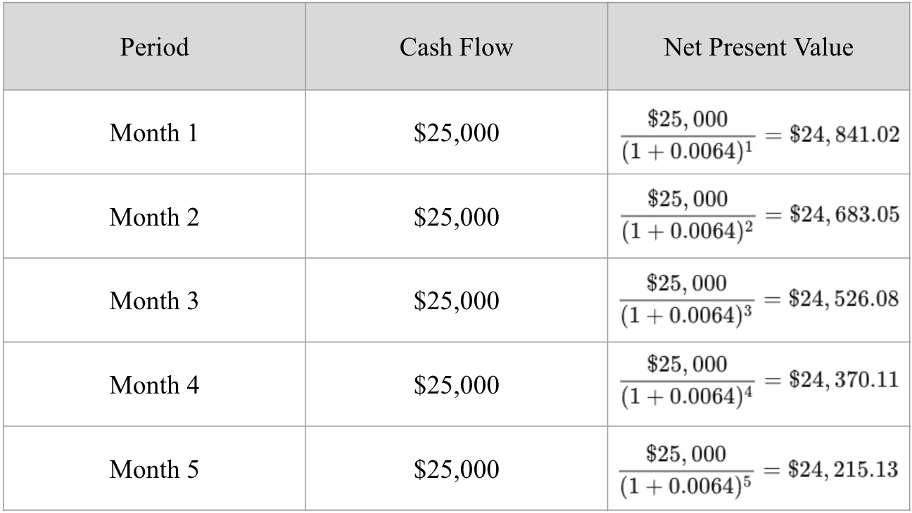

Financial markets are pivotal structures in the global economy, serving as platforms for the trading of financial securities such as stocks and bonds. They facilitate liquidity, enable price discovery, and provide opportunities for wealth accumulation through investments in various asset classes. Stock investment, in particular, plays a crucial role by allowing individuals and institutions to gain partial ownership in companies, thereby participating in their success and growth.

Identifying cheap stocks emerges as a critical investment opportunity within these markets. A cheap stock, often referred to as undervalued, is characterized by a market price that is below its intrinsic value as estimated by fundamental analysis. Investors seek such stocks with the anticipation that their market value will eventually converge with their intrinsic value, potentially resulting in substantial returns. The ability to accurately identify and invest in these undervalued opportunities requires a nuanced understanding of market indicators and financial statements. Tools such as the Price-to-Earnings Ratio (P/E) and Book Value can aid in discerning stocks that might warrant further examination for being undervalued.



Algorithmic trading, the use of computer algorithms to execute trades at high speeds and frequencies, has profoundly impacted modern investing. It involves leveraging mathematical models and complex formulas to make trading decisions, executing orders based on predetermined criteria without human intervention. The integration of algorithmic trading into investment strategies has facilitated improved decision-making by processing large datasets, identifying trends, and executing trades with precision that is unattainable through manual efforts. This method of trading capitalizes on opportunities that arise due to inefficiencies in financial markets.

The purpose of this article is to explore strategies for stock investment using algorithmic trading, emphasizing how this approach can enhance the identification and exploitation of undervalued stocks. Investors are increasingly incorporating automation in trading strategies due to its potential to optimize performance and manage risks effectively. The growing popularity of these automated systems underscores the need to understand their mechanics and value within stock investment frameworks.

This article will cover key sections that guide the reader through understanding financial markets and cheap stocks, examining the advantages of stock investment, and exploring the fundamentals of algorithmic trading. It will further illustrate how to incorporate algorithmic trading into cheap stock investment and address the associated risks and challenges. Finally, it will look toward the future of algorithmic trading in stock investments, considering emerging trends and technological advancements. Through these insights, investors may better appreciate the transformative potential of algorithmic trading in achieving investment goals.

## Table of Contents

## Understanding Financial Markets and Cheap Stocks

Financial markets are essential components of the global economy, facilitating the exchange of securities, commodities, and other financial instruments. They enable efficient allocation of resources and liquidity, allowing investors to raise capital, transfer risk, and discover prices for goods and services. These markets encompass various platforms such as stock exchanges, bond markets, and derivatives markets, each serving distinct purposes but collectively ensuring economic stability and growth.\[1\]

In the stock market, one term frequently encountered is "cheap stocks." A "cheap stock" refers to a security that appears undervalued based on specific financial metrics or market sentiment. Typically, these stocks trade at a lower price compared to their intrinsic value or peers in the same industry. Identifying cheap stocks can be a critical strategy for investors seeking to maximize returns. However, it requires thorough analysis to distinguish genuinely undervalued stocks from those priced low due to fundamental weaknesses.\[2\]

Several factors contribute to a stock being perceived as cheap. Key metrics used for evaluating stock value include the price-to-earnings (P/E) ratio, price-to-book (P/B) ratio, and dividend yield. A low P/E ratio, for instance, may suggest that a stock is undervalued compared to its earnings. Similarly, a low P/B ratio might indicate that the stock is trading for less than its book value. High dividend yield can also appeal to investors, signaling potential for income.\[3\]

Investing in cheap stocks offers both risks and rewards. On the reward side, acquiring undervalued stocks can lead to significant capital gains if the market eventually recognizes and corrects the stock’s undervaluation. For example, a stock priced at $5 but intrinsically valued at $10 represents a potential 100% return if the market adjusts to reflect its true worth.

$$
\text{Potential Return (\%)} = \left( \frac{\text{Intrinsic Value} - \text{Market Value}}{\text{Market Value}} \right) \times 100\]

Yet, risks abound in this strategy. Stocks might be cheap because of underlying performance issues or poor market conditions affecting the sector. Investors might face prolonged periods of undervaluation or permanent capital loss if market conditions deteriorate further.

There are misconceptions about cheap stocks that can mislead investors. Some assume that a low-priced stock is necessarily a bargain. However, a low absolute price does not equate to being undervalued. Stocks could be cheap for reasons such as declining financial performance, negative market sentiment, or heightened competition. Additionally, market inefficiencies or lack of investor awareness might cause stocks to remain undervalued for extended periods.

Therefore, investing in cheap stocks requires rigorous analysis, not just focusing on low prices but assessing broader economic indicators, sector trends, and company fundamentals. By combining these insights with sound investment strategies, investors can potentially leverage cheap stocks for substantial gains while minimizing associated risks.\[4\]

---

\[1\]: "Financial system." *Wikipedia*. [https://en.wikipedia.org/wiki/Financial_system](https://en.wikipedia.org/wiki/Financial_system).

\[2\]: Graham, B. (2003). *The Intelligent Investor: The Definitive Book on Value Investing*. HarperBusiness.

\[3\]: "Valuation ratios." *Investopedia*. [https://www.investopedia.com/terms/o/valuationratios.asp](https://www.investopedia.com/terms/o/valuationratios.asp).

\[4\]: Damodaran, A. (2002). *Investment Valuation: Tools and Techniques for Determining the Value of Any Asset*. John Wiley & Sons.

## The Advantages of Stock Investment

Investing in the stock market offers numerous advantages, primarily through its potential to achieve substantial long-term financial growth. When assessing these benefits, one must consider a few key aspects: the potential for wealth accumulation, the advantages brought by diversification, and the methodologies used for evaluating stock performance.

### Long-term Benefits of Investing in the Stock Market

The stock market is recognized for its capacity to provide significant returns over extended periods. Financial markets historically generate higher returns compared to other investment vehicles such as savings accounts or government bonds. For instance, data from the S&P 500, one of the most referenced stock market indices, shows an average return of approximately 7-10% per annum when adjusted for inflation.

This long-term growth can compound wealth exponentially, a concept illustrated by the formula for compound interest:

$$
A = P \left(1 + \frac{r}{n}\right)^{nt}
$$

where:
- $A$ is the amount of money accumulated after n years, including interest.
- $P$ is the principal amount (the initial amount of money).
- $r$ is the annual interest rate (decimal).
- $n$ is the number of times that interest is compounded per year.
- $t$ is the time the money is invested for in years.

### Strategic Stock Investment and Wealth Accumulation

Strategic stock investment involves choosing securities that offer the best potential for growth based on thorough analysis and market understanding. Through active management or strategic passive investment, investors can significantly enhance their capital. Active investors may pursue [growth stocks](/wiki/growth-stocks), leveraging their potential for capital appreciation, while others may prefer a value investing strategy, focusing on undervalued companies with strong fundamentals.

### Impact of Diversification through Stock Portfolios

Diversification is a risk management strategy that mixes a wide variety of investments within a portfolio. By owning stocks from various sectors and geographies, an investor can mitigate the adverse effects of market [volatility](/wiki/volatility-trading-strategies). The principle relies on the fact that the performance of various asset classes is not perfectly correlated, thus reducing the total risk of a portfolio. The efficient frontier, a concept from Modern Portfolio Theory, illustrates how diversification can optimize a portfolio's return for a given risk level.

### Evaluating Stock Performance Based on Fundamental and Technical Analysis

To make informed investment decisions, investors often rely on both fundamental and technical analysis:

- **Fundamental Analysis**: This evaluates a security by examining related economic and financial factors. Key metrics include earnings per share (EPS), price to earnings ratio (P/E), and return on equity (ROE). This approach looks at the company's intrinsic value, assessing whether the stock is correctly valued by the market.

- **Technical Analysis**: This focuses on statistical trends derived from trading activity, such as price movement and volume. Analysts use charts and other tools to identify patterns and forecast future movements. Simple moving averages (SMA) and relative strength index (RSI) are examples of techniques used in technical analysis.

Both analyses provide unique insights and are often used in tandem to offer a comprehensive view of a stock's potential. These strategies, when applied effectively, allow investors to choose stocks that align with their risk tolerance and return expectations, thus maximizing investment success.

## Exploring Algorithmic Trading

Algorithmic trading, often referred to as algo trading, involves the use of complex algorithms to execute trading orders at optimal prices. It employs mathematical models and advanced software to make high-speed transactions with minimal human intervention. This methodology is prominent in major financial markets due to its efficiency and ability to process vast amounts of data.

Algorithms execute trades based on pre-defined criteria, which may include timing, price, quantity, and other mathematical calculations. For instance, an algorithm might be programmed to buy 100 shares of a stock when its 50-day moving average crosses above its 200-day moving average, signifying a potential upward trend. This approach allows traders to capitalize on market movements more swiftly than manual trading methods.

One of the major advantages of [algorithmic trading](/wiki/algorithmic-trading) is its capacity to conduct transactions at speeds and frequencies impossible for a human trader. This speed ensures that orders are implemented at the best possible prices, reducing trading costs and slippage. Additionally, algorithms can perform trades without the emotional and psychological biases that often affect human traders, leading to more consistent decision-making.

Several tools and platforms facilitate algorithmic trading. Popular platforms such as MetaTrader, NinjaTrader, and QuantConnect provide traders with the software needed to develop, test, and execute trading algorithms. These platforms typically offer features like strategy [backtesting](/wiki/backtesting), real-time data feeds, and API integration, making them versatile for both novice and experienced traders.

Some of the commonly employed algorithmic trading strategies include:

1. **Trend Following Strategies**: These algorithms identify and trade in the direction of prevailing market trends. Techniques such as moving averages and momentum indicators are frequently used to detect these trends.

2. **Arbitrage Strategies**: These strategies exploit price differentials of the same asset across different markets or forms. Algorithms identify and capitalize on these inefficiencies almost instantaneously.

3. **Market Making**: This involves placing buy and sell limit orders simultaneously to capture the spread between bid and ask prices. Algorithms adjust these orders based on real-time market conditions to maintain liquidity.

4. **Mean Reversion**: This strategy assumes that asset prices will revert to their historical average over time. Algorithms identify overbought or oversold conditions to execute trades accordingly.

5. **Statistical Arbitrage**: Utilizing quantitative models, these algorithms find trading opportunities from price movements of a basket of securities rather than individual stocks, thereby reducing risk through diversification.

Algorithmic trading is integral to modern financial markets, enhancing efficiency and [liquidity](/wiki/liquidity-risk-premium) while providing opportunities for both profit maximization and risk management. As technology progresses, its role is expected to expand further within the investing landscape.

## Incorporating Algo Trading in Cheap Stock Investment

Algorithmic trading has become essential in modern investment, aiding in the identification and exploitation of undervalued stocks, commonly referred to as "cheap stocks." This section focuses on leveraging algorithmic trading tools to identify such stocks, implementing effective strategies, validating these strategies through backtesting, and examining real-world examples of optimizations achieved using algo trading.

### Identifying Cheap Stocks Using Algorithmic Trading Tools

Algorithmic trading employs advanced computational techniques to analyze large volumes of market data efficiently. Cheap stocks, often characterized by low price-to-earnings ratios, discounted cash flows, or other valuation metrics, can be systematically identified using algorithms. A common approach is employing screening algorithms that filter stocks based on specific financial ratios and criteria set by investors.

For example, the implementation of a basic stock screener using Python and the Pandas library can significantly ease the identification process. Here’s a simple code snippet to filter stocks with a price-to-earnings (P/E) ratio below a specified threshold:

```python
import pandas as pd

# Sample data: a DataFrame with stock symbols and their P/E ratios
stock_data = pd.DataFrame({
    'Symbol': ['AAPL', 'GOOGL', 'MSFT', 'TSLA', 'AMZN'],
    'P/E Ratio': [25.31, 29.65, 33.57, 1100.45, 58.82]
})

# Define the criteria for a cheap stock
pe_threshold = 30

# Filter stocks that have a P/E ratio less than the threshold
cheap_stocks = stock_data[stock_data['P/E Ratio'] < pe_threshold]
print(cheap_stocks)
```

### Strategies to Implement When Investing in Undervalued Stocks

Once cheap stocks are identified, algorithms can recommend suitable investment strategies. Value investing is a popular approach, where algorithms assess intrinsic value versus market price. Momentum investing can also be applied, where trends in stock prices are exploited to predict future movements.

Quantitative models such as the Capital Asset Pricing Model (CAPM) can evaluate expected returns and associated risks, guiding investors on asset allocation decisions.

### Backtesting and Simulation in Algo Trading for Validating Strategies

Backtesting involves running investment strategies using historical data to evaluate performance. It helps investors understand the viability and potential profitability of their strategies without risking capital.

Python libraries such as Backtrader and PyAlgoTrade allow for the implementation of backtesting:

```python
import backtrader as bt

class TestStrategy(bt.Strategy):
    def __init__(self):
        pass

    def next(self):
        # Example logic to print the closing price of each bar
        print(f"Close: {self.data.close[0]}")

# Set up the backtest
cerebro = bt.Cerebro()
cerebro.addstrategy(TestStrategy)

# Load data
data = bt.feeds.YahooFinanceData(dataname='AAPL', fromdate=datetime(2010, 1, 1), todate=datetime(2020, 1, 1))
cerebro.adddata(data)

# Run the backtest
cerebro.run()
```

### Real-World Examples Where Algo Trading Has Optimized Cheap Stock Investments

Algorithmic trading has proven effective in real-world applications. For instance, hedge funds and investment banks use proprietary algorithms to scour market data, identifying and capitalizing on pricing inefficiencies in cheap stocks.

Quantitative funds often utilize statistical [arbitrage](/wiki/arbitrage) techniques, profiting from temporary mispricings between related stock sets. Renaissance Technologies, a pioneer in the field, has consistently delivered remarkable returns by employing sophisticated algorithms that discover undervalued opportunities not apparent through traditional analysis.

Integrating algorithmic trading into the investment process empowers investors to make more informed decisions, enhances the precision of stock selection, and optimizes portfolio performance while mitigating risks associated with manual trading.

## Risk Management and Challenges

Algorithmic trading has revolutionized financial markets by enabling high-speed decision-making and transactions. However, despite its many advantages, it is not without risks and challenges. An effective risk management strategy is essential for investors leveraging algorithmic trading in stock investments.

**Common Risks Associated with Algo Trading in Stock Markets**

Algorithmic trading in stock markets presents various risks, primarily due to the speed and [volume](/wiki/volume-trading-strategy) of transactions. One key risk is market volatility. Algorithms can exacerbate volatility by triggering sudden buys or sells, resulting in a 'flash crash'—a rapid, deep, and volatile fall in security prices within a very short time, typically followed by a quick recovery. Moreover, algos can act on erroneous or outdated information, leading to substantial financial losses.

Another significant risk is the complexity and lack of transparency in algorithms. Trading algorithms often involve intricate models and multiple parameters that can be misunderstood or misapplied. This complexity may result in unexpected trading behaviors if parameters are not adequately tested or monitored.

**Managing Risks in Algorithmic Trading**

Effective risk management strategies are crucial while implementing algorithmic trading. Firstly, robust backtesting and simulation of strategies using historical data can help estimate performance under various market conditions. This process involves validating the algorithm's logic and performance, assuming historical patterns will repeat with certain degrees of accuracy.

Position sizing and stop-loss mechanisms are vital risk management tools. Position sizing refers to the process of determining the number of units to be traded to manage risk per trade effectively. Stop-loss orders, on the other hand, automatically close out a position at a predetermined price to limit losses.

**Overcoming Data Quality and Market Volatility Challenges**

Data quality is a critical [factor](/wiki/factor-investing) in algorithmic trading. Inaccurate or incomplete data can lead to erroneous trade signals. Ensuring access to high-quality, real-time data feeds is essential for maintaining accuracy. Algorithms should also have provisions for adapting to rapidly changing data environments, enhancing their flexibility and resilience.

Market volatility presents another significant challenge. Algo traders often use volatility-adjusted strategies, such as the volatility index (VIX) to gauge market sentiment and adjust their trading strategies accordingly. Incorporating risk-adjusted returns, such as the Sharpe ratio, can optimize decision-making by assessing returns relative to their risk.

**Role of Regulation and Ethical Considerations**

Regulation plays an essential role in ensuring the stability and fairness of financial markets engaged in algorithmic trading. Agencies like the U.S. Securities and Exchange Commission (SEC) and the European Securities and Markets Authority (ESMA) provide guidelines and enforce regulations to mitigate risks associated with high-frequency trading and prevent market manipulation.

Ethical considerations also come to the fore in algo trading. It is essential for traders to maintain transparency with investors and ensure that algorithms do not engage in unethical practices like front-running, where a trader executes orders on a proprietary basis with advance knowledge of pending orders from its customers. Establishing a code of ethics and adhering to strict compliance standards are vital to promoting integrity and trust in the market.

In conclusion, while algorithmic trading offers enhanced speed and efficiency, it necessitates a comprehensive risk management framework to mitigate associated challenges. Proper data management, regulatory compliance, and ethical practices are indispensable in harnessing the full potential of algorithmic strategies for successful stock investment.

## Future of Algo Trading in Stock Investments

Emerging trends and technologies in algorithmic trading are increasingly shaping the future of stock investments. Among these, [artificial intelligence](/wiki/ai-artificial-intelligence) (AI) and [machine learning](/wiki/machine-learning) (ML) have gained significant traction due to their ability to process vast datasets and identify patterns that are not immediately apparent to human traders.

AI and ML algorithms can analyze historical stock performance, social media sentiment, news articles, and even market anomalies, generating insights that help in developing more refined trading strategies. These technologies allow for adaptive learning, where algorithms improve over time by learning from new data inputs, enhancing the precision and efficiency of stock market predictions.

A potential impact of these technologies is the transition from traditional statistical models to more advanced, data-driven approaches. Machine learning models like neural networks and [deep learning](/wiki/deep-learning) can be utilized to predict stock prices with higher accuracy. For instance, deep [reinforcement learning](/wiki/reinforcement-learning), a subset of ML, can be employed to optimize trading strategies by simulating various market scenarios and learning optimal actions through trial and error.

The inclusion of natural language processing (NLP) within algorithmic trading systems also opens new avenues for sentiment analysis. By using NLP, trading algorithms can evaluate the tone of news articles or social media platforms, adjusting trading strategies accordingly to exploit short-term price movements driven by public sentiment.

In terms of code implementation, a simple example of using ML for stock prices prediction might include the use of libraries like TensorFlow or PyTorch for model development. Here's a basic Python snippet outlining the framework for a stock prediction model based on historical data:

```python
import pandas as pd
from sklearn.model_selection import train_test_split
from sklearn.preprocessing import MinMaxScaler
from keras.models import Sequential
from keras.layers import Dense, LSTM

# Load and preprocess data
data = pd.read_csv('stock_prices.csv')
data = data[['Close']]  # Selecting relevant feature
scaler = MinMaxScaler(feature_range=(0, 1))
scaled_data = scaler.fit_transform(data)

# Create training and testing datasets
train_data, test_data = train_test_split(scaled_data, test_size=0.2, shuffle=False)

# Convert data to suitable format for LSTM
def create_dataset(data, time_step=1):
    X, Y = [], []
    for i in range(len(data) - time_step - 1):
        a = data[i:(i + time_step), 0]
        X.append(a)
        Y.append(data[i + time_step, 0])
    return np.array(X), np.array(Y)

time_step = 100
X_train, Y_train = create_dataset(train_data, time_step)
X_test, Y_test = create_dataset(test_data, time_step)

# Reshape data for LSTM
X_train = X_train.reshape(X_train.shape[0], X_train.shape[1], 1)
X_test = X_test.reshape(X_test.shape[0], X_test.shape[1], 1)

# Build the LSTM model
model = Sequential()
model.add(LSTM(units=50, return_sequences=True, input_shape=(X_train.shape[1], 1)))
model.add(LSTM(units=50))
model.add(Dense(units=1))
model.compile(optimizer='adam', loss='mean_squared_error')

# Train the model
model.fit(X_train, Y_train, epochs=1, batch_size=1, verbose=2)

# Predicting stock prices
predicted_stock_price = model.predict(X_test)
```

Predicting the future landscape of financial markets and trading involves recognizing the continuous integration of technology into trading platforms. We anticipate increased automation, with algorithmic systems potentially handling the majority of trading activities. This level of automation may lead to enhanced market liquidity, tighter bid-ask spreads, and generally more efficient markets.

Moreover, the democratization of AI tools and the rise of bespoke algorithms for retail investors present a shift towards more personalized and accessible investment strategies. As computational power grows and data becomes more ubiquitously available, both institutional and individual investors will likely have more robust tools at their disposal.

In conclusion, the future of algorithmic trading is poised to become more intelligent and autonomous, driven by technological innovations that increase the scalability and granularity of financial analysis. This evolution in stock investments promises a landscape where strategies are refined continuously and decisions are executed with unmatched precision and speed.

## Conclusion

Throughout this article, we have comprehensively explored the nuances of stock investment, focusing on the identification and investment in undervalued stocks, and the innovative role algorithmic trading plays in modern financial markets. We began by understanding the foundational elements of financial markets and what defines a 'cheap stock' or undervalued investment opportunity. These stocks, often overlooked due to misconceptions, can present significant investment rewards if approached with a strategic mindset.

The article also highlighted the benefits of stock investment, emphasizing long-term wealth accumulation and diversification, which are crucial for mitigating risks. Evaluating stocks through both fundamental and technical analyses remains a cornerstone of strategic investing, allowing for informed decision-making.

Algorithmic trading has emerged as a transformative tool, executing trades based on pre-defined conditions with increased efficiency and accuracy. By using algorithms, traders can systematically engage with market opportunities, reducing errors associated with human trading. Through the implementation of sophisticated strategies and the utilization of algorithmic tools, investors can identify undervalued stocks more reliably and enhance their investment strategies.

Incorporating algorithmic trading in the pursuit of cheap stock investment introduces advantages such as backtesting, where hypothesis and strategies can be tested against historical data without financial risk. This approach provides a validation platform for strategy optimization before deploying capital.

Despite the potential risks associated with algo trading, including market volatility and data quality challenges, effective risk management strategies and a thorough understanding of relevant regulations can mitigate these concerns. Moreover, the ethical considerations in algorithmic trading need to be acknowledged and respected to ensure fair market practices.

Looking forward, the future of algorithmic trading in stock investments holds promise, driven by emerging technologies such as AI and machine learning. These innovations could further refine trading strategies, enabling real-time data analysis and decision-making capabilities that adapt dynamically with market conditions.

In conclusion, investors are encouraged to consider integrating algorithmic trading into their investment approaches. This technological integration not only leverages the power of advanced analytics and computational efficiencies but also broadens the horizon for identifying lucrative investment opportunities in the stock market. By harnessing the potential of algorithmic trading, investors can enhance their success in the ever-evolving landscape of financial markets.

## References & Further Reading

[1]: Damodaran, A. (2002). *Investment Valuation: Tools and Techniques for Determining the Value of Any Asset*. John Wiley & Sons.

[2]: Graham, B. (2003). *The Intelligent Investor: The Definitive Book on Value Investing*. HarperBusiness.

[3]: Bergstra, J., Bardenet, R., Bengio, Y., & Kégl, B. (2011). ["Algorithms for Hyper-Parameter Optimization."](https://dl.acm.org/doi/10.5555/2986459.2986743) Advances in Neural Information Processing Systems 24.

[4]: ["Advances in Financial Machine Learning"](https://www.amazon.com/Advances-Financial-Machine-Learning-Marcos/dp/1119482089) by Marcos Lopez de Prado.

[5]: ["Quantitative Trading: How to Build Your Own Algorithmic Trading Business"](https://www.amazon.com/Quantitative-Trading-Build-Algorithmic-Business/dp/1119800064) by Ernest P. Chan.

[6]: ["Evidence-Based Technical Analysis: Applying the Scientific Method and Statistical Inference to Trading Signals"](https://www.amazon.com/Evidence-Based-Technical-Analysis-Scientific-Statistical/dp/0470008741) by David Aronson.