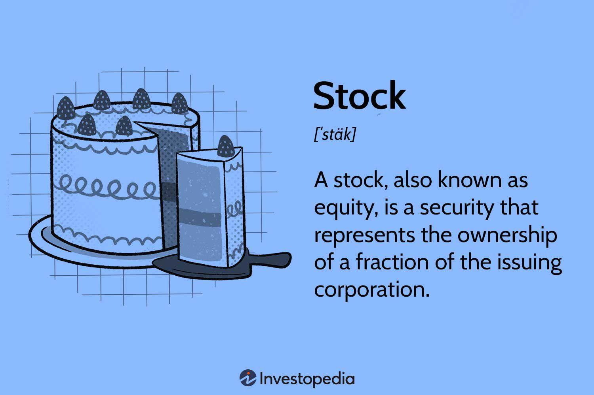

## Table of Contents

## What is the basic definition of a cheap stock?

A cheap stock is usually a stock that has a low price per share. People often think that if a stock's price is low, it means the stock is a good deal. But, the price of a stock alone doesn't tell you if it's a good buy. You need to look at other things, like how much the company is worth and how it's doing in its business.

When investors talk about a cheap stock, they might also mean a stock that is undervalued. This means the stock's price is lower than what the company is really worth. To figure out if a stock is undervalued, investors look at things like the company's earnings, its assets, and how it's doing compared to other companies in the same industry. So, a cheap stock can be a good find if it's undervalued, but it's important to do your homework first.

## How is the price of a stock determined to be 'cheap'?

The price of a stock is considered 'cheap' when it has a low price per share. But just looking at the price alone doesn't tell the whole story. Imagine you're shopping and you see a toy that costs $1. It might seem like a great deal, but if the toy is broken or not worth playing with, it's not really a good buy. The same idea applies to stocks. A stock might have a low price, but if the company behind it is not doing well, the stock might not be a good investment.

To really know if a stock is cheap in a good way, investors look at more than just the price. They check if the stock is undervalued, which means the stock's price is lower than what the company is actually worth. To figure this out, they look at things like the company's earnings, its assets, and how it's doing compared to other companies in the same industry. If a stock is undervalued, it could be a great find, like finding a valuable toy at a yard sale for a dollar. But it takes some research to make sure you're getting a good deal and not just a low price.

## What are the common characteristics of cheap stocks?

Cheap stocks usually have a low price per share. This means you can buy them for less money than other stocks. But having a low price doesn't always mean the stock is a good deal. Sometimes, the company behind the stock might not be doing well, which is why the stock price is low. People might also call these stocks 'penny stocks' because they can cost just a few cents or dollars.

To figure out if a cheap stock is a good buy, investors look at more than just the price. They check if the stock is undervalued, which means the stock's price is lower than what the company is really worth. They do this by looking at the company's earnings, its assets, and how it's doing compared to other companies in the same industry. If a stock is undervalued, it could be a great find, but it takes some research to make sure you're getting a good deal.

Cheap stocks can be risky because they often come from smaller or newer companies that might not have a long track record. These companies might be trying to grow quickly, but they can also fail. So, while cheap stocks can offer big rewards if they do well, they can also lose a lot of value if things go wrong. It's important for investors to understand these risks before buying cheap stocks.

## What are the potential benefits of investing in cheap stocks?

Investing in cheap stocks can offer big rewards. If you find a company that's undervalued, meaning its stock price is lower than what the company is really worth, you could make a lot of money. As the company grows and does better, the stock price could go up a lot. This means you could sell the stock later for more than you paid for it. It's like buying a toy at a yard sale for a dollar and then finding out it's worth a lot more.

Another benefit is that cheap stocks let you buy more shares with less money. If a stock costs $1 per share, you can buy 100 shares for $100. But if a stock costs $100 per share, you can only buy one share with that same $100. Having more shares means you have more chances to make money if the stock price goes up. It's like having more tickets in a raffle, which gives you a better chance of winning.

## What risks are associated with buying cheap stocks?

Buying cheap stocks can be risky because they often come from smaller or newer companies. These companies might not have a long history of success, so it's hard to know if they will do well in the future. They might be trying to grow quickly, but if they don't make it, the stock price can drop a lot. This means you could lose the money you invested. It's like betting on a new restaurant that might become popular or might close down soon.

Another risk is that cheap stocks can be very unpredictable. Their prices can go up and down a lot in a short time, which can be stressful if you're trying to make money. Sometimes, these stocks are also more likely to be affected by people trying to trick others into buying them, which is called a "pump and dump" scheme. This means someone might spread false information to make the stock price go up, then sell their shares before the price drops again. It's important to do a lot of research and be careful when buying cheap stocks to avoid these risks.

## How do cheap stocks function within the broader stock market?

Cheap stocks are a part of the bigger stock market where they usually have a low price per share. They often come from smaller or newer companies that might not be as well-known as big companies. These stocks can be found on different stock exchanges, like the New York Stock Exchange or the NASDAQ. Even though they have a low price, they can still be traded just like any other stock. Investors can buy and sell them during trading hours, and their prices can change based on what people think about the company and how the market is doing.

In the broader stock market, cheap stocks can add a lot of variety. They give investors a chance to buy into smaller or growing companies that might not be on the radar of big investors. If these companies do well, their stock prices can go up a lot, which means big rewards for the people who invested early. But, they also come with more risk because they can be unpredictable and their prices can go down a lot if the company doesn't do well. So, while cheap stocks are a part of the stock market, they can be a wild ride for investors.

## What are some strategies for identifying cheap stocks?

One way to find cheap stocks is by looking at the price-to-earnings (P/E) ratio. This ratio tells you how much you're paying for a company's earnings. If a stock has a low P/E ratio compared to other companies in the same industry, it might be undervalued. This means the stock's price is lower than what the company is really worth. Another thing to check is the price-to-book (P/B) ratio, which compares the stock's price to the company's net assets. A low P/B ratio can also show that a stock is cheap and might be a good buy.

Another strategy is to look at the company's financial health. You can do this by reading their financial reports and seeing if they are making money and growing. If a company is doing well but its stock price is low, it could be a good opportunity. Also, pay attention to what's happening in the industry and the economy. Sometimes, stocks can be cheap because of temporary problems, but if the company is strong, it might bounce back. It's important to do a lot of research and not just buy a stock because it's cheap.

Lastly, you can use stock screening tools to find cheap stocks. These tools let you set certain criteria, like a low P/E ratio or a certain market cap, and then show you a list of stocks that meet those criteria. This can help you quickly find stocks that might be undervalued. But remember, just because a stock looks cheap based on these numbers doesn't mean it's a good buy. You still need to look at the company's overall health and future potential to make a smart investment decision.

## Can you explain the difference between a cheap stock and a value stock?

A cheap stock is usually one that has a low price per share. People might think that if a stock's price is low, it means the stock is a good deal. But just looking at the price doesn't tell you the whole story. A stock might be cheap because the company is not doing well, or it could be because the market doesn't see the company's true value yet. Cheap stocks often come from smaller or newer companies and can be riskier because their prices can go up and down a lot.

A value stock, on the other hand, is a stock that investors think is undervalued. This means the stock's price is lower than what the company is really worth. Investors look at things like the company's earnings, its assets, and how it's doing compared to other companies in the same industry to decide if a stock is a value stock. Value stocks can come from any size company, but they are often from more established businesses. The main difference between a cheap stock and a value stock is that a value stock is seen as a good buy because it's undervalued, while a cheap stock might just have a low price without being a good investment.

## How do economic conditions affect the performance of cheap stocks?

Economic conditions can have a big impact on how cheap stocks do. When the economy is doing well, people feel more confident about spending money and investing. This can help smaller companies, which often have cheap stocks, grow and make more money. If these companies do well, their stock prices can go up. But, if the economy is not doing well, people might be more careful with their money. They might not spend as much, which can hurt smaller companies. This can make the prices of cheap stocks go down because people are worried about the future.

During times of economic uncertainty, like a recession, cheap stocks can be even riskier. Big investors might pull their money out of smaller companies and put it into safer investments. This can cause the prices of cheap stocks to drop a lot. But, if you believe the economy will get better, buying cheap stocks during a downturn could be a good move. If the economy does recover, these stocks might go up a lot in value. So, while economic conditions can make cheap stocks more risky, they can also offer big rewards if you're willing to take the chance.

## What are some advanced metrics used to evaluate the true value of cheap stocks?

When trying to figure out if a cheap stock is really a good deal, investors use some advanced ways to look at the company's value. One of these is the discounted cash flow (DCF) analysis. This method tries to guess how much money the company will make in the future and then figures out what that money is worth today. If the stock's price is less than this value, it might be undervalued. Another advanced metric is the enterprise value to EBITDA ratio (EV/EBITDA). This compares the company's total value, including its debt, to its earnings before interest, taxes, depreciation, and amortization. A low EV/EBITDA ratio can mean the stock is cheap compared to how much money the company is making.

Another useful metric is the price-to-sales (P/S) ratio, which looks at the stock's price compared to the company's revenue. A low P/S ratio can show that the stock is undervalued because you're paying less for each dollar of sales the company makes. Investors also look at the return on equity (ROE), which tells you how well the company is using the money shareholders have invested to make a profit. A high ROE can be a sign that the company is doing well, even if its stock price is low. By using these advanced metrics, investors can get a better idea of whether a cheap stock is really a good buy or if it's cheap for a reason.

## Can you provide examples of companies whose stocks were once considered cheap and later appreciated significantly?

One example of a company whose stock was once considered cheap and later appreciated significantly is Apple Inc. Back in the early 2000s, Apple's stock was trading at a low price. Many people thought the company was struggling because it was not doing well in the computer market. But then, Apple launched the iPod, iPhone, and iPad, which changed everything. These products became very popular, and Apple's stock price started to go up a lot. People who bought Apple stock when it was cheap made a lot of money as the company grew into one of the biggest in the world.

Another example is Netflix. In the early 2000s, Netflix was just starting out and its stock was very cheap. At that time, the company was mainly sending DVDs through the mail, and many people thought it wouldn't be able to compete with big video rental stores. But Netflix kept growing and eventually started offering streaming services. As more and more people started using Netflix to watch movies and TV shows online, the company's stock price went up a lot. Investors who bought Netflix stock when it was cheap saw big rewards as the company became a leader in the streaming industry.

## What are expert tips for managing a portfolio that includes cheap stocks?

When managing a portfolio with cheap stocks, it's important to do a lot of research. Look at the company's financial health, like its earnings and how much money it's making. Check if the stock is really undervalued by using metrics like the price-to-earnings ratio or the price-to-book ratio. Don't just buy a stock because it's cheap; make sure the company has a good chance of growing and doing well in the future. Also, keep an eye on what's happening in the economy and the industry the company is in. Economic conditions can affect how well cheap stocks do, so being aware of these things can help you make smarter choices.

Another tip is to diversify your portfolio. Don't put all your money into cheap stocks. Mix them with other types of investments, like stocks from bigger companies or bonds. This can help lower your risk because if one stock goes down, you have other investments that might go up. Also, be ready to hold onto your cheap stocks for a long time. Sometimes, it takes a while for a company to grow and for its stock price to go up. If you believe in the company, be patient and don't sell your stocks too quickly. Remember, managing a portfolio with cheap stocks can be risky, but with careful research and a long-term plan, it can also be rewarding.

## What is the understanding of financial markets and cheap stocks?

Financial markets are essential components of the global economy, facilitating the exchange of securities, commodities, and other financial instruments. They enable efficient allocation of resources and [liquidity](/wiki/liquidity-risk-premium), allowing investors to raise capital, transfer risk, and discover prices for goods and services. These markets encompass various platforms such as stock exchanges, bond markets, and derivatives markets, each serving distinct purposes but collectively ensuring economic stability and growth.\[1\]

In the stock market, one term frequently encountered is "cheap stocks." A "cheap stock" refers to a security that appears undervalued based on specific financial metrics or market sentiment. Typically, these stocks trade at a lower price compared to their intrinsic value or peers in the same industry. Identifying cheap stocks can be a critical strategy for investors seeking to maximize returns. However, it requires thorough analysis to distinguish genuinely undervalued stocks from those priced low due to fundamental weaknesses.\[2\]

Several factors contribute to a stock being perceived as cheap. Key metrics used for evaluating stock value include the price-to-earnings (P/E) ratio, price-to-book (P/B) ratio, and dividend yield. A low P/E ratio, for instance, may suggest that a stock is undervalued compared to its earnings. Similarly, a low P/B ratio might indicate that the stock is trading for less than its book value. High dividend yield can also appeal to investors, signaling potential for income.\[3\]

Investing in cheap stocks offers both risks and rewards. On the reward side, acquiring undervalued stocks can lead to significant capital gains if the market eventually recognizes and corrects the stock’s undervaluation. For example, a stock priced at $5 but intrinsically valued at $10 represents a potential 100% return if the market adjusts to reflect its true worth.

$$
\text{Potential Return (\%)} = \left( \frac{\text{Intrinsic Value} - \text{Market Value}}{\text{Market Value}} \right) \times 100\]

Yet, risks abound in this strategy. Stocks might be cheap because of underlying performance issues or poor market conditions affecting the sector. Investors might face prolonged periods of undervaluation or permanent capital loss if market conditions deteriorate further.

There are misconceptions about cheap stocks that can mislead investors. Some assume that a low-priced stock is necessarily a bargain. However, a low absolute price does not equate to being undervalued. Stocks could be cheap for reasons such as declining financial performance, negative market sentiment, or heightened competition. Additionally, market inefficiencies or lack of investor awareness might cause stocks to remain undervalued for extended periods.

Therefore, investing in cheap stocks requires rigorous analysis, not just focusing on low prices but assessing broader economic indicators, sector trends, and company fundamentals. By combining these insights with sound investment strategies, investors can potentially leverage cheap stocks for substantial gains while minimizing associated risks.\[4\]

---

\[1\]: "Financial system." *Wikipedia*. [https://en.wikipedia.org/wiki/Financial_system](https://en.wikipedia.org/wiki/Financial_system).

\[2\]: Graham, B. (2003). *The Intelligent Investor: The Definitive Book on Value Investing*. HarperBusiness.

\[3\]: "Valuation ratios." *Investopedia*. [https://www.investopedia.com/terms/o/valuationratios.asp](https://www.investopedia.com/terms/o/valuationratios.asp).

\[4\]: Damodaran, A. (2002). *Investment Valuation: Tools and Techniques for Determining the Value of Any Asset*. John Wiley & Sons.

## What are the advantages of stock investment?

Investing in the stock market offers numerous advantages, primarily through its potential to achieve substantial long-term financial growth. When assessing these benefits, one must consider a few key aspects: the potential for wealth accumulation, the advantages brought by diversification, and the methodologies used for evaluating stock performance.

### Long-term Benefits of Investing in the Stock Market

The stock market is recognized for its capacity to provide significant returns over extended periods. Financial markets historically generate higher returns compared to other investment vehicles such as savings accounts or government bonds. For instance, data from the S&P 500, one of the most referenced stock market indices, shows an average return of approximately 7-10% per annum when adjusted for inflation.

This long-term growth can compound wealth exponentially, a concept illustrated by the formula for compound interest:

$$
A = P \left(1 + \frac{r}{n}\right)^{nt}
$$

where:
- $A$ is the amount of money accumulated after n years, including interest.
- $P$ is the principal amount (the initial amount of money).
- $r$ is the annual interest rate (decimal).
- $n$ is the number of times that interest is compounded per year.
- $t$ is the time the money is invested for in years.

### Strategic Stock Investment and Wealth Accumulation

Strategic stock investment involves choosing securities that offer the best potential for growth based on thorough analysis and market understanding. Through active management or strategic passive investment, investors can significantly enhance their capital. Active investors may pursue [growth stocks](/wiki/growth-stocks), leveraging their potential for capital appreciation, while others may prefer a value investing strategy, focusing on undervalued companies with strong fundamentals.

### Impact of Diversification through Stock Portfolios

Diversification is a risk management strategy that mixes a wide variety of investments within a portfolio. By owning stocks from various sectors and geographies, an investor can mitigate the adverse effects of market [volatility](/wiki/volatility-trading-strategies). The principle relies on the fact that the performance of various asset classes is not perfectly correlated, thus reducing the total risk of a portfolio. The efficient frontier, a concept from Modern Portfolio Theory, illustrates how diversification can optimize a portfolio's return for a given risk level.

### Evaluating Stock Performance Based on Fundamental and Technical Analysis

To make informed investment decisions, investors often rely on both fundamental and technical analysis:

- **Fundamental Analysis**: This evaluates a security by examining related economic and financial factors. Key metrics include earnings per share (EPS), price to earnings ratio (P/E), and return on equity (ROE). This approach looks at the company's intrinsic value, assessing whether the stock is correctly valued by the market.

- **Technical Analysis**: This focuses on statistical trends derived from trading activity, such as price movement and volume. Analysts use charts and other tools to identify patterns and forecast future movements. Simple moving averages (SMA) and relative strength index (RSI) are examples of techniques used in technical analysis.

Both analyses provide unique insights and are often used in tandem to offer a comprehensive view of a stock's potential. These strategies, when applied effectively, allow investors to choose stocks that align with their risk tolerance and return expectations, thus maximizing investment success.

## References & Further Reading

[1]: Damodaran, A. (2002). *Investment Valuation: Tools and Techniques for Determining the Value of Any Asset*. John Wiley & Sons.

[2]: Graham, B. (2003). *The Intelligent Investor: The Definitive Book on Value Investing*. HarperBusiness.

[3]: Bergstra, J., Bardenet, R., Bengio, Y., & Kégl, B. (2011). ["Algorithms for Hyper-Parameter Optimization."](https://dl.acm.org/doi/10.5555/2986459.2986743) Advances in Neural Information Processing Systems 24.

[4]: ["Advances in Financial Machine Learning"](https://www.amazon.com/Advances-Financial-Machine-Learning-Marcos/dp/1119482089) by Marcos Lopez de Prado.

[5]: ["Quantitative Trading: How to Build Your Own Algorithmic Trading Business"](https://www.amazon.com/Quantitative-Trading-Build-Algorithmic-Business/dp/1119800064) by Ernest P. Chan.

[6]: ["Evidence-Based Technical Analysis: Applying the Scientific Method and Statistical Inference to Trading Signals"](https://www.amazon.com/Evidence-Based-Technical-Analysis-Scientific-Statistical/dp/0470008741) by David Aronson.