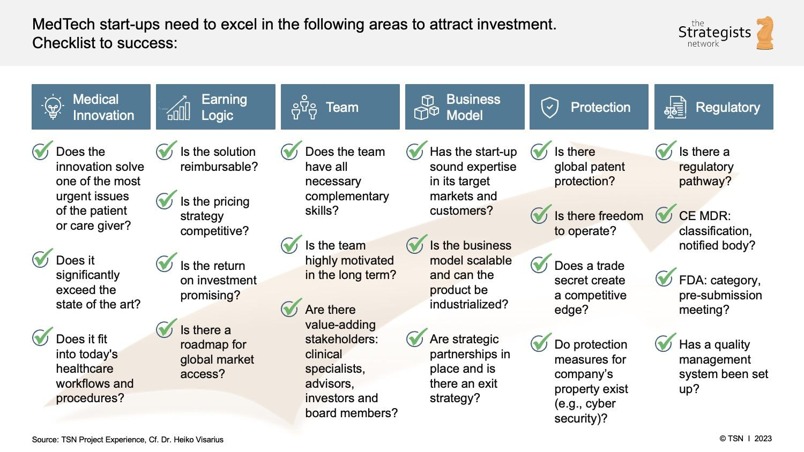

The convergence of medical technology and algorithmic trading is redefining investment landscapes. Medical technology, encompassing a wide range of products and services aimed at enhancing healthcare, offers lucrative investment opportunities due to its potential for innovation and impact on public health. However, investing in this sector requires strategic decisions due to inherent risks and regulatory challenges, such as the stringent requirements for FDA approvals and the rapid pace of technological advancements.

On the other hand, algorithmic trading, a method of executing orders using automated and pre-programmed trading instructions, provides tools for precision and optimization in investment. This approach to trading capitalizes on computational algorithms to make high-speed and accurate trades, often minimizing human psychological factors that can lead to irrational investment decisions. The integration of algorithmic trading strategies with medical technology investments can potentially enhance returns through precise market positioning and risk management.



This article aims to serve as a comprehensive checklist for integrating medical technology with algorithmic trading. By understanding the complexities of medical technology investment and leveraging algorithmic trading for strategic benefits, investors can navigate this dynamic intersection with greater efficacy. The sections that follow will delve into the essentials of both domains and provide actionable insights for optimizing investment strategies in this evolving field.

## Table of Contents

## Understanding Medical Technology Investment

The medical technology sector is characterized by its potential for high returns, offering attractive opportunities for investors willing to navigate its complexities. However, these opportunities come with significant risks and regulatory hurdles that must be considered to make informed and strategic investment decisions.

Key areas that influence investment outcomes in medical technology include innovation, product lifecycle, and regulatory compliance. Innovation serves as the backbone of the sector, as it fuels the development of new technologies and solutions that can lead to competitive advantages and higher market valuations. Investors should focus on companies that prioritize research and development (R&D) to foster innovation, thereby positioning themselves as market leaders rather than followers. Companies that invest heavily in innovation are more likely to disrupt existing markets and create new niches, providing them with early mover advantages and the potential for substantial returns.

The product lifecycle in medical technology is another critical consideration. Products in this sector often undergo lengthy development phases, followed by rigorous testing, clinical trials, and regulatory approvals. Investors need to understand where a company's products are in their lifecycle to assess potential investment risks accurately. Early-stage products may offer exponential growth opportunities but come with higher uncertainty compared to established products with proven market traction.

Regulatory compliance is paramount in the medical technology industry, given the stringent standards imposed by various agencies, such as the Food and Drug Administration (FDA) in the United States. The regulatory landscape is complex and ever-evolving, requiring companies to allocate considerable resources to ensure compliance. Delays or failures in obtaining regulatory approvals can significantly impact a company's financial health and market positioning. Investors must evaluate a company's track record in handling regulatory processes and its ability to adapt to changing requirements.

Investing in medical technology involves balancing the pursuit of cutting-edge innovators against the risks associated with regulatory challenges and lifecycle uncertainties. Prioritizing companies known for their innovative prowess rather than those merely following trends can enhance the likelihood of securing a favorable market position. By targeting innovation-led companies, investors can tap into groundbreaking advancements that redefine their respective fields while potentially achieving superior investment outcomes.

## Essentials of Algorithmic Trading

Algorithmic trading, also known as automated trading, utilizes computer algorithms to execute trading orders at optimal speeds and with precision. The primary advantage of [algorithmic trading](/wiki/algorithmic-trading) is its ability to operate free from human emotional influences, which can often lead to impulsive or biased decision-making. This approach leverages computational processes to analyze vast datasets quickly, identifying opportunities that may be invisible to human traders.

Several key strategies underpin algorithmic trading, each with distinct mechanisms and objectives:

1. **Trend-Following Strategies**: These strategies capitalize on market momentum, operating under the assumption that prices will continue moving in the direction of current trends. Moving averages and channel breakouts are typically used to identify entry and exit points. The moving average can be defined mathematically as:
$$
   MA_t = \frac{1}{n} \sum_{i=0}^{n-1} P_{t-i}

$$

   where $MA_t$ is the moving average at time $t$, $n$ is the window size, and $P_t$ is the price at time $t$.

2. **Arbitrage Strategies**: These strategies exploit price differentials between markets or instruments. The simplest form is cross-border arbitrage, where the algorithm buys an asset in one market and sells it at a higher price in another. Given the rapid shifts in financial markets, algorithmic trading systems can execute such trades more efficiently than human traders.

3. **Market-Making Strategies**: In this strategy, the algorithm presents continuous buy and sell offers to earn a profit from the bid-ask spread. Market makers provide liquidity to markets and maintain a balance between supply and demand. For instance, if the bid price is $B$ and the ask price is $A$, the spread can be represented as:
$$
   \text{Spread} = A - B

$$

The benefits of algorithmic trading extend beyond mere speed and precision. 

- **Risk Management**: Algorithms can systematically manage risk by implementing stop-loss and take-profit orders automatically, reducing exposure to potentially adverse market movements.
- **Execution Efficiency**: By automatically executing trades at the best possible prices, algorithms can minimize explicit costs, such as transaction fees, and implicit costs, such as market impact and slippage. 

The adoption of algorithmic trading reflects a paradigm shift in how markets operate, emphasizing the crucial role of technology in the contemporary financial landscape. It allows for strategies that are mathematically robust and adaptable to various market conditions, thereby offering investors enhanced capabilities to optimize their portfolio performance.

## Building a Medical Technology Investment Checklist

To construct an effective medical technology investment checklist, it is imperative to focus on several critical components that can shape the potential success of investments in this sector. The technological landscape of the medical field is continually evolving, heightening the need for strategic assessment and decision-making. Here are the fundamental steps to building such a checklist:

### Identify and Assess Innovative Companies Focused on R&D

The backbone of successful investment in medical technology is identifying companies that prioritize research and development (R&D). Firms with robust R&D activities are typically at the forefront of innovation, leading to the introduction of cutting-edge products and solutions. An investor should seek out companies that not only spend significantly on R&D but also demonstrate a clear path from research to commercialization. Evaluating patent pipelines, partnerships with research institutions, and their history of product launches can offer insights into their innovative potential.

### Understand the Company's Lifecycle and Market Strategy

Understanding where a company fits within its lifecycle is crucial for gauging its investment potential. Newer firms may present higher risk due to unproven technologies, but they might offer larger rewards if they successfully disrupt the market. On the other hand, more established companies might provide more stability but less explosive growth. Analyzing the company's market strategy, such as target demographics, competitive positioning, and market penetration plans, is equally important. A comprehensive understanding of these factors allows investors to make informed decisions about the company's future trajectory and potential profitability.

### Evaluate Regulatory Risks and Compliance, Particularly with FDA Approvals

Regulatory compliance is a major challenge in the medical technology sector. Companies must navigate complex regulatory environments, with the U.S. Food and Drug Administration (FDA) approval process being one of the most rigorous. This involves understanding the stages of FDA approval and where a company’s product stands within this process. The stages include preclinical testing, clinical trials (Phase I, II, and III), and finally the review process. Each stage has its own set of risks and potential delays. Additionally, post-market surveillance is critical to ensure ongoing compliance. An investor must be vigilant about a company's history with regulatory approvals and their capability to manage these processes effectively, as delays or failures can significantly affect company valuations and investment returns.

In summary, a robust investment checklist in medical technology demands thorough evaluation of innovation capabilities, lifecycle positioning, and regulatory navigation skills. These factors collectively inform strategic investment efforts that are well-aligned with both current market conditions and future trends.

## Integrating Algorithmic Trading with Medical Technology

Integrating algorithmic trading into medical technology investments offers a strategic advantage by optimizing returns through precision and speed. Algorithmic trading involves using computer programs to execute trades based on predefined criteria. When managing investments in the inherently volatile medical technology sector, this method allows investors to navigate market complexities with greater precision.

To effectively integrate algorithmic trading, investors must first establish clear investment goals and risk tolerance levels. Investment goals can include target returns, risk exposure, and time horizons. Risk tolerance dictates how much risk an investor is willing to take, influencing the algorithms used. For example, an investor seeking steady growth might employ conservative strategies, while one seeking higher returns might tolerate more [volatility](/wiki/volatility-trading-strategies).

Backtesting plays a crucial role in refining and validating strategies. It involves testing trading algorithms on historical data to assess their potential effectiveness and optimize parameters. The process helps identify successful patterns and eliminates strategies that may not perform well in real-market conditions.

```python
import pandas as pd
from backtesting import Backtest, Strategy
from backtesting.lib import crossover
from backtesting.test import SMA, GOOG

class SmaCross(Strategy):
    n1 = 10
    n2 = 20

    def init(self):
        self.sma1 = self.I(SMA, self.data.Close, self.n1)
        self.sma2 = self.I(SMA, self.data.Close, self.n2)

    def next(self):
        if crossover(self.sma1, self.sma2):
            self.buy()
        elif crossover(self.sma2, self.sma1):
            self.sell()

bt = Backtest(GOOG, SmaCross, cash=10000, commission=.002)
stats = bt.run()
bt.plot()
```

The above Python code demonstrates a simple [backtesting](/wiki/backtesting) framework using moving average crossovers on historical Google stock data. By adjusting the moving average periods (`n1` and `n2`), investors can evaluate different strategies to determine which might be more favorable for their specific goals within the medical technology sector.

By coupling algorithmic trading with a well-structured investment checklist, investors can achieve a more disciplined approach that leverages the advantages of algorithmic methods while aligning investments with personal financial objectives and risk profiles.

## Risk Management and Error Minimization

Risk management and error minimization are essential components in successful algorithmic trading, particularly when investing in the medical technology sector. By utilizing systematic approaches, investors can mitigate potential losses and maximize returns.

Incorporating automated stop-loss orders is a fundamental strategy for risk management. These orders automatically sell a security when its price falls below a predetermined level, thereby limiting the potential loss on a position. For instance, if an investor holds a stock that is currently trading at $100 and sets a stop-loss order at $90, the position will be sold if the price falls to or below $90, protecting the investor from further loss.

Maintaining an up-to-date checklist is crucial for adapting to evolving market conditions. This checklist should include key metrics and indicators that an investor tracks regularly. These might involve changes in regulatory environments, product development pipelines, and shifts in market demand for specific medical technologies. By consistently reviewing and updating this checklist, traders can quickly adapt their strategies to align with current and predicted market conditions.

Conducting regular stress testing of trading strategies is another vital practice. Stress testing involves simulating different market scenarios to evaluate how a trading strategy would perform under adverse conditions. This process helps identify potential weaknesses in the strategy and provides insights into how it can be improved. The following Python code snippet demonstrates a simple approach to stress testing a trading strategy using historical data:

```python
import pandas as pd
import numpy as np

# Load historical data
data = pd.read_csv('historical_data.csv')

# Define a simple trading strategy
def trading_strategy(data, threshold):
    signals = np.where(data['price'].pct_change() > threshold, 1, -1)
    return signals

# Define a stress test function
def stress_test(data, strategy, scenarios):
    results = {}
    for scenario in scenarios:
        data['price'] *= scenario  # apply stress factor
        signals = trading_strategy(data, threshold=0.02)
        pnl = (signals[:-1] * data['price'].pct_change()).sum()  # calculate profit and loss
        results[scenario] = pnl
    return results

# Stress test scenarios
scenarios = [0.9, 1.0, 1.1]  # 10% decrease, no change, 10% increase
stress_test_results = stress_test(data, trading_strategy, scenarios)

# Output results
for scenario, pnl in stress_test_results.items():
    print(f'Scenario {scenario}: PnL = {pnl}')
```

This script takes historical market data and simulates how the trading strategy would perform under different market conditions, represented by the `scenarios` variable. The results can help traders decide if their strategies are resilient enough to withstand market volatility and other potential disruptions.

By implementing these risk management techniques, investors can minimize errors and effectively safeguard their algorithmic trading investments in the medical technology sector. Regular adjustments and improvements ensure that these strategies remain robust and adaptable, contributing to long-term investment success.

## Conclusion

Medical technology investment, when strategically combined with algorithmic trading, provides a robust and dynamic opportunity for modern investors. This synergy leverages the growth potential of the medical technology sector with the precision and efficiency of algorithmic trading, creating a pathway to optimize investment returns. A structured checklist plays a vital role in this strategy, acting as a guide to ensure disciplined and informed decision-making. Such a checklist helps investors stay focused on key investment criteria such as innovation, regulatory compliance, and market trends, which are crucial for success in the medical technology field.

Continuous education and adaptation are essential in this ever-evolving landscape. As the medical technology sector constantly advances with new breakthroughs and innovations, staying informed about these developments is critical for investors. Similarly, algorithmic trading strategies must be regularly reviewed and updated based on new data and market conditions to remain effective. This requires a commitment to lifelong learning and the agility to adapt strategies as required.

In conclusion, the integration of medical technology investment with algorithmic trading offers a nuanced approach to investing that rewards those who are prepared to engage with its complexities. A disciplined checklist, combined with ongoing education and adaptation, empowers investors to make sound decisions and capitalize on opportunities within this dynamic intersection of sectors.

## Further Reading

For those looking to deepen their understanding of the integration of medical technology investments and algorithmic trading, the following resources offer valuable insights and methodologies that complement the concepts discussed in this article:

1. **Bergstra, J. et al., "Algorithms for Hyper-Parameter Optimization."** This work explores advanced techniques in hyper-parameter optimization, crucial for refining algorithmic trading strategies. It provides a comprehensive look at methods such as random search and Bayesian optimization, highlighting how they can be applied to improve the performance of trading algorithms that must adapt to the dynamic nature of medical technology markets. These optimization methods can enhance predictive models and automations utilized in sophisticated trading frameworks.

2. **Lopez de Prado, M., "Advances in Financial Machine Learning."** This book bridges the gap between financial theory and practical machine learning applications. Lopez de Prado presents methodologies that are essential for developing efficient algorithmic trading strategies. Particularly relevant are his discussions on backtesting, risk management, and execution strategies, which are vital for managing medical technology investments with precision and efficiency. The text offers both theoretical and practical guidance, illustrating how machine learning can optimize trade execution and strategy adaptation.

3. **Aronson, D., "Evidence-Based Technical Analysis: Applying the Scientific Method and Statistical Inference to Trading Signals."** Aronson's book emphasizes the application of the scientific method to develop robust trading signals. The book provides a detailed examination of statistical tools and techniques necessary for evaluating trading strategies, which can be particularly beneficial when assessing the volatile and diverse medical technology sector. This resource underscores the importance of data-driven decision-making and empirical validation in developing effective algorithmic trading models.

Engaging with these texts will equip investors and traders with the theoretical foundations and practical techniques needed to harness the full potential of algorithmic trading in medical technology investments. Each resource contributes to a more disciplined, informed, and optimized approach to modern investment strategies.

## References & Further Reading

[1]: Bergstra, J., Bardenet, R., Bengio, Y., & Kégl, B. (2011). ["Algorithms for Hyper-Parameter Optimization."](https://dl.acm.org/doi/10.5555/2986459.2986743) Advances in Neural Information Processing Systems 24.

[2]: ["Advances in Financial Machine Learning"](https://www.amazon.com/Advances-Financial-Machine-Learning-Marcos/dp/1119482089) by Marcos Lopez de Prado

[3]: ["Evidence-Based Technical Analysis: Applying the Scientific Method and Statistical Inference to Trading Signals"](https://www.amazon.com/Evidence-Based-Technical-Analysis-Scientific-Statistical/dp/0470008741) by David Aronson

[4]: ["Machine Learning for Algorithmic Trading"](https://github.com/stefan-jansen/machine-learning-for-trading) by Stefan Jansen

[5]: ["Quantitative Trading: How to Build Your Own Algorithmic Trading Business"](https://www.amazon.com/Quantitative-Trading-Build-Algorithmic-Business/dp/1119800064) by Ernest P. Chan