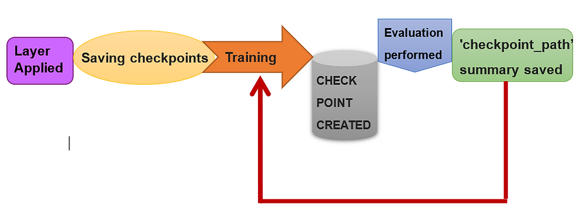

## Table of Contents

## What is a checkpoint in machine learning?

A checkpoint in machine learning is like a save point in a video game. It's a way to save the current state of a model during training so that you can stop and start again later without losing progress. This is really helpful because training big models can take a long time, sometimes days or even weeks. By saving checkpoints, you can pause the training, shut down your computer, and then pick up right where you left off.

Checkpoints usually save things like the model's weights, which are the numbers the model uses to make predictions, and other important details like the current learning rate or the optimizer's state. For example, if you're using a neural network, the weights might look like a big list of numbers that the network uses to process data. Saving these weights at different points during training lets you see how the model is improving over time and can help you go back to an earlier version if something goes wrong later on.

## Why are checkpoints important in the training process?

Checkpoints are really important when you're training a machine learning model because they let you save your work as you go along. Imagine you're training a model and it takes a long time, maybe even days. If something goes wrong, like your computer crashes or the power goes out, you could lose all that work. But if you've been saving checkpoints, you can just go back to the last save point and start from there instead of starting all over again. This saves a lot of time and frustration.

Also, checkpoints help you keep track of how your model is doing over time. As you train your model, you can save different versions of it at different points. This way, you can look back and see how the model's performance has changed. If you notice that the model was doing better at an earlier checkpoint, you can go back to that version. This is really helpful for making sure your model keeps improving and doesn't start getting worse.

## How do checkpoints help in preventing loss of progress during model training?

Checkpoints are like save points in a video game. When you're training a [machine learning](/wiki/machine-learning) model, it can take a long time, sometimes days or even weeks. If your computer crashes or you need to stop the training for any reason, you could lose all that work. But if you save checkpoints, you can stop at any time and then start again from the last checkpoint without losing any progress. This means you don't have to start all over again from the beginning, which saves a lot of time and effort.

Also, checkpoints help you keep track of how your model is doing as it trains. You can save the model's weights and other important details at different points during training. If something goes wrong later on, or if you want to see how the model was doing at an earlier stage, you can just go back to a previous checkpoint. This way, you can make sure your model keeps getting better and doesn't start getting worse. It's like having a safety net that lets you try different things without worrying about losing your progress.

## What are the common formats for saving checkpoints?

Checkpoints in machine learning are often saved in formats like HDF5 or Protocol Buffers. HDF5 is a file format that can store large amounts of data efficiently. It's good for saving the weights of a [neural network](/wiki/neural-network), which are the numbers the network uses to make predictions. Protocol Buffers, or Protobuf, is another format that's used a lot, especially by TensorFlow. It's a way to structure data that's fast and flexible, making it easy to save and load the state of a model during training.

Both formats have their own advantages. HDF5 is widely used because it's easy to work with in many programming languages and can handle big data well. On the other hand, Protocol Buffers are very efficient and are often used in large-scale systems because they're fast and can be easily integrated into different parts of a project. When you save a checkpoint, you're usually saving the model's weights, the optimizer's state, and sometimes other details like the current learning rate or the training step number. This lets you stop and start training without losing progress.

## How can you implement checkpointing in popular machine learning frameworks like TensorFlow or PyTorch?

In TensorFlow, you can implement checkpointing by using the `tf.train.Checkpoint` class. This class lets you save and restore the state of your model, including its weights and the optimizer's state. To save a checkpoint, you create a `Checkpoint` object and call its `save` method, passing in a directory where you want to save the files. For example, you might do something like `checkpoint = tf.train.Checkpoint(model=model, optimizer=optimizer)` and then `checkpoint.save(file_prefix='./checkpoints/ckpt')`. To load a checkpoint later, you can use the `restore` method on the same `Checkpoint` object, like `checkpoint.restore('./checkpoints/ckpt-1')`. This way, you can stop and start your training without losing progress.

In PyTorch, checkpointing is done using the `torch.save` and `torch.load` functions. To save a checkpoint, you typically save the model's state dictionary, which contains all the weights, along with the optimizer's state. You might do this with code like ```python
torch.save({
    'epoch': epoch,
    'model_state_dict': model.state_dict(),
    'optimizer_state_dict': optimizer.state_dict(),
    'loss': loss,
}, './checkpoints/ckpt.pth')
```. To load the checkpoint later, you use `torch.load` to get the saved dictionary and then load the state into your model and optimizer, like ```python
checkpoint = torch.load('./checkpoints/ckpt.pth')
model.load_state_dict(checkpoint['model_state_dict'])
optimizer.load_state_dict(checkpoint['optimizer_state_dict'])
epoch = checkpoint['epoch']
loss = checkpoint['loss']
```. This lets you pick up training right where you left off.

## What are the best practices for managing checkpoints to optimize storage and performance?

When managing checkpoints, it's important to think about how to save space on your computer and keep your training going smoothly. One good way to do this is by saving checkpoints at regular intervals but not too often. This means you can go back to a recent checkpoint if something goes wrong, but you don't fill up your storage with too many files. You can also save only the most important parts of the model, like the weights and optimizer state, and not save things you don't need. This helps keep the checkpoint files small and easy to manage.

Another good practice is to keep only the most recent or the best-performing checkpoints. This way, you don't have a lot of old checkpoints taking up space. You can set up a system where older checkpoints get deleted automatically when new ones are saved. This keeps your storage organized and makes it easier to find the checkpoints you need. Also, if you're working with a big model, you might want to use a format like HDF5 or Protocol Buffers, which are good at handling large amounts of data efficiently. This can help your training go faster and use less space on your computer.

## How do checkpoints affect the training time and overall model performance?

Checkpoints can make training a machine learning model take a bit longer because saving them takes time. Every time you save a checkpoint, the computer has to stop training for a moment to write the data to a file. If you save checkpoints too often, this can slow down the training process. But if you save them just the right amount, it can actually help keep your training going smoothly. For example, if your computer crashes or you need to stop training for a while, you can start again from the last checkpoint without losing any progress. This can save you a lot of time in the long run.

Checkpoints also help you keep an eye on how well your model is doing as it trains. By saving different versions of your model at different times, you can go back and see if the model was performing better at an earlier point. This is really helpful because sometimes a model can start to get worse as it trains, a problem called overfitting. If you notice this happening, you can go back to an earlier checkpoint where the model was doing better. This way, checkpoints help you make sure your model keeps improving and doesn't start to perform worse.

## Can checkpoints be used to resume training on a different machine or environment?

Yes, checkpoints can be used to resume training on a different machine or environment. When you save a checkpoint, it includes all the important information about your model, like the weights and the optimizer's state. As long as you can move the checkpoint file to the new machine, you can load it there and continue training from where you left off. This is really helpful if you need to switch to a different computer or if you want to use a different setup for training, like moving from a local machine to a cloud server.

To do this, you just need to make sure that the new environment has the same version of the machine learning framework you're using, like TensorFlow or PyTorch. Once you've moved the checkpoint file to the new machine, you can load it using the same code you used to save it. For example, in TensorFlow, you would use the `restore` method of the `Checkpoint` object, and in PyTorch, you would use `torch.load` to load the checkpoint and then `load_state_dict` to put the saved state back into your model and optimizer. This way, you can keep training your model without starting over, even if you're using a different machine.

## What are the security considerations when saving and loading checkpoints?

When saving and loading checkpoints, it's important to think about security. Checkpoints contain important information about your model, like its weights and the state of the optimizer. If someone else gets access to these files, they might be able to see how your model works or even steal it. To keep your checkpoints safe, you should store them in a secure place, like a private folder or a secure cloud storage. You can also encrypt the checkpoint files so that only people with the right key can open them. This helps keep your model's information private and safe from people who shouldn't see it.

Another thing to consider is making sure the checkpoints you load are safe and haven't been changed by someone else. If you load a checkpoint that's been tampered with, it could mess up your model or even add harmful code. To avoid this, you can use checksums or digital signatures to check if the checkpoint file has been changed. This way, you can be sure that the checkpoint you're loading is the same one you saved before. By taking these steps, you can help keep your model training process secure and protect your work from being stolen or damaged.

## How can you use checkpoints to perform model versioning and track changes over time?

Checkpoints can be used to keep track of different versions of your model as it trains. Every time you save a checkpoint, it's like taking a snapshot of your model at that moment. You can save the model's weights, the optimizer's state, and even other details like the current learning rate or the training step number. By saving these snapshots regularly, you can go back and see how your model has changed over time. This helps you understand if your model is getting better or if it's starting to perform worse, which is important for making sure your training is going well.

To use checkpoints for model versioning, you can save them with different names or in different folders based on the version or the performance of the model. For example, you might save a checkpoint every time the model reaches a new best performance, and you can name these checkpoints something like 'best_model_v1', 'best_model_v2', and so on. This way, you can easily find and load the best version of your model later. You can also keep track of the changes by looking at the saved information in each checkpoint, like the weights or the loss value, to see how the model has improved or changed over time.

## What advanced techniques can be applied to checkpointing for large-scale distributed training?

When training big models across many computers, a technique called distributed checkpointing can be really helpful. This means saving the model's state across different machines so that if one machine goes down, you can still keep training without losing everything. One way to do this is by using a centralized storage system where all the machines save their part of the model. This way, you can gather all the pieces together to make a complete checkpoint. Another way is to use a system where each machine saves its own checkpoint, and then you can combine them later. This helps make sure your training keeps going smoothly even if something goes wrong with one of the machines.

Another advanced technique is called asynchronous checkpointing. This is when different parts of the model are saved at different times, which can help speed up the training process. Instead of waiting for all the machines to finish their work before saving a checkpoint, each machine can save its part whenever it's ready. This can make the training process faster because the machines don't have to wait for each other. But it can also make things a bit more complicated because you need to make sure all the parts fit together correctly when you load the checkpoint later. By using these techniques, you can handle the challenges of training big models across many computers more easily.

## How do you evaluate the effectiveness of a checkpointing strategy in a machine learning project?

Evaluating the effectiveness of a checkpointing strategy in a machine learning project involves looking at how well it helps you save time and keep your model's performance on track. One way to do this is by checking how often you need to restart training from a checkpoint because of interruptions like computer crashes or power outages. If you find that you're able to quickly get back to training without losing much progress, then your checkpointing strategy is working well. You can also look at the storage space used by your checkpoints. If you're saving them too often and filling up your storage, you might need to adjust how frequently you save or how much information you're saving in each checkpoint.

Another important aspect is how checkpoints help you track your model's performance over time. By saving checkpoints at regular intervals, you can go back and see how your model's accuracy or loss has changed. This can help you spot issues like overfitting, where the model starts to perform worse as it trains. If your checkpoints let you easily find and load earlier versions of your model where it was performing better, then your strategy is effective. You can also use metrics like the time it takes to save and load checkpoints to see if they're slowing down your training too much. If the time spent on checkpointing is small compared to the overall training time, then it's not a big problem.

## References & Further Reading

[1]: Goodfellow, I., Bengio, Y., & Courville, A. (2016). ["Deep Learning"](https://link.springer.com/article/10.1007/s10710-017-9314-z) MIT Press. This book provides a comprehensive introduction to deep learning, including topics related to neural network training and checkpointing.

[2]: Hinton, G., Deng, L., Yu, D., Dahl, G. E., Mohamed, A. r., Jaitly, N., ... & Kingsbury, B. (2012). ["Deep Neural Networks for Acoustic Modeling in Speech Recognition"](https://ieeexplore.ieee.org/document/6296526). IEEE Signal Processing Magazine, 29(6), 82-97. This paper discusses deep neural networks, which often utilize checkpointing strategies during training.

[3]: Paszke, A., Gross, S., Massa, F., Lerer, A., Bradbury, J., Chanan, G., ... & Chintala, S. (2019). ["PyTorch: An Imperative Style, High-Performance Deep Learning Library."](https://arxiv.org/abs/1912.01703) Advances in Neural Information Processing Systems 32. This paper provides information on PyTorch, one of the popular libraries mentioned in the content that supports checkpointing.

[4]: Abadi, M., Barham, P., Chen, J., Chen, Z., Davis, A., Dean, J., ... & Zheng, X. (2016). ["TensorFlow: A system for large-scale machine learning."](https://arxiv.org/abs/1603.04467) 12th USENIX Symposium on Operating Systems Design and Implementation (OSDI 16), 265-283. This paper details TensorFlow, which is one of the frameworks that implement checkpointing as described in the content.

[5]: Szegedy, C., Ioffe, S., Vanhoucke, V., & Alemi, A. (2017). ["Inception-v4, Inception-ResNet and the Impact of Residual Connections on Learning."](https://arxiv.org/abs/1602.07261) AAAI, 31(1). This paper covers neural network training and methodologies that benefit from checkpoint strategies.