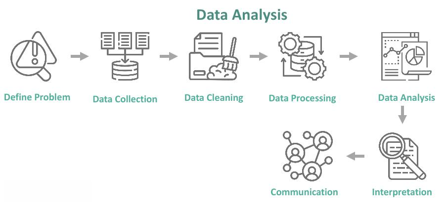

In the rapidly evolving landscape of data-driven decision-making and algorithmic trading, understanding biases such as cherry-picking and information bias is crucial. These biases, if unrecognized, can lead to distorted analysis and suboptimal outcomes in trading strategies. Cherry picking occurs when data points that support a certain hypothesis or desired outcome are selectively chosen, while contradictory data is ignored. This can create a skewed representation of reality, leading to misguided trading decisions. Information bias, on the other hand, refers to systematic distortions that arise in the data collection or reporting phase, impacting the integrity of the analysis.

Algorithmic trading, which relies heavily on quantitative models, is particularly susceptible to these biases. The precision and accuracy of trading algorithms are contingent upon the quality of the data they analyze. Biased data can compromise the performance of these algorithms, resulting in unreliable trading signals and increased financial risk. Given that trading decisions often involve significant capital, the implications of these biases can be substantial.



The article will explore the definitions and implications of these biases, emphasizing their impact on trading algorithms. Furthermore, strategies to mitigate these biases will be discussed, focusing on enhancing the reliability and accuracy of algorithmic trading. Employing strategies such as rigorous data selection criteria, embracing diverse data sources, and automating data processing and visualization can help in minimizing the effects of these biases. By addressing these challenges, traders and analysts can improve the robustness of their trading models and foster more effective decision-making.

## Table of Contents

## What is Cherry Picking in Data Analysis?

Cherry picking in data analysis is defined as the selective use of data points that confirm a predetermined hypothesis or desired outcome, while disregarding data that may contradict it. This selective reporting can give rise to skewed analyses and lead businesses or individuals to make decisions based on incomplete or misleading information. In financial markets, where decisions are often made based on quantitative data, cherry picking can detract from the quality and reliability of trading strategies. The financial market thrives on accuracy and comprehensive analysis, meaning that the neglect of relevant data may result in transactions that do not truly reflect market conditions, thus potentially leading to suboptimal trading results.

The occurrence of cherry picking is more prevalent than one might expect and can take place during both the data collection and analysis phases. During the data collection stage, it may occur when traders or analysts consciously or subconsciously select data sets or time periods that reflect their expectations or align with their biases. This may include focusing only on data from bull markets while disregarding fluctuations or bear market conditions that might present a full spectrum of risk and opportunity. During analysis, cherry picking manifests when analysts emphasize certain results or [statistics](/wiki/bayesian-statistics) while minimizing those that might negate or complicate their interpretations.

Mitigating cherry picking is crucial for traders who rely on accurate insights to inform their investment strategies. Traders need to be cognizant of confirmation bias, where their expectations influence the data they choose to highlight. Ensuring that analysis involves the comprehensive evaluation of all available data points, regardless of whether they align with the expected outcomes, is vital. Additionally, transparency in methodologies and an open critique of the strategies employed can go a long way in preventing this bias. Automating data analysis processes through the use of algorithms and ensuring peer review of trading strategies can help mitigate the risks associated with cherry picking by striving for balanced and unbiased results.

## The Consequences of Cherry Picking

Cherry [picking](/wiki/asset-class-picking), a selective data analysis practice, can significantly distort the perception of market conditions, contributing to poor investment decisions. This bias emerges when analysts prioritize data supporting their hypotheses, ignoring contradictory evidence that could provide a more comprehensive understanding of the financial landscape. Such selective reporting does not only compromise the integrity of data-driven insights but also diminishes the credibility of the analysts or organizations involved.

The inherent risk of cherry picking lies in its potential to create misleading narratives about market trends, ultimately impairing stakeholder decision-making. For example, an investment firm may emphasize positive financial indicators while disregarding relevant negative data points, resulting in overconfident investment strategies that do not align with actual market dynamics. This skewed analysis can lead to significant financial losses, especially when exposed to unexpected market shifts.

Moreover, when investors discover instances of cherry picking, trust in the analyst or organization wanes. This loss of confidence can have lasting ramifications, such as reduced client retention, a decline in capital inflows, and damage to the firm's reputation. In a data-centric industry, maintaining a reputation for integrity and transparency is paramount, as stakeholders rely heavily on the accurate interpretation of complex datasets to guide their financial decisions.

Real-world examples further illustrate the detrimental effects of cherry picking in financial analysis. During the 2008 financial crisis, some financial institutions were accused of selectively highlighting favorable risk assessments while neglecting critical risk factors, subsequently misleading investors and exacerbating the market downturn. These practices contributed to the erosion of trust between investors and financial entities, leading to increased regulatory scrutiny and demands for greater transparency in financial reporting.

In summary, cherry picking skews data interpretation, fostering an environment ripe for erroneous investment strategies and mistrust. By prioritizing unbiased and comprehensive data analysis, analysts can enhance the precision of market assessments and support sound investment decisions that benefit all stakeholders in the long term.

## Understanding Information Bias

Information bias is a prevalent issue in data analysis, characterized by a systematic distortion in the data or information used, which can lead to misleading results. In the context of [algorithmic trading](/wiki/algorithmic-trading), information bias can significantly impact the performance of trading algorithms, compromising their predictive accuracy and overall effectiveness.

Information bias may originate from several factors, including selective reporting, inaccurate data sources, and poor data collection methodologies. Selective reporting occurs when only specific results or data points that support a desired outcome are highlighted, while contrary data is ignored or underreported. This creates an incomplete picture that may mislead algorithmic models. One example of this in trading is when back-testing results are selectively presented, emphasizing only successful trades while omitting unprofitable ones, which could make a trading strategy appear more robust than it actually is.

Inaccurate data sources can also introduce information bias. The reliability of a trading algorithm is contingent upon the quality of the data it is based on. Erroneous or out-of-date data can lead a model to develop incorrect assumptions, adversely affecting its predictions. For instance, using historical data that has not been adjusted for corporate actions like stock splits or dividends would skew a trading model's perspective, leading to inaccurate predictions.

Poor data collection methods, such as non-random sampling or inconsistent data intervals, further exacerbate the issue of information bias. For example, if a trader only considers stock prices at market open and close but ignores intra-day price variations, they may miss crucial market signals.

Addressing information bias is vital for maintaining the integrity of algorithmic trading strategies. It requires employing robust data validation techniques, ensuring data sources are verified and consistently updated. Automated data cleaning processes can help identify and rectify anomalies in the dataset, while statistical methods such as bootstrap sampling or cross-validation can provide a more comprehensive analysis by considering all available data rather than a selective subset.

In conclusion, recognizing and mitigating information bias is essential to enhance the reliability of trading algorithms, ensuring they accurately reflect market conditions and thereby aiding traders in making more informed decisions.

## Algo Trading and Biases

Algorithmic trading employs complex algorithms and data-driven models to make investment decisions at speeds and frequencies not possible for human traders. However, the effectiveness of these algorithms can be significantly compromised by biases such as cherry picking and information bias. Cherry picking in algorithmic trading involves selecting data points that confirm a trader's hypothesis while disregarding data that may indicate contrary outcomes. Information bias occurs when there is a systematic distortion in the data, potentially from selective reporting or flawed data collection, which affects the results and decisions derived from the data analysis.

These biases have profound implications for the predictive power and accuracy of trading algorithms. When an algorithm is based on biased data, it may produce unreliable trading signals. For example, an algorithm trained exclusively on bullish market conditions may perform poorly during market downturns because it fails to account for bearish scenarios. This could lead to increased risk and unfavorable trading outcomes.

Algorithmic models often use quantitative techniques to predict future market behavior. However, the presence of biases can skew the models, leading to inaccuracies in predictions. For instance, consider a simple moving average crossover strategy: if the data used to train the model is cherry-picked to specifically highlight profitable trades, the algorithm could generate overly optimistic signals. Mathematically, let $MA_{fast}(t)$ and $MA_{slow}(t)$ be the fast and slow moving averages at time $t$. The signal to buy or sell depends on their crossover:
$$
\text{Signal}(t) =
\begin{cases} 
\text{Buy}, & \text{if } MA_{fast}(t) > MA_{slow}(t) \\
\text{Sell}, & \text{if } MA_{fast}(t) < MA_{slow}(t)
\end{cases}
$$
If these moving averages are calculated from biased data, the trading signals will not accurately reflect market conditions.

To create resilient and adaptive trading strategies, a thorough understanding of how biases interact with quantitative models is necessary. One approach is to ensure that data collection and processing are as unbiased as possible. This involves incorporating diverse datasets and using robust statistical techniques to detect and correct biases. Employing [machine learning](/wiki/machine-learning) practices such as cross-validation can help assess the reliability of algorithmic model predictions across different market scenarios.

Additionally, continuous model evaluation and adaptation are imperative. Algorithms must be monitored and adjusted to accommodate new data and market dynamics. This requires developing a feedback loop where model performance is consistently reviewed against market outcomes, ensuring biases are identified and mitigated over time. Without addressing these biases, the efficacy of algorithmic trading remains compromised, potentially leading to suboptimal investment decisions and increased exposure to market risks.

## Strategies to Mitigate Biases

To mitigate biases such as cherry picking and information bias in algorithmic trading, several strategies can be employed to enhance the integrity and reliability of data analysis. 

First, applying rigorous data selection criteria is fundamental. This involves setting clear guidelines on how data should be collected, processed, and analyzed. By doing so, traders can ensure that the data is representative and comprehensive, thus minimizing the risk of selectively choosing data points that support a biased hypothesis. Utilizing diverse data sources further strengthens this approach. By incorporating multiple datasets, traders can obtain a more holistic view, diluting the influence of any single biased data source and enhancing the robustness of their conclusions.

Incorporating automated data processing and visualization techniques also plays a crucial role. Automation reduces human intervention in data handling, thereby decreasing the potential for biases. Tools such as Python libraries like Pandas for data manipulation and Matplotlib or Seaborn for visualization can be highly effective. By automating the process, data integrity is maintained, consistency is ensured, and transparency is increased as algorithms can process data uniformly, free from personal biases. For instance, employing a script to clean and visualize data could look like the following:

```python
import pandas as pd
import seaborn as sns
import matplotlib.pyplot as plt

# Load and clean data
data = pd.read_csv('trading_data.csv')
clean_data = data.dropna()  # Remove missing values

# Visualize data
sns.lineplot(data=clean_data, x='date', y='price')
plt.title('Trading Data Over Time')
plt.show()
```

Engaging multiple stakeholders when conducting data analyses is another effective strategy. By involving diverse perspectives, organizations can avoid the echo chamber effect where only like-minded views are considered. This collaborative approach not only exposes potential biases but also encourages a more rigorous critique of the data and the assumptions underlying any trading strategy. Incorporating feedback from traders, analysts, and even external consultants can lead to a more balanced analytical process.

Finally, considering alternative perspectives, such as conducting 'devil's advocacy' process where a team member is designated to intentionally challenge the prevailing view, can highlight potential oversights or biases that may not be immediately apparent. This method encourages critical thinking and helps in identifying any blind spots in the analysis, improving the overall robustness of trading algorithms.

By systematically implementing these strategies, traders can reduce the impact of biases in their decision-making processes, leading to more reliable and effective trading outcomes.

## Conclusion

Cherry picking and information biases significantly challenge the integrity of data analysis and algorithmic trading. These biases can distort data interpretation, leading to unreliable trading signals and suboptimal decision-making. Understanding and addressing these biases are essential for enhancing the reliability and accuracy of trading algorithms.

To mitigate these biases, traders should commit to transparency and employ robust analytical practices. Implementing rigorous data selection criteria, using diverse data sources, and incorporating automated data processing and visualization techniques can help maintain consistency and reduce the risk of bias. Additionally, involving multiple stakeholders and considering alternative perspectives can foster a balanced analytical approach, ensuring that trading strategies are less susceptible to bias-induced errors.

Ultimately, by acknowledging the existence of these biases and actively working to counteract them, traders can make more informed and effective trading decisions. This commitment not only improves the predictive power of algorithmic models but also builds trust in data-driven insights, leading to better investment outcomes and enhanced market participation.

## References & Further Reading

[1]: ["Advances in Financial Machine Learning"](https://www.amazon.com/Advances-Financial-Machine-Learning-Marcos/dp/1119482089) by Marcos Lopez de Prado

[2]: ["Evidence-Based Technical Analysis: Applying the Scientific Method and Statistical Inference to Trading Signals"](https://www.amazon.com/Evidence-Based-Technical-Analysis-Scientific-Statistical/dp/0470008741) by David Aronson

[3]: ["Machine Learning for Algorithmic Trading"](https://github.com/stefan-jansen/machine-learning-for-trading) by Stefan Jansen

[4]: Lütkepohl, H. (2005). ["New Introduction to Multiple Time Series Analysis."](https://link.springer.com/book/10.1007/978-3-540-27752-1) Springer-Verlag Berlin Heidelberg.

[5]: Kahneman, D. (2011). ["Thinking, Fast and Slow."](https://psycnet.apa.org/record/2011-26535-000) Farrar, Straus and Giroux.

[6]: ["Quantitative Trading: How to Build Your Own Algorithmic Trading Business"](https://www.amazon.com/Quantitative-Trading-Build-Algorithmic-Business/dp/1119800064) by Ernest P. Chan