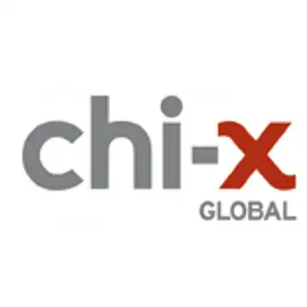

## Table of Contents

## What is Chi-X Global Holdings?

Chi-X Global Holdings is a company that owns and operates stock exchanges. It was started in 2007 and is known for being one of the first companies to offer alternative trading systems, which are different from traditional stock exchanges.

These alternative trading systems, also called "dark pools," allow people to buy and sell stocks in a way that is less visible to the public. This can be helpful for big investors who want to make large trades without affecting the stock price. Chi-X Global Holdings has exchanges in several countries, including Australia, Canada, and Japan.

## When was Chi-X Global Holdings founded?

Chi-X Global Holdings was founded in 2007. It started as a company that wanted to change how people buy and sell stocks. Instead of using the usual stock exchanges, Chi-X offered a new way called alternative trading systems.

These systems are sometimes called "dark pools." They let big investors trade stocks without everyone knowing about it right away. This can help keep the stock price steady when big trades happen. Chi-X Global Holdings now runs exchanges in places like Australia, Canada, and Japan.

## Who are the founders of Chi-X Global Holdings?

Chi-X Global Holdings was started by a group of people who wanted to change how stock trading works. The main person behind this idea was Tony Mackay. He used to work at big banks and saw that the usual way of trading stocks had problems. He wanted to make it easier and cheaper for people to buy and sell stocks.

Tony Mackay and his team created Chi-X in 2007. They made a new kind of trading system called a "dark pool." This system lets big investors trade without everyone knowing about it right away. This can help keep the stock price steady when big trades happen. Thanks to Tony Mackay and his team, Chi-X now runs exchanges in countries like Australia, Canada, and Japan.

## What are the main services offered by Chi-X Global Holdings?

Chi-X Global Holdings mainly offers a service called alternative trading systems, which are also known as "dark pools." These systems let big investors trade stocks without everyone knowing about it right away. This can help keep the stock price steady when big trades happen. It's like trading in secret, which can be good for big investors who don't want their trades to affect the market.

Chi-X also runs stock exchanges in different countries like Australia, Canada, and Japan. These exchanges use the dark pool system to help people buy and sell stocks in a way that's different from traditional stock exchanges. This makes trading easier and cheaper for everyone involved. By offering these services, Chi-X helps make the stock market work better for big investors and others who use their exchanges.

## In which countries does Chi-X Global Holdings operate?

Chi-X Global Holdings runs stock exchanges in different countries. They have exchanges in Australia, Canada, and Japan. These places use Chi-X's special way of trading called "dark pools."

In Australia, Chi-X helps people trade stocks in a way that's different from the usual stock exchange. In Canada, they do the same thing, making it easier for big investors to buy and sell without affecting the market too much. In Japan, Chi-X also uses dark pools to help keep stock prices steady when big trades happen.

## How does Chi-X Global Holdings impact the financial markets?

Chi-X Global Holdings has a big impact on financial markets by offering a different way to trade stocks. They use something called "dark pools," which let big investors buy and sell stocks without everyone knowing about it right away. This can help keep the stock price steady when big trades happen. It's like trading in secret, which can be good for big investors who don't want their trades to affect the market.

By running exchanges in countries like Australia, Canada, and Japan, Chi-X helps make trading easier and cheaper for everyone. This can attract more people to trade on their exchanges, which can make the markets more competitive. When more people trade, it can lead to better prices and more choices for everyone who wants to buy or sell stocks.

## What are the key achievements of Chi-X Global Holdings?

Chi-X Global Holdings has made a big impact on the stock market since it started in 2007. One of their biggest achievements is creating "dark pools," a new way for big investors to trade stocks without everyone knowing about it right away. This helps keep the stock price steady when big trades happen. It's like trading in secret, which can be good for big investors who don't want their trades to affect the market.

Another key achievement is that Chi-X now runs stock exchanges in different countries like Australia, Canada, and Japan. By doing this, they've made trading easier and cheaper for everyone. This has attracted more people to trade on their exchanges, making the markets more competitive. When more people trade, it can lead to better prices and more choices for everyone who wants to buy or sell stocks.

## What is the business model of Chi-X Global Holdings?

Chi-X Global Holdings makes money by running stock exchanges in different countries like Australia, Canada, and Japan. They use a special way of trading called "dark pools." This lets big investors buy and sell stocks without everyone knowing about it right away. This can help keep the stock price steady when big trades happen. It's like trading in secret, which can be good for big investors who don't want their trades to affect the market.

By offering this service, Chi-X makes trading easier and cheaper for everyone. This attracts more people to trade on their exchanges, which makes the markets more competitive. When more people trade, it can lead to better prices and more choices for everyone who wants to buy or sell stocks. Chi-X charges fees for using their trading systems, which is how they make money.

## How does Chi-X Global Holdings ensure the security and integrity of its trading platforms?

Chi-X Global Holdings works hard to keep its trading platforms safe and fair. They use strong security measures to protect the information and trades that happen on their exchanges. This includes things like encryption, which is like putting a secret code on the data so only the right people can see it. They also have systems in place to watch for any strange activity that could be a sign of someone trying to cheat or steal information.

To make sure the trading is fair, Chi-X follows strict rules and is watched by government groups in the countries where they operate. These rules help stop people from doing things that could hurt the market, like insider trading or making the market go up and down on purpose. By following these rules and using good security, Chi-X helps keep the trading platforms safe and trustworthy for everyone who uses them.

## What are the recent strategic initiatives or expansions by Chi-X Global Holdings?

Chi-X Global Holdings has been working on expanding its reach and improving its services. One of their recent moves is to focus more on technology. They are working on new systems that make trading faster and more reliable. This is important because it helps them stay ahead of other trading platforms. They are also looking into new markets where they can offer their services. This could mean starting new exchanges in different countries or adding new types of trading to their existing exchanges.

Another important initiative is about making their trading platforms even safer and more transparent. Chi-X is investing in better security systems to protect the data and trades that happen on their exchanges. They are also working on ways to make sure everyone can see what's happening in the market, which helps keep things fair. By doing these things, Chi-X is trying to build trust with the people who use their services and attract more investors to their exchanges.

## What are the challenges faced by Chi-X Global Holdings in the competitive landscape?

Chi-X Global Holdings faces many challenges in the competitive world of stock trading. One big challenge is keeping up with new technology. Other trading platforms are always working on new systems that make trading faster and easier. Chi-X has to keep improving its own technology to stay ahead. Another challenge is dealing with different rules in the countries where they operate. Each country has its own laws about trading, and Chi-X has to follow all of them. This can be hard and might slow them down.

Another challenge is making sure their trading platforms stay safe and fair. There are always people trying to cheat or steal information, so Chi-X has to keep their security strong. They also have to make sure everyone can see what's happening in the market, which helps keep things fair. It's a lot of work to keep everything safe and transparent. Plus, they have to keep attracting new investors to their exchanges. If other platforms offer better deals or easier ways to trade, people might choose to go there instead of Chi-X.

## What are the future prospects and innovations planned by Chi-X Global Holdings?

Chi-X Global Holdings is always looking ahead to the future. They want to keep making their trading platforms better by using new technology. This means they are working on systems that make trading faster and more reliable. They also want to grow by starting new exchanges in different countries or by adding new types of trading to their current exchanges. By doing this, they hope to reach more people and make their services more useful.

Another important part of their future plans is to keep their platforms safe and fair. Chi-X is investing in better security to protect the data and trades that happen on their exchanges. They also want to make sure everyone can see what's happening in the market, which helps keep things fair. By focusing on these areas, Chi-X hopes to build trust with the people who use their services and attract more investors to their exchanges.

## References & Further Reading

[1]: Aldridge, I. (2013). ["High-Frequency Trading: A Practical Guide to Algorithmic Strategies and Trading Systems."](https://www.amazon.com/High-Frequency-Trading-Practical-Algorithmic-Strategies/dp/1118343506) Wiley Finance.

[2]: Armstrong, D. (2014). ["A Regulatory and Economic Perplex: The European and U.S. Approaches to Regulating Algorithmic and High-Frequency Trading."](https://forum.homebrewersassociation.org/t/beer-advertising/2586) University of Pennsylvania Journal of Business Law.

[3]: Lewis, M. (2014). ["Flash Boys: A Wall Street Revolt."](https://en.wikipedia.org/wiki/Flash_Boys) W. W. Norton & Company.

[4]: MacKenzie, D. (2021). ["Trading at the Speed of Light: How Ultrafast Algorithms Are Transforming Financial Markets."](https://www.amazon.com/Trading-Speed-Light-Algorithms-Transforming/dp/0691211388) University of Chicago Press.

[5]: U.S. Securities and Exchange Commission (SEC). ["Regulation Systems Compliance and Integrity (Regulation SCI)."](https://www.sec.gov/rules-regulations/2023/03/regulation-systems-compliance-integrity) 

[6]: Zohar, C. (2021). ["Algorithmic and High-Frequency Trading: Is There a Need for more Transparency and Regulation?."](https://papers.ssrn.com/sol3/papers.cfm?abstract_id=3846814) Pepperdine Journal of Business, Entrepreneurship & the Law.