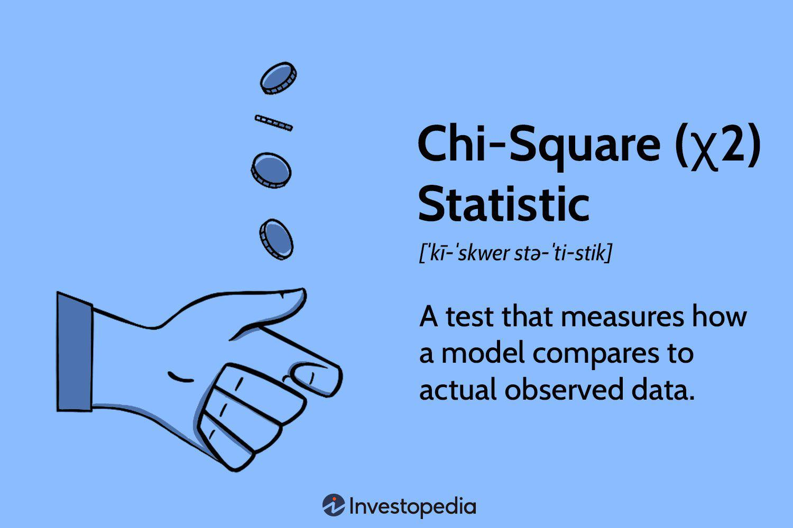

The financial services sector has experienced significant transformation due to trading platforms utilizing algorithmic trading, fundamentally changing trade execution processes in global markets. These platforms leverage sophisticated algorithms to automate trading decisions, enhancing efficiency by executing orders at speeds human traders cannot match. The integration of such technology has not only increased trading volumes but also improved market liquidity and transparency.

This article examines the intersection of financial services, trading platforms, market regulation, and algorithmic trading to better understand their collective impact on modern financial markets. Algorithmic trading utilizes advanced computing strategies to analyze market data and execute trades based on predetermined criteria. This involves mathematical models and quantitative analysis, allowing for the development of complex trading strategies that optimize execution across diverse market conditions.



Increased reliance on these platforms highlights the importance of comprehending the accompanying regulatory landscape. Regulatory bodies worldwide have recognized the need for stringent guidelines to mitigate risks associated with algorithmic trading, particularly with respect to market stability and integrity. This includes ensuring that platforms operate transparently and adhere to sound risk management practices, which are essential components for maintaining investor confidence and safeguarding against market disruptions.

Navigating the complexities of algorithmic trading and its regulation requires a deep understanding of how these platforms function within the financial ecosystem. As algorithmic trading continues to evolve, staying informed about current trends and regulatory requirements is crucial for market participants aiming to capitalize on the opportunities presented by this technological advancement, while mitigating potential risks.

## Table of Contents

## The Rise of Trading Platforms

Trading platforms have significantly transformed the financial services sector by offering alternative trading venues that enhance market accessibility and efficiency. A notable example is Chi-X Global, which has played a crucial role in expanding this landscape. These platforms facilitate access to a wide range of markets and asset classes, thus becoming integral components of global finance.

The proliferation of trading platforms corresponds with the escalating demand for transactions that are faster, more transparent, and efficient. By offering solutions that streamline the execution of trades, these platforms contribute to reducing the time it takes to complete transactions and lower associated costs. For instance, they utilize cutting-edge technology to optimize the speed at which buy and sell orders are matched, thereby catering to the needs of market participants who prioritize efficiency.

Trading platforms like Chi-X Global have also democratized market access, which traditionally might have been limited by geographic or institutional constraints. By providing services across various regions and financial hubs, they enable a more inclusive financial ecosystem. This has broadened investment opportunities for a more diverse range of market actors, from individual traders to large institutional investors.

Moreover, the transparent nature of trading platforms enhances market integrity by ensuring that market participants receive consistent and accurate information. This transparency fosters trust within the financial markets, encouraging greater participation and [liquidity](/wiki/liquidity-risk-premium). The algorithms and protocols embedded in these platforms ensure that trades are executed at the best available prices, thus promoting fairness and competitive practices.

In summary, the rise of trading platforms has marked a significant shift in how financial markets operate, characterized by an increased emphasis on speed, transparency, and efficiency. These platforms not only meet the needs of current market participants but also pave the way for future advancements in trading technologies.

## Understanding Algorithmic Trading

Algorithmic trading, often abbreviated as algo trading, refers to the use of computer algorithms to automate the process of executing orders in financial markets. These algorithms can make trade decisions on the basis of pre-set criteria, which might include variables such as timing, price, or [volume](/wiki/volume-trading-strategy). The primary goal of algo trading is to optimize the execution of orders by minimizing trading costs, reducing market impact, and ensuring the trade's execution speed.

Institutional investors and hedge funds predominantly utilize [algorithmic trading](/wiki/algorithmic-trading) due to its inherent advantages. These entities benefit significantly from the speed and precision algorithms bring to executing trades. With the ability to process complex mathematical formulas and execute decisions in milliseconds, algo trading platforms enable traders to take advantage of minute price discrepancies across markets. Furthermore, algorithms can handle sophisticated trading strategies, such as statistical [arbitrage](/wiki/arbitrage), [market making](/wiki/market-making), and [trend following](/wiki/trend-following), which require the assimilation and processing of vast data sets that would be impossible for a human trader to manage in real-time.

Despite these benefits, the rapid adoption of algorithmic trading has sparked concerns regarding its potential effects on market stability. One notable issue is the phenomenon known as "flash crashes," where markets experience a very rapid decline in asset prices, often triggered by automated selling. These crashes can exacerbate market [volatility](/wiki/volatility-trading-strategies) and lead to significant financial turmoil. Also, the highly automated nature of algo trading raises the risk of systemic failures due to bugs or unforeseen interactions between competing algorithms that could trigger disorderly market behavior.

Another critical concern is the potential for market manipulation. High-frequency trading, a form of algorithmic trading, can be used to conduct practices such as "quote stuffing," which involves sending a large number of orders to a market to create confusion and slow down other traders, thereby gaining an unfair advantage. Such practices call for increased scrutiny and regulation to preserve fair trading environments.

The balancing act between leveraging the efficiencies of algorithmic trading and safeguarding market integrity presents ongoing challenges. Regulatory bodies continuously work to establish frameworks that allow market innovation while ensuring robust checks and balances against potential destabilizing activities.

## Market Regulation and Compliance

Regulators have established comprehensive rules for algorithmic trading to mitigate risks such as market manipulation and ensure fair trading practices. In the United States, the oversight of algorithmic trading falls under the jurisdiction of the Securities and Exchange Commission (SEC) and the Commodity Futures Trading Commission (CFTC). Both agencies have implemented regulatory measures designed to preserve market integrity and protect investors.

The SEC requires algorithmic trading firms to adhere to regulations such as Regulation SCI (Systems Compliance and Integrity), which mandates that firms ensure their trading systems are robust, reliable, and secure. This regulation requires firms to develop and maintain effective policies and procedures for the operation of their trading systems, as well as undergo regular testing and reviews.

Similarly, the CFTC has established regulations for entities engaging in algorithmic trading on futures and swaps markets. These include requirements for pre-trade risk controls, order cancellation functionalities, and trade surveillance to detect and prevent abusive trading practices. The CFTC emphasizes the need for firms to conduct thorough testing and validation of their algorithms prior to deployment.

Compliance is a multifaceted process that involves the implementation of robust risk management practices. Firms must ensure their algorithms are rigorously tested under various market conditions to verify their performance and resilience. This involves simulating trading scenarios, stress testing the algorithms, and incorporating [machine learning](/wiki/machine-learning) techniques to identify potential vulnerabilities.

For example, a basic Python script for [backtesting](/wiki/backtesting) an algorithm might look like this:

```python
import pandas as pd

def backtest_strategy(data, strategy_function):
    cash = 10000  # initial capital in USD
    position = 0  # number of shares currently held
    for date, row in data.iterrows():
        action = strategy_function(row)
        if action == "buy" and cash >= row['close']:
            position += 1
            cash -= row['close']
        elif action == "sell" and position > 0:
            position -= 1
            cash += row['close']
    return cash + position * data.iloc[-1]['close']

# Example strategy function
def example_strategy(row):
    # A simple strategy based on moving averages
    if row['close'] > row['ma50']:  
        return "buy"
    elif row['close'] < row['ma50']:
        return "sell"
    else:
        return "hold"

# Load historical market data
data = pd.read_csv('historical_data.csv')
final_portfolio_value = backtest_strategy(data, example_strategy)
print("Final Portfolio Value: USD", final_portfolio_value)
```

This code demonstrates a simplified backtesting process where a trading strategy, based on moving averages, is tested on historical data to evaluate its potential profitability. Such practices are crucial for compliance as they ensure trading algorithms can withstand various market scenarios while minimizing risks.

Overall, regulators emphasize the importance of transparency, accountability, and rigorous testing. By adhering to these principles, firms can align with market integrity standards, thereby promoting fair and efficient trading environments.

## Chi-X Global: A Case Study

Chi-X Global, established by Instinet in 2008, serves as an exemplary model for the successful operation of trading platforms within a diverse array of regulatory environments. Operating as an alternative trading system, Chi-X Global has leveraged technological innovation to provide market participants efficient and transparent avenues for executing trades. As an exchange, it has expanded its presence across multiple regions, showcasing its capability to adhere to varying local regulatory requirements while maintaining its competitive edge.

The platform's growth underscores the increasing viability of alternative trading systems worldwide, underscoring the demand for diversified market access. Chi-X Global's model has proven particularly attractive to institutional investors seeking reduced latency and cost-effective trading solutions. Its success is attributable to its innovative trading infrastructure, which incorporates advanced matching engines and algorithms designed to facilitate rapid trade execution without compromising accuracy.

Significantly, Chi-X Global's integration with major financial hubs, including Japan and Australia, highlights the importance of global regulatory compliance in the increasingly interconnected financial markets. In Japan, Chi-X has operated as one of the leading proprietary trading systems, offering efficient trading solutions aligned with the requirements of the Japanese Financial Services Agency. Similarly, its presence in Australia aligns with the guidelines set forth by the Australian Securities and Investments Commission, ensuring adherence to local mandates while delivering high-frequency trading capabilities.

Chi-X Global's experience emphasizes the necessity for alternative trading platforms to navigate and comply with international regulations, ensuring both market access and operational success. As regulatory landscapes continue to evolve globally, platforms like Chi-X demonstrate the potential for innovation within structured compliance, offering a clear pathway for the future development of global financial services.

## Global Perspectives on Regulation

Different regions implement distinct regulatory frameworks for algorithmic trading, each tailored to the specific conditions and priorities of their financial markets. These frameworks are critical for ensuring market transparency, mitigating risk, and protecting investors.

In the European Union, the Markets in Financial Instruments Directive II (MiFID II) establishes comprehensive guidelines. MiFID II mandates high transparency standards, requiring detailed reporting and real-time data dissemination to bolster market integrity. It also enforces stringent risk management protocols, obligating trading firms to implement systems and controls to monitor and manage algorithmic trading risks effectively. These measures aim to enhance investor protection and financial market stability across EU member states.

Asia's regulatory approaches differ, reflecting diverse market structures and regulatory philosophies. For instance, Japan's Financial Services Agency (FSA) imposes requirements that promote transparency and competition, while simultaneously protecting investors through detailed scrutiny of trading algorithms. Meanwhile, Singapore’s Monetary Authority of Singapore (MAS) emphasizes the importance of technology risk management and the implementation of robust governance frameworks for financial institutions engaging in algorithmic trading.

Understanding these regulatory differences is crucial for traders and firms operating on a global scale. Firms must navigate varying compliance requirements, which may include adapting their systems and procedures to adhere to local laws and guidelines. Consequently, successful global trading requires not only financial acumen but also a comprehensive understanding of international regulatory environments.

## Challenges and Future Directions

The rapid evolution of algorithmic trading necessitates that regulatory frameworks remain adaptable to effectively govern this ever-changing landscape. One of the primary challenges is the integration of cutting-edge technologies, such as AI-driven trading algorithms. These advancements enhance trading efficiency and strategy sophistication, but they also introduce complexities that could affect market stability and fairness. For instance, AI algorithms can identify and exploit market inefficiencies at a pace that far outstrips human capabilities, potentially leading to unintended market consequences or exacerbated volatility.

Addressing these technological advancements requires regulators to not only update existing rules but also anticipate the implications of emerging technologies. This may involve redefining what constitutes fair trading practices and ensuring that AI-driven strategies do not lead to systemic risks. Regulatory bodies must invest in technological expertise to better understand the nuances of algorithmic strategies and assess their impacts accurately. Furthermore, collaborative efforts, such as regular consultations and exchanges between regulators and industry participants, are crucial to developing rules that are both effective and practical.

Inclusivity in dialogue helps ensure that market integrity is preserved while allowing for continued innovation. For example, the implementation of regulatory sandboxes could provide a controlled environment where new technologies and strategies can be tested without posing significant risks to real markets. Such initiatives not only foster innovation but also offer regulators firsthand insights into the tools they are tasked with overseeing.

As algorithmic trading continues to progress, maintaining this equilibrium between regulation and innovation will be pivotal. The future landscape will likely see more sophisticated AI-driven models, necessitating more agile and responsive regulatory approaches. Balancing these demands will require ongoing updates to regulatory frameworks to ensure they are proportionate, forward-looking, and supportive of both market integrity and technological advancement.

## Conclusion

Algorithmic trading has profoundly transformed the financial markets, redefining not just how trades are executed but also the strategies behind them. By automating trading processes, algorithmic trading enhances efficiency, provides speed, and reduces human error, making it indispensable for market participants. However, this evolution also ushers in a set of challenges, predominantly related to market stability and fairness.

The integration of algorithmic trading into financial markets requires stringent regulatory oversight to manage its associated risks. Proper regulation helps ensure that while the benefits of algorithmic trading are harnessed, its potential downsides—such as market manipulation and systemic risks—are effectively mitigated. Entities like the U.S Securities and Exchange Commission (SEC), Commodity Futures Trading Commission (CFTC), and the European Securities and Markets Authority (ESMA) play critical roles in shaping policies to maintain market integrity and stability.

Platforms like Chi-X Global exemplify the importance of understanding and complying with regulatory structures. As a model of how alternative trading systems can thrive under varying regulatory frameworks, Chi-X Global highlights the necessity for market participants to remain informed about both local and international regulatory climates. This understanding not only aids in compliance but also in leveraging these platforms for optimal trading strategies.

Navigating the complexities of modern trading necessitates a harmonious balance between innovation and regulation. While algorithmic trading offers numerous opportunities for efficiency and innovation, continuous dialogue between regulators and market participants is paramount. This dialogue ensures that regulatory policies evolve alongside technological advancements, such as AI and machine learning, fostering an environment where both market integrity and innovation can coexist.

## References & Further Reading

[1]: Aldridge, I. (2013). ["High-Frequency Trading: A Practical Guide to Algorithmic Strategies and Trading Systems."](https://www.amazon.com/High-Frequency-Trading-Practical-Algorithmic-Strategies/dp/1118343506) Wiley Finance.

[2]: Armstrong, D. (2014). ["A Regulatory and Economic Perplex: The European and U.S. Approaches to Regulating Algorithmic and High-Frequency Trading."](https://forum.homebrewersassociation.org/t/beer-advertising/2586) University of Pennsylvania Journal of Business Law.

[3]: Lewis, M. (2014). ["Flash Boys: A Wall Street Revolt."](https://en.wikipedia.org/wiki/Flash_Boys) W. W. Norton & Company.

[4]: MacKenzie, D. (2021). ["Trading at the Speed of Light: How Ultrafast Algorithms Are Transforming Financial Markets."](https://www.amazon.com/Trading-Speed-Light-Algorithms-Transforming/dp/0691211388) University of Chicago Press.

[5]: U.S. Securities and Exchange Commission (SEC). ["Regulation Systems Compliance and Integrity (Regulation SCI)."](https://www.sec.gov/rules-regulations/2023/03/regulation-systems-compliance-integrity) 

[6]: Zohar, C. (2021). ["Algorithmic and High-Frequency Trading: Is There a Need for more Transparency and Regulation?."](https://papers.ssrn.com/sol3/papers.cfm?abstract_id=3846814) Pepperdine Journal of Business, Entrepreneurship & the Law.