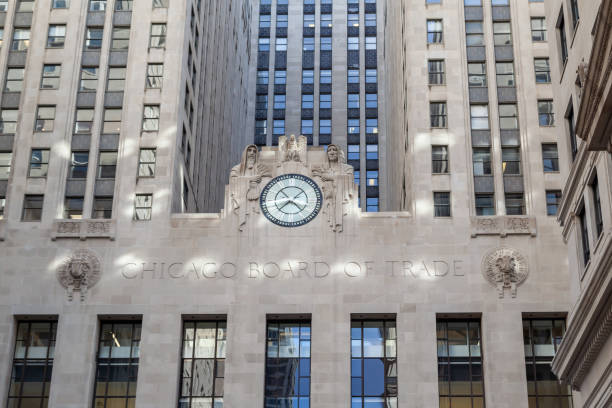

## Table of Contents

## What is the Chicago Board Options Exchange (CBOE)?

The Chicago Board Options Exchange, often called CBOE, is a place where people can buy and sell options. Options are special contracts that give you the right to buy or sell something, like a stock, at a certain price before a certain date. The CBOE started in 1973 and was the first place in the world where people could trade options in a big, organized way. It's located in Chicago, Illinois, and it's a very important part of the financial world.

The CBOE helps people manage risk and make money. For example, if you think the price of a stock might go up, you can buy an option that lets you buy that stock at a lower price later. If the stock price does go up, you can make money. If it doesn't, you only lose the money you paid for the option. The CBOE also creates new kinds of options, like options on things other than stocks, such as indexes or even the weather. This helps more people use options in different ways.

## When was the CBOE founded and by whom?

The Chicago Board Options Exchange (CBOE) was founded on April 26, 1973. It was created by a group of people from the Chicago Board of Trade. The main person behind starting the CBOE was a man named Joe Sullivan. He and his team wanted to make a new place where people could trade options easily.

Before the CBOE, options trading was not very organized. People had to find each other to make deals. The CBOE changed this by setting up a place where options could be bought and sold in a clear and fair way. This made options trading much easier and more popular.

## What types of financial instruments are traded on the CBOE?

The Chicago Board Options Exchange (CBOE) is a place where people trade different kinds of options. Options are contracts that give you the right to buy or sell something at a certain price before a certain time. The main thing traded at the CBOE is stock options. These are options on individual company stocks. People use these options to bet on whether the price of a stock will go up or down.

But the CBOE also trades other types of options. One type is index options, which are based on groups of stocks, like the S&P 500. Another type is options on exchange-traded funds (ETFs), which are like baskets of stocks that you can buy and sell like a single stock. The CBOE even has options on things like interest rates and the weather. This variety helps people use options in many different ways to manage risk or make money.

Besides options, the CBOE also trades something called [volatility](/wiki/volatility-trading-strategies) products. These are based on how much the price of something might change in the future. The most famous one is the VIX, which measures how much people expect the stock market to move. Trading these products helps people protect themselves from big price swings or even bet on them.

## How does the CBOE impact the financial markets?

The Chicago Board Options Exchange (CBOE) has a big impact on the financial markets. It helps make trading options easier and more organized. Before the CBOE, people had to find each other to trade options, which was hard and not very clear. The CBOE changed this by setting up a place where options can be bought and sold easily. This makes the market more fair and helps more people get involved. The CBOE also creates new types of options, like ones based on stock indexes or even the weather. This helps people use options in more ways to manage risk or make money.

The CBOE also affects the markets by offering products that help people deal with big price changes. One famous product is the VIX, which measures how much people expect the stock market to move. Trading these products helps people protect themselves from big price swings or even bet on them. This can make the markets more stable because people can use these tools to manage their risks better. Overall, the CBOE plays a key role in making the financial markets work smoothly and helping people manage their investments.

## What are some of the key indices and products offered by the CBOE?

The Chicago Board Options Exchange (CBOE) offers many important indices and products that people use to manage their money and investments. One of the most famous is the VIX, which is also called the "fear index." The VIX measures how much people think the stock market will move in the next 30 days. If the VIX is high, it means people are worried about big changes in the market. If it's low, it means they think the market will stay pretty calm. People can trade options on the VIX to protect themselves from big price swings or to bet on them.

Another key product is options on stock indexes like the S&P 500. These options let people bet on whether the whole market will go up or down, not just one stock. The CBOE also offers options on exchange-traded funds (ETFs), which are like baskets of stocks that you can buy and sell like a single stock. This helps people manage their investments in a more flexible way. Besides these, the CBOE also has options on things like interest rates and the weather, which can be used in many different situations to manage risk or make money.

## Can you explain the role of the VIX, known as the 'fear gauge', in the CBOE?

The VIX, which people call the "fear gauge," is a very important part of the Chicago Board Options Exchange (CBOE). It measures how much people think the stock market will move in the next 30 days. If the VIX is high, it means people are worried and expect big changes in the market. If it's low, it means they think the market will stay calm. The VIX helps people understand how scared or confident everyone is about the stock market.

At the CBOE, people can trade options on the VIX. This means they can use the VIX to protect themselves from big price swings or even bet on them. If someone thinks the market will get very wild soon, they might buy a VIX option to make money if that happens. If they think the market will stay calm, they might sell a VIX option. This helps make the markets more stable because people can use these tools to manage their risks better.

## What are the trading hours for the CBOE?

The Chicago Board Options Exchange (CBOE) has regular trading hours and also special extended hours. The regular trading hours are from 9:30 AM to 4:00 PM Eastern Time, Monday through Friday. This is when most people trade options on stocks, indexes, and other things.

But the CBOE also has extended trading hours. These hours are from 2:00 AM to 9:15 AM Eastern Time, and then from 4:15 PM to 8:15 PM Eastern Time. During these times, people can trade certain products like VIX options and S&P 500 options. This helps people who want to trade outside of the regular hours.

## How does one become a member of the CBOE?

Becoming a member of the Chicago Board Options Exchange (CBOE) involves a few steps. First, you need to meet the CBOE's membership requirements. This means you have to show that you have enough money and experience to trade options safely. You'll need to fill out an application and provide financial statements to prove your financial stability. The CBOE also checks your background to make sure you are trustworthy and follow the rules.

Once you pass the initial checks, you'll need to pay a membership fee. This fee can be different depending on what kind of membership you want. There are different types of memberships, like trading permits or market-maker memberships, each with its own costs and benefits. After you pay the fee and get approved, you can start trading on the CBOE. You'll need to keep following the CBOE's rules and regulations to stay a member.

## What are the regulatory bodies that oversee the CBOE?

The Chicago Board Options Exchange (CBOE) is watched over by a few important groups to make sure it follows the rules. The main one is the Securities and Exchange Commission (SEC). The SEC is a part of the U.S. government that makes sure everyone in the stock market plays fair. They check the CBOE to make sure it is doing things the right way and protecting people who trade there.

Another group that oversees the CBOE is the Financial Industry Regulatory Authority (FINRA). FINRA is not part of the government but works to make sure that people and companies in the financial world are honest and follow the rules. They work with the SEC to keep an eye on the CBOE and make sure it is doing a good job.

The CBOE also has its own rules and a team that makes sure everyone follows them. This helps the CBOE stay in line with what the SEC and FINRA expect. By working together, these groups help keep the CBOE a safe and fair place for people to trade options.

## How has technology influenced trading at the CBOE?

Technology has changed the way people trade at the Chicago Board Options Exchange (CBOE) a lot. Before, trading was done by people shouting and making hand signals on a trading floor. Now, with computers and the internet, most trading happens electronically. This makes it faster and easier for people to buy and sell options. They can do it from anywhere, not just in Chicago. The CBOE uses special computer systems that match buyers and sellers quickly, making the market work better.

The CBOE also uses technology to make new products and ways to trade. For example, they have special computer programs that help people trade options on the VIX, which measures how much people think the stock market will move. These programs can handle a lot of trades at once and make sure everything is fair. Technology also helps the CBOE keep an eye on the market and make sure everyone follows the rules. This makes the market safer and more trustworthy for everyone who trades there.

## What are some significant historical events or milestones in the history of the CBOE?

The Chicago Board Options Exchange (CBOE) has a rich history filled with important events and milestones. It all started on April 26, 1973, when the CBOE was founded. This was a big deal because it was the first place in the world where people could trade options in an organized way. Before that, options trading was hard and not very clear. The CBOE made it easier and more fair for everyone. In 1983, the CBOE launched options on stock indexes, like the S&P 100, which was another big step. This let people bet on the whole market, not just one stock.

Another important milestone came in 1993 when the CBOE introduced the VIX, also known as the "fear gauge." The VIX measures how much people expect the stock market to move in the next 30 days. It became a very useful tool for people to manage their risks. In 2004, the CBOE started offering options on exchange-traded funds (ETFs), which helped people trade more easily. And in 2014, the CBOE went fully electronic, moving away from the old way of trading with hand signals and shouts on the trading floor. This made trading faster and more efficient.

## What future trends or developments can we expect from the CBOE?

The Chicago Board Options Exchange (CBOE) is always looking to the future and trying new things. One big trend we might see is more use of technology, like [artificial intelligence](/wiki/ai-artificial-intelligence) and [machine learning](/wiki/machine-learning). These tools could help the CBOE make trading even faster and smarter. They might also come up with new types of options that people can use in different ways. For example, they might create options based on new kinds of things, like cryptocurrencies or other new financial products. This would help more people use the CBOE to manage their money.

Another thing we might see is the CBOE working more with other countries. They might set up new ways for people from around the world to trade options easily. This could make the CBOE even more important in the global financial world. They might also focus more on helping people understand and use options better, maybe by offering more education and tools. Overall, the CBOE will keep changing and growing to meet the needs of people who trade options.

## References & Further Reading

[1]: ["The CBOE Volatility Index - VIX"](https://www.investopedia.com/terms/v/vix.asp) - Official CBOE website.

[2]: [Cboe Global Markets](https://www.cboe.com/) - Official CBOE website.

[3]: Hull, J.C. (2012). ["Options, Futures, and Other Derivatives"](https://www.semanticscholar.org/paper/Options%2C-Futures%2C-and-Other-Derivatives-Hull/89bdee500c8623864fc9eb7a471546aa713acc44) - Pearson.

[4]: Chance, Don M., and Brooks, Robert. (2015). ["Introduction to Derivatives and Risk Management"](https://www.amazon.com/Introduction-Derivatives-Management-Stock-Trak-Coupon/dp/130510496X) - Cengage Learning.

[5]: Berman, Kendall. (2019). ["Algorithmic Trading: A Comprehensive Beginner’s Guide to Learn and Understand the Fundamentals of Algorithmic Training"](https://en.wikipedia.org/wiki/Safe_Room_(Succession)) - Kindle Edition.