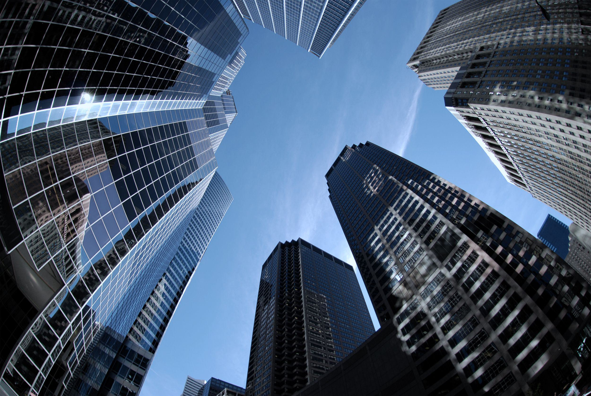

## Table of Contents

## What is the Chicago Mercantile Exchange (CME)?

The Chicago Mercantile Exchange, often called the CME, is a big place where people buy and sell things like farm products, money from different countries, and even promises about future prices. It started a long time ago in 1898 and is located in Chicago, Illinois. People come to the CME to trade things they need for their businesses or to make money by guessing what prices will do in the future.

The CME is very important because it helps set prices for many things around the world. For example, if you are a farmer, you can use the CME to find out how much your crops might be worth in the future. This helps farmers plan better. The CME also has a lot of computers and technology to make trading fast and easy. It's not just in Chicago anymore; it has grown to be a global marketplace where people from all over the world can trade.

## When was the Chicago Mercantile Exchange founded?

The Chicago Mercantile Exchange, or CME, was founded a long time ago in 1898. It started in Chicago, Illinois. Back then, it was a place where people came to trade things like farm products and other goods.

Over the years, the CME grew bigger and more important. It became a place where people not only trade physical items but also promises about future prices. This helps businesses plan better and manage risks. Today, the CME is a global marketplace where people from all over the world can trade.

## What types of financial products are traded on the CME?

The Chicago Mercantile Exchange, or CME, is a big place where people trade many different financial products. They trade things like futures and options, which are agreements to buy or sell something at a set price in the future. This can include farm products like corn, wheat, and soybeans. It also includes things like oil, natural gas, and metals like gold and silver.

Another big part of what's traded at the CME is money from different countries, called foreign exchange or [forex](/wiki/forex-system). People trade currencies like the US dollar, Euro, and Japanese yen. They also trade interest rates, which are important for banks and other financial businesses. These trades help people manage risks and plan for the future.

Lastly, the CME also deals with trading indexes and stocks. This includes stock market indexes like the S&P 500 and individual stocks. These trades can help investors make money or protect their investments from going down in value. Overall, the CME is a busy place where lots of different financial products are bought and sold every day.

## How does trading work at the Chicago Mercantile Exchange?

Trading at the Chicago Mercantile Exchange, or CME, happens in two main ways: on the trading floor and through computers. On the trading floor, people called traders shout and use hand signals to buy and sell things. This is called open outcry. They trade things like farm products, money from different countries, and promises about future prices. It's a fast and exciting place where traders need to be quick and smart to make good deals.

Most trading at the CME now happens through computers. This is called electronic trading. People use special software to buy and sell things from anywhere in the world. They can see prices and make trades with just a few clicks. This makes trading faster and easier. The CME has a big computer system called Globex that works all the time, so people can trade whenever they want, even when the trading floor is closed.

## What is the role of the CME in the global financial market?

The Chicago Mercantile Exchange, or CME, plays a big role in the global financial market. It helps set prices for many things like farm products, money from different countries, and promises about future prices. When people trade at the CME, they help create a fair price for these things. This is important because it helps businesses all over the world know what things are worth. For example, a farmer in Brazil can use the CME to see how much their soybeans might be worth in the future, which helps them plan better.

The CME also helps people manage risks. When someone trades futures or options at the CME, they are making a deal about what something will be worth later. This can protect businesses from big changes in prices. For instance, an airline might use the CME to buy fuel at a set price in the future, so they don't have to worry if fuel prices go up. By doing this, the CME makes the global market more stable and helps businesses plan for the future.

## How has the CME evolved since its inception?

The Chicago Mercantile Exchange, or CME, started in 1898 as a place where people traded farm products like butter and eggs. Back then, it was all about helping farmers and food businesses know what things were worth. Over time, the CME grew and started trading more things like meat and potatoes. It became a busy place where people shouted and used hand signals to make deals. This way of trading was called open outcry, and it helped set prices for many important things.

As technology got better, the CME changed a lot. In the 1990s, they started using computers for trading, which made everything faster and easier. Now, most trading happens through a computer system called Globex, which works all the time, so people can trade from anywhere in the world. The CME also started trading new things like money from different countries, promises about future prices, and even stock market indexes. Today, the CME is a big part of the global financial market, helping businesses manage risks and plan for the future.

## What are the major indices and benchmarks provided by the CME?

The Chicago Mercantile Exchange, or CME, provides several major indices and benchmarks that help people understand how different markets are doing. One important benchmark is the S&P 500, which tracks the stock prices of 500 big companies in the United States. Another is the Dow Jones Industrial Average, which looks at the stock prices of 30 big companies. These indices help investors see if the stock market is going up or down and make decisions about their money.

The CME also offers benchmarks for things like interest rates and money from different countries. For example, the CME's Fed Funds futures help people guess what the U.S. interest rates might be in the future. This is important for banks and other businesses that need to borrow money. The CME also has benchmarks for foreign exchange, like the Euro and the Japanese yen, which help people trading different currencies know what prices to expect. These benchmarks make the global market more stable and help businesses plan better.

## What technological advancements has the CME implemented to facilitate trading?

The Chicago Mercantile Exchange, or CME, has made big changes to use technology to help with trading. They started using computers for trading in the 1990s, which was a big step forward. Before that, people traded by shouting and using hand signals on the trading floor. Now, most trading happens through a computer system called Globex. This system works all the time, so people can trade from anywhere in the world, even when the trading floor is closed. Using computers makes trading faster and easier, and it helps more people take part in the market.

The CME also uses technology to make trading safer and more reliable. They have systems that check trades to make sure they are fair and correct. This helps stop mistakes and cheating. The CME also uses technology to keep track of all the trades and make sure everything is working well. They keep improving their technology to handle more trades and make the market work better. All these changes have helped the CME become a big part of the global financial market.

## How does the CME manage risk and ensure market integrity?

The Chicago Mercantile Exchange, or CME, works hard to manage risk and keep the market fair. They do this by having strict rules and systems in place. For example, they check every trade to make sure it's fair and correct. This helps stop mistakes and cheating. The CME also makes sure that people who trade have enough money to cover their trades. This is called margin, and it helps protect the market if prices change a lot. By doing all these things, the CME helps keep the market safe and stable.

Another way the CME manages risk is by using technology. They have special computer systems that watch the market all the time. These systems can spot if something strange is happening and stop it before it causes problems. The CME also has rules about how much prices can change in a day. This helps stop big, sudden changes that could hurt people who are trading. By using technology and having good rules, the CME makes sure the market is fair and that people can trust it.

## What are the key regulatory bodies overseeing the operations of the CME?

The Chicago Mercantile Exchange, or CME, is watched over by a few important groups to make sure it follows the rules. The main one is the Commodity Futures Trading Commission, or CFTC. This group makes sure that trading in things like farm products and promises about future prices is fair and honest. They check that the CME is doing what it should to stop cheating and protect people who trade.

Another big group is the Securities and Exchange Commission, or SEC. While the SEC mostly looks after stocks and bonds, it also helps keep an eye on some of the things traded at the CME, like stock market indexes. The CME also has its own group called the CME Group, which makes rules and watches over trading to make sure everything is done right. These groups work together to keep the CME a safe and fair place to trade.

## How does the CME influence commodity prices and financial markets?

The Chicago Mercantile Exchange, or CME, has a big effect on commodity prices and financial markets. When people trade things like farm products, oil, and metals at the CME, they help set the prices for these things around the world. For example, if a lot of people want to buy corn at the CME, the price of corn might go up. This is important because it helps farmers, businesses, and even governments know what things are worth. They can use this information to make plans and decisions.

The CME also influences financial markets by trading things like money from different countries, interest rates, and stock market indexes. When traders make deals about these things, it can change how much they are worth. For example, if many people think the U.S. dollar will be worth more in the future, they might buy it at the CME, which could make the dollar's value go up. This helps banks, investors, and other businesses manage risks and plan better. By setting prices and helping people make smart trades, the CME keeps the global market stable and fair.

## What are some notable historical events or crises that impacted the CME?

The Chicago Mercantile Exchange, or CME, has been through some big events and crises over the years. One big event was the Great Depression in the 1930s. During this time, the whole world was struggling, and many people lost their jobs and money. The CME had to deal with wild price changes and less trading. They made new rules to help keep things stable and fair, which helped them get through the tough times.

Another important time was the financial crisis of 2008. This was when a lot of big banks and businesses had problems, and the whole world's economy was shaky. The CME had to handle a lot of trading and make sure everything was fair. They used their technology and rules to help keep the market stable. This crisis showed how important the CME is for setting prices and helping businesses manage risks during hard times.

## References & Further Reading

[1]: ["Algorithmic Trading: Winning Strategies and Their Rationale"](https://books.google.com/books/about/Algorithmic_Trading.html?id=WAlFDwAAQBAJ) by Ernest P. Chan

[2]: ["Trading Commodities and Financial Futures: A Step-by-Step Guide to Mastering the Markets"](https://www.amazon.com/Trading-Commodities-Financial-Futures-Step/dp/0134087186) by George Kleinman

[3]: Aldridge, I. (2013). ["High-Frequency Trading: A Practical Guide to Algorithmic Strategies and Trading Systems"](https://www.amazon.com/High-Frequency-Trading-Practical-Algorithmic-Strategies/dp/0470563761). Wiley.

[4]: Jamieson, K., & Talwalkar, A. (2016). ["Algorithmic Trading and the Market for Liquidity"](http://proceedings.mlr.press/v51/jamieson16.pdf). Proceedings of the 33rd International Conference on Machine Learning.

[5]: Sandor, R. L. (2012). ["Good Derivatives: A Story of Financial and Environmental Innovation"](https://archive.org/details/goodderivativess0000sand) by Richard L. Sandor

[6]: Hull, J. C. (2017). ["Options, Futures, and Other Derivatives"](https://www.semanticscholar.org/paper/Options%2C-Futures%2C-and-Other-Derivatives-Hull/89bdee500c8623864fc9eb7a471546aa713acc44), 9th Edition, Pearson.

[7]: ["Market Liquidity: Theory, Evidence, and Policy"](https://academic.oup.com/book/55158) by Thierry Foucault, Marco Pagano, and Ailsa Roëll