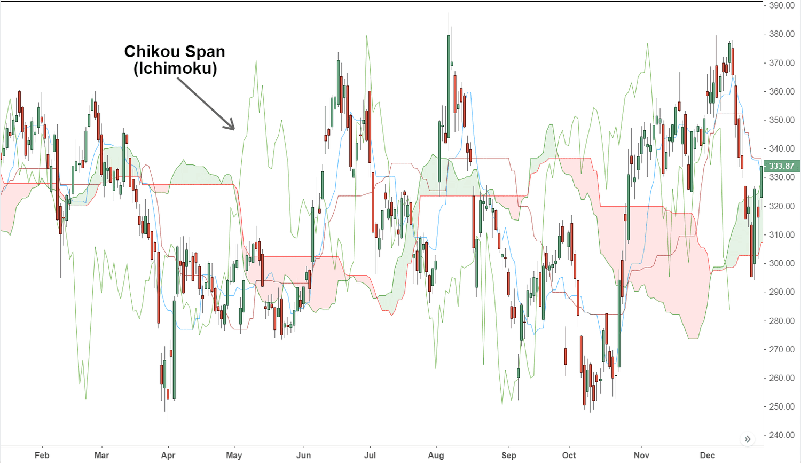

## Table of Contents

## What is the Chikou Span in technical analysis?

The Chikou Span, also known as the lagging span, is a component of the Ichimoku Kinko Hyo, a popular technical analysis tool used in trading. It is essentially the current closing price plotted 26 periods back on the chart. This means that the Chikou Span shows where the price was 26 periods ago, helping traders to see how the current price compares to past prices.

Traders use the Chikou Span to identify potential support and resistance levels. If the Chikou Span is above the price from 26 periods ago, it might suggest bullish momentum. Conversely, if it is below the price from that time, it could indicate bearish momentum. By comparing the Chikou Span with the current price action, traders can make more informed decisions about entering or exiting trades.

## How is the Chikou Span calculated?

The Chikou Span is easy to figure out. It's just the closing price of the current day, but you plot it on the chart 26 days before today. So, if today's closing price is $50, you would put a dot on the chart 26 days ago at the $50 level.

This helps traders see how today's price compares to what was happening 26 days ago. If the dot is above the price from 26 days ago, it might mean the market is getting stronger. If it's below, it could mean the market is getting weaker. It's a simple way to spot trends and make trading decisions.

## What is the purpose of using the Chikou Span in trading?

The Chikou Span helps traders see how today's price compares to the price 26 days ago. By plotting today's closing price 26 days back on the chart, traders can easily spot if the current price is higher or lower than it was in the past. This can show if the market is getting stronger or weaker, which is useful for making trading decisions.

Traders use the Chikou Span to find important levels where the price might go up or down. If the Chikou Span is above the price from 26 days ago, it might mean the market is bullish, suggesting a good time to buy. If it's below, it might mean the market is bearish, suggesting a good time to sell. This simple tool helps traders understand the market's direction and make smarter trades.

## How does the Chikou Span interact with other components of the Ichimoku Cloud?

The Chikou Span is one part of the Ichimoku Cloud, which also includes the Tenkan-sen, Kijun-sen, Senkou Span A, and Senkou Span B. When you look at a chart with the Ichimoku Cloud, the Chikou Span is the line that shows today's closing price but plotted 26 days back. This line can help traders see if the current price is higher or lower than it was 26 days ago. If the Chikou Span is above the price from 26 days ago, it might mean the market is getting stronger. If it's below, it might mean the market is getting weaker.

The Chikou Span works together with the other parts of the Ichimoku Cloud to give a full picture of the market. For example, if the Chikou Span is above both the Tenkan-sen and Kijun-sen, it can be a strong sign that the market is bullish. Also, if the Chikou Span crosses above or below the Senkou Span A and B (which make up the cloud), it can show where the price might find support or resistance. By looking at how the Chikou Span interacts with these other lines, traders can make better decisions about when to buy or sell.

## Can you explain how to interpret the Chikou Span on a price chart?

When you look at a price chart with the Chikou Span, you'll see a line that shows today's closing price but plotted 26 days back. This line helps you see if the price now is higher or lower than it was 26 days ago. If the Chikou Span is above the price from 26 days ago, it might mean the market is getting stronger. If it's below, it might mean the market is getting weaker. This can help you decide if it's a good time to buy or sell.

The Chikou Span also works with other parts of the Ichimoku Cloud, like the Tenkan-sen, Kijun-sen, and the cloud made by Senkou Span A and B. If the Chikou Span is above the Tenkan-sen and Kijun-sen, it can be a strong sign that the market is bullish, which might be a good time to buy. If it crosses above or below the cloud, it can show where the price might find support or resistance. By looking at how the Chikou Span interacts with these other lines, you can get a better idea of the market's direction and make smarter trading decisions.

## What are common trading signals generated by the Chikou Span?

The Chikou Span can give traders important signals about when to buy or sell. One common signal is when the Chikou Span crosses above the price from 26 days ago. This can mean the market is getting stronger, and it might be a good time to buy. On the other hand, if the Chikou Span crosses below the price from 26 days ago, it can mean the market is getting weaker, and it might be a good time to sell.

Another signal comes from how the Chikou Span interacts with other parts of the Ichimoku Cloud. If the Chikou Span moves above both the Tenkan-sen and Kijun-sen, it's a strong sign that the market is bullish, suggesting a good time to buy. If the Chikou Span crosses above the cloud made by Senkou Span A and B, it might show where the price could find support. If it crosses below the cloud, it might show where the price could find resistance. These signals help traders understand the market's direction and make better trading decisions.

## How can the Chikou Span help in identifying support and resistance levels?

The Chikou Span can help traders find where the price might stop going down or up, which are called support and resistance levels. It does this by showing today's closing price but 26 days back on the chart. If the Chikou Span is above the price from 26 days ago, it might mean the price could find support at that level. This means the price might not go much lower because it's higher than it was before. On the other hand, if the Chikou Span is below the price from 26 days ago, it might mean the price could find resistance at that level. This means the price might not go much higher because it's lower than it was before.

The Chikou Span also works with other parts of the Ichimoku Cloud to help find support and resistance. For example, if the Chikou Span crosses above the cloud made by Senkou Span A and B, it can show where the price might find support. If it crosses below the cloud, it can show where the price might find resistance. By looking at where the Chikou Span is compared to these other lines, traders can get a better idea of where the price might stop moving and make smarter trading decisions.

## What are the limitations of using the Chikou Span in market analysis?

The Chikou Span can be a helpful tool, but it has some limitations that traders should know about. One big problem is that it looks at the past, not the future. It shows today's price 26 days back, so it can't predict what will happen next. This means it might not be as useful for traders who want to know what the market will do in the future. Also, the Chikou Span can give false signals. Sometimes it might look like the market is getting stronger or weaker, but the price can still go the other way. This can make it hard to trust the signals it gives.

Another limitation is that the Chikou Span works best when used with other parts of the Ichimoku Cloud. If you only use the Chikou Span by itself, you might miss important information from the other lines like the Tenkan-sen, Kijun-sen, and the cloud. This can make your analysis less accurate. Also, the Chikou Span uses a fixed number of periods, which is 26 days. This might not work well for all markets or time frames. Different markets can move at different speeds, so a 26-day period might be too long or too short for some traders.

## How does the Chikou Span perform in different market conditions, such as trending vs. ranging markets?

The Chikou Span can work differently depending on whether the market is trending or ranging. In a trending market, where prices are clearly moving up or down, the Chikou Span can be very helpful. If the market is going up and the Chikou Span is above the price from 26 days ago, it can confirm that the trend is strong. This can give traders more confidence to keep buying. On the other hand, if the market is going down and the Chikou Span is below the price from 26 days ago, it can confirm that the downtrend is strong, and traders might want to keep selling.

In a ranging market, where prices are moving sideways without a clear direction, the Chikou Span might not be as useful. It can give false signals because the price keeps bouncing between the same levels. If the Chikou Span crosses above or below the price from 26 days ago, it might look like the market is starting to trend, but the price can quickly go back to its range. This can make it hard for traders to decide when to buy or sell. So, in a ranging market, it's important to use the Chikou Span along with other tools to get a better picture of what's happening.

## Can the Chikou Span be used effectively in conjunction with other technical indicators?

Yes, the Chikou Span can be used effectively with other technical indicators to get a better understanding of the market. For example, combining it with moving averages can help confirm trends. If the Chikou Span is above both the price from 26 days ago and a moving average, it can be a strong sign that the market is bullish. On the other hand, if the Chikou Span is below both the price from 26 days ago and a moving average, it can be a strong sign that the market is bearish. This can help traders decide when to buy or sell with more confidence.

Another useful combination is using the Chikou Span with the Relative Strength Index (RSI). The RSI can show if a market is overbought or oversold. If the Chikou Span shows a bullish signal and the RSI is not overbought, it might be a good time to buy. If the Chikou Span shows a bearish signal and the RSI is not oversold, it might be a good time to sell. By looking at both indicators together, traders can avoid making decisions based on false signals and get a clearer picture of the market's direction.

## What are some advanced strategies that incorporate the Chikou Span?

One advanced strategy that uses the Chikou Span is called the "Chikou Span Crossover Strategy." In this strategy, traders look for the Chikou Span to cross above or below the price from 26 days ago. If the Chikou Span crosses above the price, it's a sign that the market might be getting stronger, and it could be a good time to buy. If it crosses below, it's a sign that the market might be getting weaker, and it could be a good time to sell. Traders can make this strategy even better by using it with other parts of the Ichimoku Cloud, like the Tenkan-sen and Kijun-sen. If the Chikou Span crosses above both these lines, it's a strong sign that the market is bullish, and if it crosses below, it's a strong sign that the market is bearish.

Another advanced strategy is the "Chikou Span and Cloud Interaction Strategy." In this strategy, traders pay attention to how the Chikou Span interacts with the cloud made by Senkou Span A and B. If the Chikou Span crosses above the cloud, it can show where the price might find support, which means it might not go much lower. If the Chikou Span crosses below the cloud, it can show where the price might find resistance, which means it might not go much higher. Traders can use this information to decide when to enter or [exit](/wiki/exit-strategy) trades. For example, if the Chikou Span is above the cloud and the price is also above the cloud, it can be a strong bullish signal, suggesting a good time to buy. If the Chikou Span is below the cloud and the price is also below the cloud, it can be a strong bearish signal, suggesting a good time to sell.

## How can backtesting be used to assess the effectiveness of the Chikou Span in a trading system?

Backtesting is a way to check if using the Chikou Span in a trading system works well. It means looking at old market data to see how the Chikou Span would have worked in the past. Traders can set up rules for when to buy or sell based on the Chikou Span, like buying when it crosses above the price from 26 days ago and selling when it crosses below. By running these rules on past data, traders can see if they would have made money or lost money. This helps them understand if the Chikou Span is a good tool for their trading system.

Using [backtesting](/wiki/backtesting), traders can also try different settings and see which ones work best. For example, they might test different time periods or combine the Chikou Span with other indicators like moving averages or the RSI. By doing this, they can find the best way to use the Chikou Span in their trading strategy. Backtesting helps traders feel more confident in their system because they know it has been tested with real data from the past.

## References & Further Reading

[1]: Nison, S. (1991). ["Japanese Candlestick Charting Techniques."](https://drive.google.com/file/d/0B_CADMk621uLNDEyZTEzZjYtMmZjOS00ZmUyLTlhYmYtN2E1YTViOWRiOTdi/view) Prentice Hall Press.

[2]: Hosada, G. (2018). ["Ichimoku Charts: An Introduction to Ichimoku Kinko Clouds."](https://books.google.com/books/about/Ichimoku_Charts.html?id=UMvZAgAAQBAJ) Harriman House.

[3]: Murphy, J. J. (1999). ["Technical Analysis of the Financial Markets: A Comprehensive Guide to Trading Methods and Applications."](https://archive.org/details/technicalanalysi0000murp) New York Institute of Finance.

[4]: Elder, A. (2002). ["Come Into My Trading Room: A Complete Guide to Trading."](https://www.amazon.com/Come-Into-My-Trading-Room/dp/0471225347) Wiley.

[5]: Schwager, J. D. (1992). ["The New Market Wizards: Conversations with America's Top Traders."](https://archive.org/details/newmarketwizards00jack) HarperBusiness.