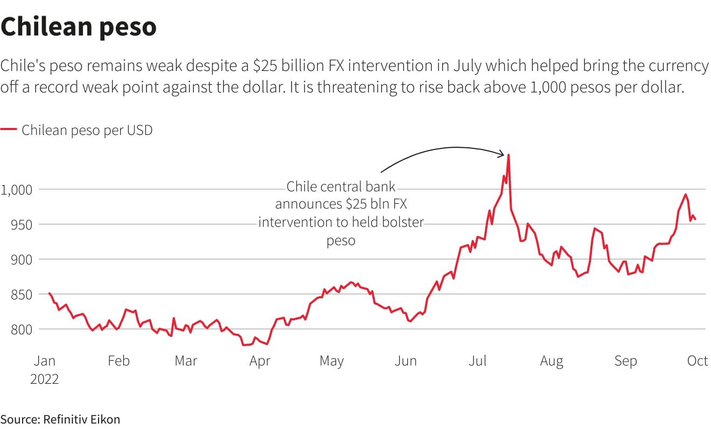

## Table of Contents

## What is the Chilean Peso?

The Chilean Peso is the official money used in Chile, a country in South America. It is written as CLP and uses the symbol $. One Chilean Peso is made up of 100 centavos, but these smaller units are not used much anymore. People in Chile use the Peso to buy things like food, clothes, and services.

The Chilean Peso has been around since 1975, when it replaced the old Escudo. The government and the central bank of Chile control how much Peso is made and used. The value of the Peso can go up or down compared to other countries' money, like the US Dollar or the Euro. This can affect how much things cost in Chile and how much money people can get for their Pesos when they travel or trade with other countries.

## When was the Chilean Peso first introduced?

The Chilean Peso was first introduced in 1975. Before that, Chile used a different kind of money called the Escudo. The government decided to change to the Peso to make things easier and to help the country's economy.

When the Peso started, it was worth the same as 1,000 Escudos. This change was a big deal for people in Chile because they had to get used to new money. The new Peso helped make prices simpler and it was part of a plan to make the country's money more stable.

## What are the different denominations of the Chilean Peso?

The Chilean Peso comes in different amounts of money, called denominations. For coins, you can find 1, 5, 10, 50, 100, and 500 pesos. These coins are used every day by people in Chile to buy small things like candy or a bus ticket. The 1 peso coin is very small and not used much anymore, but it's still around.

For paper money, there are banknotes of 1,000, 2,000, 5,000, 10,000, and 20,000 pesos. These bigger amounts are used for buying more expensive things like clothes or paying for bigger services. The 2,000 peso note is not as common as the others, but it's still part of the money you can use in Chile.

## How has the design of the Chilean Peso changed over time?

Since it was first introduced in 1975, the design of the Chilean Peso has changed a few times. Early versions of the banknotes had pictures of important people from Chile's history, like Bernardo O'Higgins and Gabriela Mistral. These designs were simple and showed the value of the note clearly. Over time, as technology improved, the notes started to include more security features to stop people from making fake money. These features included special inks, watermarks, and holograms that made the notes harder to copy.

In more recent years, the designs of both the coins and banknotes have been updated to show more of Chile's culture and nature. For example, newer banknotes might show beautiful landscapes like the Andes mountains or the Atacama Desert. The coins have also changed, with newer ones showing native animals and plants. These updates not only make the money more secure but also give people a sense of pride in their country's rich heritage and natural beauty.

## What major economic events have influenced the value of the Chilean Peso?

The value of the Chilean Peso has been affected by many big economic events over the years. One major event was the global financial crisis in 2008. This crisis caused a lot of trouble for economies around the world, and Chile was no different. The Peso lost a lot of its value because many people were worried about the economy and wanted to trade their Pesos for safer money like the US Dollar. Another important event was the drop in the price of copper, which is a big part of Chile's economy. When copper prices go down, it can make the Peso weaker because Chile makes less money from selling copper.

More recently, the value of the Chilean Peso has been influenced by events like the COVID-19 pandemic. When the pandemic started in 2020, it caused a lot of uncertainty and made the Peso lose value quickly. People were scared about the future and moved their money into safer investments. Also, the social unrest in Chile in 2019 affected the Peso. Protests and strikes made the economy less stable, which caused the Peso to become weaker. These events show how the value of the Chilean Peso can change a lot because of what happens both in Chile and around the world.

## How does inflation affect the Chilean Peso?

Inflation is when prices for things go up over time. When there's a lot of inflation in Chile, it means that the value of the Chilean Peso goes down. If you have 1,000 pesos today, and there's high inflation, you might not be able to buy as much with that 1,000 pesos next year. This happens because the money loses its buying power. The central bank of Chile tries to control inflation by changing how much money is in the economy, but sometimes it can still get too high.

High inflation can make life harder for people in Chile. If prices keep going up, people might not be able to afford the things they need. This can cause problems for the whole country. The government and the central bank watch inflation closely because it affects how much things cost and how much the Peso is worth. When inflation is under control, the Peso stays more stable, and people can plan better for the future.

## What is the current exchange rate of the Chilean Peso to the US Dollar?

The current exchange rate of the Chilean Peso to the US Dollar changes every day. As of the latest data, 1 US Dollar is worth about 900 Chilean Pesos. This means if you have 1 US Dollar, you can get around 900 Chilean Pesos in exchange.

The exchange rate between the Chilean Peso and the US Dollar can be affected by many things like the economy in Chile, the global economy, and how much people want to buy or sell each currency. When the economy in Chile is doing well, the Peso might become stronger, and you might get fewer Pesos for your Dollar. But if there are problems in Chile's economy, the Peso might get weaker, and you could get more Pesos for your Dollar.

## How does the exchange rate of the Chilean Peso compare to other Latin American currencies?

The Chilean Peso's exchange rate compared to other Latin American currencies can change a lot. For example, the Mexican Peso and the Brazilian Real are two big currencies in Latin America. If 1 US Dollar can buy about 900 Chilean Pesos, it might buy around 17 Mexican Pesos and about 5 Brazilian Reals. So, the Chilean Peso is usually worth less than the Mexican Peso and the Brazilian Real when you look at how many you get for 1 US Dollar.

These differences can change because of many things like how well each country's economy is doing, what people think about the future of these economies, and even things happening in the world that affect all countries. For example, if Chile is doing really well and people want to buy more Chilean Pesos, the Peso might get stronger compared to the Mexican Peso or the Brazilian Real. But if there are problems in Chile, the Peso might get weaker. It's always a good idea to check the latest exchange rates if you need to change money from one Latin American currency to another.

## What are the factors that influence the exchange rate of the Chilean Peso?

The exchange rate of the Chilean Peso can change because of many things. One big [factor](/wiki/factor-investing) is how well Chile's economy is doing. If the economy is growing and people are making more money, the Peso might get stronger. But if the economy is not doing well, maybe because of high inflation or other problems, the Peso might get weaker. Another factor is the price of copper, which is a big part of Chile's economy. When copper prices go up, it can make the Peso stronger because Chile makes more money from selling copper. But if copper prices go down, the Peso might lose value.

Also, things happening around the world can affect the Peso's exchange rate. If there's a lot of uncertainty, like during a global financial crisis or a big event like the COVID-19 pandemic, people might want to trade their Pesos for safer money like the US Dollar, which can make the Peso weaker. The actions of the central bank of Chile are important too. They can try to control the amount of money in the economy and make the Peso more stable. But sometimes, even the central bank can't stop big changes in the exchange rate if there are a lot of other things happening.

## How does the Central Bank of Chile manage the exchange rate?

The Central Bank of Chile tries to keep the value of the Chilean Peso steady. They do this by changing how much money is in the economy. If the Peso is getting too weak, the Central Bank might sell US Dollars to buy Pesos, which can make the Peso stronger. If the Peso is getting too strong, they might do the opposite and buy US Dollars with Pesos, which can make the Peso weaker. They also change interest rates to control inflation, which can affect how much people want to hold onto Pesos.

Sometimes, the Central Bank can't control everything. Big events like a global financial crisis or a drop in copper prices can make the Peso move a lot. The Central Bank tries its best to keep things stable, but they can't always stop big changes in the exchange rate. They watch what's happening in the economy and around the world to make the best decisions they can.

## What are the historical highs and lows of the Chilean Peso exchange rate?

The Chilean Peso has seen many ups and downs in its exchange rate over the years. One of the highest points for the Peso was in the early 2000s when it was very strong. Back then, you could get around 400 Pesos for 1 US Dollar. This was a good time for the Peso because Chile's economy was doing well and copper prices were high, which helped make the Peso stronger.

On the other hand, the Peso has also been very weak at times. One of the lowest points was during the global financial crisis in 2008. At that time, the exchange rate went up to around 700 Pesos for 1 US Dollar. The Peso got even weaker during the COVID-19 pandemic in 2020, when the exchange rate hit over 800 Pesos per US Dollar. These low points happened because of big problems in the world economy and worries about what would happen next.

## How do international trade policies impact the Chilean Peso?

International trade policies can have a big effect on the value of the Chilean Peso. When other countries put up trade barriers like tariffs or quotas, it can make it harder for Chile to sell things like copper, fruits, and wine. If Chile can't sell as much, they make less money, and this can make the Peso weaker. Also, if other countries have good trade deals with Chile, it can help the Peso get stronger because Chile can sell more and make more money.

Trade agreements can also change how much money people want to invest in Chile. If there are good trade deals, more companies might want to do business in Chile, which can bring in more money and make the Peso stronger. But if trade policies make it hard for companies to do business in Chile, they might take their money out, which can make the Peso weaker. So, what other countries do with their trade policies can really affect how strong or weak the Chilean Peso is.

## What are the factors affecting the Chilean Peso exchange rate?

The Chilean Peso (CLP) exchange rate is influenced by several critical factors, each playing a significant role in determining its value against other currencies. These factors include economic stability, commodity prices, government policy, and external global events.

### Economic Stability

Chile's economy is widely recognized for its stability in Latin America, though it is not without challenges. A stable economic environment typically supports a strong currency as it fosters investor confidence. Despite its stability, Chile contends with issues such as income inequality, which can affect economic growth and, consequently, the value of the Chilean Peso. Economic indicators such as GDP growth, inflation rates, and employment levels are crucial in assessing economic stability and forecasting the peso's movements.

### Commodities

Chile is the world’s largest producer and exporter of copper. As such, the country's economy—and by extension, the Chilean Peso—is particularly sensitive to fluctuations in global copper prices. A rise in copper prices generally leads to an increase in foreign currency reserves and strengthens the CLP due to an improved trade balance. Conversely, a decline in copper prices can weaken the peso. The relationship between copper prices and the CLP can be expressed through the terms of trade:

$$
\text{Terms of Trade} = \frac{\text{Export Prices}}{\text{Import Prices}}
$$

A favorable change in this ratio, driven by higher copper prices, would positively influence the peso.

### Government Policy

Monetary and fiscal policies enacted by the Chilean government have a direct impact on the currency’s valuation. The Central Bank of Chile manages monetary policy, primarily through [interest rate](/wiki/interest-rate-trading-strategies) adjustments. Higher interest rates often attract foreign investment, which increases demand for the peso and can lead to an appreciation of its value. Fiscal policy, including government spending and taxation, also affects economic growth and inflation, thereby influencing the currency's strength.

### External Factors

Global events have substantial implications for the Chilean Peso. The COVID-19 pandemic, for example, induced significant [volatility](/wiki/volatility-trading-strategies) in global markets, affecting commodity prices and trade patterns. Such events can trigger sudden shifts in currency values as investors re-evaluate risks and adjust their portfolios. Currency traders must remain vigilant of global developments that can impact market sentiment and the peso's exchange rate.

In summary, the Chilean Peso's exchange rate is shaped by a combination of domestic and international factors. Understanding these influences is crucial for anticipating currency movements and making informed trading decisions.

## References & Further Reading

[1]: ["Chilean Peso: Currency Guide"](https://wise.com/us/blog/money-and-banks-in-chile) from Investopedia

[2]: ["Central Bank of Chile"](https://www.bcentral.cl/en/web/banco-central/home) - Official website for information on Chile's monetary policy and currency.

[3]: Fischer, G. R., & Hoffman, A. (2004). ["Economic Impacts of Chile's Copper Export Boom"](https://psycnet.apa.org/record/2004-21560-004) The Annals of Regional Science.

[4]: ["Advances in Financial Machine Learning"](https://www.amazon.com/Advances-Financial-Machine-Learning-Marcos/dp/1119482089) by Marcos Lopez de Prado

[5]: ["Quantitative Trading: How to Build Your Own Algorithmic Trading Business"](https://www.amazon.com/Quantitative-Trading-Build-Algorithmic-Business/dp/1119800064) by Ernest P. Chan

[6]: ["Algorithmic and High-Frequency Trading"](https://assets.cambridge.org/97811070/91146/frontmatter/9781107091146_frontmatter.pdf) by Álvaro Cartea, Sebastian Jaimungal, and José Penalva

[7]: ["Tinbergen Institute Discussion Paper: Chile and its Copper"](https://link.springer.com/chapter/10.1007/978-1-4613-3949-6_6) discusses Chile's economic dependency on copper exports.