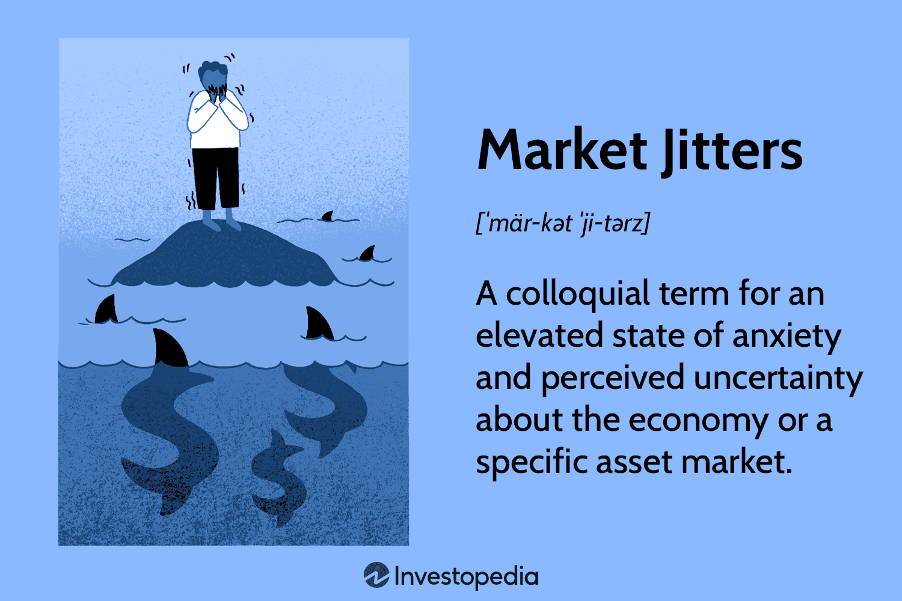

Welcome to the world of algorithmic trading, where financial markets meet advanced technology. Over the past few decades, algorithmic trading has transformed the financial landscape, allowing trades to be executed with unprecedented speed and precision. As this technology continues to evolve, so does the language used by traders and developers, leading to an intriguing convergence with contemporary slang. This trend brings about a dynamic shift in how market concepts are communicated, reflecting broader changes in digital communication and social interaction.

Algorithmic trading, also known as algo trading, employs sophisticated computer algorithms to execute trades based on pre-defined criteria, often involving mathematical models and statistical analyses. These systems process vast quantities of data and react to market movements with remarkable efficiency. However, as markets become more complex, the language used to describe trading strategies and market conditions is also adapting. Introducing colloquial language into the technicalities of algo trading can help bridge the gap between seasoned traders and newcomers, making the trading environment more accessible.



The integration of market slang is not just about keeping up with linguistic trends; it enhances communication and engagement. Traders can convey complex ideas succinctly, using terms that resonate with a broader audience. For instance, phrases like "HODL" (hold on for dear life) and "diamond hands" encapsulate investment strategies and sentiments in a way that is instantly recognizable, especially among younger, tech-savvy traders.

This article explores the latest trends and slang influences in the world of algorithmic trading. We'll examine how the adoption of a more relaxed vernacular style reflects a shift towards community-driven engagement and quick information exchange, essential in today's fast-paced trading environment. Understanding these changes is crucial for anyone involved in trading, from individual investors to large financial institutions, as they navigate this ever-evolving landscape.

## Table of Contents

## Understanding Algorithmic Trading

Algorithmic trading, often referred to as algo trading, employs sophisticated computer algorithms to execute trades at speeds and frequencies that are impossible for human traders to achieve. These automated systems operate based on pre-defined criteria, such as timing, price, quantity, or a mathematical model, allowing traders to execute orders rapidly and without manual intervention. This form of trading is increasingly dominant in global financial markets, where speed and precision can significantly influence profitability.

At the core of algorithmic trading lies the ability to process and analyze vast quantities of data in real-time, effectively identifying trading opportunities across multiple markets and asset classes. These systems can monitor markets continuously, executing orders in milliseconds, and sometimes even microseconds. This speed is essential in today’s market environment, where prices can fluctuate in fractions of a second due to the intense competition among traders and ever-changing financial information.

Several strategies underpin [algorithmic trading](/wiki/algorithmic-trading). High-frequency trading ([HFT](/wiki/high-frequency-trading-strategies)) is one of the most notable, characterized by high-speed execution and the rapid turnover of positions, capturing small price changes. Statistical [arbitrage](/wiki/arbitrage) involves complex mathematical models to identify and exploit price inefficiencies between securities, while automated [market making](/wiki/market-making) provides [liquidity](/wiki/liquidity-risk-premium) to markets by continuously quoting buy and sell prices.

The transformative impact of algo trading on the financial landscape cannot be overstated. By automating the trading process, it reduces the influence of human emotions and biases in decision-making, ensuring that trading decisions are consistent, disciplined, and grounded in quantitative analysis. This results in increased efficiency and often more predictable trading outcomes.

In this fast-evolving industry, a new vernacular has emerged, with specific terminologies and jargon becoming an integral part of trading conversations. These terms simplify and convey complex trading concepts quickly, facilitating more effective communication among market participants. Understanding and adapting to this evolving terminology can provide a competitive edge, enhancing one's ability to navigate the intricacies of modern trading landscapes effectively.

## The Rise of Slang in Financial Markets

Financial markets are replete with their own unique set of jargon and slang, a linguistic tapestry woven from years of market tradition and the influences of digital-era communication. Traditional terms like "bulls" and "bears" have been long-standing symbols of market trends, representing upward and downward movements, respectively. These terms provide a quick, evocative means for traders to communicate complex ideas, emotions, and strategies succinctly.

The advent of the digital age has expedited the evolution and adoption of trader slang. Online communities, notably platforms like Reddit and Twitter, have been pivotal in this transformative phase. With the rise of social media, slang terms such as "to the moon," which denotes a belief that an asset's value will significantly increase, "FOMO" (Fear Of Missing Out), reflecting a trader's anxiety about missing out on potential gains, and "YOLO" (You Only Live Once), often used to justify risky trades, have become embedded in trading discourse. These terms exemplify modern trading sentiments and attitudes, reflecting a blend of optimism, urgency, and a predisposition for risk-taking attitudes.

For traders to remain integral members of these online communities, understanding this evolving colloquial language has become essential. It allows traders not only to communicate effectively but also to interpret market sentiments that can influence trading decisions and market movements. Therefore, staying conversant with the latest slang is crucial for any trader looking to maintain relevance in today's digitally connected trading environment.

## Popular Slang Influencing Algo Trading

Terms such as 'whales,' 'sharks,' and 'pumping' have increasingly permeated the lexicon of algorithmic trading. Traditions of market vernacular are now augmented by the rapid dissemination of information through social media platforms like Reddit and Twitter. These slang terms are valuable tools for describing various aspects of trading, such as identifying large investors, characterizing significant market movements, or encapsulating speculative trading strategies.

In the context of algorithmic trading, social media sentiment often serves as a barometer of market movements, allowing trading algorithms to harness real-time user-generated content. This content is essential for conducting sentiment analysis, a technique used to assess market sentiment by analyzing textual data collected from online platforms. Here, slang becomes an integral component, as staying attuned to the latest colloquialisms allows traders to understand and potentially predict shifts within the market.

Utilizing programming languages like Python, algorithmic traders can integrate social media streams into their trading systems. For example, the Tweepy library accesses Twitter data, allowing traders to develop models that can ascertain the sentiment around particular slang terms.

```python
import tweepy
from textblob import TextBlob

# Example of authenticating and fetching tweets
consumer_key = 'your_consumer_key'
consumer_secret = 'your_consumer_secret'
access_token = 'your_access_token'
access_token_secret = 'your_access_token_secret'

auth = tweepy.OAuth1UserHandler(consumer_key, consumer_secret, access_token, access_token_secret)
api = tweepy.API(auth)

# Target slang terms
slang_terms = ['whales', 'sharks', 'pumping']

# Fetching tweets and performing sentiment analysis
for term in slang_terms:
    public_tweets = api.search(q=term, count=100)
    for tweet in public_tweets:
        analysis = TextBlob(tweet.text)
        print(f'Term: {term}, Tweet: {tweet.text}, Sentiment: {analysis.sentiment.polarity}')
```

In this code snippet, we authenticate to Twitter's API, search for tweets containing relevant slang terms, and analyze the sentiment of each tweet using TextBlob. Sentiment polarity scores can inform algorithmic trading systems, providing actionable insights into market perceptions, which may ultimately influence trading decisions.

Slang, therefore, not only enriches the descriptive power of market dialogue but also facilitates more nuanced algorithms capable of capturing and forecasting trends driven by community sentiment. By incorporating this informal language, algo traders can enhance their systems' ability to react to rapid market changes initiated within social media forums.

## Benefits of Chill Slang in Algo Trading

Incorporating chill slang into algorithmic trading offers several advantages that contribute to a more welcoming and efficient trading environment. Firstly, this informal language can act as a bridge between experienced, tech-savvy traders and newcomers to the financial markets. By employing terms that are familiar and less formal, new traders can engage more comfortably, easing the onboarding process. This aids in demystifying complex trading concepts, fostering understanding and trust among diverse participants.

Additionally, chill slang enhances quick comprehension and decision-making. In the fast-paced trading sector, the ability to rapidly interpret and react to market signals is crucial. Slang terms often encapsulate intricate market phenomena in concise, memorable phrases, allowing traders to process information swiftly and make informed decisions without lengthy deliberations.

Moreover, the use of slang promotes a sense of community and shared culture within trading circles. This common language helps traders connect on a cultural level, encouraging both collaboration and the exchange of knowledge. As traders adopt slang expressions, they participate in a cultural dialogue that reinforces community bonds and collective learning.

By integrating these linguistic elements, the trading atmosphere becomes more engaging and less daunting, encouraging greater participation and facilitating smoother communication pathways. Overall, the strategic use of chill slang not only enhances operational efficiency but also strengthens the social fabric of the trading community.

## Challenges and Risks

The integration of slang into algorithmic trading, while providing numerous benefits, also presents significant challenges and risks. One primary concern is the potential for misinterpretation. Slang is often region-specific or community-based, and without universal understanding, it can lead to mistakes in communication. For instance, a slang term may mean different actions or sentiments in separate markets or trading communities, leading to conflicting interpretations.

Algorithmic trading systems, which operate on precise criteria, must be adept at handling these linguistic nuances to prevent executing trades based on misunderstood cues. This requires rigorous programming of algorithms to detect and interpret slang accurately. Moreover, the use of natural language processing (NLP) tools becomes crucial. For a simple implementation in Python, one might use an NLP library like spaCy or NLTK to refine the sentiment analysis when processing traders' language:

```python
import spacy

# Load the English NLP model
nlp = spacy.load("en_core_web_sm")

def slang_sentiment_analysis(text):
    doc = nlp(text)
    sentiments = {
        "positive": ["moon", "bullish", "gains"],
        "negative": ["bearish", "dump", "crash"]
    }
    sentiment_score = 0

    for token in doc:
        if token.text.lower() in sentiments["positive"]:
            sentiment_score += 1
        elif token.text.lower() in sentiments["negative"]:
            sentiment_score -= 1

    return "Positive" if sentiment_score > 0 else "Negative" if sentiment_score < 0 else "Neutral"

# Example usage
text = "The market is looking bullish with potential moon this week"
print(slang_sentiment_analysis(text))  # Output: Positive
```

Another consideration is the risk of over-relying on informal language, which could mask the full complexity of some market scenarios. Slang might oversimplify multi-faceted financial events, obscuring their underlying factors and leading to poor strategic decisions. Therefore, while incorporating slang can make the trading environment more relatable, it should be complemented with robust analytical tools that account for diverse market variables.

The rapid evolution of slang further necessitates continual updates to these trading algorithms to ensure they remain current and effective. As slang changes over time, algorithms must be frequently reviewed and revised, incurring additional maintenance costs and efforts.

Finally, a crucial balance must be maintained between adopting popular slang to keep strategies relevant and maintaining clarity to avoid misleading interpretations. This requires collaboration between traders and developers to ensure that language integration supports effective decision-making without compromising the precision inherent in algorithmic trading.

## Case Studies: Slang in Action

The use of slang in financial markets has opened new dimensions for algorithmic trading strategies, particularly during events with heightened market [volatility](/wiki/volatility-trading-strategies) fueled by social media chatter. A notable example is the GameStop saga, where slang played a crucial role in influencing market movements. During this event, online communities, most prominently on Reddit's "WallStreetBets," used terms like "diamond hands" and "to the moon" to express strong bullish sentiments and commitment to holding positions despite market pressure. This vernacular not only galvanized retail traders but also attracted significant attention from institutional investors and algorithmic trading systems.

Algorithmic trading systems, typically reliant on quantitative data, adapted to these slang-driven dynamics by incorporating sentiment analysis tools designed to process informal language and slang present in social media. For example, Python libraries such as Natural Language Toolkit (NLTK) or TextBlob can be used to perform sentiment analysis, which helps algorithms in detecting positive or negative market sentiment from social media feeds. A simple sentiment analysis script might look like this:

```python
from textblob import TextBlob

def analyze_sentiment(text):
    # Create a TextBlob object
    blob = TextBlob(text)
    # Return the sentiment score
    return blob.sentiment.polarity

# Example usage
text = "GameStop to the moon! 💎🙌"
print(analyze_sentiment(text))  # Output: positive sentiment score
```

Through successful sentiment analysis, algorithmic traders were able to predict and respond to the swift rally in GameStop's stock price, driven largely by slang-laden social discourse. Such adaptability underscores the importance of integrating real-time language parsing capabilities into trading algorithms. However, challenges remain in ensuring these systems distinguish between noise and genuine market signals—a lesson learned during the GameStop event when excessive reliance on speculative language led to market volatility and unexpected swings.

As evidences from the GameStop episode illustrate, algorithmic trading systems must continuously update and refine their slang dictionaries and sentiment models to remain effective in volatile markets. Key lessons for future strategies include investing in advanced natural language processing (NLP) technologies and continuously monitoring the evolution of trading slang in online communities. Such proactive approaches can enhance the predictive accuracy of trading algorithms and ensure they remain aligned with market sentiments, ultimately optimizing trading outcomes in an increasingly slang-influenced market landscape.

## Conclusion

Chill slang transcends mere cultural trends, embedding itself into the structure of modern trading ecosystems. The dynamic nature of financial markets, intertwined with ever-expanding digital connectivity, ensures that the language of trading will continue to mold and shift in tandem with these influences. 

For algorithmic trading developers, a significant challenge lies in harmonizing the laid-back tone of slang with the exacting precision required in trading algorithms. This equilibrium is pivotal to ensuring that the benefits of informal language—ease of communication and community engagement—do not overshadow the substantive needs for accuracy and clarity.

Incorporating this linguistic evolution into algorithmic strategies can lead to more engaging and efficient trading practices. It allows for a nuanced understanding of market sentiments, particularly those influenced by social media and online communities. Code snippets for analyzing sentiments might incorporate terms directly drawn from digital platforms to better interpret real-time market trends. For example, Python libraries such as `VADER` (Valence Aware Dictionary for sEntiment Reasoning) could be adapted to recognize emerging slang and evaluate their market impacts:

```python
from vaderSentiment.vaderSentiment import SentimentIntensityAnalyzer

analyzer = SentimentIntensityAnalyzer()

# Example slang usage in sentiment analysis
sample_text = "This stock is definitely going to the moon! 🚀 #HODL"

sentiment = analyzer.polarity_scores(sample_text)
print(sentiment)
```

Remaining informed and flexible is imperative for anyone engaged in algorithmic trading. As language evolves, so too must the strategies that rely on its analysis. Adapting to these shifts ensures traders remain at the forefront of market innovation, leveraging both traditional skills and contemporary communication trends to their advantage. In doing so, the trading environment becomes not only a place of transaction and profit but also one of shared culture and collective advancement.

## Further Reading and Resources

For those interested in understanding the rich tapestry of trading slang and its historical roots, a variety of literature and resources are available. Books such as "The Language of Stock Trading: Descriptions and Origins" provide detailed insights into the development and usage of trading expressions over time. Academic papers and financial magazines also frequently explore the etymology and adaptation of slang within the trading community, offering valuable perspectives on how these terms have evolved with market behaviors.

For advanced materials on algorithmic trading, numerous educational resources and textbooks explain its technological foundation. "Algorithmic Trading: Winning Strategies and Their Rationale" by Ernie Chan is a highly recommended read for those looking to comprehend the mechanics and strategies involved in algo trading. Professional courses and certifications, such as those offered by the CFA Institute or online platforms like Coursera and edX, provide structured learning paths that cover both the theoretical and practical aspects of algorithmic trading strategies.

Participation in online forums and communities can significantly enhance understanding and keep you updated with current trends. Platforms like Reddit's r/algotrading and Stack Exchange's Quantitative Finance section host active discussions on the intersection of slang and algorithmic strategies. They provide an excellent way to engage with both experienced traders and newcomers, sharing knowledge and insights.

Engage with educational courses that capture both foundational knowledge and the latest trends in financial markets. Institutions and online platforms frequently update their curricula to include the latest slang and strategies in algorithmic trading, making courses like those from MIT OpenCourseWare and Khan Academy valuable resources.

To remain informed about how slang continues to influence trading discourse, keeping up with market news is crucial. Sites like Bloomberg, Reuters, and CNBC often analyze trends in trader language and its impact on market behaviors. Real-time news feeds and dedicated sections on these platforms can offer timely updates on the interplay between trading slang and market dynamics, ensuring you're always in the loop with the latest developments.

## References & Further Reading

[1]: Lopez de Prado, M. (2018). ["Advances in Financial Machine Learning."](https://www.amazon.com/Advances-Financial-Machine-Learning-Marcos/dp/1119482089) Wiley.

[2]: Chan, E. P. (2009). ["Quantitative Trading: How to Build Your Own Algorithmic Trading Business."](https://github.com/ftvision/quant_trading_echan_book) Wiley.

[3]: Chan, E. P. (2013). ["Algorithmic Trading: Winning Strategies and Their Rationale."](https://github.com/ftvision/quant_trading_echan_book) Wiley.

[4]: Aronson, D. R. (2006). ["Evidence-Based Technical Analysis: Applying the Scientific Method and Statistical Inference to Trading Signals."](https://www.amazon.com/Evidence-Based-Technical-Analysis-Scientific-Statistical/dp/0470008741) Wiley.

[5]: Jansen, S. (2020). ["Machine Learning for Algorithmic Trading: Predictive models to extract signals from market and alternative data for systematic trading strategies in Python."](https://www.amazon.com/Machine-Learning-Algorithmic-Trading-alternative/dp/1839217715) Packt Publishing.