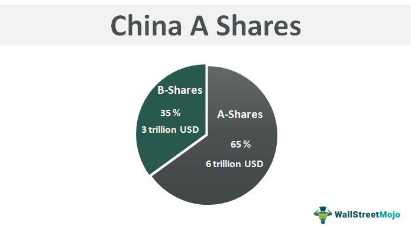

## Table of Contents

## What are China A-Shares?

China A-Shares are stocks of companies that are based in mainland China and are traded on the Shanghai and Shenzhen stock exchanges. These shares are usually priced in Chinese yuan and are primarily available to investors within China. However, in recent years, some A-Shares have become accessible to foreign investors through programs like the Qualified Foreign Institutional Investor (QFII) and the Stock Connect schemes.

A-Shares are important because they represent a large part of the Chinese stock market. They give investors a chance to invest directly in China's growing economy. Before, it was hard for people outside China to buy these shares, but now it's easier thanks to new rules and programs. This means more people around the world can invest in Chinese companies and benefit from China's economic growth.

## What are China B-Shares?

China B-Shares are stocks of companies based in mainland China, but they are different from A-Shares. B-Shares are listed on the Shanghai and Shenzhen stock exchanges, just like A-Shares, but they are meant for foreign investors. They are priced in foreign currencies, like the US dollar in Shanghai and the Hong Kong dollar in Shenzhen. This makes it easier for people from other countries to buy them.

In the past, B-Shares were the main way for foreigners to invest in Chinese companies. But now, with new programs like the Stock Connect, more people can buy A-Shares too. Still, B-Shares are important because they give another option for investing in China. They help connect China's economy with the rest of the world.

## When were China A-Shares first introduced?

China A-Shares were first introduced in the early 1990s. This was when China started to open up its stock markets to the public. The first A-Shares were listed on the Shanghai Stock Exchange in December 1990. A little later, in 1991, A-Shares also started trading on the Shenzhen Stock Exchange.

At first, only people living in China could buy A-Shares. They were priced in Chinese yuan, which made it hard for foreigners to invest. But over time, China made changes to let more people from around the world buy these shares. Programs like the Qualified Foreign Institutional Investor (QFII) and the Stock Connect helped make A-Shares more available to everyone.

## When were China B-Shares first introduced?

China B-Shares were first introduced in the early 1990s, around the same time as A-Shares. The first B-Shares started trading on the Shanghai Stock Exchange in February 1992. A bit later, in 1992, B-Shares also began trading on the Shenzhen Stock Exchange.

B-Shares were created to let foreign investors buy stocks in Chinese companies. They are priced in foreign currencies, like the US dollar in Shanghai and the Hong Kong dollar in Shenzhen. This made it easier for people outside China to invest in the country's growing economy. Over time, new programs like the Stock Connect have made it easier for foreigners to buy A-Shares too, but B-Shares are still an important way for international investors to get into the Chinese market.

## Who can invest in China A-Shares?

China A-Shares are mainly for people living in China. They are stocks of companies based in mainland China and are traded on the Shanghai and Shenzhen stock exchanges. These shares are priced in Chinese yuan, which makes it easier for people in China to buy them.

Over time, China has opened up A-Shares to more people around the world. Programs like the Qualified Foreign Institutional Investor (QFII) and the Stock Connect have made it possible for foreign investors to buy A-Shares too. This means that both people in China and investors from other countries can now invest in China's growing economy through A-Shares.

## Who can invest in China B-Shares?

China B-Shares are mainly for people who live outside of China. They are stocks of companies based in mainland China and are traded on the Shanghai and Shenzhen stock exchanges. These shares are priced in foreign currencies, like the US dollar in Shanghai and the Hong Kong dollar in Shenzhen. This makes it easier for people from other countries to buy them.

Even though B-Shares are meant for foreign investors, some people in China can also buy them. This helps connect China's economy with the rest of the world. Over time, new programs like the Stock Connect have made it easier for foreigners to buy A-Shares too, but B-Shares are still an important way for international investors to get into the Chinese market.

## What are the key differences between A-Shares and B-Shares?

A-Shares and B-Shares are both stocks of companies based in mainland China, but they have some big differences. A-Shares are mainly for people living in China. They are traded on the Shanghai and Shenzhen stock exchanges and are priced in Chinese yuan. This makes it easier for people in China to buy them. Over time, China has made it possible for foreign investors to buy A-Shares too, through programs like the Qualified Foreign Institutional Investor (QFII) and the Stock Connect.

On the other hand, B-Shares are mainly for people who live outside of China. They are also traded on the Shanghai and Shenzhen stock exchanges, but they are priced in foreign currencies, like the US dollar in Shanghai and the Hong Kong dollar in Shenzhen. This makes it easier for people from other countries to invest in Chinese companies. Even though B-Shares are meant for foreign investors, some people in China can also buy them. Both types of shares help connect China's economy with the rest of the world, but they serve different groups of investors.

## How have the regulations for A-Shares and B-Shares evolved over time?

When A-Shares and B-Shares first started in the early 1990s, the rules were different from what they are now. A-Shares were only for people living in China and were priced in Chinese yuan. This made it hard for foreigners to buy them. B-Shares, on the other hand, were meant for people from other countries and were priced in foreign currencies like the US dollar and the Hong Kong dollar. This made it easier for people outside China to invest in Chinese companies.

Over time, China changed the rules to make it easier for more people to invest in its economy. They created programs like the Qualified Foreign Institutional Investor (QFII) and the Stock Connect. These programs let foreign investors buy A-Shares, which were once only for people in China. Even though B-Shares are still mainly for foreigners, these changes have made it easier for everyone to invest in China's growing market. This has helped connect China's economy with the rest of the world even more.

## What impact do A-Shares and B-Shares have on the Chinese economy?

A-Shares and B-Shares help the Chinese economy grow by letting more people invest in Chinese companies. A-Shares are mainly for people in China, but now foreigners can buy them too through special programs. This means more money can come into the Chinese market, helping companies get the funds they need to grow and create jobs. When more people invest in A-Shares, it can make the stock market bigger and stronger, which is good for the whole economy.

B-Shares are mainly for people outside China and are priced in foreign currencies. They help bring money from other countries into China, which can help the economy grow even more. When foreign investors buy B-Shares, they are putting money into Chinese companies, which can help those companies expand and hire more people. Both A-Shares and B-Shares make it easier for China to connect with the rest of the world, helping the economy grow and become more stable.

## How do A-Shares and B-Shares perform in terms of market liquidity?

A-Shares usually have more market [liquidity](/wiki/liquidity-risk-premium) than B-Shares. This means it's easier to buy and sell A-Shares because there are more people trading them. A-Shares are mainly for people in China, and since there are a lot of people in China, there's a big market for them. Also, now that foreigners can buy A-Shares through programs like the Stock Connect, even more people are trading them. This makes the market for A-Shares very active and liquid.

B-Shares, on the other hand, have less market liquidity. They are mainly for people outside China, and there are fewer people trading them compared to A-Shares. B-Shares are priced in foreign currencies, which can make it harder for some people to buy them. Because fewer people are trading B-Shares, it can be harder to buy and sell them quickly. This means the market for B-Shares is not as liquid as the market for A-Shares.

## What are the risks associated with investing in A-Shares and B-Shares?

Investing in A-Shares and B-Shares can be risky because the Chinese market can be unpredictable. The government in China has a lot of control over the economy and can change rules suddenly. This can make the value of your investments go up and down a lot. Also, the information about Chinese companies might not be as clear or easy to understand as it is in other countries. This can make it hard to know if a company is doing well or not.

Another risk is that the Chinese market can be affected by what's happening in the world. Things like trade wars or global economic problems can hurt the value of A-Shares and B-Shares. For B-Shares, there's also the risk of changes in currency values. Since B-Shares are priced in foreign currencies, if the value of the US dollar or Hong Kong dollar changes a lot, it can affect how much your investment is worth. Both A-Shares and B-Shares can be good ways to invest in China's growing economy, but you need to be ready for these risks.

## How do global investors access China A-Shares through mechanisms like the Stock Connect programs?

Global investors can access China A-Shares through the Stock Connect programs, which are special ways to buy stocks in China. The Stock Connect programs link the stock markets in Hong Kong with those in Shanghai and Shenzhen. This means that investors from around the world can buy A-Shares through brokers in Hong Kong. It's like a bridge that lets people outside China invest in Chinese companies without having to be in China.

The Stock Connect programs make it easier for global investors to get into the Chinese market. Before, it was hard for foreigners to buy A-Shares because they were only for people in China. But now, with Stock Connect, more people can invest in China's growing economy. This helps bring more money into China, which can help the country's companies grow and create jobs.

## What are the Algorithmic Trading Strategies used in the Chinese Market?

Algorithmic trading in the Chinese market has seen a significant rise, attributed to its potential for enhanced efficiency and execution speed. Common strategies employed by traders include mean reversion, [momentum](/wiki/momentum), and [arbitrage](/wiki/arbitrage), each with unique applications and benefits tailored to the market's characteristics.

### Mean Reversion

Mean reversion assumes that asset prices will revert to their historical mean or average over time. This strategy is particularly appealing in the Chinese market due to the pronounced short-term fluctuations in asset prices. Traders using mean reversion techniques typically identify overbought or oversold conditions and trade accordingly, expecting the asset price to revert to its average. The basic formula used to calculate the mean reversion signal is:

$$
\text{Signal} = \frac{(P_t - \mu)}{\sigma}
$$

where $P_t$ is the price at time $t$, $\mu$ is the mean price, and $\sigma$ is the standard deviation. A positive signal may suggest a selling opportunity, whereas a negative signal may indicate a buying opportunity.

### Momentum

Momentum trading exploits the continuation of existing trends in market prices. Traders implementing this strategy in the Chinese market observe trends and make bets on their persistence, rather than expecting a reversal. Momentum strategies have gained traction due to the rapid market shifts and the occasional strong trends observed in both A-Shares and B-Shares.

### Arbitrage

Arbitrage aims to profit from discrepancies in price between two or more markets. In the context of China's stock market, this often involves exploiting the differences in pricing between A-Shares and B-Shares. The inherent currency conversion involved with B-Shares can also offer additional arbitrage opportunities, considering the exchange rate fluctuations. A simple arbitrage strategy might identify a price differential and execute simultaneous buy and sell orders to lock in a profit:

```python
def arbitrage_opportunity(price_A, price_B, transaction_cost):
    if price_A > price_B + transaction_cost:
        buy_B_sell_A = True
    elif price_B > price_A + transaction_cost:
        buy_A_sell_B = True
    else:
        no_arbitrage = True
    return buy_B_sell_A, buy_A_sell_B, no_arbitrage
```

### Integration of Machine Learning and AI

The integration of [machine learning](/wiki/machine-learning) (ML) and [artificial intelligence](/wiki/ai-artificial-intelligence) (AI) in trading algorithms has transformed strategy formulation and execution. ML algorithms can analyze vast datasets to identify patterns and predict future movements with greater accuracy. For example, [reinforcement learning](/wiki/reinforcement-learning), a subset of ML, allows algorithms to learn from the results of their trades and adapt strategies dynamically in the fluid Chinese market environment.

### Volatility and Liquidity in B-Shares

Specific algorithms leverage the [volatility](/wiki/volatility-trading-strategies) and liquidity patterns in the B-Share markets, potentially yielding higher returns. The B-Share market, often characterized by higher volatility due to currency risks and external investor activities, presents unique challenges and opportunities for [algorithmic trading](/wiki/algorithmic-trading). Liquidity constraints, while a challenge, also provide opportunities for sophisticated algorithms to exploit smaller price movements, often neglected due to higher transaction costs.

### Importance of Data-Driven Decision-Making

Successful examples of algorithmic trading strategies in the Chinese market underscore the importance of data-driven decision-making. The ability to process and interpret large volumes of data allows traders to identify opportunities and manage risks effectively. Consistent monitoring, [backtesting](/wiki/backtesting), and refinement of algorithms ensure alignment with market dynamics, thereby optimizing trading outcomes and maximizing returns.

In conclusion, algorithmic trading strategies in the Chinese market are diverse and complex. Employing data-driven strategies, integrating technological advancements, and understanding market-specific facets are essential for navigating and capitalizing on this rapidly evolving financial landscape.

## References & Further Reading

[1]: Allen, F., Qian, J., & Qian, M. (2005). ["Law, Finance, and Economic Growth in China."](https://www.sciencedirect.com/science/article/abs/pii/S0304405X0500036X) Review of Finance, 10(1), 63-112.

[2]: Ko, W., & Liu, Q. (2021). ["Pricing Efficiency of China's Dual-Share Markets: Evidence From and Implications for A-Shares and B-Shares."](http://www.esciencemag.com/en/article/doi/10.1016/j.esci.2021.09.004?viewType=HTML) Global Business Review, 22(1), 52-65.

[3]: Hayo, B., Kutan, A. M., & Ding, L. (2010). ["Currency substitution in China? Evidence from the Chinese stock markets."](https://www.uni-marburg.de/en/fb02/research-groups/economics/macroeconomics/research/magks-joint-discussion-papers-in-economics/papers/2009-papers/27-2009_hayo.pdf) Journal of Asian Economics, 21(5), 464-474.

[4]: Fong, W.-M., & Wong, T.-L. (2015). ["Diffusion of Algorithmic Trading and Stylized Facts of Stock Market Efficiency."](https://journals.sagepub.com/doi/abs/10.3233/XST-17261) Annals of Operations Research, 229, 525–537.

[5]: Niederhoffer, V. (1997). ["The Education of a Speculator."](https://archive.org/details/educationofspecu0000nied) John Wiley & Sons.

[6]: Liu, L. (2007). ["Order Flow and Exchange Rate Dynamics in China: The Transition to a Flexible Exchange Rate System."](https://www.jstor.org/stable/pdf/10.1086/324391.pdf) Centre for Economic Performance. 

[7]: Zhu, H., & He, J. (2009). ["The Impact of Stock Connect Program on Chinese Stock Market."](https://www.sciencedirect.com/science/article/pii/S0360319924052996) Journal of Financial Markets, 12, 90-110.