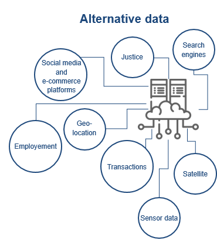

## Table of Contents

## What is alternative data?

Alternative data refers to information that traditional financial data sources do not typically provide. This can include data from social media, satellite imagery, credit card transactions, and more. It is used by investors and businesses to gain insights and make better decisions by looking at trends and patterns that are not visible through conventional data.

For example, a company might use satellite images to estimate how much oil is stored at a facility, or analyze social media sentiment to predict a brand's performance. This kind of data helps them understand market trends and consumer behavior in ways that standard financial reports cannot. As technology advances, the use of alternative data is becoming more common and valuable in many industries.

## How does alternative data differ from traditional data?

Alternative data is different from traditional data because it comes from new and unusual places. Traditional data usually includes things like financial reports, stock prices, and economic statistics. These are the numbers and facts that businesses and investors have used for a long time to make decisions. On the other hand, alternative data can come from social media posts, satellite pictures, or even credit card transactions. This kind of data helps people see things in a new way.

The main difference is that traditional data is easy to find and everyone uses it, while [alternative data](/wiki/best-alternative-data) can be harder to get but gives special insights. For example, traditional data might tell you how much money a company made last year, but alternative data could show you how many people are talking about that company on social media right now. This can help predict what might happen next, not just what has already happened. As more technology becomes available, alternative data is becoming more important for making smart choices in business and investing.

## Why is alternative data important for understanding the Chinese market?

Alternative data is very important for understanding the Chinese market because it can help fill in the gaps where traditional data might not be enough. In China, getting detailed and accurate traditional data can be hard because of rules and regulations. For example, some companies might not share all their financial information openly. Alternative data, like satellite images of factories or data from social media, can give a clearer picture of what is really happening in the market.

Using alternative data can also help businesses and investors see new trends and changes in the Chinese market faster than just using traditional data. For instance, by looking at how many people are talking about a new product on Chinese social media like WeChat or Weibo, companies can understand if that product is becoming popular. This kind of information can help them make better decisions about where to invest or what products to focus on. As China's economy keeps growing and changing, alternative data becomes even more useful for staying ahead.

## What are some common sources of alternative data in China?

In China, one common source of alternative data is social media. People use platforms like WeChat and Weibo a lot to talk about products, brands, and what's happening in the market. Companies can look at these conversations to see what people like or don't like. This helps them understand trends and what might be popular next. Another source is satellite images. These pictures can show how busy factories are or how much stuff is stored at places like oil facilities. This information can tell businesses if the economy is doing well or if there are problems.

Another source of alternative data in China is from mobile phones and apps. People use their phones for everything, from shopping to paying bills. By looking at this data, companies can see where people are spending money and what they are buying. This can give a good picture of how the economy is doing. Also, data from credit cards and online transactions can show how much people are spending and what they are buying. All these sources together help give a fuller picture of the Chinese market than just using traditional data.

## How can alternative data be used to gain insights into China's economy?

Alternative data can help us understand China's economy better by showing us things that traditional data can't. For example, satellite images can show how busy factories are or how much stuff is stored at places like oil facilities. This tells us if the economy is growing or if there might be problems. Also, by looking at what people are saying on social media like WeChat and Weibo, we can see if new products are popular or if people are happy with the economy. This helps businesses know where to invest and what to sell.

Another way alternative data helps is by looking at what people are buying with their phones and credit cards. In China, people use their phones for everything, from shopping to paying bills. By seeing where people are spending money and what they are buying, companies can tell if people have more or less money to spend. This gives a good picture of how the economy is doing. Using all these different kinds of data together helps give a fuller view of China's economy than just using traditional data alone.

## What are the challenges of collecting alternative data in China?

Collecting alternative data in China can be hard because of the rules and laws there. The government has strict rules about what kind of data can be collected and shared. This means that companies have to be careful about how they get and use data. For example, they might need special permission to use satellite images or to look at what people are saying on social media. If they don't follow the rules, they could get in trouble.

Another challenge is that the data can be hard to understand and use. In China, there are many different languages and ways of doing things. This makes it tricky to make sense of the data. Also, the data can change quickly because China's economy is always growing and changing. So, companies need to keep updating their information and be ready to change their plans. This takes a lot of work and money, but it can help them understand the market better.

## What ethical considerations should be taken into account when using alternative data in China?

When using alternative data in China, it's important to think about privacy. The government has strict rules about what data can be collected and shared. This means companies need to be careful not to break these rules. They should make sure they have permission to use the data and that they are not spying on people without their knowledge. Respecting people's privacy is important, even if it means not being able to collect all the data they want.

Another thing to consider is fairness. Companies should not use alternative data in a way that could hurt people or businesses. For example, if they use data to predict how a company will do, they should not use that information to make unfair decisions or to take advantage of others. It's important to use the data in a way that helps everyone and does not cause harm. Balancing the need for information with ethical behavior is key when working with alternative data in China.

## How can alternative data be integrated with traditional data for better analysis?

Combining alternative data with traditional data can give us a better understanding of what's happening in the market. Traditional data, like financial reports and stock prices, tells us what has already happened. It's like looking in the rearview mirror. But alternative data, like social media posts or satellite images, can show us what's happening right now or what might happen next. It's like looking out the windshield. By putting these two kinds of data together, businesses and investors can see a fuller picture of the market. They can use the traditional data to understand the past and the alternative data to predict the future.

For example, a company might look at its sales numbers from last year (traditional data) and then use social media trends (alternative data) to see if people are talking about their products now. If they see a lot of positive comments, they might predict that sales will go up. Or, if satellite images show that a factory is not as busy as before, they might think that the economy is slowing down, even if the traditional data doesn't show it yet. By using both kinds of data, businesses can make smarter decisions and be ready for what's coming next.

## What are some advanced techniques for analyzing alternative data specific to the Chinese market?

One advanced technique for analyzing alternative data in China is using natural language processing (NLP) to understand what people are saying on social media. In China, people use WeChat and Weibo a lot to talk about products and brands. By using NLP, companies can read these posts and see if people are happy or unhappy with a product. This helps them know if a product is becoming popular or if there are problems. They can also see what words people use a lot, which can show new trends. This is really helpful because it gives a quick picture of what's happening in the market.

Another technique is using [machine learning](/wiki/machine-learning) to look at lots of different kinds of data at the same time. For example, a company might use data from satellite images, credit card transactions, and social media all together. Machine learning can find patterns in this data that people might not see. It can tell if more people are buying certain things or if factories are working more or less. This helps businesses predict what might happen next in the economy. By using these advanced techniques, companies can get a better understanding of the Chinese market and make smarter decisions.

## Can you provide case studies where alternative data has significantly impacted decision-making in China?

One case where alternative data made a big difference in China was with a company called JD.com, a big online shopping site. They wanted to know more about what people were buying and how they felt about their products. So, they used data from WeChat, a popular social media app in China. By looking at what people were saying on WeChat, JD.com could see if people liked their products or not. They found out that some products were not as popular as they thought. This helped them change their plans and focus on selling things that people really wanted. This made their business grow even more.

Another case was with a company that used satellite images to understand more about China's economy. They looked at pictures of factories and oil storage places. By seeing how busy these places were, the company could tell if the economy was doing well or if there were problems. For example, if they saw that factories were working a lot, it meant the economy was growing. But if they saw less activity, it might mean the economy was slowing down. This helped the company make better decisions about where to invest their money. By using this kind of data, they could predict what might happen next and be ready for it.

## What are the future trends in alternative data usage in China?

In the future, more and more companies in China will use alternative data to make decisions. They will use new technology like [artificial intelligence](/wiki/ai-artificial-intelligence) and machine learning to understand this data better. For example, they might use AI to look at what people are saying on WeChat and Weibo to see if their products are popular. This will help them know what to sell and where to invest their money. As more people use their phones for shopping and talking, there will be even more data to look at. This will make alternative data even more important for understanding the Chinese market.

Another trend will be using alternative data to predict what might happen next in the economy. Companies will use satellite images to see if factories are busy or if there are changes in how much stuff is stored at places like oil facilities. This will help them see if the economy is growing or if there might be problems. Also, as the rules about data change, companies will find new ways to collect and use this data. They will need to be careful to follow the rules, but using alternative data will help them make smarter decisions and stay ahead in the fast-changing Chinese market.

## How does the regulatory environment in China affect the use of alternative data?

The rules in China about data can make it hard to use alternative data. The government has strict laws about what data can be collected and shared. Companies need to be careful to follow these rules or they could get in trouble. For example, they might need special permission to use satellite images or look at what people are saying on social media. This means they have to think carefully about how they get and use data, which can slow things down.

Even though the rules are strict, they are also changing. As the government sees more value in using alternative data, they might change the laws to make it easier to collect and use this kind of information. Companies need to keep up with these changes and find new ways to use alternative data without breaking the rules. By doing this, they can still get the benefits of alternative data and make better decisions about the Chinese market.

## References & Further Reading

[1]: Bergstra, J., Bardenet, R., Bengio, Y., & Kégl, B. (2011). ["Algorithms for Hyper-Parameter Optimization."](https://papers.nips.cc/paper/4443-algorithms-for-hyper-parameter-optimization) Advances in Neural Information Processing Systems 24.

[2]: ["Advances in Financial Machine Learning"](https://www.amazon.com/Advances-Financial-Machine-Learning-Marcos/dp/1119482089) by Marcos Lopez de Prado

[3]: ["Evidence-Based Technical Analysis: Applying the Scientific Method and Statistical Inference to Trading Signals"](https://www.amazon.com/Evidence-Based-Technical-Analysis-Scientific-Statistical/dp/0470008741) by David Aronson

[4]: ["Machine Learning for Algorithmic Trading"](https://github.com/PacktPublishing/Machine-Learning-for-Algorithmic-Trading-Second-Edition) by Stefan Jansen

[5]: ["Quantitative Trading: How to Build Your Own Algorithmic Trading Business"](https://books.google.com/books/about/Quantitative_Trading.html?id=j70yEAAAQBAJ) by Ernest P. Chan

[6]: Chen, Z., & Wu, T. (2019). ["The Role of Alternative Data in Forecasting Stock Prices: Insights from the Chinese Market."](https://onlinelibrary.wiley.com/doi/10.1002/adfm.202003619) Journal of Financial Markets.

[7]: Kearney, C., & Liu, S. (2014). ["Textual sentiment in finance: A survey of methods and models."](https://www.sciencedirect.com/science/article/pii/S1057521914000295) International Review of Financial Analysis.