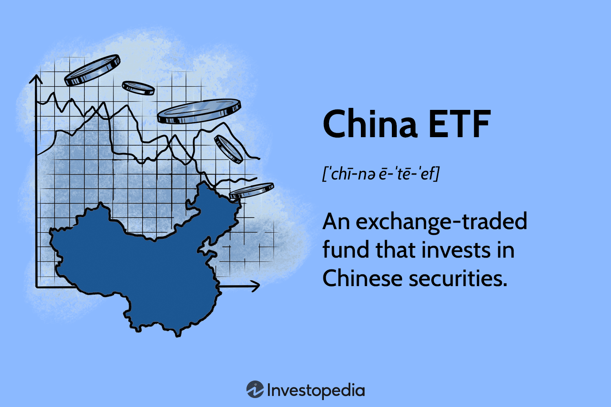

## Table of Contents

## What is a China ETF?

A China ETF, or Exchange-Traded Fund, is a type of investment fund that focuses on stocks from companies in China. It allows investors to buy a diversified portfolio of Chinese stocks without having to pick individual companies themselves. This can be a good way for people to invest in China's growing economy without the need for deep knowledge of the Chinese market.

These ETFs can track various indexes, like the FTSE China 50 Index or the MSCI China Index, which include major companies listed in China or companies that do a lot of business in China. Some China ETFs might focus on specific sectors, like technology or real estate, while others might cover a broad range of industries. This variety helps investors choose an ETF that matches their investment goals and risk tolerance.

## How do China ETFs work?

China ETFs work by pooling money from many investors to buy a basket of stocks from Chinese companies. When you buy shares of a China ETF, you're essentially buying a small piece of all the companies in that ETF's portfolio. This makes it easy for you to invest in China's economy without having to pick individual stocks yourself. The ETF tracks a specific index, like the FTSE China 50 Index, which includes big Chinese companies. As the value of these companies goes up or down, the value of your ETF shares will also change.

These ETFs are traded on stock exchanges, just like regular stocks. You can buy and sell shares of a China [ETF](/wiki/etf-trading-strategies) throughout the trading day at the current market price. This is different from mutual funds, which you can only buy or sell at the end of the trading day. The price of the ETF can change based on how the stocks in its portfolio are doing, as well as other factors like investor demand and market conditions. By investing in a China ETF, you can spread your risk across many companies and sectors, making it a good way to get exposure to China's growth without putting all your eggs in one basket.

## What are the different types of China ETFs available?

There are different kinds of China ETFs you can choose from, depending on what you want to invest in. Some China ETFs focus on big, well-known companies in China. These ETFs might track an index like the FTSE China 50 Index, which includes the 50 largest companies listed in Hong Kong. Other China ETFs might target smaller companies that could grow a lot in the future. These might track an index like the MSCI China Small Cap Index.

Another type of China ETF focuses on specific industries. For example, there are ETFs that only invest in Chinese tech companies or in the real estate sector. These can be good if you think a certain part of the Chinese economy will do well. There are also ETFs that invest in Chinese companies listed on American stock exchanges, like the NASDAQ Golden Dragon China Index. This can be a way to invest in Chinese companies that are easier to buy and sell in the U.S.

Lastly, some China ETFs might be more diversified, investing across many different sectors and company sizes. These can be good if you want a broad exposure to the Chinese economy without focusing on one area. Each type of China ETF has its own risks and potential rewards, so it's important to pick one that matches your investment goals and how much risk you're willing to take.

## What are the advantages of investing in China ETFs?

Investing in China ETFs has several advantages. One big advantage is that it's an easy way to invest in China's growing economy. You don't need to know a lot about individual Chinese companies. The ETF does that work for you by [picking](/wiki/asset-class-picking) a group of stocks that match a certain index. This can save you time and help you spread your risk across many companies. Another advantage is that China ETFs are traded on stock exchanges, so you can buy and sell them easily during the trading day, just like regular stocks. This gives you more control over your investments.

Another benefit is that China ETFs can help you diversify your investment portfolio. By adding Chinese stocks to your investments, you're not putting all your money in one place, like just the U.S. market. This can help protect your money if one market does badly. Also, China is a big player in many industries, like technology and manufacturing. By investing in a China ETF, you can take advantage of growth in these areas. Overall, China ETFs can be a smart way to tap into the potential of China's economy without needing to be an expert on Chinese stocks.

## What are the disadvantages of investing in China ETFs?

One disadvantage of investing in China ETFs is the risk that comes with the Chinese market. The Chinese economy can be unpredictable, and there can be big ups and downs. This means your investment could lose value quickly. Also, the Chinese government has a lot of control over businesses and can change rules that affect companies and their stocks. This adds another layer of risk that you might not see in other markets.

Another downside is that China ETFs might not be as clear as ETFs in other countries. It can be hard to find out exactly what's in the ETF or how it's managed. This lack of transparency can make it tough to know if you're making a good investment. Plus, there can be extra costs, like higher fees or taxes, when you invest in China ETFs. These costs can eat into your returns and make your investment less profitable.

## How can one start investing in China ETFs?

To start investing in China ETFs, you first need to open a brokerage account. This can be done online with many big companies like Charles Schwab, Fidelity, or Vanguard. Once your account is set up, you can search for China ETFs on the brokerage's website. Look for ETFs that track indexes like the FTSE China 50 Index or the MSCI China Index. Make sure to read about the ETF to understand what companies it invests in and what fees you might have to pay.

After picking a China ETF, you can buy shares of it through your brokerage account. Just enter the number of shares you want to buy and place the order. You can choose to buy at the current market price or set a limit order to buy at a specific price. Once you own the shares, you can keep them as a long-term investment or sell them when you think it's a good time. Keep an eye on how the ETF is doing and stay updated on news about China's economy to make smart decisions about your investment.

## What are the key factors to consider before investing in China ETFs?

Before you invest in China ETFs, it's important to think about the risks. The Chinese market can be up and down a lot, and the government can change rules that affect businesses. This means your investment could lose value quickly. Also, China ETFs might not be as clear as other ETFs. It can be hard to know exactly what's in the ETF or how it's managed. This can make it tough to decide if it's a good investment. Plus, there might be extra costs like higher fees or taxes that can eat into your returns.

You should also think about how China ETFs can help you. They're an easy way to invest in China's growing economy without needing to know a lot about individual Chinese companies. The ETF picks a group of stocks for you, which can save you time and help you spread your risk. China ETFs are traded on stock exchanges, so you can buy and sell them easily during the trading day. This gives you more control over your investments. By adding Chinese stocks to your portfolio, you can diversify your investments and take advantage of growth in industries like technology and manufacturing.

## How do China ETFs compare to other investment options in the Chinese market?

China ETFs are a good way to invest in China's economy without having to pick individual stocks. They offer a basket of stocks that track a specific index, like the FTSE China 50 Index or the MSCI China Index. This makes it easier for investors to get exposure to a wide range of Chinese companies without needing to do a lot of research. Compared to buying individual Chinese stocks, ETFs are more diversified, which can lower your risk. However, they can also come with higher fees and less transparency than investing directly in stocks.

Another option is investing in Chinese mutual funds, which are similar to ETFs but are only traded at the end of the day. Mutual funds might offer more active management, meaning professionals pick the stocks for you, but this can also mean higher fees. Compared to ETFs, mutual funds might be better if you want someone else to manage your investments, but they might not give you the same flexibility to buy and sell during the day. Both ETFs and mutual funds are easier ways to invest in China than picking individual stocks, but they have different costs and levels of control.

You could also consider investing in Chinese companies listed on American stock exchanges, like Alibaba or Tencent. These can be easier to buy and sell if you're based in the U.S., and you might feel more comfortable with the regulations and transparency. However, you're limited to the Chinese companies that are listed in the U.S., which might not give you as broad an exposure to the Chinese market as an ETF or mutual fund. Each option has its own advantages and disadvantages, so it's important to think about what fits best with your investment goals and how much risk you're willing to take.

## What are the risks associated with China ETFs?

Investing in China ETFs can be risky because the Chinese market can go up and down a lot. The Chinese government has a big say in how businesses work and can change rules suddenly. This can make the value of your investment drop fast. Also, China ETFs might not be as clear as other ETFs. It can be hard to know exactly what stocks are in the ETF or how it's managed. This lack of transparency can make it tough to decide if it's a good investment. Plus, there might be extra costs like higher fees or taxes that can make your returns smaller.

On the other hand, China ETFs can help you spread your risk across many companies. Instead of putting all your money in one Chinese company, you can invest in a whole group of them. This can make your investment safer. But you still need to keep an eye on how the ETF is doing and stay updated on news about China's economy. This way, you can make smart choices about when to buy or sell. Even though China ETFs offer a way to invest in China's growth, the risks mean you need to be careful and think about what you're willing to risk.

## How have China ETFs performed historically?

China ETFs have had ups and downs over the years. When China's economy is doing well, these ETFs can grow a lot. For example, during times when China's technology and e-commerce companies like Alibaba and Tencent were booming, China ETFs that focused on these sectors did really well. But when China's economy slows down or the government changes rules, these ETFs can lose value quickly. For instance, in 2015, the Chinese stock market crashed, and many China ETFs saw big drops in their value.

Looking at the long term, China ETFs have shown they can be good investments. Over the past 10 years, many of these ETFs have grown, even with the ups and downs. This is because China's economy has been growing steadily over time. But it's important to remember that past performance doesn't mean the same will happen in the future. The Chinese market can be unpredictable, and it's always a good idea to keep an eye on how your investments are doing and be ready for changes.

## What are the tax implications of investing in China ETFs?

Investing in China ETFs can have different tax rules depending on where you live and how the ETF is set up. In the U.S., if you make money from selling your China ETF shares, you might have to pay capital gains tax. This tax depends on how long you held the shares. If you held them for less than a year, it's a short-term capital gain, and you pay your normal income tax rate. If you held them for more than a year, it's a long-term capital gain, and the tax rate is usually lower. Also, if the ETF pays out dividends, you might have to pay taxes on those too, but the rate can be different depending on if they're qualified dividends or not.

Another thing to think about is if the ETF invests in companies in China or Hong Kong. Some countries, like the U.S., have tax treaties with China and Hong Kong that can affect how much tax you pay. For example, you might get a credit for taxes paid in China against your U.S. taxes. It's a good idea to talk to a tax advisor to understand all the rules and make sure you're not paying more tax than you need to. They can help you figure out how to report your gains and dividends correctly on your tax return.

## How do geopolitical factors affect China ETFs?

Geopolitical factors can have a big impact on China ETFs. When there's tension between China and other countries, like trade wars or political disagreements, it can make investors nervous. They might sell their shares in China ETFs, which can cause the value to go down. For example, if the U.S. puts tariffs on Chinese goods, it can hurt Chinese companies, and the ETFs that invest in those companies might lose value too. Also, if there are changes in China's government policies, like new rules for businesses, this can affect how well Chinese companies do and, in turn, how China ETFs perform.

On the other hand, good news about China's relations with other countries can help China ETFs. If China and other countries work together on big projects or sign trade deals, it can make investors feel more confident. This can lead to more people buying shares in China ETFs, which can push the value up. But because geopolitical situations can change quickly, it's important for investors to keep an eye on the news and be ready to adjust their investments if things change.

## References & Further Reading

[1]: ["Advances in Financial Machine Learning"](https://www.amazon.com/Advances-Financial-Machine-Learning-Marcos/dp/1119482089) by Marcos Lopez de Prado

[2]: ["Machine Learning for Algorithmic Trading"](https://github.com/stefan-jansen/machine-learning-for-trading) by Stefan Jansen

[3]: ["Quantitative Trading: How to Build Your Own Algorithmic Trading Business"](https://www.amazon.com/Quantitative-Trading-Build-Algorithmic-Business/dp/1119800064) by Ernest P. Chan

[4]: ["China and the Future of Globalization: The Political Economy of China's Rise"](https://www.amazon.com/China-Future-Globalization-Political-Economy/dp/1788315502) by Grzegorz W. Kolodko

[5]: "The Role of ETFs in the 2008 Financial Crisis: Lessons Learned and Implications for the Future," Financial Analysts Journal, Vol. 70, No. 4 (2014).