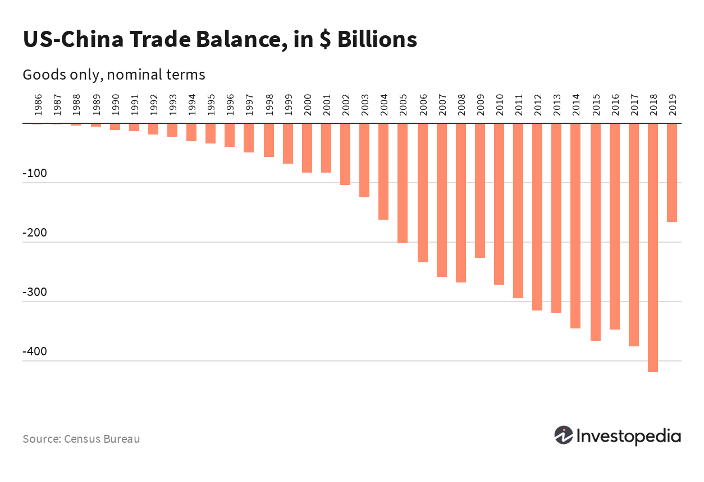

The China Foreign Exchange Trade System (CFETS) plays a crucial role in China's currency market, acting as a central hub for interbank trading and foreign exchange activities. Established in 1994 by the People’s Bank of China, CFETS was designed to enhance the transparency and efficiency of China's financial markets, providing a platform where major financial institutions can conduct currency trading. Over the years, CFETS has evolved to meet the changing dynamics of the global economy by incorporating advanced technologies, including algorithmic trading.

CFETS's influence extends beyond mere facilitation of trading; it is integral to the strategic economic dynamics of China. By ensuring stability and increased efficiency in the Renminbi (RMB) and the foreign exchange markets, CFETS supports the transmission of monetary policies and aligns with China's global economic interactions. As the country continues to integrate into the global financial system, CFETS's operations reflect a broader movement towards modernization within China's financial sector. This modernization effort is evident in its embrace of new technologies designed to optimize trading performance and enhance market stability.



Understanding CFETS's pivotal role is essential for comprehending China's approach to economic management and its interaction with international financial markets. With the incorporation of algorithmic trading, CFETS is not just a marketplace, but a significant player contributing to the sophistication and resilience of China's currency market infrastructure. This article aims to explain CFETS's significant impact on both domestic and global economic landscapes by examining its historical development, current functionalities, and technological advancements.

## Table of Contents

## The Foundation and Evolution of CFETS

The China Foreign Exchange Trade System (CFETS) was founded in 1994, motivated by the need to refine the transmission of monetary policy and ensure stability within China's burgeoning currency market. Established under the auspices of the People's Bank of China, CFETS emerged as a pivotal platform to facilitate foreign exchange and RMB trading, profoundly influencing China's financial landscape. Initially, CFETS catered primarily to RMB and foreign currency spot trading, reflecting the nascent stage of China's financial system, which was then heavily regulated and limited in scope.

Over the ensuing years, CFETS expanded its breadth and scope of operations to accommodate China's rapid economic growth and integration into the global financial system. A significant milestone in this evolution was the introduction of foreign currency trading to the interbank market in 2005. This development was crucial as it marked China's strategic shift towards a more open and market-oriented economy, allowing for greater flexibility and responsiveness to global financial dynamics.

In addition to broadening its trading capabilities, CFETS has embraced technological advancements to remain at the forefront of financial market innovation. The inception of platforms such as FX2017 exemplifies this commitment to modernization, enhancing trading capacities and operational efficiency. These platforms have been instrumental in integrating derivatives and bond trading, thereby diversifying the trading options available to the market's participants.

CFETS's evolution reflects both its response to economic imperatives and its role in strategically positioning China within the global financial architecture. The ongoing adaptation and modernization efforts underscore CFETS's commitment to bolstering China's financial market infrastructure and furthering its development goals.

## Structure and Functionality of CFETS

The China Foreign Exchange Trade System (CFETS) serves as a core component of China's financial infrastructure, with its headquarters located in Shanghai and numerous sub-centers spread across the country. This strategic positioning allows CFETS to efficiently facilitate various forms of financial transactions and contribute to the stability and development of China's currency markets.

CFETS provides a comprehensive suite of services including trading, information dissemination, benchmark provision, and training facilities. The e-trading platform is designed to encourage trading activities among a diverse array of financial institutions, thereby fostering a more dynamic and liquid market environment. By offering a centralized and unified electronic trading system, CFETS enables participants to engage in seamless transactions, optimizing both time and cost efficiency.

The system supports various trading forms tailored to meet the needs of market participants. These include anonymous trading, where the identities of the trading counterparties are concealed, thus increasing market fairness and reducing the potential for manipulation. Bilateral trading is also facilitated, allowing parties to negotiate and agree upon transaction terms directly, providing a flexible trading mechanism within a regulated environment. Matched trading is another important function, wherein trades are automatically matched based on predetermined criteria, ensuring transaction efficiency and price discovery.

These functionalities empower CFETS to address the complexities and demands of modern financial markets, making it an indispensable player in China's efforts to maintain a robust and transparent currency market. The system's comprehensive capabilities underscore its pivotal role in enhancing market accessibility, efficiency, and stability, crucial elements in China's strategy to further integrate into the global financial system.

## CFETS and Algorithmic Trading

Algorithmic trading has become a transformative force in the financial markets, enhancing both [forex](/wiki/forex-system) and bond trading through enhanced speed and efficiency. At the China Foreign Exchange Trade System (CFETS), the integration of [algorithmic trading](/wiki/algorithmic-trading) has been pivotal in optimizing the functioning of China's currency market.

CFETS employs algorithmic trading to significantly improve the speed and efficiency of transactions. Algorithms can execute orders at a scale and efficiency beyond human capacity, operating under pre-set trading conditions and strategies. These algorithms aid in the seamless execution of trades by instantly and autonomously evaluating vast amounts of market data and executing trades when specific criteria are met. This technological advancement reduces the latency associated with manual trading, thus enhancing the overall market execution.

Moreover, algorithmic trading systems often contribute to increased market [liquidity](/wiki/liquidity-risk-premium) and stability. By automating trades, these algorithms can process large volumes of trading data quickly and execute orders with minimal market impact. This automation allows CFETS to facilitate a continuous range of low-slippage transactions, minimizing the bid-ask spread and ensuring that market participants can execute trades near their intended prices.

Another benefit of adopting algorithmic trading at CFETS is the anonymity it provides to traders. In traditional trading platforms, large orders might signal market direction to other participants, influencing price movements. However, through algorithmic trading, trades can be broken down into smaller parts, allowing orders to be executed in a way that conceals the overall transaction [volume](/wiki/volume-trading-strategy). This anonymization process protects the strategic intentions of market participants and enhances the market's overall efficiency.

The systematization of trades through algorithmic processes also reduces the risk of human error, ensuring a more reliable trading environment. Algorithms are designed to process information and execute orders based on logical sequences, removing emotional bias and human oversight from the trading equation. This precision is particularly valuable in high-frequency trading environments where split-second decisions can have significant financial consequences.

Leveraging algorithmic trading, CFETS enhances transaction speeds while maintaining transparency and reliability in the foreign exchange markets. It empowers traders by providing tools that offer deeper insights into market dynamics, thereby fostering a trading environment that supports robust market activity and stability. Through the harnessing of algorithms, CFETS continues to play an essential role in advancing the infrastructure of China's financial markets by supporting a stable and efficient trading ecosystem.

## Impact on China’s Foreign Exchange Market

The China Foreign Exchange Trade System (CFETS) plays a crucial role in maintaining the stability of the Renminbi (RMB) exchange rate, vital for China's economic stability and growth. By serving as the central hub for foreign exchange trading in China, CFETS ensures that transaction flows remain orderly, allowing for effective monetary policy transmission. This is accomplished through sophisticated platforms that offer a comprehensive range of financial products and services, such as foreign exchange spot trading, swap transactions, and forward contracts. 

One of the most significant advancements facilitated by CFETS is the development of the foreign exchange ([FX](/wiki/fx-anomaly)) derivatives markets. These markets offer various instruments like currency futures, options, and swaps, which are critical for hedging risks and enhancing liquidity. By enabling financial institutions to manage exchange rate risks more effectively, CFETS aids in building a more resilient financial infrastructure in China. This effort is instrumental in broadening the scope of available financial products and deepening market maturity.

CFETS's integration of algorithmic trading represents a leap forward in trading efficiency and precision. Algorithmic trading systems use complex mathematical models and statistical methods to automate trading decisions, leading to faster execution times and reduced transaction costs. For instance, algorithms can evaluate large data sets to identify trading opportunities more quickly than human traders. This capability increases market liquidity and stability as it allows for rapid adjustments to fluctuations in supply and demand.

Consider the following example of a simple algorithmic trading strategy that could be applied within CFETS's system to achieve efficient trading:

```python
import pandas as pd

# Sample data for exchange rates
data = {'Time': ['09:00', '09:01', '09:02'],
        'Exchange_Rate': [6.45, 6.46, 6.44]}
df = pd.DataFrame(data)

# Simple moving average strategy
df['SMA_2'] = df['Exchange_Rate'].rolling(window=2).mean()
df['Signal'] = 0

# Generating trading signals
df.loc[df['Exchange_Rate'] > df['SMA_2'], 'Signal'] = 1  # Buy Signal
df.loc[df['Exchange_Rate'] < df['SMA_2'], 'Signal'] = -1  # Sell Signal

print(df[['Time', 'Exchange_Rate', 'SMA_2', 'Signal']])
```

The algorithm calculates a simple moving average (SMA) and generates buy or sell signals based on the comparison of the exchange rate with its SMA. This strategy helps to identify trends and execute trades accordingly, thereby promoting market fluidity.

Overall, CFETS's efforts to enhance trading platforms, expand financial derivatives markets, and integrate advanced trading technologies bolster China's foreign exchange market. These developments not only stabilize the RMB exchange rate but also reinforce China's position in global forex markets, showcasing the significance of CFETS in the broader context of international finance.

## Challenges and Future Prospects

The China Foreign Exchange Trade System (CFETS) faces numerous challenges as it strives to embrace technological advancements in the ever-evolving global financial landscape. One of the foremost challenges is regulatory compliance. The integration of sophisticated algorithmic trading systems necessitates adherence to stringent regulatory frameworks to ensure transparency, fairness, and market integrity. This requires CFETS to work closely with regulatory bodies such as the People's Bank of China to formulate policies that accommodate technological innovation while safeguarding market participants.

Data security is another critical concern for CFETS as it increases its reliance on technology. The vast amount of sensitive financial data exchanged within CFETS's platforms makes them a target for cyber threats. To combat this, the system must invest in robust cybersecurity measures, employing state-of-the-art technologies to protect against data breaches and unauthorized access. This underscores the need for ongoing research and development in cybersecurity protocols to keep pace with the sophistication of cyber threats.

CFETS is focused on enhancing its algorithmic trading capabilities, which involves continuous innovation in trading algorithms to improve execution speed, accuracy, and efficiency. Plans for the future include the development of advanced [machine learning](/wiki/machine-learning) models that can predict market trends and optimize trading strategies in real-time. By harnessing the power of [artificial intelligence](/wiki/ai-artificial-intelligence), CFETS aims to revolutionize its trading processes, thereby offering more competitive and reliable trading solutions to its participants.

As the global market progresses, CFETS must adapt by maintaining robust risk management strategies. This includes evolving its risk assessment models to account for the complexities introduced by high-frequency trading and cross-border transactions. The implementation of comprehensive risk management frameworks will enable CFETS to identify potential market disruptions early and implement measures to mitigate their impact.

Looking ahead, CFETS is poised to explore strategic partnerships with other major global financial centers to enhance its global reach and influence. By aligning with international market standards and adopting best practices from leading foreign exchange systems, CFETS can position itself as a significant player in the global market. Such collaborations may involve technology sharing agreements and coordinated policy frameworks that facilitate smoother cross-border trading.

In conclusion, while CFETS faces substantial challenges in embracing technological advancements, it also has the opportunity to set a benchmark in the global financial landscape through innovation and strategic foresight. By prioritizing regulatory compliance, data security, and risk management, CFETS is well-positioned to navigate the future complexities of international finance.

## Conclusion

The China Foreign Exchange Trade System (CFETS) is pivotal in modernizing China's currency market. By integrating algorithmic trading, CFETS has significantly enhanced the operational efficiency of financial markets. This advancement allows for greater transaction speeds and increased market liquidity, thereby contributing to a more stable and robust foreign exchange environment. Algorithmic trading helps in managing large-scale transactions with precision, reducing the risk of human error, and improving market efficiencies.

CFETS continues to play a crucial role in executing China's foreign exchange and monetary policies. Through its sophisticated platforms, CFETS ensures seamless transmission of these policies, impacting both domestic and international market dynamics. The system's comprehensive trading infrastructure supports a variety of financial instruments, from foreign exchange to derivatives, strengthening China's financial ecosystem.

The evolution of CFETS mirrors broader trends in global finance, emphasizing the growing importance of technology in market operations. This change aligns with the global shift towards automated and high-frequency trading systems, which are now indispensable in the context of international financial markets. By keeping pace with these global trends, CFETS not only supports China's economic strategies but also reinforces its position within the international finance landscape.

## References & Further Reading

[1]: ["The Role of CFETS in China's Foreign Exchange Market"](https://en.wikipedia.org/wiki/China_Foreign_Exchange_Trade_System) by Liu, Z.

[2]: Scissors, D. (2014). ["China’s Financial Market Infrastructure: Issues and Opportunities"](https://en.wikipedia.org/wiki/AKB48). The Heritage Foundation.

[3]: Kose, M. A., & Prasad, E. S. (2010). ["Emerging Markets: Resilience and Growth Amid Global Turmoil"](https://archive.org/details/emergingmarketsr0000kose). Brookings Institution Press.

[4]: Lopez de Prado, M. (2018). ["Advances in Financial Machine Learning"](https://www.amazon.com/Advances-Financial-Machine-Learning-Marcos/dp/1119482089) by Marcos Lopez de Prado

[5]: Aronson, D. (2006). ["Evidence-Based Technical Analysis: Applying the Scientific Method and Statistical Inference to Trading Signals"](https://www.amazon.com/Evidence-Based-Technical-Analysis-Scientific-Statistical/dp/0470008741) by John Wiley & Sons.

[6]: Jansen, S. (2020). ["Machine Learning for Algorithmic Trading"](https://github.com/stefan-jansen/machine-learning-for-trading) by Stefan Jansen 

[7]: Chan, E. P. (2009). ["Quantitative Trading: How to Build Your Own Algorithmic Trading Business"](https://github.com/ftvision/quant_trading_echan_book) by Ernest P. Chan