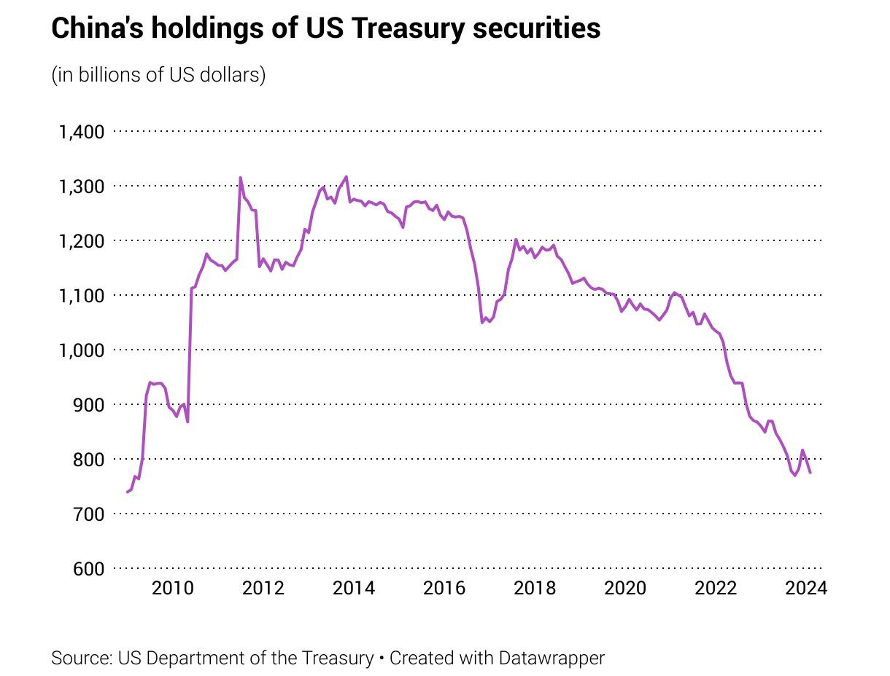

## Table of Contents

## What are U.S. Treasury bonds?

U.S. Treasury bonds are loans that people give to the government. The government uses the money for things like building roads or helping schools. In return, the government promises to pay back the money with interest after a certain time. These bonds are seen as very safe because the U.S. government is unlikely to fail to pay back the money.

These bonds come in different lengths of time, from a few months to as long as 30 years. The longer you wait for your money back, the more interest you usually get. People and big groups like banks buy these bonds to keep their money safe and earn a little extra. You can buy them directly from the U.S. government through a website called TreasuryDirect.

## Why does the U.S. government issue Treasury bonds?

The U.S. government issues Treasury bonds to borrow money from people and organizations. They need this money to pay for things that the country needs, like building roads, helping schools, and other big projects. When the government doesn't have enough money from taxes, it can borrow by selling these bonds.

People and organizations buy these bonds because they get their money back with a little extra, called interest, after a certain time. This is a way for them to save money safely. The U.S. government is seen as very reliable, so people trust that they will get their money back. By issuing these bonds, the government can keep running and doing important work without having to raise taxes right away.

## How does China purchase U.S. Treasury bonds?

China buys U.S. Treasury bonds by using dollars it gets from selling things like toys, clothes, and electronics to people in the United States. When Chinese companies sell these products, they get paid in dollars. Instead of keeping all those dollars in China, the government decides to invest some of them in U.S. Treasury bonds because they are seen as a safe place to keep money.

The Chinese government goes through banks and financial companies to buy these bonds. They use their dollars to buy the bonds from the U.S. government through the bond market. This helps China keep its money safe and earn a little interest over time. By doing this, China also helps the U.S. government by lending it money that the U.S. can use for important projects.

## What is the current amount of U.S. debt held by China?

As of the latest data available, China holds about $859 billion in U.S. Treasury securities. This amount can change over time because countries buy and sell these bonds regularly. The U.S. debt held by China is a big part of the total U.S. public debt, which is over $34 trillion.

China buys these bonds to keep its money safe and earn some interest. By doing this, China also helps the U.S. government by lending it money. This relationship is important for both countries, but it can also cause worries about how much the U.S. depends on other countries for money.

## How has China's holding of U.S. debt changed over time?

Over the years, China's holding of U.S. debt has gone up and down. In the early 2000s, China started buying more U.S. Treasury bonds because it was selling a lot of things to the United States and getting paid in dollars. By 2011, China's holdings reached a peak of around $1.3 trillion. After that, the amount started to go down slowly. By the end of 2023, China held about $859 billion in U.S. debt. This decrease happened because China wanted to spread its money around to other places and because of some tensions between the U.S. and China.

Even though China's holdings have gone down, it is still one of the biggest holders of U.S. debt. The U.S. needs to borrow money to pay for things like roads and schools, and China buying U.S. bonds helps with that. But the relationship can be tricky. Some people in the U.S. worry about depending too much on China for money. At the same time, China uses these bonds to keep its money safe and earn a little interest. So, both countries have reasons to keep this relationship going, even if the amount of debt China holds changes over time.

## What are the economic implications for the U.S. of China holding its debt?

When China holds a lot of U.S. debt, it means that China is lending money to the U.S. government. This can be good for the U.S. because it helps the government pay for important things like roads and schools without having to raise taxes right away. Also, because China buys U.S. Treasury bonds, it helps keep interest rates low in the U.S. When lots of people want to buy these bonds, the U.S. doesn't have to offer as much interest to get people to buy them.

But there are also some worries. If China decides to sell a lot of its U.S. debt at once, it could cause problems. The price of the bonds might go down, and that could make interest rates go up in the U.S. This would make it more expensive for the U.S. government to borrow money. Also, some people in the U.S. worry about depending too much on China. If there are big fights or disagreements between the two countries, it could make things harder for the U.S. economy.

## How does the purchase of U.S. Treasury bonds affect the U.S.-China economic relationship?

When China buys U.S. Treasury bonds, it helps the U.S. government by lending it money. This money helps the U.S. pay for things like roads and schools without needing to raise taxes right away. It also keeps interest rates low in the U.S. because when lots of people want to buy these bonds, the U.S. doesn't have to offer as much interest to get people to buy them. This makes borrowing money cheaper for the U.S. government and helps the economy grow.

But there are also some worries about this relationship. If China decides to sell a lot of its U.S. debt all at once, it could cause problems. The price of the bonds might go down, and that could make interest rates go up in the U.S. This would make it more expensive for the U.S. government to borrow money. Also, some people worry about the U.S. depending too much on China. If the two countries have big fights or disagreements, it could make things harder for the U.S. economy. So, while China buying U.S. debt can help in some ways, it also brings some risks.

## What are the potential risks for China in holding large amounts of U.S. debt?

When China holds a lot of U.S. debt, it faces some risks. One big risk is that if the U.S. dollar loses value, the money China has in U.S. bonds will be worth less. This could happen if the U.S. has a lot of inflation or if people start to trust the U.S. dollar less. Also, if the U.S. decides to print more money to pay off its debt, that could make the dollar worth less, which would hurt China's savings.

Another risk is that if the U.S. and China have big fights or disagreements, it could make things hard for China. If China decides to sell a lot of its U.S. debt all at once, it might make the price of the bonds go down. This could mean China loses money on its investment. Also, if the U.S. government has trouble paying back its debt, China could lose a lot of money. So, while holding U.S. debt can be a safe way to save money, it also comes with some big risks for China.

## How do fluctuations in U.S. interest rates impact China's investment in U.S. Treasury bonds?

When U.S. interest rates go up, it can affect China's investment in U.S. Treasury bonds. If interest rates rise, new bonds will offer more interest than the older ones China already owns. This makes the value of China's existing bonds go down because people would rather buy the new bonds with higher interest. If China decides to sell its bonds during this time, it might lose money because the bonds are worth less.

On the other hand, when U.S. interest rates go down, it can be good for China. Lower interest rates mean the value of the bonds China already owns goes up. People are more likely to buy older bonds because they offer better interest compared to new ones. This means China can sell its bonds for more money if it wants to. But, if China keeps its bonds until they mature, it will still get the same amount of interest it was promised when it bought them, no matter what happens to interest rates.

## What role do U.S. Treasury bonds play in China's foreign exchange reserves management?

U.S. Treasury bonds are an important part of China's foreign exchange reserves. China earns a lot of U.S. dollars from selling things like toys and clothes to people in the U.S. Instead of keeping all those dollars in China, the government decides to invest some of them in U.S. Treasury bonds. These bonds are seen as a safe place to keep money because the U.S. government is unlikely to fail to pay back the money. By buying these bonds, China can keep its money safe and earn a little interest over time.

But managing these reserves can be tricky. If the U.S. dollar loses value because of inflation or other problems, the money China has in U.S. bonds will be worth less. Also, if the U.S. and China have big fights or disagreements, it could make things hard for China. If China decides to sell a lot of its U.S. debt all at once, it might make the price of the bonds go down, and China could lose money. So, while U.S. Treasury bonds help China keep its foreign exchange reserves safe, there are also risks that China has to think about.

## How might geopolitical tensions affect China's strategy regarding U.S. debt?

Geopolitical tensions can make China think carefully about how much U.S. debt it wants to hold. If there are big fights or disagreements between the U.S. and China, China might worry about the safety of its money. If things get really bad, China might decide to sell some of its U.S. Treasury bonds to move its money to other places that seem safer. But selling a lot of bonds at once could make the price of the bonds go down, and China could lose money. So, China has to balance the need to keep its money safe with the risk of losing money if it sells too quickly.

At the same time, China might use its holdings of U.S. debt as a way to have more power in talks with the U.S. If China holds a lot of U.S. debt, it can say, "We are important to your economy, so you should listen to us." This can give China more say in things like trade deals or other big decisions. But it's a tricky balance because if China uses its debt too aggressively, it could make the U.S. angry and cause even more problems. So, geopolitical tensions make China's strategy about U.S. debt more complicated and risky.

## What are the long-term strategic implications for global financial markets of China's holdings in U.S. debt?

China's holdings in U.S. debt have big effects on global financial markets over time. When China buys a lot of U.S. Treasury bonds, it helps keep interest rates low in the U.S. This makes it cheaper for the U.S. government and people to borrow money, which can help the economy grow. But if China decides to sell a lot of its U.S. debt, it could make interest rates go up and cause problems in the U.S. and around the world. This is because the price of the bonds might go down, and other countries might start to worry about their own investments in U.S. debt.

Also, the way China manages its U.S. debt can affect how other countries see the U.S. dollar. If China starts to sell a lot of its U.S. bonds, it might make people think the U.S. dollar is not as safe as before. This could make the dollar lose value, which would be bad for countries that keep their money in dollars. On the other hand, if China keeps buying U.S. debt, it can help keep the dollar strong and make people trust it more. So, what China does with its U.S. debt can change how the whole world thinks about money and investments.

## References & Further Reading

[1]: Krugman, P. (2009). ["The Return of Depression Economics and the Crisis of 2008"](https://books.google.com/books/about/The_Return_of_Depression_Economics_and_t.html?id=0B_8f3BBwdwC). W. W. Norton & Company.

[2]: Warnock, F. E., & Warnock, V. C. (2009). ["International Capital Flows and U.S. Interest Rates"](https://www.nber.org/papers/w12560). National Bureau of Economic Research.

[3]: Zhang, M. (2021). ["U.S. Treasury Securities: Conducting Auctions Effectively to Support Economic Policy"](https://www.newyorkfed.org/research/epr/). U.S. Department of the Treasury.

[4]: Alden, E. (2017). ["Failure to Adjust: How Americans Got Left Behind in the Global Economy"](https://www.tandfonline.com/doi/full/10.1080/08853908.2017.1372232). Rowman & Littlefield Publishers.

[5]: Haldane, A. G., & Young, P. (2020). ["Algorithmic Trading: A Brief Overview"](https://www.nature.com/articles/nature09659). Bank of England Working Paper.