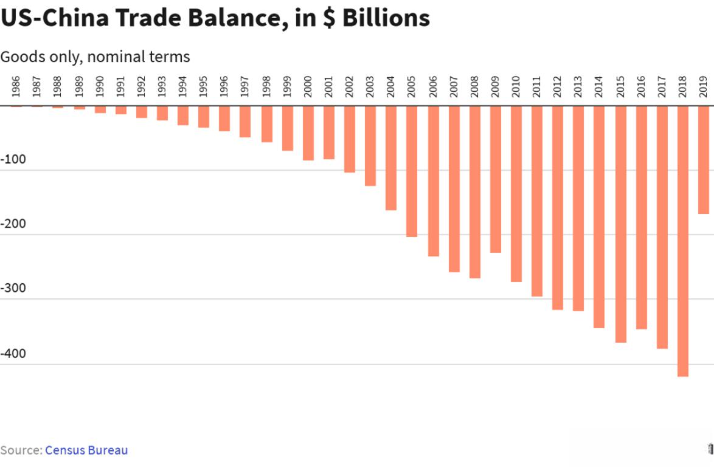

Global industrial production plays a crucial role in shaping the economic landscape, with China serving as a pivotal player due to its dominance in manufacturing. The interplay between China’s manufacturing sector and algorithmic trading (algotrading) illustrates the complexities and opportunities that exist at the intersection of traditional industries and technological advancements.

China's importance in global manufacturing is unparalleled. As the world's largest manufacturing hub, China contributes significantly to industrial production worldwide. Its extensive production infrastructure, low labor costs, and robust supply chain networks have been instrumental in establishing its position as a global leader. The influence of China's manufacturing sector extends beyond national borders, impacting global supply chains and economies. Changes in China’s manufacturing policies or practices can send ripples through international markets, affecting everything from raw material prices to the availability of finished goods.

Algorithmic trading, meanwhile, has revolutionized financial markets through the use of computer algorithms to execute trades at speeds and frequencies far beyond human capability. Algotrading leverages mathematical models and data analysis to make trading decisions, often resulting in more efficient and cost-effective transactions. In the context of manufacturing and production, algotrading facilitates better management of commodity risks, energy costs, and financial operations. By integrating real-time data analytics, it offers manufacturers the potential to optimize their operations, reduce costs, and enhance decision-making processes.

Despite the clear benefits presented by integrating algotrading with industrial production and manufacturing, challenges remain. The complexity of implementing algorithmic systems within traditional manufacturing models requires substantial investment and expertise. Moreover, ethical considerations regarding transparency and algorithmic accountability must be addressed to ensure fair and unbiased trading practices.

The purpose of this article is to explore the synergy between global industrial production, China’s manufacturing sector, and algorithmic trading. It aims to provide insights into how these interconnected elements can unlock new efficiencies and innovations in the manufacturing industry. By examining the potential benefits and challenges, industry stakeholders can better navigate this evolving landscape and harness the full potential of technological advancements in manufacturing and production.

## Table of Contents

## The Role of China in Global Manufacturing

China's role as the world's largest manufacturing hub is pivotal in shaping global supply chains and influencing industrial production across continents. As of recent estimates, China accounts for approximately 28.7% of global manufacturing output. This considerable share underscores China's influence in the global factory landscape, driven by several key factors.

### Factors Contributing to China's Manufacturing Dominance

1. **Cost Efficiency**: China's manufacturing prowess is significantly attributed to its labor cost advantage. Although wages have been rising over recent years, the overall cost of employment remains lower compared to developed nations, providing a competitive edge in labor-intensive industries.

2. **Infrastructure and Logistics**: The country has one of the most developed logistics infrastructures in the world, with extensive railways, roads, and ports that facilitate efficient distribution and exportation of goods. The "Belt and Road Initiative" further expands China’s reach, enhancing trade routes and economic ties with other regions.

3. **Government Policies and Incentives**: Chinese government policies have historically supported industrial growth through subsidies, tax incentives, and strategies like the "Made in China 2025" initiative, which aims to move the country up the value chain in high-tech production.

4. **Supply Chain Integration**: China's ecosystem of suppliers, manufacturers, and assemblers is highly efficient, providing seamless supply chain integration. Proximity to a variety of suppliers enables quick turnarounds in production and adaptation to global market demands.

### Impact on Global Supply Chains and Industrial Production

China's manufacturing practices have long contributed to global economic interdependency. Its capacity to produce goods at a large scale and low cost drives down prices worldwide. However, this centralization also poses risks, as evidenced during the COVID-19 pandemic when global supply chains experienced severe disruptions due to production halts in China.

### Recent Trends in Chinese Manufacturing

Recent shifts include a focus on technology-driven manufacturing. Investments in automation, robotics, and [artificial intelligence](/wiki/ai-artificial-intelligence) are surging, aiming to address rising labor costs and increase production efficiency. Furthermore, China is increasingly focusing on environmentally sustainable practices, in response to both global pressures and domestic environmental challenges.

### Challenges Faced by China and Potential Impacts

Despite its strengths, China faces several challenges that may shape its future role in global manufacturing:

- **Rising Labor Costs**: Continuous wage increases are eroding China's cost advantage, prompting some industries to relocate to Southeast Asian countries with lower labor costs.

- **Trade Tensions**: Diplomatic and trade disputes, particularly with Western nations, introduce uncertainty and potential barriers to China's export-driven manufacturing sector.

- **Environmental Regulations**: Stricter environmental policies may impact production practices. While these aim to reduce pollution, they can also increase operational costs and affect productivity.

- **Dependency on Technology Imports**: As China targets high-tech manufacturing, its dependency on importing advanced technology and components could be a bottleneck, especially amid geopolitical tensions that restrict access to certain technologies.

The dynamic nature of China's manufacturing sector reflects both opportunities and challenges that have significant implications for global industrial production and supply chains. These evolving elements underscore the critical need to monitor China's manufacturing landscape closely, as changes within this sector have far-reaching economic impacts worldwide.

## Understanding Industrial Production within a Global Context

Industrial production refers to the output of the industrial sector, which includes mining, manufacturing, and utilities. It is a critical component of the global economy as it provides the goods and energy necessary for consumption and further economic activities. The significance of industrial production lies in its direct correlation with economic growth, employment, and its influence on trade balances among nations. An increase in industrial production often signifies economic expansion, whereas a decline may indicate economic contraction.

International trade pressures significantly influence industrial production across different regions. These pressures arise from currency fluctuations, trade barriers, tariffs, and shifts in consumer demand. For example, currency appreciation can make a country's exports more expensive and imports cheaper, affecting domestic manufacturing competitiveness. Conversely, a weaker currency could boost exports. Trade agreements and tariffs also play a substantial role. For instance, the imposition of tariffs on steel and aluminum in 2018 by the United States led to ripple effects in the industrial production of these metals globally, affecting manufacturers in countries reliant on exporting these materials to the U.S.

Technological innovations are crucial in enhancing production efficiencies. Automation, artificial intelligence (AI), and the Internet of Things (IoT) have transformed industrial production by reducing costs and increasing output quality and consistency. Robotics and AI facilitate precision in manufacturing, while IoT devices enable real-time monitoring and predictive maintenance, thereby minimizing downtime. These technological advancements contribute to economies of scale, allowing industries to produce more at lower marginal costs. For example, AI-driven algorithms optimize the supply chain by predicting demand fluctuations, leading to more efficient inventory management.

Economic policies and trade agreements are instrumental in shaping global industrial output. Policies that encourage investment in infrastructure, research and development, and clean energy can stimulate production sectors. Conversely, protectionist policies may initially protect domestic industries but can lead to inefficiencies and retaliation from trading partners, ultimately affecting global industrial dynamics. Trade agreements like the North American Free Trade Agreement (NAFTA), now replaced by the United States-Mexico-Canada Agreement (USMCA), have historically played a role in reshaping production structures and supply chains in North America, promoting cross-border manufacturing and increasing industrial output.

Case studies illustrate how shifts in industrial production occur due to geopolitical and economic changes. The U.S.-China trade war is a pertinent example, impacting supply chains worldwide. Tariffs and trade barriers imposed during the conflict prompted manufacturers to relocate production to other parts of Asia, such as Vietnam and Thailand, thereby altering the industrial landscape. Similarly, Brexit has forced companies in the UK and EU to adjust their production strategies, with some moving operations to mainland Europe to bypass potential trade disruptions.

In conclusion, industrial production is integral to the global economy, driven by technological innovations and influenced by international trade pressures, economic policies, and geopolitical events. Understanding these factors is essential for comprehending the dynamics of global industrial production and its future development.

## Algorithmic Trading: An Overview

Algorithmic trading, commonly referred to as "algotrading," employs complex algorithms to execute trading decisions at speeds and frequencies beyond the capabilities of human traders. It involves the use of computer programs to follow a defined set of instructions (an algorithm) to place a trade, with the ultimate goal of generating profits at speeds and frequencies that surpass manual trading. The evolution of [algorithmic trading](/wiki/algorithmic-trading) in the financial market has been marked by rapid technological advancements and the increased availability of market data.

Key technologies that enable algo trading include [machine learning](/wiki/machine-learning) algorithms, high-frequency trading platforms, and sophisticated data analysis tools. Machine learning plays a pivotal role, providing predictive analytics that can model and anticipate market trends. High-frequency trading platforms allow transactions to be executed in milliseconds, capitalizing on tiny price discrepancies that wouldn't be apparent to humans.

Algotrading can significantly influence commodity prices, thereby impacting global manufacturing. For instance, large-scale automated trading can lead to rapid changes in market [liquidity](/wiki/liquidity-risk-premium) and [volatility](/wiki/volatility-trading-strategies), causing price shifts in commodities such as oil, metals, and agricultural products. These price shifts, in turn, have direct implications on manufacturing costs, supply chain management, and inventory valuations on a global scale.

A practical example of algo trading within the industrial sector is its application in optimizing supply chain logistics. Through real-time data analysis and predictive modeling, algorithms can assess global supply and demand patterns, foresee potential disruptions, and make strategic purchasing decisions that align with manufacturing needs.

However, algorithmic trading is not without risks and ethical considerations. One of the most prominent risks is the potential for market manipulation through strategies such as "spoofing," where false orders are placed to deceive other traders about supply and demand. Additionally, the reliance on algorithms can lead to systemic risks, exemplified by the "Flash Crash" of 2010, when major stock indices experienced a sudden and drastic plunge, mainly attributed to algorithmic trading.

Ethical considerations also include the transparency of trading strategies and the fairness of access to trading technology. The debate over whether sophisticated trading algorithms provide an undue advantage to certain market participants continues to shape regulatory discussions.

In summary, algorithmic trading is a potent force in the financial markets, with the capability to reshape not only trading practices but also global manufacturing and economic systems. Its continued integration into these sectors demands careful oversight to mitigate risks and ensure a balanced and fair marketplace.

## Synergy between Algotrading and Manufacturing

The integration of algorithmic trading, or algotrading, with manufacturing processes and supply chains presents numerous opportunities for optimization. By leveraging sophisticated algorithms for real-time data analysis and decision-making, manufacturing can harness a level of efficiency and responsiveness previously unattainable.

Algorithmic trading can streamline manufacturing through predictive analytics, optimizing inventory levels, and managing supply chain disruptions more effectively. For instance, algorithms can process market signals, supply chain data, and consumer demand trends to forecast production needs accurately. Implementing such a system reduces overproduction and storage costs while ensuring timely delivery of goods.

Several case studies illustrate the successful integration of algotrading into manufacturing strategies. One notable example is the deployment of machine learning algorithms to optimize just-in-time (JIT) manufacturing processes. The JIT approach, which focuses on reducing in-process inventory and associated costs, benefits significantly from the precise demand forecasts generated by refined algorithms. By dynamically adjusting production schedules based on real-time data, manufacturers can mitigate waste and enhance operational efficiency.

Another benefit of real-time data processing in manufacturing is improved decision-making capabilities. Algorithms can continuously monitor equipment status, predict maintenance needs, and prevent potential downtimes, thus ensuring uninterrupted production. Real-time analysis also aids in quality control by promptly identifying defects and implementing corrective actions, thereby reducing waste and enhancing product quality.

Despite these advantages, merging financial algorithms with manufacturing processes poses several challenges. The complexity of aligning algorithms designed for financial markets with the multifaceted nature of manufacturing processes requires careful calibration. Data quality remains a critical concern, as algorithms depend on accurate and timely information to function effectively. Additionally, there is the challenge of effectively integrating diverse data sources such as IoT devices, enterprise resource planning (ERP) systems, and external market data.

The future outlook for the integration of AI and algorithms in industrial production is promising. Advancements in artificial intelligence, particularly in [deep learning](/wiki/deep-learning) and [reinforcement learning](/wiki/reinforcement-learning), are set to further enhance the capability of algotrading systems. These technologies can refine predictive models and facilitate adaptive learning within production environments. Moreover, the advent of Industry 4.0 and the proliferation of smart factories underscore the increasing role of such intelligent systems.

In conclusion, the synergy between algotrading and manufacturing holds the potential to revolutionize the industrial sector. The continued development and integration of advanced algorithms will further improve efficiencies across manufacturing processes, offering significant competitive advantages to early adopters. Nonetheless, ensuring data integrity and addressing integration complexities remain vital to the successful realization of these benefits.

## Implications for Investors and Industry Leaders

Investors and industry leaders stand at a unique intersection where global manufacturing and algorithmic trading (algotrading) converge, offering numerous opportunities and challenges. The integration of algotrading into manufacturing processes can yield significant financial benefits by optimizing supply chain efficiencies and reacting swiftly to market conditions. This blending of finance and manufacturing allows investors to capitalize on both sectors' growth and volatility.

One of the primary ways investors can leverage this connection is by investing in technologies that automate and optimize supply chains. Algorithmic trading can be employed to predict market trends, commodity prices, and demand fluctuations, facilitating more informed decision-making in procurement and production scheduling. By using algorithms to manage and hedge against price risks, companies can stabilize costs and protect margins, an attractive proposition for investors seeking stable returns. 

Industry leaders play a critical role in facilitating the integration of trading algorithms in manufacturing. They must champion the adoption of these technologies, ensuring alignment between financial strategies and manufacturing operations. This requires fostering a culture of innovation within their organizations, where cross-disciplinary teams collaborate to refine and implement algorithmic solutions. Leadership must also bridge the gap between technical teams and executive management, translating complex algorithmic strategies into actionable business insights.

As businesses look to adopt algorithmic strategies in production, several key considerations should be addressed. Firstly, companies need to ensure data integrity and access to real-time information, as the effectiveness of algorithms depends on the accuracy and timeliness of data inputs. Secondly, businesses should focus on scalability, ensuring that their algorithmic solutions can grow with their operational demands. Additionally, there is a need for robust IT infrastructure to support the advanced computational requirements of algotrading systems.

The long-term economic impacts of integrating algo trading into the manufacturing sector are profound. Broad adoption of these technologies can lead to increased productivity, reduced waste, and improved responsiveness to market changes. By enhancing operational efficiencies, businesses can achieve cost savings and higher profit margins, which are attractive attributes for investors. Moreover, the synergy between financial and manufacturing processes can spur innovation, paving the way for new business models and revenue streams.

To support these innovative practices, policymakers should consider creating frameworks that encourage the integration of technology and manufacturing. This could include providing tax incentives for research and development, establishing guidelines for data privacy and cybersecurity, and promoting education programs to upskill the workforce in data analysis and algorithmic applications. By fostering a business environment conducive to technological advancements, policymakers can help ensure that industries remain competitive on a global scale. 

In conclusion, the intersection of global manufacturing and algotrading presents substantial opportunities for investors and industry leaders. By strategically leveraging these technologies, companies can gain a competitive edge and deliver enhanced value to stakeholders.

## Conclusion

The convergence of global manufacturing, industrial production, and algorithmic trading represents a dynamic frontier in the contemporary economic landscape. This intersection not only underscores the critical role that China plays as a manufacturing powerhouse but also highlights the transformative potential of algorithmic strategies in optimizing industrial operations.

Key insights from this interplay reveal that algorithmic trading, particularly within the commodity markets, influences manufacturing outputs by modulating price signals and production schedules. The integration of real-time data analytics and decision-making facilitated by algorithms enhances the efficiency of supply chains and manufacturing processes. This symbiotic relationship leads to reduced operational costs, optimized resource allocation, and ultimately, maximized production efficacy.

The evolving landscape of manufacturing, buoyed by these algorithmic innovations, is characterized by increased adaptability to fluctuating market demands and geopolitical shifts. As the industrial sector continues to grapple with challenges such as trade tensions and environmental sustainability, algorithmic trading offers a strategic advantage by providing predictive insights and responsive capabilities.

Looking ahead, the future development of this sector will likely see a deeper integration of artificial intelligence and machine learning into manufacturing frameworks. These technologies promise to further revolutionize production methodologies by introducing greater levels of automation and autonomous decision-making. Additionally, as data becomes more integral to manufacturing strategies, the importance of robust cybersecurity measures will heighten to protect proprietary information and maintain operational integrity.

Encouragement for continued research and investment in this domain is paramount. Advancements in algorithmic techniques can unlock new efficiencies and drive innovation, propelling both economic growth and sustainable practices. Stakeholders, including investors, industry leaders, and policymakers, are urged to foster environments conducive to technological experimentation and implementation, ensuring that the manufacturing sector remains resilient and competitive in an increasingly digital world.

## References & Further Reading

[1]: Dornberger, U. (2020). ["New Trends in Emerging Complex Real Life Problems."](https://openlibrary.org/books/OL33942681M/New_Trends_in_Business_Information_Systems_and_Technology) Springer International Publishing.

[2]: D'Aveni, R. A. (2018). ["The Pan-Industrial Revolution: How New Manufacturing Titans Will Transform The World's Biggest Industries."](https://www.innovativehumancapital.com/article/succeeding-in-an-era-of-volatility-leadership-strategies-for-an-uncertain-future) Houghton Mifflin Harcourt.

[3]: Wilson, L. (2012). ["Industries of the Future"](https://www.taylorfrancis.com/books/edit/10.4324/9780203106495/video-game-industry-peter-zackariasson-timothy-wilson) Simon & Schuster.

[4]: Campbell, J. Y., & Viceira, L. M. (2002). ["Strategic Asset Allocation: Portfolio Choice for Long-Term Investors."](https://academic.oup.com/book/6093) Oxford University Press.

[5]: Perez, C. (2003). ["Technological Revolutions and Financial Capital: The Dynamics of Bubbles and Golden Ages."](https://archive.org/details/technologicalrev00carl) Edward Elgar Publishing.

[6]: Brynjolfsson, E., & McAfee, A. (2014). ["The Second Machine Age: Work, Progress, and Prosperity in a Time of Brilliant Technologies."](https://psycnet.apa.org/record/2014-07087-000) W. W. Norton & Company.

[7]: Agrawal, A., Gans, J., & Goldfarb, A. (2018). ["Prediction Machines: The Simple Economics of Artificial Intelligence."](https://dl.acm.org/doi/book/10.5555/3239975) Harvard Business Review Press.

[8]: Kaplan, J. (2015). ["Humans Need Not Apply: A Guide to Wealth and Work in the Age of Artificial Intelligence."](https://www.amazon.com/Humans-Need-Not-Apply-Intelligence/dp/0300213557) Yale University Press.